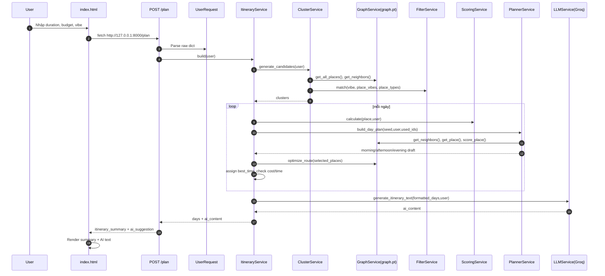
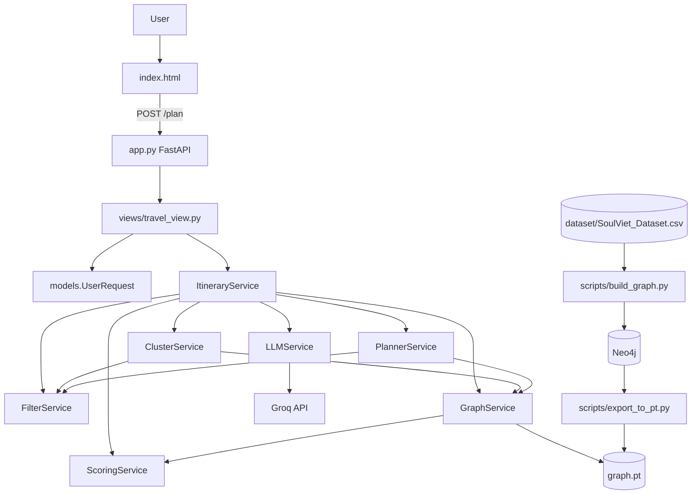

# SoulViet Project Code Review

## 1. Project Goal

SoulViet hiện là một MVP tạo lịch trình du lịch cá nhân hóa bằng dữ liệu địa điểm, quan hệ gần nhau trong graph và LLM để diễn đạt lịch trình. Người dùng nhập số ngày, ngân sách và phong cách trải nghiệm; backend lọc địa điểm, tạo cụm gần nhau, chấm điểm, chọn điểm theo ngày/buổi rồi gọi Groq để viết nội dung gợi ý.

Mục tiêu sản phẩm phù hợp với hướng Graph RAG du lịch: dùng graph địa điểm để retrieve các điểm liên quan theo khoảng cách, type, vibe, budget; dùng scoring/recommendation để chọn lịch trình; dùng LLM chỉ để trình bày kết quả dựa trên dữ liệu đã chọn, không tự bịa địa điểm.

## 2. Repository Structure

| Path | Vai trò |
| --- | --- |
| `app.py` | FastAPI application, cấu hình CORS và include router `/plan`. |
| `index.html` | Frontend tĩnh: form nhập chuyến đi, gọi API `/plan`, render tóm tắt và nội dung AI. |
| `views/` | API route layer, hiện có `travel_view.py`. |
| `models/` | Model Python thủ công cho request và place. |
| `services/` | Business logic chính: graph loading, filter, scoring, cluster, planner, itinerary, LLM, Neo4j/routing phụ trợ. |
| `utils/` | Hàm tiện ích: distance, time estimator, time preference, type duration. |
| `scripts/` | Script build graph vào Neo4j và export `graph.pt`. |
| `dataset/` | Dataset CSV gốc `SoulViet_Dataset.csv`. |
| `docs/status/` | Review/plan trạng thái đã có trước đó. |
| `craw/` | Crawler/source data pipeline, không nằm trực tiếp trong runtime `/plan` hiện tại. |
| `requirements.txt` | Dependency list hiện chưa đủ so với code runtime/scripts. |
| `graph.pt` | Artifact graph runtime được `GraphService` load. |

## 3. Frontend Review

### Vị trí form nhập chuyến đi

Form nằm trực tiếp trong `index.html`, phần sidebar `Tùy chỉnh chuyến đi`.

### Field người dùng nhập

Frontend hiện có 3 field:

- `duration`: input number, default `2`, min `1`, max `5`.
- `budget`: input number, default `2000000`, step `500000`.
- `vibe`: select với các option `culture`, `chill`, `food`, `adventure`, `creative`.

Chưa có field cho destination/location, group size, pace, sở thích bổ sung, avoid places/types, giờ khởi hành, phương tiện di chuyển.

### Nút “Lên kế hoạch ngay” xử lý ra sao

Nút gọi inline handler `onclick="planTrip()"`. Hàm `planTrip()`:

1. Lấy DOM element `duration`, `budget`, `vibe`.
2. Disable button và hiện loading.
3. Gọi `fetch('http://127.0.0.1:8000/plan')` với JSON body.
4. Parse `response.json()`.
5. Lấy `resData.data` rồi render `payload.itinerary_summary` và `payload.ai_suggestion`.

### Frontend có gọi backend/API không

Có. Frontend gọi hard-coded API URL `http://127.0.0.1:8000/plan`. Điều này chạy được local nhưng khó deploy vì không dùng relative path hoặc biến cấu hình.

### Itinerary có được render chưa

Có, nhưng ở mức tóm tắt. Frontend render:

- Ngày.
- Score.
- Total cost.
- Total time.
- Danh sách tên địa điểm buổi sáng/chiều/tối.
- Nội dung AI trong `#ai-content` qua `marked.parse()`.

Chưa render detail card theo địa điểm như address, type, rating, reason, evidence, price range, distance, image, route detail.

### Chat panel đã có chưa

Chưa có chat panel. Frontend không có state `itinerary_id`, không lưu itinerary hiện tại, không có input chat, không có API refinement.

### Nếu chưa có, cần thêm gì

- Backend trả `itinerary_id` và structured itinerary đầy đủ.
- Frontend giữ current itinerary state sau khi `/plan` thành công.
- Chat panel ẩn mặc định, chỉ hiện sau khi itinerary sẵn sàng.
- Endpoint như `POST /chat/refine` nhận `itinerary_id`, `message`, optional current itinerary/version.
- UI hiển thị change summary và itinerary version mới.
- Error handling tốt hơn: kiểm `response.ok`, catch lỗi JSON, không crash nếu `resData.data` thiếu.

## 4. Backend / Services Review

### DataService

- File: `services/data_service.py`.
- Vai trò: load `graph.pt` bằng `torch.load`, đọc `data["nodes"]`, convert từng node thành `Place` object.
- Class/function chính: `DataService.__init__(path)`, `DataService.load()`.
- Input: path tới `.pt` file.
- Output: list `Place` objects.
- Service gọi nó: không thấy flow `/plan` hiện tại gọi `DataService`; runtime chính dùng `GraphService` trực tiếp.
- Bug/rủi ro: duplicate schema với `GraphService`; `torch.load` không dùng `weights_only=False` explicit như GraphService; nếu graph artifact đổi schema sẽ lỗi; không load edges nên không đủ cho routing/cluster.

### GraphService

- File: `services/graph_service.py`.
- Vai trò: load `graph.pt`, normalize nodes, build adjacency edges, cung cấp query graph cơ bản và route optimization.
- Function chính: `get_all_places`, `get_place`, `get_neighbors`, `filter_places`, `score_place`, `optimize_route`, `normalize_place`, `get_clusters`.
- Input: `graph.pt` gồm `nodes` và `edges`; user object cho filter/score.
- Output: normalized place dicts, neighbors, clusters, score, optimized route list.
- Service gọi nó: `ItineraryService`, `ClusterService`, `PlannerService`; `GraphService` gọi `ScoringService`.
- Bug/rủi ro:
  - `normalize_place` không ép kiểu số cho `lat`, `lng`, `rating`, `review_count`, `price_min`, `price_max`.
  - `vibes`/`types` không chuẩn hóa thành list; nếu artifact có string thì `FilterService` duyệt từng ký tự hoặc match sai.
  - `optimize_route` giả định lat/lng hợp lệ, có thể lỗi nếu thiếu/NaN/string không parse được.
  - `filter_places` chỉ lọc rating/budget, không dùng vibe/blacklist.
  - `get_clusters` BFS cơ bản, không trả metadata hoặc distances tổng.

### FilterService

- File: `services/filter_service.py`.
- Vai trò: match user vibe với place vibes/types và loại blacklist types.
- Function chính: `_resolve_types`, `match_vibe`, `match_type`, `match`, `is_blacklisted`.
- Input: `user_vibe`, `place_vibes`, `place_types`.
- Output: boolean match/non-match.
- Service gọi nó: `ItineraryService`, `ClusterService`, `PlannerService`.
- Bug/rủi ro:
  - Giả định `place_vibes` và `place_types` là iterable list; nếu là string thì logic bị sai.
  - `match_vibe` chỉ match label chính xác; nếu dataset có khác dấu/case/spacing sẽ fail.
  - Blacklist chỉ check exact type; chưa normalize lower-case.
  - Mapping culture chưa bao phủ nhiều type thực tế như `establishment`, `point_of_interest`, làng nghề có thể chỉ match nhờ `VibeTag`.

### ScoringService

- File: `services/scoring_service.py`.
- Vai trò: tính score soft recommendation cho place theo rating, review, vibe, price.
- Function chính: `calculate`, `rating_score`, `review_score`, `vibe_score`, `price_score`.
- Input: place dict, user object.
- Output: float score 0-1 round 2.
- Service gọi nó: `ItineraryService`, `GraphService`.
- Bug/rủi ro:
  - `vibe_score` lấy `user.vibe` như `culture` để tìm substring trong label tiếng Việt `Đậm văn hóa & Bản địa`, thường không match.
  - Không dùng `FilterService` mapping nên scoring và filtering không thống nhất.
  - `price_score` trả `1 - price_max / budget`; địa điểm càng rẻ càng cao nhưng nếu budget là tổng chuyến đi, không phân bổ theo ngày.
  - Không trả score breakdown/evidence nên khó explain và debug.

### ClusterService

- File: `services/cluster_service.py`.
- Vai trò: tạo candidate clusters bằng cách lấy valid places rồi expand 2 tầng qua edge `NEAR`.
- Function chính: `generate_candidates`, `expand_cluster`, `is_valid_place`.
- Input: user, limit, graph places/edges.
- Output: list cluster dict `{places, edges}`.
- Service gọi nó: `ItineraryService`.
- Bug/rủi ro:
  - `random.shuffle(valid_places)` làm kết quả không deterministic, khó test và debug.
  - Nếu budget quá thấp/vibe quá hẹp thì trả rỗng, không fallback nới constraint.
  - Chọn `valid_places[:limit]` sau shuffle nên có thể bỏ seed tốt hơn.
  - Dùng `user.budget` như ngưỡng cho từng place, chưa rõ budget là tổng trip hay per day.

### PlannerService

- File: `services/planner_service.py`.
- Vai trò: từ seed place BFS qua neighbors để chọn tối đa 5 địa điểm/ngày, đa dạng category, chia morning/afternoon/evening.
- Function chính: `build_day_plan`, `detect_category`.
- Input: seed place, user, used_ids.
- Output: dict `{morning, afternoon, evening}`.
- Service gọi nó: `ItineraryService`.
- Bug/rủi ro:
  - Dòng logic hiện tại gọi `place["value"] = self.graph.score_place(place, user)` trước khi kiểm `if not place`; nếu edge trỏ node thiếu sẽ crash.
  - Không check budget per day trong planner.
  - Category detection còn thô; nhiều type thực tế bị rơi vào `other` làm mất diversity.
  - Không đưa seed vào queue expansion sau depth >=2? Có BFS 2 tầng nhưng selected luôn bắt đầu seed, chưa validate seed used/budget tại planner.

### ItineraryService

- File: `services/itinerary_service.py`.
- Vai trò: orchestration chính cho `/plan`: cluster -> candidate -> score -> planner -> route -> time slot -> validation sơ bộ -> LLM.
- Function chính: `build`, `remove_duplicate_types`, `detect_category`, `sort_by_time_semantic`.
- Input: `UserRequest` object.
- Output: dict `{days, ai_content}`; API route format thành `itinerary_summary` và `ai_suggestion`.
- Service gọi nó: `views/travel_view.py`.
- Service nó gọi: `GraphService`, `LLMService`, `FilterService`, `ClusterService`, `PlannerService`, `ScoringService`, `utils.time_preference`, `utils.time_estimator`.
- Bug/rủi ro:
  - `used_ids.add(p["id"])` xảy ra trước check `total_cost > user.budget` và `total_time > 600`; nếu ngày bị reject, địa điểm vẫn bị mất oan.
  - Nếu `day_index >= len(clusters)` thì `break`, có thể trả ít ngày hơn request mà không báo lý do.
  - Fallback slot có thể duplicate địa điểm trong nhiều buổi vì thêm `selected_places[0/1/2]` mà không kiểm đã nằm ở slot khác.
  - Nếu `selected_places` rỗng thì tính score chia cho len có nguy cơ lỗi, dù flow thường skip candidates trước đó.
  - Validation chưa tách service, không có report lỗi.
  - Mutate trực tiếp dict place (`value`, `cost`, `estimated_time`, `best_time`), dễ side effect vì GraphService trả reference node global.

### LLMService

- File: `services/llm_service.py`.
- Vai trò: gọi Groq để viết nội dung lịch trình tiếng Việt dựa trên itinerary data.
- Function chính: `generate_itinerary_text`.
- Input: `itinerary_data`, user.
- Output: text itinerary hoặc fallback `AI đang bận 😭`.
- Service gọi nó: `ItineraryService`.
- Bug/rủi ro:
  - Tạo `Groq(api_key=os.getenv("GROQ_API_KEY"))` ngay trong `__init__`; nếu thiếu key/môi trường lỗi có thể ảnh hưởng startup.
  - Prompt yêu cầu không bịa nhưng không có structured response validation.
  - Fallback text quá chung, không tận dụng itinerary đã build để trả deterministic content.

### Neo4jService

- File: `services/neo4j_service.py`.
- Vai trò: wrapper tạo Neo4j driver và close.
- Function chính: `__init__`, `close`.
- Input: env `NEO4J_URI`, `NEO4J_USER`, `NEO4J_PASSWORD`.
- Output: `driver` property.
- Service gọi nó: chưa thấy runtime `/plan` sử dụng trực tiếp.
- Bug/rủi ro: thiếu query methods, tạo connection nếu env thiếu, chưa manage session/retry.

### RoutingService

- File: `services/routing_service.py`.
- Vai trò: greedy optimize route theo nearest neighbor bằng haversine.
- Function chính: `optimize`.
- Input: list place object/dict có lat/lng.
- Output: ordered list.
- Service gọi nó: không thấy `ItineraryService` dùng; đang dùng `GraphService.optimize_route` thay thế.
- Bug/rủi ro: duplicate logic với GraphService, chưa xử lý lat/lng invalid.

## 5. Models Review

### Place

- File: `models/place.py`.
- Vai trò: object wrapper cho node graph.
- Field quan trọng: `id`, `name`, `lat`, `lng`, `rating`, `review_count`, `price_min`, `price_max`, `description`, `vibes`, `types`.
- Field dùng cho itinerary: name, lat/lng, rating, price, description, vibes, types.
- Field dùng cho validation: price_max, lat/lng, rating, types/vibes.
- Field thiếu: address, operation_hours, images, activities, top reviews/evidence, duration estimate, opening constraints, source/version.
- Rủi ro: Runtime chính không dùng `Place`; schema bị lệch với normalized dict trong `GraphService`.

### UserRequest

- File: `models/user_request.py`.
- Vai trò: parse request raw dict từ API.
- Field hiện có: `duration`, `budget`, `vibe`, `location`.
- Field dùng cho itinerary: duration, budget, vibe.
- Field dùng cho validation: duration, budget; nhưng validation thực tế rất ít.
- Field thiếu: max duration, min budget, pace, group size, travel mode, preferred place, avoid place/type, destination/province, time window, meal preference.
- Rủi ro: `int(data.get("duration", 1))` và `float(data.get("budget", 0))` không try/except, malformed input gây 500. Không dùng Pydantic nên không có 422 rõ ràng.

## 6. Dataset Review

Dataset: `dataset/SoulViet_Dataset.csv`.

### Các cột hiện có

- `PlaceId`
- `Name`
- `Type`
- `AllTypes`
- `Address`
- `Lat`
- `Lng`
- `RatingScore`
- `ReviewCount`
- `OperationHours`
- `Description`
- `MainImage`
- `LandImages_JSON`
- `TopReviews_JSON`
- `VibeTag`
- `Generated_Description`
- `Activities_JSON`
- `PriceCategory`
- `PriceRange`

### Cột dùng cho địa điểm

- Identity/name: `PlaceId`, `Name`.
- Location: `Address`, `Lat`, `Lng`.
- Category/type: `Type`, `AllTypes`.
- Quality: `RatingScore`, `ReviewCount`.
- Content/evidence: `Description`, `Generated_Description`, `TopReviews_JSON`, `Activities_JSON`.
- Media: `MainImage`, `LandImages_JSON`.
- Opening: `OperationHours`.

### Cột dùng cho style

- `VibeTag`: style label tiếng Việt như `Đậm văn hóa & Bản địa`.
- `Type`, `AllTypes`: type Google Places dùng để match style mapping.
- `Generated_Description`, `Activities_JSON`, `TopReviews_JSON`: có thể dùng semantic evidence cho style nhưng runtime hiện chưa dùng sâu.

### Cột dùng cho budget

- `PriceCategory`.
- `PriceRange`.

Runtime hiện parse `PriceRange` thành `PriceMin`, `PriceMax` trong `scripts/export_to_pt.py`.

### Cột dùng cho duration

Không có cột duration trực tiếp. Runtime ước lượng thời lượng qua `utils/time_estimator.py` dựa trên type/category, không dựa trên dataset field.

### Cột cần normalize

- `AllTypes`: JSON string -> list string.
- `LandImages_JSON`, `TopReviews_JSON`, `Activities_JSON`: JSON string -> list.
- `PriceRange`: string VNĐ như `30.000đ - 100.000đ` -> numeric min/max.
- `OperationHours`: text tiếng Việt -> structured opening hours nếu muốn validate giờ mở cửa.
- `RatingScore`, `ReviewCount`, `Lat`, `Lng`: numeric with NaN handling.
- `VibeTag`: map label tiếng Việt <-> style key English.

### Dataset có đủ để build itinerary chưa

Đủ cho MVP itinerary cơ bản: có id/name/location/rating/review/type/vibe/price/description. Tuy nhiên chưa đủ cho Graph RAG tốt nếu runtime artifact không export các field evidence quan trọng. Hiện `graph.pt` chỉ chứa một phần thông tin; activities/reviews/images/operation hours/address chưa xuất đầy đủ cho itinerary UI và grounding.

## 7. Current Itinerary Flow

## 8. Current Graph / Graph RAG Design

### Graph build ở đâu

- `scripts/build_graph.py`: đọc CSV, ghi Neo4j nodes/relationships.
- `scripts/export_to_pt.py`: đọc Neo4j, export `graph.pt` để runtime load nhanh.

### Node hiện tại

- Neo4j `Place`: tạo từ từng dòng dataset, properties gồm id, name, type, all_types, address, lat, lng, rating, review_count, operation_hours, description, activities, reviews, main_image, images, price_category, price_range.
- Neo4j `Vibe`: từ `VibeTag`.
- Neo4j `Type`: từ `AllTypes` hoặc fallback `Type`.

Trong `graph.pt`, node được export thành dict gồm: `PlaceId`, `Name`, `Lat`, `Lng`, `RatingScore`, `ReviewCount`, `PriceMin`, `PriceMax`, `Generated_Description`, `VibeTag`, `Type`.

### Edge hiện tại

- `(:Place)-[:HAS_VIBE]->(:Vibe)`.
- `(:Place)-[:HAS_TYPE]->(:Type)`.
- `(:Place)-[:NEAR {distance}]->(:Place)` hai chiều nếu haversine <= threshold 2km.

Trong `graph.pt`, edges chỉ gồm `src`, `dst`, `distance` cho `NEAR`.

### Property hiện tại

Runtime dùng chính: id, name, lat, lng, rating, review_count, price_min, price_max, vibes, types, description.

### Retrieval hiện tại có phải Graph RAG đúng nghĩa chưa

Chưa phải Graph RAG đầy đủ. Hiện là graph-based heuristic retrieval/recommendation:

- Có graph địa điểm và edge `NEAR`.
- Có filter style/type/budget/rating.
- Có BFS cluster và BFS day planner.
- Có LLM writer sau khi itinerary được chọn.

Nhưng thiếu các thành phần RAG quan trọng:

- Không có semantic/vector retrieval trên description/reviews/activities.
- Không có evidence package/citation cho mỗi gợi ý.
- Không có reranker giải thích score breakdown.
- Không có validator deterministic tách riêng.
- Không có context/state cho chat refinement.
- LLM không gọi retrieval; LLM chỉ nhận itinerary đã format.

### Thiếu gì để thành Graph RAG tốt hơn

- Export đủ evidence fields vào `graph.pt`: address, activities, top reviews, images, price_category, operation_hours.
- Tạo `GraphRAGRetriever` tách riêng: hard filter -> graph expansion -> semantic search -> rerank -> evidence.
- Score breakdown: rating, review, style, budget, distance, time slot, diversity.
- Validator service trước khi accept itinerary.
- Structured response source-of-truth; LLM chỉ viết dựa trên structured itinerary.
- Itinerary state/version cho chat context.
- Optional vector index cho query tự nhiên như “ít đi bộ”, “nhiều đặc sản”, “hợp gia đình”.

## 9. Current Bugs / Risks

1. `used_ids` bug: trong `services/itinerary_service.py`, selected place ids được add vào `used_ids` trước khi check `total_cost` và `total_time`. Nếu ngày bị reject, candidate bị mất oan ở các ngày sau.
2. Reject một ngày mất candidate: cùng nguyên nhân trên; ngày `continue` nhưng `used_ids` đã mutate.
3. `PlannerService` có thể crash nếu `place is None`: code score `place` trước `if not place`.
4. Graph numeric/list normalization yếu: `GraphService.normalize_place` không ép kiểu numeric và không coerce list cho vibes/types.
5. Thiếu request validation: `UserRequest` parse thủ công, input rỗng/sai kiểu gây 500; không giới hạn duration/budget rõ ở backend.
6. Ngân sách thấp: filter sẽ loại hầu hết candidate, trả lịch rỗng; không fallback/nới constraint/gợi ý tăng budget.
7. Số ngày quá lớn: frontend max 5 nhưng backend không chặn; service có thể trả ít ngày hơn request mà không báo rõ.
8. Dataset/runtime thiếu field: graph runtime chưa export address, activities, reviews, images, operation_hours nên UI/evidence nghèo.
9. Frontend chưa giữ itinerary state: không có `itinerary_id`, không lưu selected places/version.
10. Chat chưa dùng itinerary context: chưa có chat panel, chưa có endpoint refine, chưa có state store.
11. Scoring vibe mismatch: user vibe là key tiếng Anh nhưng dataset vibe là label tiếng Việt, làm `vibe_score` thấp dù filter match.
12. Fallback slot duplicate: ItineraryService có thể thêm lại selected place vào slot khác nếu slot trống.
13. Randomness: ClusterService shuffle không seed làm kết quả không reproducible.
14. LLM dependency fragile: Groq client tạo lúc service init; thiếu API key dễ gây lỗi runtime/startup.
15. Requirements thiếu dependency thực tế như `torch`, `groq`, `python-dotenv`.

## 10. Current Architecture Diagram

## 11. Gap Analysis

| Area | Current | Target | Gap | Priority |
| --- | --- | --- | --- | --- |
| Request validation | Raw dict -> manual cast | Pydantic/schema validation | Malformed input gây 500, không limit backend | P0 |
| Graph normalization | Shallow mapping | Safe numeric/list/schema normalization | Type/string/NaN dễ làm filter/route lỗi | P0 |
| Planner safety | BFS chọn điểm | Guard đầy đủ missing node/budget/time | `place is None` crash | P0 |
| Itinerary acceptance | Mutate `used_ids` trước validation | Validate draft rồi mới accept/mutate | Candidate mất oan khi reject day | P0 |
| Scoring | Score đơn giản | Explainable score consistent with filter | Vibe mismatch key/label, không breakdown | P0 |
| Validation | Inline cost/time check | ValidatorService deterministic | Không report lỗi, không test constraints | P0 |
| Frontend state | Render summary only | Store itinerary id/version/current state | Không thể chat refine | P1 |
| Chat | Không có | Chat after itinerary ready with context | Thiếu UI/API/service/state | P1 |
| Graph RAG | NEAR graph + heuristic | Hybrid graph/semantic retrieval + evidence | Chưa có vector/evidence/rerank | P2 |
| Dataset export | Export một phần field | Export rich evidence fields | Address/reviews/activities/images thiếu ở runtime | P1 |
| LLM | Writer trực tiếp Groq | Optional grounded writer + fallback | Missing key/failure trả text nghèo | P1 |
| Dependencies | requirements thiếu | Reproducible install | Cài mới có thể lỗi import | P0 |
| Testing | Không thấy test suite | Unit/API/regression tests | Dễ regression itinerary | P0 |
| Deployment | Hard-coded localhost | Relative/configurable API base | Khó deploy frontend/backend | P2 |

## 12. Phase 1 Candidates

Các file/function nên sửa đầu tiên để ổn định itinerary generation:

1. `services/itinerary_service.py` / `ItineraryService.build`
   - Move `used_ids.add(...)` sau khi `total_cost` và `total_time` pass.
   - Không duplicate place trong fallback slot.
   - Trả warning/error khi số ngày tạo được ít hơn request.

2. `services/planner_service.py` / `PlannerService.build_day_plan`
   - Check `if not place: continue` trước mọi truy cập/scoring.
   - Không mutate place global nếu không cần; dùng copy hoặc enrich riêng.

3. `services/graph_service.py` / `normalize_place`, `optimize_route`
   - Safe cast numeric fields.
   - Coerce `vibes` và `types` về list.
   - Guard lat/lng invalid khi route.

4. `models/user_request.py` và `views/travel_view.py`
   - Thêm request validation rõ: duration min/max, budget numeric/min, vibe enum.
   - Trả HTTP error hoặc JSON error có message thay vì 500.

5. `services/scoring_service.py`
   - Fix `vibe_score` để dùng mapping style label/type giống `FilterService`.
   - Thêm score breakdown nếu có thể.

6. `services/filter_service.py`
   - Normalize input list/string/case.
   - Expose allowed types/style labels để scoring dùng chung.

7. `requirements.txt`
   - Bổ sung dependency thực tế: `torch`, `groq`, `python-dotenv` và dependency scripts nếu cần.

8. `services/llm_service.py`
   - Lazy init Groq client hoặc handle missing key rõ.
   - Deterministic fallback text từ structured itinerary.

## 13. Files Read

- `app.py`
- `index.html`
- `README.md`
- `requirements.txt`
- `test_llm.py`
- `.gitignore`
- `models/place.py`
- `models/user_request.py`
- `services/data_service.py`
- `services/graph_service.py`
- `services/filter_service.py`
- `services/scoring_service.py`
- `services/cluster_service.py`
- `services/itinerary_service.py`
- `services/llm_service.py`
- `services/neo4j_service.py`
- `services/planner_service.py`
- `services/routing_service.py`
- `scripts/build_graph.py`
- `scripts/export_to_pt.py`
- `utils/distance.py`
- `utils/time_estimator.py`
- `utils/time_preference.py`
- `utils/type_duration.py`
- `views/travel_view.py`
- `dataset/SoulViet_Dataset.csv` schema/head sample
- `docs/status/soulviet_code_status_review.md`
- `docs/status/soulviet_implementation_plan.md`

Không đọc `docs/repo_exp/` trong task này.
