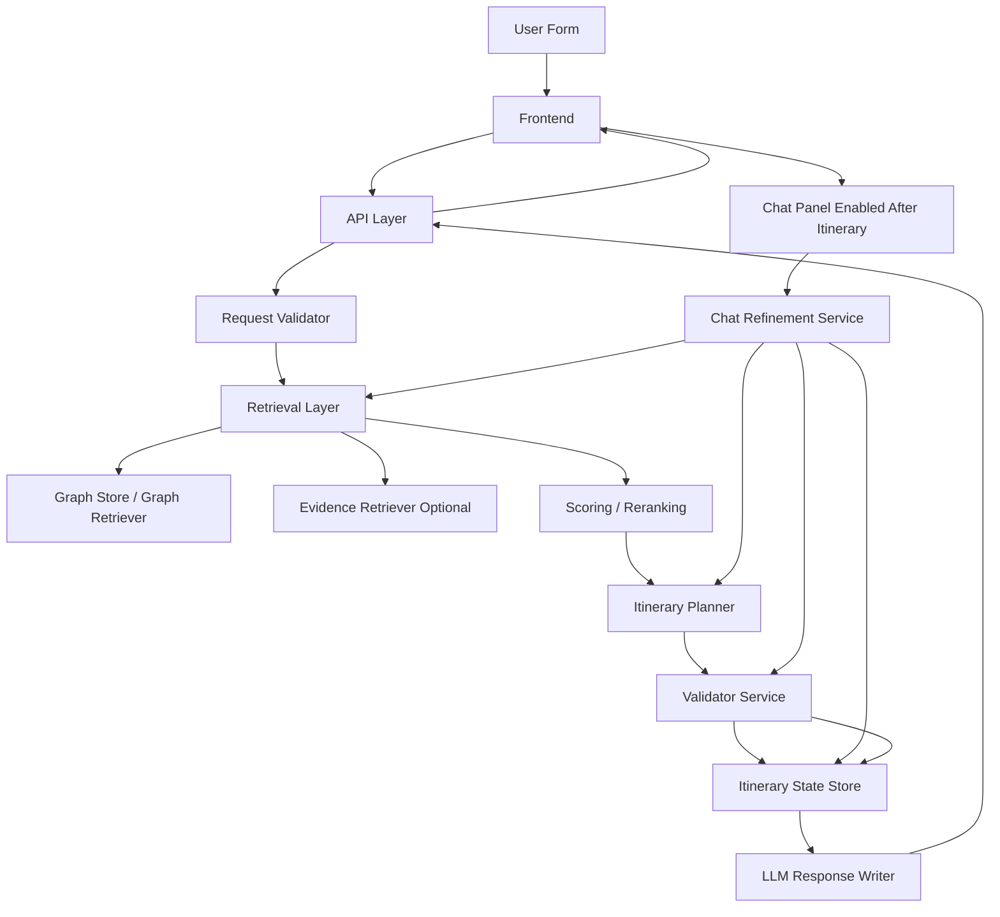
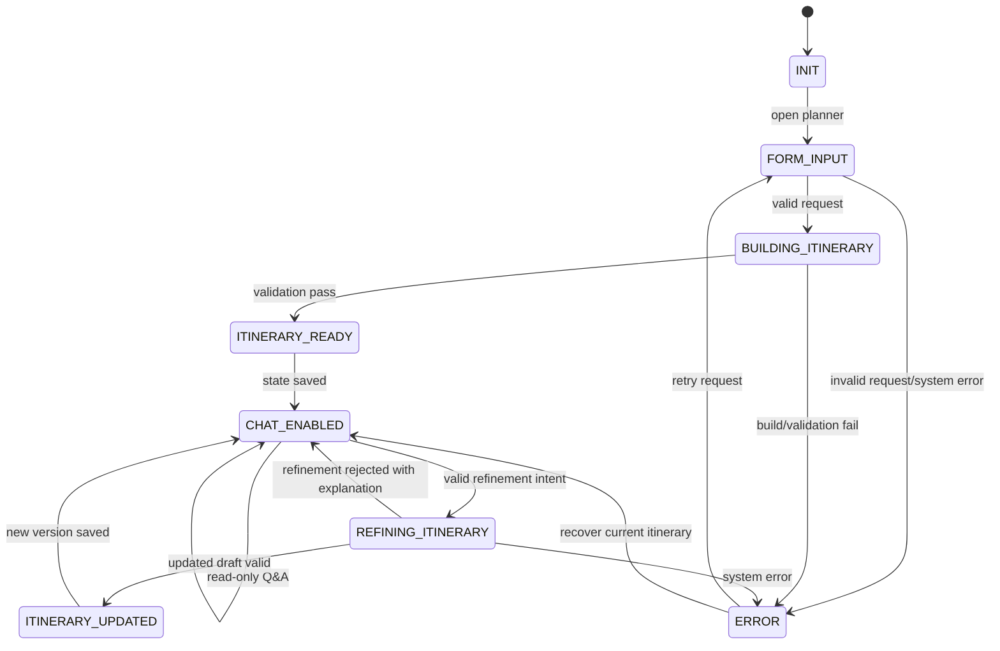

# SoulViet Architecture Decision

## 1. Decision Summary

SoulViet should adopt **Option C: Controlled Core Rebuild**.

- **Option A: Incremental Refactor** is useful for short-term bug fixes, but will keep pushing more responsibility into the current services.
- **Option B: Full Rebuild** gives clean boundaries, but is too risky as a one-shot rewrite while the MVP, dataset, and existing pipeline still provide value.
- **Option C: Controlled Core Rebuild** keeps the current MVP as a runnable baseline while extracting a cleaner core in phases.

Recommended direction: **Controlled Core Rebuild**.

Why:

- The MVP still runs and already has valuable dataset, graph build/export, filtering, scoring, clustering, planning, and LLM wiring.
- The current architecture mixes retrieval, scoring, planning, validation, state mutation, and LLM writing.
- If SoulViet patches this structure for too long, `ItineraryService` can become a god service.
- A full rebuild in one step could break the working baseline and delay learning from real outputs.
- Controlled Core Rebuild allows immediate correctness fixes while gradually introducing clean modules and contracts.

## 2. Product Goal

SoulViet's target product flow is:

```text
User enters trip form
-> backend validates request
-> backend retrieves, filters, and scores places
-> backend builds a draft itinerary
-> backend validates itinerary
-> frontend renders structured itinerary
-> chat appears only after itinerary exists
-> user chats to refine itinerary
-> backend updates itinerary from current itinerary state/version
```

The product should be a **Graph RAG travel itinerary planner**, not a generic chatbot.

Core principles:

- The structured itinerary is the source of truth.
- The graph/dataset provide accepted place candidates.
- The LLM is a grounded writer/refiner over accepted structured data.
- The LLM must not select places outside the graph/dataset.
- The LLM must not override validators, invent prices, invent opening hours, or create fake evidence.
- Chat refinement must edit the current itinerary state/version, not regenerate from scratch without context.

## 3. Current Architecture Assessment

Current SoulViet is an MVP pipeline:

- **frontend/form:** `index.html` collects duration, budget, and vibe, then calls `/plan`.
- **dataset:** `dataset/SoulViet_Dataset.csv` contains many useful fields for places, ratings, reviews, operation hours, descriptions, images, activities, vibe, and price.
- **graph build/export:** `scripts/build_graph.py` imports CSV into Neo4j; `scripts/export_to_pt.py` exports graph data into `graph.pt`.
- **runtime graph.pt:** used as a runtime graph artifact, but it does not preserve enough rich evidence fields yet.
- **GraphService:** loads and normalizes graph data, then exposes graph/place access.
- **FilterService:** filters candidates by user request, but hard constraints and soft preferences are not cleanly separated.
- **ScoringService:** scores places, but score breakdown and style/vibe consistency are weak.
- **ClusterService:** groups/reorders candidates, but random behavior makes results hard to test.
- **PlannerService:** builds slots/days from candidates, but needs stronger guards and separation from retrieval logic.
- **ItineraryService:** orchestrates the flow, but currently mixes retrieval, planning, validation-like checks, state mutation, and LLM response preparation.
- **LLMService:** writes text summaries, but should become a grounded response writer only.
- **current `/plan` flow:** request -> graph/filter/score/cluster/plan -> LLM text -> frontend summary.

### What Works

- Dataset has many useful fields for a travel recommendation system.
- Graph pipeline already exists: CSV -> Neo4j -> `graph.pt`.
- Core services already exist for graph, filtering, scoring, clustering, planning, itinerary generation, and LLM writing.
- MVP frontend can call `/plan` and display results.
- Current system is a useful baseline for correctness testing and phased migration.

### What Is Weak

- Runtime behavior is still graph heuristic, not full Graph RAG.
- `ItineraryService` is at risk of becoming a god service.
- `used_ids` can mutate before validation passes.
- Request validation is weak and can fail with malformed input.
- Graph normalization for numeric fields and list fields is weak.
- Filter/scoring mappings for vibe/style are inconsistent.
- Frontend has no itinerary state, versioning, or chat gating.
- LLM output is still text-summary-heavy and not a strict grounded writer layer.
- Validator, evidence, state, and chat refinement boundaries are missing.

## 4. Core Problems To Solve

Before adding chat, vector DB, or large UX changes, solve these core problems:

1. `used_ids` updates before validation pass.
2. Candidate places can be lost when a day is rejected.
3. `PlannerService` can score before guarding `place is None`.
4. `GraphService` numeric/list normalization is weak.
5. `UserRequest` validation is weak.
6. `FilterService` and `ScoringService` mismatch vibe/style semantics.
7. `ClusterService` has random behavior that is hard to test.
8. Runtime graph artifact lacks evidence fields.
9. API output is not structured enough for itinerary rendering, validation, and chat.
10. Frontend lacks itinerary state and chat gating.
11. LLM is not strictly limited to response writing.
12. There is no separate validator service.
13. There is no itinerary state/version store.
14. There is no evidence/grounding model.
15. There is no evaluation/test plan.

## 5. Options Considered

| Option | Description | Pros | Cons | Risk | Verdict |
| ------ | ----------- | ---- | ---- | ---- | ------- |
| Option A — Incremental Refactor | Keep current architecture and patch bugs gradually. | Fastest for demo; preserves working MVP; good for fixing `used_ids`, request validation, normalization, and deterministic fallback. | Keeps weak service boundaries; `ItineraryService` can keep growing; chat/state/validator become awkward. | Long-term monolith and repeated correctness bugs. | Use only for urgent Phase 1 fixes, not as final architecture. |
| Option B — Full Rebuild | Rebuild core/frontend/backend from scratch. | Cleanest architecture; easiest to design proper modules, API contracts, state, validation, and tests. | High delivery risk; can break runnable baseline; may over-engineer before data/schema is stable. | Big-bang rewrite failure and delayed feedback. | Reject for now. |
| Option C — Controlled Core Rebuild | Keep MVP baseline, fix correctness first, then extract clean modules phase by phase. | Balances safety and architecture quality; preserves learning from MVP; enables validator/state/chat boundaries. | Requires discipline and clear phase boundaries. | Slow migration if contracts are not enforced. | Adopt. |

## 6. Final Decision

**Adopt Option C — Controlled Core Rebuild.**

Decision details:

- Keep the dataset, graph artifact, and current filter/scoring/planning logic as raw material.
- Fix correctness immediately so the current app does not produce obviously wrong output.
- Design a cleaner core architecture with explicit module boundaries.
- Move functionality in phases instead of replacing everything at once.
- Do not add real chat before state and validator exist.
- Do not add vector DB before graph/data normalization is reliable.
- Do not refactor the frontend heavily before backend API contracts are stable.

## 7. Target Architecture



Layer responsibilities:

- **Frontend:** collects form input, renders itinerary, renders warnings/errors, and shows chat only after itinerary state exists.
- **API Layer:** owns HTTP contracts and status codes; it should stay thin.
- **Request Validator:** validates duration, budget, style/vibe, optional fields, and future refinement request shape.
- **Retrieval Layer:** applies hard filters and retrieves candidate places from graph and optional evidence/vector sources.
- **Graph Store / Graph Retriever:** stores/query graph nodes, edges, stable IDs, graph scores, and path reasons.
- **Evidence Retriever Optional:** retrieves structured and later external evidence for claims and itinerary items.
- **Scoring / Reranking:** returns score breakdowns and ranks candidates by preference, budget, route, diversity, graph, and evidence signals.
- **Itinerary Planner:** builds draft day/slot itineraries from ranked candidates.
- **Validator Service:** accepts or rejects drafts using deterministic rules.
- **Itinerary State Store:** saves accepted itinerary versions, selected IDs, request snapshot, validation report, and history.
- **LLM Response Writer:** writes summaries, explanations, and change summaries from accepted structured data only.
- **Chat Refinement Service:** parses refinement intent, loads current state, retrieves alternatives, applies changes to a draft, validates, and saves a new version.

## 8. Target Core Modules

| Module | Responsibility | Input | Output | Build Phase |
|---|---|---|---|---|
| `src/ingestion/` | Load raw CSV/API/document sources. | Raw files/sources | Raw records | Phase 8 |
| `src/normalization/` | Normalize numeric/list/text fields and canonical place attributes. | Raw records | Canonical place records | Phase 1 |
| `src/graph/` | Define graph schema, build graph, query graph, return paths/reasons. | Places/edges/query seeds | Graph candidates and path reasons | Phase 4/8 |
| `src/retrieval/` | Hard filter, candidate generation, hybrid retrieval, graph rank. | Request seeds and graph | Candidate set | Phase 4/8 |
| `src/scoring/` | Score candidates with explainable breakdown. | Candidates and request | Ranked candidates with score breakdown | Phase 2/8 |
| `src/planning/` | Build draft itinerary by day/slot/route. | Ranked candidates | Draft itinerary | Phase 5 |
| `src/validation/` | Validate request, place, day, itinerary, state, and evidence. | Request/draft/state/evidence | Validation result | Phase 1/7 |
| `src/state/` | Store itinerary state, version, history, and transitions. | Accepted itinerary | State/version record | Phase 4 |
| `src/chat/` | Parse chat intent and apply validated refinements. | Message + current state | Proposed or accepted update | Phase 6 |
| `src/evidence/` | Map and retrieve grounding evidence. | Places/claims/sources | Evidence refs and bundles | Phase 8 |
| `src/llm/` | LLM client and grounded response writer. | Accepted structured data | `ai_text`, summary, explanations | Phase 2 |
| `src/api/` | API routes and response contracts. | HTTP requests | Structured JSON | Phase 2 |
| `src/models/` | Domain models for request, place, itinerary, validation, score, evidence. | Data dicts | Typed domain objects | Phase 2 |
| `frontend/` | Render form, itinerary, warnings, state, and chat. | API response | User UI | Phase 3/5 |
| `tests/` | Unit, integration, and evaluation tests. | Fixtures | Pass/fail metrics | Phase 9 |

## 9. Target Data / Graph Schema Decision

Minimum target graph schema:

### Nodes

- Destination
- City
- District
- Place
- Tag
- Style
- BudgetLevel
- TimeSlot
- Cuisine
- ActivityType
- RouteSegment
- Evidence
- UserRequest
- Itinerary
- ItineraryDay
- ItineraryItem

### Edges

- LOCATED_IN
- HAS_TAG
- SUITABLE_FOR_STYLE
- NEAR
- SAME_CLUSTER
- BEST_AT_TIME
- HAS_PRICE_LEVEL
- HAS_CUISINE
- SUPPORTS_ACTIVITY
- RECOMMENDED_WITH
- CONFLICTS_WITH
- CONNECTED_TO
- SELECTED_IN
- REPLACED_BY
- GROUNDED_BY

Decision:

- Phase 1 does not need to implement the full schema.
- Phase 1 should normalize current data, preserve stable IDs, and stop losing useful fields.
- The full graph schema belongs to Phase 8 and the Controlled Core Rebuild migration.
- The schema should support retrieval, explanation, validation, itinerary state, and chat refinement.

## 10. Target API Contracts

### POST `/plan`

Input:

- `duration`
- `budget`
- `vibe` / `style`
- optional `pace`
- optional `food_preference`
- optional `must_see`
- optional `avoid`

Output:

- `itinerary_id`
- `version`
- `state`
- `request`
- `days`
- `items`
- `summary`
- `total_estimated_cost`
- `total_estimated_time`
- `validation_report`
- `warnings`
- `evidence`
- `ai_text`

### GET `/itinerary/{id}`

Output:

- Current itinerary state.
- Current version.
- Accepted itinerary.
- Validation report.
- Warnings and evidence refs.

### POST `/chat/refine`

Input:

- `itinerary_id`
- `version`
- `message`

Output:

- `new_version`
- `updated_itinerary`
- `change_summary`
- `validation_report`
- `warnings`
- `ai_text`

### GET `/health`

Output:

- Basic service health.
- Optional graph artifact status.
- Optional LLM configuration status without exposing secrets.

## 11. State Machine Decision

States:

- `INIT`
- `FORM_INPUT`
- `BUILDING_ITINERARY`
- `ITINERARY_READY`
- `CHAT_ENABLED`
- `REFINING_ITINERARY`
- `ITINERARY_UPDATED`
- `ERROR`



Rules:

- Chat is visible only after `ITINERARY_READY` or `CHAT_ENABLED`.
- Chat refinement must include `itinerary_id` and `version`.
- Backend owns state transitions.
- Frontend renders the backend's current state; it should not invent state.
- LLM cannot move state or save accepted changes.

## 12. Validation Boundary Decision

Validator is a separate architecture boundary, not just a prompt helper.

- Phase 1 can patch small validation into the current flow.
- Phase 7 should extract validation into `src/validation/`.

Validation rules:

- request validation
- place validation
- day plan validation
- budget validation
- time validation
- duplicate validation
- route/distance validation
- style/vibe validation
- state/version validation
- evidence validation

Boundary rules:

- Retrieval is read-only.
- Planner creates drafts.
- Validator accepts or rejects drafts.
- State mutation happens only after validation passes.
- `used_ids` updates only after validation passes.
- LLM cannot override validator decisions.

## 13. Evidence / Grounding Decision

SoulViet MVP does not need full citation immediately. It should start with **structured grounding**.

Each itinerary item should eventually include:

- `why_selected`
- `score_breakdown`
- `evidence_refs` placeholder
- `warnings`
- `validation_status`

LLM may write:

- `ai_text`
- summary
- explanation
- change summary

LLM must not:

- create new places
- invent sources
- invent opening hours
- invent prices
- override validators
- convert unsupported claims into accepted facts

## 14. Migration Plan

| Phase | Goal | Reason | Affected Files/Modules | Done Criteria | Risk If Wrong |
| ----- | ---- | ------ | ---------------------- | ------------- | ------------- |
| Phase 0 — Architecture Decision | Create `03_architecture_decision.md`. | Align on Controlled Core Rebuild before code changes. | `docs/plan/03_architecture_decision.md` | Decision, phases, target modules, API/state/validation boundaries documented. | Implementation starts without clear boundaries. |
| Phase 1 — Correctness fixes in current MVP | Fix known correctness bugs while keeping app runnable. | Bad output will poison later chat/state work. | `models/user_request.py`, `services/graph_service.py`, `services/filter_service.py`, `services/scoring_service.py`, `services/cluster_service.py`, `services/planner_service.py`, `services/itinerary_service.py`, `services/llm_service.py` | Fix `used_ids`, candidate loss, `place is None`, normalization, request validation, deterministic fallback, LLM safe fallback. | Invalid itineraries become persisted state later. |
| Phase 2 — Structured itinerary output | Return structured itinerary contract. | Frontend, grounding, state, and chat need stable data shape. | API/view, models, itinerary/LLM output | `days`, `items`, `why_selected`, `score_breakdown`, `validation_report`, `warnings`, `evidence_refs` returned. | UI and chat depend on unstable AI text. |
| Phase 3 — Frontend itinerary rendering | Render structured results and errors. | Users need readable itinerary, reasons, and warnings. | `index.html` or future `frontend/` | Place cards, warning display, error display, chat disabled until state exists. | Frontend hides important validation failures. |
| Phase 4 — Itinerary state/versioning | Store accepted itinerary state. | Chat needs current state and version. | future `src/state/`, API, itinerary flow | `itinerary_id`, `version`, accepted itinerary, selected IDs, validation report, state store. | Chat edits the wrong or missing itinerary. |
| Phase 5 — Chat after itinerary | Add chat panel only after itinerary exists. | Chat must not start from empty state. | frontend, API, state, LLM writer | Chat visible only when itinerary is ready; read-only Q&A or preparation only. | Premature chat causes stateless hallucination. |
| Phase 6 — Chat refinement | Apply controlled itinerary changes. | Real refinement requires retrieval, planning, validation, and versioning. | `src/chat/`, retrieval, planning, validation, state | Intent parser, change applier, replacement retrieval, updated validation, new version saved. | LLM freely rewrites itinerary. |
| Phase 7 — Validator service | Extract deterministic validation. | Validation is core correctness gate. | `src/validation/` | Request/day/itinerary/budget/time/duplicate/state validators and shared validation result. | Scoring or prompt judgment replaces validation. |
| Phase 8 — Graph RAG improvement | Add richer Graph RAG and grounding. | Improve retrieval quality and explainability. | `src/graph/`, `src/retrieval/`, `src/evidence/` | Richer graph schema, graph ranker, hybrid retrieval, evidence retriever, context builder. | Tooling is added before data is ready. |
| Phase 9 — Tests/evaluation | Prevent regressions. | Correctness must be measurable. | `tests/`, eval fixtures | Tests for validation, retrieval, scoring, planning, state, chat, grounding. | Known bugs return silently. |
| Phase X — Controlled Core Rebuild migration | Move clean core to `src/` while keeping MVP as fallback. | Long-term maintainability. | all target modules | New pipeline replaces current flow safely. | Big-bang migration breaks baseline. |

## 15. File-Level Keep / Refactor / Rewrite

| Current File | Decision | Target Module | Reason |
| ------------ | -------- | ------------- | ------ |
| `app.py` | Keep light / refactor route setup | `app.py`, `src/api/` | Should remain bootstrap, not business logic. |
| `index.html` | Keep for MVP / later split | `frontend/` | Current form is useful, but structured rendering and chat need cleaner frontend modules. |
| `views/travel_view.py` | Refactor | `src/api/itinerary_routes.py` | Route should return structured contract and stay thin. |
| `models/user_request.py` | Rewrite validation | `src/models/user_request.py`, `src/validation/request_validator.py` | Raw parsing should become safe validation with errors. |
| `models/place.py` | Keep concept / expand fields | `src/models/place.py` | Place remains core but needs normalized fields, score, evidence, and graph IDs. |
| `services/graph_service.py` | Split / refactor | `src/graph/graph_store.py`, `src/graph/graph_retriever.py`, `src/graph/graph_schema.py` | Separate storage, normalization, retrieval, and graph reasons. |
| `services/filter_service.py` | Refactor | `src/retrieval/hard_filter.py`, `src/retrieval/hybrid_retriever.py` | Hard filters and soft preferences need separate treatment. |
| `services/scoring_service.py` | Rewrite scoring output | `src/scoring/place_scorer.py`, `src/scoring/score_breakdown.py` | Need explainable score breakdown, not only total score. |
| `services/cluster_service.py` | Refactor / split | `src/retrieval/graph_ranker.py`, `src/planning/day_planner.py` | Remove random behavior and separate retrieval ranking from day planning. |
| `services/planner_service.py` | Split / rewrite core | `src/planning/day_planner.py`, `src/planning/slot_assigner.py`, `src/planning/route_optimizer.py` | Planner should create drafts from ranked candidates and guard invalid places. |
| `services/itinerary_service.py` | Rewrite core orchestration | `src/planning/itinerary_planner.py`, `src/validation/`, `src/state/` | Current service mixes too many responsibilities. |
| `services/llm_service.py` | Refactor | `src/llm/llm_client.py`, `src/llm/response_writer.py` | LLM should write/explain accepted data only. |
| `scripts/build_graph.py` | Keep script / move reusable logic | `scripts/build_graph.py`, `src/graph/graph_builder.py` | Script remains entrypoint; graph build logic should be testable. |
| `scripts/export_to_pt.py` | Keep script / improve artifact | `scripts/export_to_pt.py`, `src/graph/graph_store.py` | Export should preserve normalized properties and evidence-capable fields. |
| `dataset/SoulViet_Dataset.csv` | Keep | `dataset/`, `data/processed/` | Dataset is valuable source material; normalize rather than replace. |

## 16. Non-goals / What Not To Do Now

- Do not read optional files before the architecture decision is accepted.
- Do not add real chat before itinerary state exists.
- Do not add vector DB before graph normalization is stable.
- Do not call it Graph RAG if it is only BFS over `NEAR`.
- Do not let LLM choose places.
- Do not refactor frontend heavily before backend API contract is stable.
- Do not create a graph dashboard before itinerary output is correct.
- Do not stuff all evidence into prompts.
- Do not mix filter, scoring, planning, and validation in one service.

## 17. Acceptance Criteria Before Implementation

Before implementing Phase 1:

- Architecture decision is clear and accepted.
- Phase 1 file list is clear.
- Known bugs are clear.
- Minimal test cases are clear.
- No large architecture change starts before API contract direction is understood.
- No chat work starts before itinerary state/version exists.

## 18. Recommended Next Step

After this file, create:

`docs/plan/04_phase_1_correctness_fix_plan.md`

That file should focus only on Phase 1:

- files to change
- bugs to fix
- order of fixes
- test cases
- acceptance criteria
- explicit rule: do not implement chat