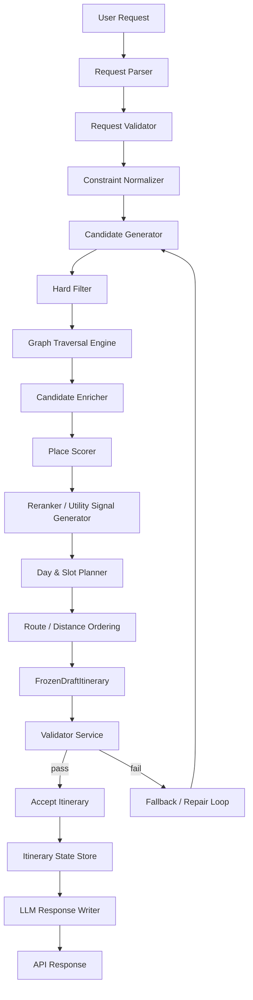
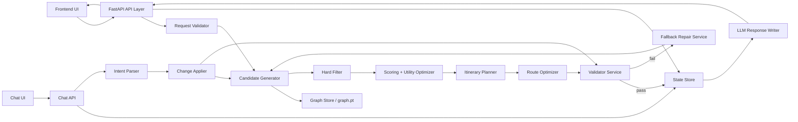
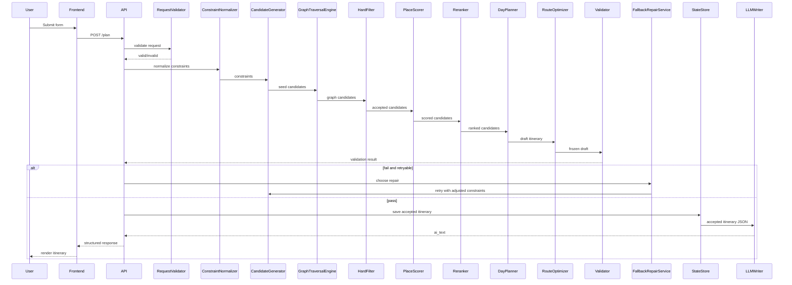
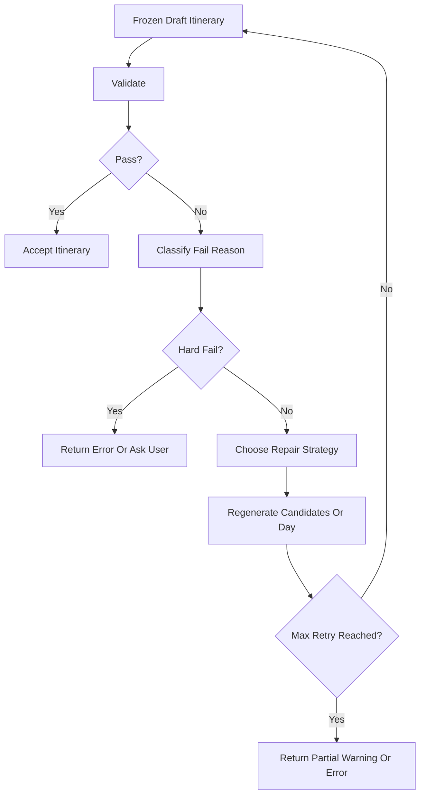

# SoulViet Deterministic Itinerary Engine Design

## 1. Purpose

This file designs SoulViet's automatic itinerary engine. The backend must create itineraries from dataset, graph, filters, scoring, planning, validation, fallback, and state. The LLM is only a grounded response writer/refiner.

SoulViet must not depend on an LLM to decide the trip. The deterministic backend pipeline produces places, ordering, timing, draft alternatives, validation outcomes, repair attempts, and state mutation. Decision authority is single-owner per layer: retrieval finds candidates, scoring ranks candidates, planning assembles immutable drafts, validation accepts or rejects drafts, and state stores only accepted results.

## 2. Current Data Reality

SoulViet currently has `dataset/SoulViet_Dataset.csv` with 1210 places and 19 columns:

- `PlaceId`
- `Name`
- `Type`
- `AllTypes`
- `Address`
- `Lat`
- `Lng`
- `RatingScore`
- `ReviewCount`
- `OperationHours`
- `Description`
- `MainImage`
- `LandImages_JSON`
- `TopReviews_JSON`
- `VibeTag`
- `Generated_Description`
- `Activities_JSON`
- `PriceCategory`
- `PriceRange`

Runtime artifact:

- `graph.pt` stores nodes and edges.
- Current runtime uses only part of the dataset fields.
- Current graph is mainly `Place`, `Vibe`, `Type`, and `NEAR`.
- It is useful as an MVP graph artifact, but it does not yet preserve enough evidence and UI fields.

Field usage:

| Purpose | Fields |
| ------- | ------ |
| identity | `PlaceId`, `Name` |
| location | `Address`, `Lat`, `Lng`, `NEAR` edges |
| type/category | `Type`, `AllTypes` |
| style/vibe | `VibeTag`, future `Style`/`Tag` nodes |
| quality/rating | `RatingScore`, `ReviewCount` |
| budget/price | `PriceCategory`, `PriceRange` |
| evidence/grounding | `Description`, `Generated_Description`, `OperationHours`, `TopReviews_JSON`, `Activities_JSON` |
| UI rendering | `Name`, `Address`, `MainImage`, `LandImages_JSON`, `Description`, `RatingScore`, `PriceRange` |
| future semantic retrieval | descriptions, reviews, activities, operation hours, generated text |

## 3. Core Principle

Correct flow:

```text
User request
-> deterministic engine
-> structured itinerary
-> validator
-> accepted itinerary
-> LLM writer
```

Incorrect flow:

```text
User request
-> LLM tự nghĩ itinerary
```

Rules:

- Structured itinerary is the source of truth.
- Candidate places must come from dataset/graph.
- Scoring must have a formula and score breakdown.
- Planner uses ranked candidates only and does not override scoring or optimize budget utilization.
- Validator is the only hard authority for accept/reject, including budget validity.
- State mutates only after validation pass.
- LLM writes text only from accepted itinerary.

Authority boundaries:

| Layer | Authority | Explicit Non-Authority |
| ----- | --------- | ---------------------- |
| Retrieval | Return traceable candidates, ranked graph paths, and ranked subgraphs from dataset/graph artifacts. | Score preferences, assign slots, validate drafts, mutate state, or call LLM. |
| Scoring | Compute explainable ranking signals and score breakdowns. Budget is soft signal only. | Accept/reject candidates, force budget utilization, or override hard filters/Validator. |
| Utility Optimization | Re-rank candidates or validator-approved draft alternatives using soft utility signals. | Select final itinerary, force spending, change candidate selection, or override Validator. |
| Planning | Assign ranked candidates into day/slot structures and produce immutable drafts. | Select best candidate globally, reject by preference, enforce budget, optimize budget, or mutate accepted state. |
| Validation | Accept/reject `FrozenDraftItinerary` objects and enforce all hard constraints, including budget. | Generate candidates, score preferences, or mutate drafts. |
| State | Persist accepted itinerary versions only after validation pass. | Store invalid drafts as accepted state or infer itinerary decisions. |
| LLM | Write grounded text from accepted structured data. | Choose, add, remove, reorder, validate, or repair itinerary items. |

## 4. Current MVP Engine vs Target Engine

| Area | Current MVP | Target Deterministic Engine | Gap |
| ---- | ----------- | --------------------------- | --- |
| Request input | `duration`, `budget`, `vibe` parsed loosely. | Typed request with validation and structured errors. | Safe parsing and validation missing. |
| Dataset/runtime data | CSV rich, `graph.pt` partial. | Preserve normalized fields and evidence-capable fields. | Runtime loses useful data. |
| Candidate generation | Graph/filter service returns candidates heuristically. | Candidate generator reads graph/dataset only with traceable source. | Need explicit candidate schema. |
| Hard filter | Mixed with preference filtering. | Deterministic hard filters with rejected reasons. | Hard vs soft unclear. |
| Scoring | Opaque total score. | Score breakdown with tunable weights. | No explainable scores. |
| Graph retrieval | Mostly `NEAR`/basic graph heuristic. | Graph Traversal Engine with bounded beam search, depth limit, top-K frontier, path reasons, graph score, and deterministic ordering. | Not full Graph RAG yet. |
| Clustering | Can use random shuffle. | Deterministic cluster/routing preference. | Reproducibility weak. |
| Day planning | Builds days from candidates. | Draft-only day planner from ranked candidates. | Planning and acceptance mixed. |
| Slot assignment | Basic slot fill. | Slot suitability by time, type, distance, cost, pace. | Slot logic needs formal rules. |
| Route optimization | Basic distance/routing. | Haversine/cluster reorder with warnings/rejects. | Need deterministic route checks. |
| Budget/time validation | Partial checks. | Validator with hard/soft rules. | No validation boundary. |
| Duplicate handling | `used_ids` can mutate too early. | Duplicates checked before accept; `used_ids` mutates after pass. | Current mutation bug. |
| `used_ids`/state mutation | Can happen during planning. | Mutation only after validation pass. | Core correctness issue. |
| LLM role | Text summary heavy. | Grounded response writer only. | LLM boundary unclear. |
| Frontend output | Summary/AI text. | Structured itinerary, reasons, warnings, state. | UI cannot trust structured data yet. |

## 5. High-Level Engine Architecture



- **Request Parser:** converts raw JSON/form data into a typed request shape.
- **Request Validator:** rejects invalid duration, budget, style, or malformed optional fields.
- **Constraint Normalizer:** creates hard constraints and soft preferences.
- **Candidate Generator:** loads candidate places from graph/dataset, never from LLM.
- **Hard Filter:** removes invalid candidates and records rejection reasons.
- **Graph Traversal Engine:** performs bounded beam search over graph relations such as `NEAR`, type, vibe, and future richer edges; it returns traceable candidate paths and graph scores, not accepted itinerary choices.
- **Candidate Enricher:** attaches normalized fields, UI data, evidence placeholders, and graph traces.
- **Place Scorer:** computes score breakdowns; budget is a soft ranking signal only and never a hard pass/fail decision.
- **Reranker / Utility Signal Generator:** deterministically reorders candidates by score, diversity, route compactness, type mix, and soft utility signals. It emits ranked lists only; it does not choose accepted itinerary items, change candidate membership after planning, force budget usage, or override Validator decisions.
- **Day & Slot Planner:** assigns already-ranked candidates into day/slot structures and produces structurally complete drafts. It does not optimize budget utilization, choose candidates by its own preference model, or reject candidates for soft score reasons.
- **Route / Distance Ordering:** applies deterministic route ordering and route metrics to draft structures, then freezes the result as `FrozenDraftItinerary`; hard route acceptance remains exclusively with Validator.
- **Validator Service:** is the only authority for hard constraints and gates acceptance, including total budget, duplicates, time, route, blacklist, and state consistency.
- **Fallback / Repair Loop:** retries soft failures without mutating state.
- **Itinerary State Store:** saves accepted itinerary version.
- **LLM Response Writer:** writes friendly text from accepted JSON only.

## 5A. Target System Architecture

Target SoulViet architecture should be layered as:

```text
Frontend
-> API Layer
-> Request / State Layer
-> Retrieval Layer
-> Scoring / Utility Optimization Layer
-> Planning Layer
-> Validation Layer
-> State Store
-> LLM Writer Layer
-> Response Layer
```

- **Frontend:** renders form, itinerary cards, budget fields, validation warnings, error states, and chat state. It does not decide itinerary correctness.
- **API Layer:** receives requests and returns responses. It should be thin and should not contain business logic.
- **Request / State Layer:** validates input request, normalizes request constraints, and manages `itinerary_id`, `version`, and lifecycle state.
- **Retrieval Layer:** loads candidates from dataset/graph artifacts and graph relations using bounded beam search. It does not score preferences, plan slots, validate budgets, or choose the final itinerary.
- **Scoring / Utility Optimization Layer:** computes place scores, graph scores, budget-as-signal scores, marginal utility per cost, ranking, and reranking. It may reorder feasible candidates/drafts but must never select over Validator, force budget utilization, or enforce hard budget decisions.
- **Planning Layer:** builds day/slot/route draft structures from ranked candidates. It assigns ranked candidates into slots, assembles top-K alternatives per structural constraint, and checks structural completeness only; it must not select the best candidate globally, reject by preference, override scoring, enforce budget, or optimize budget utilization.
- **Validation Layer:** accepts or rejects `FrozenDraftItinerary` objects based on budget, route, duplicate, time, required style constraints, state, and data consistency. It is the only hard authority for budget validity and all final pass/fail decisions.
- **State Store:** persists only accepted itineraries and versions after validation pass.
- **LLM Writer Layer:** writes friendly text from accepted structured data only.
- **Response Layer:** returns structured itinerary, `ai_text`, budget fields, validation report, warnings, and state metadata.

Rules:

- LLM is not in the decision path.
- LLM runs only after an itinerary is accepted.
- State mutation happens only after validation pass.

## 5B. Target Project Structure

```text
soulviet/
├── app.py
├── main.py
├── config.yaml
├── requirements.txt
├── .env.example
├── dataset/
│   └── SoulViet_Dataset.csv
├── data/
│   ├── raw/
│   ├── processed/
│   └── artifacts/
│       └── graph.pt
├── src/
│   ├── api/
│   │   ├── routes.py
│   │   ├── itinerary_routes.py
│   │   ├── chat_routes.py
│   │   └── health_routes.py
│   ├── models/
│   │   ├── user_request.py
│   │   ├── place.py
│   │   ├── itinerary.py
│   │   ├── score_breakdown.py
│   │   ├── validation_result.py
│   │   └── evidence.py
│   ├── ingestion/
│   │   ├── csv_loader.py
│   │   └── source_loader.py
│   ├── normalization/
│   │   ├── place_normalizer.py
│   │   ├── price_normalizer.py
│   │   ├── type_normalizer.py
│   │   └── vibe_normalizer.py
│   ├── graph/
│   │   ├── graph_schema.py
│   │   ├── graph_builder.py
│   │   ├── graph_store.py
│   │   └── graph_retriever.py
│   ├── retrieval/
│   │   ├── candidate_generator.py
│   │   ├── hard_filter.py
│   │   ├── hybrid_retriever.py
│   │   └── context_builder.py
│   ├── scoring/
│   │   ├── place_scorer.py
│   │   ├── utility_optimizer.py
│   │   ├── budget_scorer.py
│   │   └── reranker.py
│   ├── planning/
│   │   ├── itinerary_planner.py
│   │   ├── day_planner.py
│   │   ├── slot_assigner.py
│   │   └── route_optimizer.py
│   ├── validation/
│   │   ├── request_validator.py
│   │   ├── place_validator.py
│   │   ├── budget_validator.py
│   │   ├── time_validator.py
│   │   ├── route_validator.py
│   │   ├── duplicate_validator.py
│   │   ├── state_validator.py
│   │   └── itinerary_validator.py
│   ├── state/
│   │   ├── itinerary_state_store.py
│   │   └── conversation_state_machine.py
│   ├── chat/
│   │   ├── intent_parser.py
│   │   ├── refinement_service.py
│   │   └── change_applier.py
│   ├── evidence/
│   │   ├── evidence_store.py
│   │   ├── evidence_retriever.py
│   │   └── source_mapper.py
│   ├── llm/
│   │   ├── llm_client.py
│   │   └── response_writer.py
│   └── utils/
│       ├── distance.py
│       ├── time_estimator.py
│       └── logging.py
├── frontend/
│   ├── index.html
│   ├── app.js
│   └── styles.css
├── scripts/
│   ├── build_graph.py
│   ├── export_to_pt.py
│   └── rebuild_indexes.py
├── tests/
│   ├── test_request_validation.py
│   ├── test_graph_normalization.py
│   ├── test_candidate_generation.py
│   ├── test_budget_optimization.py
│   ├── test_itinerary_planning.py
│   ├── test_validator.py
│   └── test_chat_refinement.py
└── docs/
    └── plan/
```

- `api/`: route definitions and thin HTTP orchestration.
- `models/`: typed contracts for requests, places, itineraries, scores, validation, and evidence.
- `ingestion/`: source loading from CSV or future source systems.
- `normalization/`: canonical price, type, vibe, and place normalization.
- `graph/`: graph schema, build helpers, runtime graph store, and graph retrieval.
- `retrieval/`: candidate generation, hard filters, hybrid retrieval, and context construction.
- `src/scoring/`: place scoring, budget-as-soft-signal scoring, utility signal generation, and reranking.
- `src/planning/`: itinerary/day/slot assignment and deterministic route ordering before draft freeze.
- `validation/`: request, place, budget, time, route, duplicate, state, and itinerary validators.
- `state/`: itinerary state storage and conversation state machine.
- `chat/`: intent parsing, refinement orchestration, and safe change application.
- `evidence/`: evidence lookup, source mapping, and grounding references.
- `llm/`: LLM client wrapper and response writer only.
- `frontend/`: UI shell, client logic, rendering, and styles.
- `scripts/`: build-time graph and index generation.
- `tests/`: correctness tests for request validation, graph normalization, planning, budget, validation, and chat refinement.

## 5C. Runtime Component Architecture



- `graph.pt` is a runtime artifact read by Graph Store.
- Dataset, Neo4j, and build scripts are build-time concerns and should not be directly inside the `/plan` runtime path.
- `/plan` runtime uses graph artifact plus normalized fields.
- `/chat/refine` runtime uses itinerary state/version and the same retrieval/planning/validation pipeline.
- LLM writer is called only after validator pass.

## 5D. Build-Time vs Runtime Architecture

Build-time flow:

```text
SoulViet_Dataset.csv
-> scripts/build_graph.py
-> Neo4j
-> scripts/export_to_pt.py
-> graph.pt
```

Runtime flow:

```text
POST /plan
-> GraphStore loads graph.pt
-> CandidateGenerator / GraphTraversalEngine
-> Scoring / Planning / Validation
-> StateStore
-> LLM Writer
-> API Response
```

| Layer | Build-Time | Runtime |
| ----- | ---------- | ------- |
| dataset loading | Load `SoulViet_Dataset.csv` for graph/index generation. | Use normalized fields already exported into artifacts. |
| normalization | Normalize place/type/vibe/price fields before export. | Trust normalized fields; perform defensive coercion only. |
| graph construction | Build graph in Neo4j or build pipeline. | Not performed inside `/plan`. |
| graph export | Export runtime artifact to `graph.pt`. | Read-only artifact consumption. |
| graph loading | Optional validation after export. | `GraphStore` loads `graph.pt`. |
| candidate retrieval | Not user-request specific. | `CandidateGenerator` and `GraphTraversalEngine` retrieve request-specific candidates. |
| scoring | Define formulas and weights. | Score candidates and drafts with current constraints. |
| planning | Not performed. | Build draft itinerary, slots, and routes. |
| validation | Validate artifact integrity. | Validate request, budget, route, duplicates, time, state, and itinerary. |
| state | Not mutated. | Save accepted itinerary/version after validation pass. |
| LLM writing | Not used. | Write presentation text from accepted JSON only. |
| frontend rendering | Static asset build or packaging. | Render structured response, warnings, budget, and chat state. |

## 5E. Current File To Target Module Mapping

| Current File | Current Responsibility | Target Module | Decision | Reason |
| ------------ | ---------------------- | ------------- | -------- | ------ |
| `app.py` | App entry and route registration. | `app.py`, `main.py`, `src/api/routes.py` | Refactor | Keep entry thin and move route logic into API modules. |
| `index.html` | Single-file frontend UI. | `frontend/index.html`, `frontend/app.js`, `frontend/styles.css` | Split | Separate markup, behavior, and styling later. |
| `views/travel_view.py` | Plan endpoint/controller. | `src/api/itinerary_routes.py` | Refactor | API should orchestrate only, not own engine logic. |
| `models/user_request.py` | Request shape/parsing. | `src/models/user_request.py`, `src/validation/request_validator.py` | Split | Separate data contract from validation. |
| `models/place.py` | Place model. | `src/models/place.py` | Keep | Expand fields and normalize source data. |
| `services/graph_service.py` | Graph loading/query behavior. | `src/graph/graph_store.py`, `src/graph/graph_retriever.py`, `src/graph/graph_schema.py` | Split | Separate artifact loading, retrieval, and schema. |
| `services/filter_service.py` | Candidate filtering. | `src/retrieval/hard_filter.py`, scoring preference inputs | Split | Hard filters must be deterministic; soft preferences belong to scoring. |
| `services/scoring_service.py` | Candidate scoring. | `src/scoring/place_scorer.py`, `src/scoring/budget_scorer.py`, `src/scoring/utility_optimizer.py`, `src/scoring/reranker.py` | Split | Need explainable scoring and budget-aware utility. |
| `services/cluster_service.py` | Candidate grouping/cluster behavior. | `src/planning/route_optimizer.py`, `src/scoring/reranker.py` | Refactor | Clustering should support deterministic route-aware ranking. |
| `services/planner_service.py` | Planning and slot assignment. | `src/planning/day_planner.py`, `src/planning/slot_assigner.py`, `src/planning/itinerary_planner.py` | Split | Separate day planning, slot assignment, and orchestration. |
| `services/itinerary_service.py` | End-to-end itinerary building. | `src/planning/`, `src/validation/`, `src/state/`, `src/llm/response_writer.py` | Split | Current service mixes planning, validation, state, and LLM boundaries. |
| `services/llm_service.py` | LLM calls/text generation. | `src/llm/llm_client.py`, `src/llm/response_writer.py` | Split | Separate raw client from grounded response writer. |
| `services/routing_service.py` | Routing/distance behavior. | `src/planning/route_optimizer.py`, `src/validation/route_validator.py` | Refactor | Split optimization from validation. |
| `scripts/build_graph.py` | Build graph from dataset. | `scripts/build_graph.py`, `src/graph/graph_builder.py` | Refactor | Keep script wrapper, move reusable logic into graph builder. |
| `scripts/export_to_pt.py` | Export runtime graph artifact. | `scripts/export_to_pt.py`, `src/graph/graph_store.py` | Refactor | Export richer normalized fields and validate artifact shape. |
| `dataset/SoulViet_Dataset.csv` | Source data. | `dataset/`, future `data/raw/` | Keep | Remains source of truth for MVP data. |
| `graph.pt` | Runtime graph artifact. | `data/artifacts/graph.pt` | Move later | Keep current path for MVP, move to artifacts in rebuild. |

## 5F. Engine Module Ownership

| Engine Step | Owning Target Module | Current MVP Owner | Should Move In Phase |
| ----------- | -------------------- | ----------------- | -------------------- |
| Parse request | `src/api/itinerary_routes.py` + `src/models/user_request.py` | `views/travel_view.py`, `models/user_request.py` | Phase 1 |
| Validate request | `src/validation/request_validator.py` | `models/user_request.py`, `views/travel_view.py` | Phase 1 |
| Normalize constraints | `src/normalization/` + `src/models/` | mixed services | Phase 1 |
| Load graph | `src/graph/graph_store.py` | `services/graph_service.py` | Phase 1 |
| Generate candidates | `src/retrieval/candidate_generator.py` | `services/graph_service.py`, `services/filter_service.py` | Phase 1 |
| Hard filter | `src/retrieval/hard_filter.py` | `services/filter_service.py` | Phase 1 |
| Graph retrieve | `src/graph/graph_retriever.py` | `services/graph_service.py` | Phase 2/3 |
| Score candidate | `src/scoring/place_scorer.py` | `services/scoring_service.py` | Phase 1 |
| Budget utility optimize | `src/scoring/budget_scorer.py`, `src/scoring/utility_optimizer.py` | partial scoring/planning | Phase 1 |
| Rerank/diversify | `src/scoring/reranker.py` | `services/cluster_service.py`, `services/scoring_service.py` | Phase 1 |
| Assign slots | `src/planning/slot_assigner.py` | `services/planner_service.py` | Phase 1 |
| Optimize route | `src/planning/route_optimizer.py` | `services/routing_service.py`, `services/cluster_service.py` | Phase 1 |
| Validate itinerary | `src/validation/itinerary_validator.py` | `services/itinerary_service.py` | Phase 1 |
| Repair/fallback | `src/planning/fallback_repair_service.py` or `src/validation/` | `services/itinerary_service.py` | Phase 1/2 |
| Accept itinerary | `src/state/itinerary_state_store.py` | `services/itinerary_service.py` | Phase 4 |
| Save state | `src/state/itinerary_state_store.py` | none/implicit | Phase 4 |
| LLM write text | `src/llm/response_writer.py` | `services/llm_service.py` | Phase 1 |
| Return API response | `src/api/itinerary_routes.py` | `views/travel_view.py` | Phase 1 |
| Render frontend | `frontend/` | `index.html` | Phase 2/5 |
| Chat refine | `src/chat/refinement_service.py` | none | Phase 6 |

## 5G. API Architecture

### POST `/plan`

Responsible for:

- validate request
- run deterministic engine
- return structured itinerary
- return `itinerary_id`, `version`, `state`
- return budget fields
- return validation report
- return `ai_text` only as presentation

Not responsible for:

- free-form LLM planning
- frontend formatting
- direct state mutation before validation

### GET `/itinerary/{id}`

Responsible for:

- return current itinerary state/version
- support refresh/resume

### POST `/chat/refine`

Responsible for:

- require `itinerary_id`
- require `version`
- parse intent
- apply change to draft
- validate
- save new version
- return updated itinerary

### GET `/health`

Responsible for:

- graph artifact status
- LLM config status without exposing secret
- basic service health

## 5H. Frontend Architecture

Target frontend flow:

```text
FORM_INPUT
-> loading BUILDING_ITINERARY
-> render ITINERARY_READY
-> enable CHAT_ENABLED
-> show REFINING_ITINERARY loading
-> render ITINERARY_UPDATED
-> show ERROR / retry if fail
```

Frontend modules:

- `apiClient`
- `formController`
- `itineraryRenderer`
- `budgetRenderer`
- `validationRenderer`
- `chatController`
- `stateStore`

Frontend must not:

- decide itinerary validity
- mutate backend state alone
- parse AI text as source of truth
- show chat before itinerary state exists

## 5I. Architecture Acceptance Criteria

Architecture design is sufficient when:

- target project structure is defined
- runtime component diagram is defined
- build-time vs runtime split is defined
- current-file-to-target-module mapping is defined
- engine module ownership is defined
- API architecture is defined
- frontend architecture is defined
- LLM is clearly outside the decision path
- validator/state mutation boundary is clear
- budget utility optimization is limited to scoring/reranking as a soft signal, while budget acceptance is owned only by validation
- it is detailed enough to create `docs/plan/05_phase_1_correctness_fix_plan.md`

## 6. Internal Processing Flow For POST /plan

### Step 1 — Parse User Request

Current frontend input:

- `duration`
- `budget`
- `vibe`

Future input:

- `location`
- `pace`
- `food_preference`
- `must_see`
- `avoid`
- `group_size`
- `travel_mode`
- `start_time`

Output: `ParsedUserRequest`.

### Step 2 — Validate User Request

Checks:

- `duration` is numeric.
- `duration` is in MVP range, e.g. 1-5 or 1-7.
- `budget` is numeric.
- `budget > 0`.
- `vibe` is supported: `culture`, `chill`, `food`, `adventure`, `creative`.
- If `location` is missing, use default scope or return a warning.
- If invalid, return structured error and do not run planner.

Output: `ValidationResult`.

### Step 3 — Normalize Constraints

Convert request into:

- `days`
- `total_budget`
- `daily_budget`
- `style_key`
- `style_tags`
- `preferred_types`
- `blacklist_types`
- `pace_level`
- `max_places_per_day`
- `slots_per_day`
- `hard_constraints`
- `soft_preferences`

Hard constraints:

- duration
- budget
- valid place
- non-duplicate
- required fields
- type blacklist
- route feasibility

Soft preferences:

- vibe/style
- rating
- review count
- diversity
- cultural depth
- food preference
- chill/adventure/creative balance

## 7. Candidate Generation Design

Candidate places must come from:

- `graph.pt` nodes
- Graph Traversal Engine bounded beam search results
- `NEAR` edges
- `Type` / `AllTypes`
- `VibeTag`
- current deterministic filter logic
- future richer graph schema

They must never come from the LLM.

Graph Traversal Engine rules:

- Traversal type is bounded beam search graph traversal, not BFS and not uncontrolled neighbor expansion.
- Seed set comes from request-compatible dataset/graph candidates after request normalization.
- `depth_limit` defines maximum graph hops from each seed, for example 1-2 hops in MVP and configurable per request type.
- `beam_width` defines top-K frontier size retained after each expansion step, for example `top_k_frontier = 50`.
- `max_expanded_nodes` caps total expansion work per request to prevent runaway traversal.
- Each expansion step computes an `expansion_score` from edge type, path length penalty, request style/type match, route proximity, data completeness, and prior node score.
- Budget-related values may contribute only to soft `expansion_score`; graph traversal must not reject solely because of budget unless a prior hard filter removed the node.
- Frontier ordering is deterministic: sort by `expansion_score` descending, then shorter path length, then edge priority, then normalized place name, then stable `place_id`.
- Duplicate node visits keep the best deterministic path; ties use the same ordering rule.
- Output includes `candidate`, `graph_score`, `path`, `edge_reasons`, `depth`, and `traversal_trace`.
- The Graph Traversal Engine retrieves and ranks graph candidates only; it does not assign slots, validate drafts, mutate state, or choose accepted itinerary items.

Graph traversal output contract:

- Traversal returns `RankedGraphPath` and `RankedSubgraph` records, not raw nodes only.
- A `RankedGraphPath` contains `seed_id`, `terminal_place_id`, ordered `node_ids`, ordered `edge_ids`, `depth`, `graph_score`, `expansion_scores`, `edge_reasons`, and deterministic `rank`.
- A `RankedSubgraph` contains the selected path set, frontier snapshot, retained candidate IDs, discarded candidate IDs with reasons, and traversal configuration.
- Candidate generation consumes these ranked paths/subgraphs and maps terminal place nodes to `CandidatePlace` records.
- Graph traversal is GraphRAG-style retrieval: it retrieves structured graph context with evidence traces for downstream scoring; it is not a planner and not an itinerary selector.

`CandidatePlace` schema:

- `place_id`
- `name`
- `type`
- `types`
- `vibes`
- `address`
- `lat`
- `lng`
- `rating`
- `review_count`
- `price_min`
- `price_max`
- `price_category`
- `operation_hours`
- `description`
- `activities`
- `reviews`
- `image`
- `graph_edges`
- `evidence_refs`

## 8. Hard Filter Design

Hard filters remove candidates that cannot be accepted:

- missing `place_id` / `name`
- missing `lat` / `lng` when route is required
- invalid numeric fields that cannot be repaired
- blacklisted type
- impossible price data that cannot be represented for Validator
- duplicate selected place
- place does not exist in graph/dataset
- candidate lacks minimum data for rendering
- mandatory request constraint is not satisfied

Output:

- `accepted_candidates`
- `rejected_candidates` with reason

Hard filter must be deterministic and must not use random behavior.

## 9. Scoring Design

Example tunable formula:

```text
total_score =
  style_score * 0.25 +
  type_score * 0.15 +
  budget_score * 0.15 +
  rating_score * 0.10 +
  distance_score * 0.15 +
  time_slot_score * 0.10 +
  diversity_score * 0.05 +
  evidence_score * 0.05
  - penalties
```

Rules:

- Score is not validation.
- Score is only for ranking and soft prioritization.
- Budget score is never a hard filter, never a selection override, and never a reason to force spending.
- A hard constraint failure cannot be kept because score is high.
- Scoring must share vibe/type mapping with filtering.
- LLM must not assign scores.

`ScoreBreakdown`:

- `total_score`
- `style_score`
- `item_budget_score`
- `budget_efficiency_score`
- `budget_utilization_score`
- `type_score`
- `budget_score`
- `rating_score`
- `review_confidence_score`
- `distance_score`
- `time_slot_score`
- `diversity_score`
- `marginal_utility_per_cost`
- `estimated_item_cost`
- `price_category`
- `price_range`
- `budget_reason`
- `graph_score`
- `evidence_score`
- `penalties`

Budget score types:

### 1. Item Budget Fit

Item budget fit estimates whether a place/activity is reasonable for the user's budget context as a soft scoring signal only.

Fields:

- `item_budget_score`
- `estimated_item_cost`
- `price_category`
- `price_range`
- `budget_reason`

### 2. Day Budget Fit

Day budget fit estimates budget balance for ranking and warnings only; daily budget enforcement, if enabled, belongs to Validator.

Fields:

- `day_budget`
- `estimated_day_cost`
- `day_budget_utilization`
- `day_budget_remaining`
- `day_budget_status`

### 3. Itinerary Budget Utilization

Itinerary budget utilization estimates value-aware budget usage for ranking and warnings only; it must not force spending or override Validator.

Fields:

- `total_budget`
- `estimated_total_cost`
- `budget_utilization`
- `budget_gap`
- `budget_status`
- `budget_warnings`

Budget status values:

```text
optimal_value
good_value
under_budget_but_valid
under_budget_warning
over_budget_rejected
unknown_price_warning
```

## 9A. Budget-Constrained Utility Optimization

SoulViet should compute itinerary utility as a ranking signal only. The Validator, not the scorer, enforces `estimated_total_cost <= user_budget`. Utility optimization ranks feasible-looking alternatives before validation and proposes repair/improvement candidates after validation feedback; it never has final selection authority.

It should not optimize as:

```text
minimize cost
```

It also should not optimize as:

```text
spend all budget
```

Budget semantics:

- `total_budget`: the user's budget for the whole trip.
- `daily_budget`: `total_budget / duration`.
- `estimated_item_cost`: estimated cost for each itinerary item.
- `estimated_day_cost`: total estimated cost for one day.
- `estimated_total_cost`: total estimated cost for the itinerary.
- `budget_remaining`: remaining budget after the itinerary or current draft.
- `budget_utilization`: `estimated_total_cost / total_budget`.
- `budget_gap`: `total_budget - estimated_total_cost`.
- `budget_status`: structured budget state of the plan.
- `budget_warnings`: budget-related warnings.

MVP rule: the user-entered `budget` is the total trip budget, not per-day budget. If SoulViet later supports per-day budget, it must add a separate field and must not infer it from the existing `budget` field.

Ranking rules:

- If multiple draft alternatives have passed validation, the accepted result is chosen by deterministic post-validation ranking over validator-approved drafts only.
- If utility is nearly equal among validator-approved drafts, budget utilization may be used as a small tie-breaker.
- If a draft is very cheap relative to the budget, the repair/improvement loop may request better feasible alternatives, but only Validator can approve the replacement draft.
- If no better validator-approved alternative exists because of route/time/style/dataset constraints, accept the cheaper valid itinerary with a clear warning.
- Do not add expensive activities that do not increase utility or that damage route, time, pace, or style quality.
- Utility Optimizer must never force spending, select expensive items only to use budget, or override Validator constraints.

Example with user budget = 2.000.000đ:

| Itinerary | Cost | Utility | Valid? | Decision |
| --------- | ---: | ------: | ------ | -------- |
| A | 450.000đ | 70 | Yes | Không ưu tiên nếu còn plan tốt hơn |
| B | 1.650.000đ | 86 | Yes | Tốt |
| C | 1.950.000đ | 87 | Yes | Có thể chọn nếu route/time ổn |
| D | 2.300.000đ | 95 | No | Loại vì vượt budget |

If C only improves utility slightly over B but has worse route, denser schedule, or lower safety margin, ranking should prefer B only after both drafts have passed Validator.

Utility objective:

```text
itinerary_utility =
  relevance_score * 0.20 +
  style_score * 0.15 +
  route_score * 0.15 +
  time_score * 0.10 +
  diversity_score * 0.10 +
  quality_score * 0.10 +
  experience_value_score * 0.10 +
  budget_efficiency_score * 0.05 +
  budget_utilization_score * 0.05
  - penalties
```

Rules:

- `budget_utilization_score` is only a small component.
- `budget_utilization_score` must not overpower route, time, style, or quality.
- An itinerary near the budget limit should not beat a cheaper itinerary if it has worse route/time/style/quality.
- Budget optimization serves experience value, not spending money.

## 10. Rerank / Diversify Design

Rerank to reduce ranking concentration from:

- one type of place dominating the ranked list
- route-distant places dominating the ranked list
- high-rating places outranking stronger vibe matches without sufficient utility reason
- cafes/restaurants dominating ranked results when the user wants culture
- candidate lists that cannot support a reasonable mix of sightseeing, food, rest, and experience

Rerank should prefer route-friendly candidates by cluster and `NEAR` relation.

Budget-aware reranking should compare candidates or draft itineraries by:

- total utility
- route compactness
- style fit
- diversity
- budget-fit signal
- budget utilization
- marginal utility per cost
- opportunity to improve an under-budget itinerary

Rules:

- If two candidates have similar utility, rerank the one that helps the plan use budget more reasonably, but do not force selection.
- If a candidate is more expensive but does not improve utility, lower its rank; final rejection remains with Validator or deterministic top-K assembly rules.
- If a draft plan is far under budget, propose an upgrade/replacement with higher utility; only Validator can approve the replacement draft.

Output:

- `ranked_candidates`
- `diversity_adjustments`
- `route_penalties`
- `ranking_trace`

## 11. Day And Slot Planning Design

Basic slots:

- morning
- lunch/noon
- afternoon
- evening

Dynamic density by pace:

- light: 2-3 items/day
- normal: 3-4 items/day
- packed: 4-5 items/day

Each slot is assigned from a pre-ranked candidate list using deterministic structural rules:

- slot suitability
- matching type
- distance from previous place
- estimated remaining cost as a soft annotation only
- remaining time budget
- duplicate check
- graph relation to previous place
- style/vibe balance
- meal slot logic for lunch/evening

DayPlanner and SlotAssigner may annotate, but must not optimize against, these budget fields:

- `current_day_cost`
- `current_total_cost`
- `remaining_day_budget`
- `remaining_total_budget`
- `target_day_cost`
- `budget_gap_after_candidate`
- `utility_gain_after_candidate`


Planner authority rules:

- Planner is an assignment engine only.
- Planner consumes ranked candidates exactly as provided by scoring/reranking, with deterministic tie-breaking for slot compatibility.
- Planner may skip a candidate only for structural incompatibility such as duplicate within the draft, missing required slot data, impossible slot type, or impossible day capacity.
- Planner must record every structural skip reason in the draft trace.
- Planner must not choose a lower-ranked candidate because it personally estimates better preference fit.
- Planner must not replace scoring, reranking, utility optimization, or validation logic.
- Planner output becomes immutable once route ordering freezes it as `FrozenDraftItinerary`.

Budget annotation rules for planning:

- Do not choose the cheapest candidate mechanically.
- Do not choose the most expensive candidate just to spend money.
- Planner assembles top-K slot-compatible candidates already ranked by scoring/reranking.
- Planner must not optimize budget utilization directly.
- Planner must not reject candidates solely because of soft preference or budget-efficiency ranking.
- If a candidate appears to exceed budget, Planner may keep it in the immutable draft trace or alternative list, but Validator is the only component that rejects the draft for budget.
- If adding a candidate worsens route/time structurally, Planner may mark a structural issue; Validator decides hard rejection.

Output:

- `DraftItinerary`
- `DraftItineraryDay`
- `DraftItineraryItem`

## 12. Route / Distance Optimization

MVP deterministic routing:

- use lat/lng + haversine
- group by cluster/area
- reorder items in a day to reduce travel
- compute `estimated_travel_distance`
- compute simple `estimated_travel_time`
- compute route feasibility metrics for Validator; warnings/rejections are emitted by Validator
- do not require Google Maps API in MVP

Future:

- separate `RoutingService`
- optional Google Maps/OSRM integration
- `travel_mode` support

## 12A. Draft Immutability Design

`DraftItinerary` becomes `FrozenDraftItinerary` immediately after creation by the planner/route optimizer boundary.

Rules:

- Draft items, day order, route order, score breakdowns, cost estimates, warnings, and graph traces are immutable after the draft is frozen.
- Validator reads a frozen draft and returns `ValidationResult`; it must not mutate the draft to make it pass.
- State Store never persists mutable drafts.
- Fallback / Repair Loop cannot edit a frozen draft in place. It must generate a new candidate set, ranked list, and new frozen draft with a new `draft_id` and parent trace.
- LLM Response Writer receives only accepted itinerary JSON converted from a validator-approved frozen draft.
- Any warning added after freeze must be stored in `ValidationResult` or repair metadata, not injected into the frozen draft object.

## 13. Validation Design

Validator checks:

- enough days, or warning if partial
- each day has minimum items
- no duplicate place
- total budget does not exceed hard budget
- daily budget exceeds configured tolerance only if daily budget enforcement is enabled
- `estimated_total_cost <= total_budget`
- `estimated_day_cost` does not exceed `daily_budget` beyond allowed tolerance, if daily budget is enforced
- low `budget_utilization` triggers improvement attempt or warning, not immediate hard fail
- overly cheap itinerary may trigger a validator-directed improvement attempt, but final acceptance still requires Validator pass
- total time is reasonable
- route is not too far
- each place exists in graph/dataset
- required minimum score threshold only if configured as a hard request constraint
- required style/vibe threshold only if configured as a hard request constraint
- evidence/warnings
- state consistency

Budget validation rule:

```text
Over-budget = hard fail.
Under-budget = warning / repair opportunity.
Good-value under-budget = valid if no better feasible plan exists.
```

Budget optimization is not a selection authority. It must never violate or override Validator rules for time, route, duplicate, required style, pace, dataset/graph existence, blacklist constraints, or total budget.

`ValidationResult`:

- `is_valid`
- `errors`
- `warnings`
- `failed_rules`
- `passed_rules`
- `repair_suggestions`
- `affected_day`
- `affected_slot`
- `affected_place_id`
- `can_retry`
- `retry_strategy`

## 14. Fallback / Repair Loop

If validation fails, do not mutate `used_ids`.

Fallback order:

1. relax soft vibe/style
2. expand cluster radius
3. lower rating threshold
4. replace expensive place
5. reduce number of items per day
6. switch to cheaper/free place
7. return partial itinerary with warning if needed

If itinerary is over-budget, repair loop should try:

1. replace expensive place with cheaper similar place
2. reduce paid activity
3. choose free/low-cost alternative nearby
4. reduce optional food/cafe stop
5. return budget error if still over-budget

If itinerary is far under-budget, do not return immediately when better feasible candidates may exist. Repair/improvement loop should try:

1. add meaningful experience if time allows
2. upgrade low-utility cheap candidate to better candidate
3. add local food/cafe/activity in empty slot
4. improve quality/rating/review confidence
5. expand graph radius for better candidate
6. keep current plan only if no better feasible improvement exists

If still under-budget, return warning:

```text
Lịch trình hiện dùng khoảng X% ngân sách. Hệ thống không tìm được phương án tốt hơn trong ngân sách mà vẫn giữ tuyến đường/thời gian/phong cách hợp lý.
```

Hard constraints must not be relaxed unless the user agrees.

Rules:

- Use a max retry count, e.g. `max_retries = 3`.
- Log every retry reason.
- If still failing, return structured error/warning with `repair_suggestion`.
- Do not silently `continue` and hide failures.

## 15. Acceptance And State Mutation

Only after validation pass:

- accept item/day
- update `used_ids`
- create `itinerary_id`
- create `version = 1`
- save `selected_ids`
- save `request_snapshot`
- save `validation_report`
- save `score_breakdown`
- save `evidence_refs` / `warnings`

Important rules:

- retrieval is read-only
- planning creates immutable draft candidates and does not mutate accepted state
- validator decides accept/reject and is the only hard budget authority
- state mutation only occurs after validation pass
- LLM cannot override validator

## 16. LLM Response Writer

LLM receives only:

- accepted itinerary JSON
- score breakdown
- `why_selected`
- validation report
- warnings
- evidence refs

LLM output:

- `ai_text`
- short summary
- explanation
- friendly wording

LLM must not:

- change selected places
- add places
- remove places
- reorder items unless the engine decided it
- invent prices
- invent opening hours
- invent distance
- invent evidence

## 17. Data Contracts

```python
class UserRequest:
    duration: int
    budget: float
    vibe: str
    location: str | None
    pace: str | None
    food_preference: str | None
    must_see: list[str]
    avoid: list[str]
    group_size: int | None
    travel_mode: str | None
    start_time: str | None

class NormalizedConstraints:
    days: int
    total_budget: float
    daily_budget: float
    budget_mode: str  # "total_trip" by default
    target_budget_utilization: float
    minimum_budget_utilization_warning_threshold: float
    budget_buffer_ratio: float
    style_key: str
    style_tags: list[str]
    preferred_types: list[str]
    blacklist_types: list[str]
    pace_level: str
    max_places_per_day: int
    slots_per_day: list[str]
    hard_constraints: dict
    soft_preferences: dict

class CandidatePlace:
    place_id: str
    name: str
    type: str
    types: list[str]
    vibes: list[str]
    address: str
    lat: float
    lng: float
    rating: float | None
    review_count: int | None
    price_min: float | None
    price_max: float | None
    price_category: str | None
    operation_hours: str | None
    description: str | None
    activities: list[str]
    reviews: list[dict]
    image: str | None
    graph_edges: list[dict]
    evidence_refs: list[str]

class ScoreBreakdown:
    total_score: float
    style_score: float
    type_score: float
    budget_score: float
    item_budget_score: float
    budget_efficiency_score: float
    budget_utilization_score: float
    marginal_utility_per_cost: float
    estimated_item_cost: float | None
    price_category: str | None
    price_range: str | None
    budget_reason: str | None
    rating_score: float
    review_confidence_score: float
    distance_score: float
    time_slot_score: float
    diversity_score: float
    graph_score: float
    evidence_score: float
    penalties: list[dict]
    matched_reasons: list[str]
    warnings: list[str]

class DraftItineraryItem:
    day_index: int
    slot: str
    candidate: CandidatePlace
    estimated_cost: float
    estimated_duration_minutes: int
    estimated_travel_distance_km: float
    score_breakdown: ScoreBreakdown
    why_selected: list[str]
    warnings: list[str]

class AcceptedItineraryItem:
    item_id: str
    place_id: str
    day_index: int
    slot: str
    name: str
    address: str
    estimated_cost: float
    estimated_duration_minutes: int
    score_breakdown: ScoreBreakdown
    why_selected: list[str]
    evidence_refs: list[str]
    validation_status: str
    warnings: list[str]

class FrozenDraftItinerary:
    draft_id: str
    parent_draft_id: str | None
    is_frozen: bool
    request: UserRequest
    constraints: NormalizedConstraints
    days: list[list[DraftItineraryItem]]
    total_budget: float
    estimated_total_cost: float
    budget_remaining: float
    budget_utilization: float
    budget_gap: float
    budget_status: str
    budget_warnings: list[str]
    total_estimated_time_minutes: int
    route_summary: dict
    score_breakdowns: list[ScoreBreakdown]
    graph_traces: list[dict]
    warnings: list[str]

class DraftItinerary:
    request: UserRequest
    constraints: NormalizedConstraints
    days: list[list[DraftItineraryItem]]
    total_budget: float
    estimated_total_cost: float
    budget_remaining: float
    budget_utilization: float
    budget_gap: float
    budget_status: str
    budget_warnings: list[str]
    total_estimated_cost: float
    total_estimated_time_minutes: int
    route_summary: dict
    warnings: list[str]

class AcceptedItinerary:
    itinerary_id: str
    version: int
    request_snapshot: dict
    days: list[list[AcceptedItineraryItem]]
    selected_ids: list[str]
    total_budget: float
    estimated_total_cost: float
    budget_remaining: float
    budget_utilization: float
    budget_status: str
    budget_warnings: list[str]
    total_estimated_cost: float
    total_estimated_time_minutes: int
    validation_report: dict
    warnings: list[str]

class ValidationResult:
    is_valid: bool
    errors: list[dict]
    warnings: list[dict]
    failed_rules: list[str]
    passed_rules: list[str]
    repair_suggestions: list[str]
    affected_day: int | None
    affected_slot: str | None
    affected_place_id: str | None
    can_retry: bool
    retry_strategy: str | None

class ItineraryState:
    itinerary_id: str
    version: int
    state: str
    accepted_itinerary: AcceptedItinerary
    selected_ids: list[str]
    request_snapshot: dict
    validation_report: dict
    history: list[dict]

class PlanResponse:
    itinerary_id: str
    version: int
    state: str
    request: dict
    days: list[dict]
    summary: str
    total_budget: float
    estimated_total_cost: float
    budget_remaining: float
    budget_utilization: float
    budget_status: str
    budget_warnings: list[str]
    total_estimated_cost: float
    total_estimated_time: int
    validation_report: dict
    warnings: list[dict]
    evidence: dict
    ai_text: str
```

## 18. Deterministic Algorithm Pseudocode

```python
def build_itinerary(request: UserRequest) -> PlanResponse:
    parsed = RequestParser.parse(request)

    request_validation = RequestValidator.validate(parsed)
    if not request_validation.is_valid:
        return PlanResponse.from_error(request_validation)

    constraints = ConstraintNormalizer.normalize(parsed)
    constraints.budget_mode = "total_trip"
    constraints.daily_budget = constraints.total_budget / constraints.days
    constraints.target_budget_utilization = 0.85
    used_ids = set()
    retry_count = 0
    max_retries = 3
    last_validation = None

    while retry_count <= max_retries:
        candidates = CandidateGenerator.generate(constraints)
        graph_candidates = GraphTraversalEngine.beam_search(candidates, constraints)
        enriched = CandidateEnricher.enrich(graph_candidates)

        filter_result = HardFilter.apply(
            enriched,
            constraints=constraints,
            selected_ids=used_ids,
        )

        scored = []
        for candidate in filter_result.accepted_candidates:
            current_day_cost = DayPlanner.current_day_cost()
            current_total_cost = DayPlanner.current_total_cost()
            remaining_budget = constraints.total_budget - current_total_cost
            score = PlaceScorer.score(
                candidate,
                constraints,
                current_day_cost=current_day_cost,
                current_total_cost=current_total_cost,
                remaining_budget=remaining_budget,
            )
            scored.append((candidate, score))

        ranked = Reranker.diversify(scored, constraints)
        draft = DayPlanner.plan_days(ranked, constraints, selected_ids=used_ids)
        optimized_draft = RouteOptimizer.optimize(draft, constraints)
        frozen_draft = FrozenDraftItinerary.freeze(optimized_draft)

        validation = ItineraryValidator.validate(frozen_draft, constraints)
        # BudgetValidator is invoked only inside ItineraryValidator.
        # No planner/scorer/utility component can hard-reject budget outside Validator authority.
        last_validation = validation

        if validation.is_valid:
            # Only now mutate accepted IDs/state.
            accepted = AcceptItinerary.from_draft(frozen_draft, validation)
            used_ids.update(accepted.selected_ids)
            state = ItineraryStateStore.create(
                itinerary=accepted,
                request_snapshot=parsed,
                validation_report=validation,
            )
            ai_text = LLMResponseWriter.write(
                accepted_itinerary=accepted,
                validation_report=validation,
            )
            return PlanResponse.from_state(state, ai_text)

        if not validation.can_retry:
            return PlanResponse.from_validation_failure(validation)

        repair = FallbackRepairService.choose_strategy(validation, constraints)
        constraints = FallbackRepairService.apply(repair, constraints)
        retry_count += 1

    return PlanResponse.from_validation_failure(last_validation)
```

Budget rules in the algorithm:

- Over-budget is a hard fail unless the repair loop can bring the draft back under `total_budget`.
- Under-budget is not a hard fail by default.
- Under-budget drafts may trigger validator-directed utility improvement when better feasible candidates are available.
- Under-budget drafts remain valid if they pass hard validation and no better validator-approved plan exists.
- LLM must not decide budget fit, budget status, or budget warnings.

## 19. Service Responsibility Matrix

| Service / Module | Responsibility | Input | Output | Must Not Do |
| ---------------- | -------------- | ----- | ------ | ----------- |
| RequestParser | Parse raw request. | Raw JSON/form | Parsed request | Validate business rules or call LLM. |
| RequestValidator | Validate request fields. | Parsed request | ValidationResult | Build itinerary. |
| ConstraintNormalizer | Convert request to constraints. | Valid request | NormalizedConstraints | Drop hard constraints. |
| CandidateGenerator | Load candidate places from dataset/graph. | Constraints | CandidatePlace list | Invent candidates or call LLM. |
| HardFilter | Remove impossible candidates. | Candidates, constraints | accepted/rejected candidates | Randomly reorder or score preferences. |
| GraphTraversalEngine | Run GraphRAG-style bounded beam search graph traversal over graph relations with depth limit, top-K frontier selection, step-wise expansion scoring, deterministic ordering, and ranked subgraph/path output. | Seed candidates, graph, constraints | Ranked subgraphs/paths with graph-enriched candidates and traversal traces | Run BFS/unbounded expansion, mutate itinerary state, assign slots, or validate drafts. |
| CandidateEnricher | Attach normalized fields/evidence placeholders. | Graph candidates | Enriched candidates | Create fake evidence. |
| PlaceScorer | Compute score breakdown. | Candidate, constraints | ScoreBreakdown | Decide validation pass/fail. |
| Reranker | Diversify and route-aware reorder candidate list. | Scored candidates | Ranked candidates | Violate hard filters. |
| UtilityOptimizer / Reranker | Compare candidate/draft utility, use budget only as a soft signal or tie-breaker, compute marginal utility per cost, and provide ranking signals. | Scored candidates, frozen draft alternatives, constraints | Utility-ranked candidates/drafts | Spend all budget, violate hard constraints, replace Validator, force expensive selections, change candidate selection after planning, or select final itinerary. |
| DayPlanner | Assign ranked candidates into structurally valid draft days and slots. | Ranked candidates | DraftItinerary | Mutate accepted state, select best candidate globally, override scores, reject by preference, or optimize budget utilization. |
| SlotAssigner | Assign from top-K slot-compatible ranked candidates deterministically. | Day candidates | Draft items | Use duplicate places, override scoring, optimize spend, or reject by budget authority. |
| RouteOptimizer | Deterministically order route and compute route metrics before freezing. | Draft day | FrozenDraftItinerary | Invent travel distances, validate final route feasibility, or mutate a frozen draft. |
| BudgetValidator | Enforce hard budget ceiling, emit under-budget warnings, and provide budget repair suggestions. | Frozen draft itinerary, constraints | BudgetValidationResult | Choose places, call LLM, relax hard budget, optimize spend, or replace the overall ItineraryValidator. |
| ItineraryValidator | Accept/reject frozen draft across all hard constraints. | Frozen draft itinerary | ValidationResult | Repair silently, mutate draft, delegate budget authority, or call LLM. |
| FallbackRepairService | Choose controlled repair strategy. | Validation failure | Updated constraints/draft request | Relax hard constraints without user consent. |
| ItineraryStateStore | Save accepted itinerary versions. | Accepted itinerary | ItineraryState | Save invalid drafts. |
| LLMResponseWriter | Write user-friendly text. | Accepted JSON | AI text/summary | Change itinerary, add places, override validation. |
| ChatRefinementService | Apply versioned refinements. | State + intent | New version or rejection | Edit state without validation. |

## 20. Mermaid Sequence Diagram For POST /plan



## 21. Mermaid Flow For Fallback Loop



## 22. Chat Refinement Internal Flow

User message must not be sent directly to the LLM to rewrite itinerary.

Flow:

1. Load current itinerary by `itinerary_id` + `version`.
2. Parse user intent.
3. Convert intent to structured change request.
4. Determine affected day/slot/place.
5. Retrieve replacement candidates if needed.
6. Generate a new immutable draft from the current accepted itinerary plus structured change request.
7. Validate the new frozen draft.
8. If pass, save new version.
9. If fail, return explanation and alternatives.
10. LLM writes change summary only.

Intent examples:

- remove place
- replace place
- add local food
- reduce budget
- make schedule lighter
- increase culture
- change style

## 23. Why This Is Not LLM-Driven Planning

- LLM does not choose places.
- LLM does not check budget/time.
- LLM does not decide route.
- LLM does not mutate state.
- LLM does not decide validation pass/fail.
- LLM only writes text from accepted JSON.

The deterministic backend engine is the decision maker for itinerary creation and refinement.

## 24. What Needs To Change In Current Architecture

| Current Weakness | Required Engine Design Change | Affected Files |
| ---------------- | ----------------------------- | -------------- |
| `used_ids` mutation | Update only after validation pass. | `services/itinerary_service.py` |
| candidate loss | Keep candidate exploration read-only until accept. | `services/itinerary_service.py`, `services/planner_service.py` |
| `place is None` | Guard before scoring or slot assignment. | `services/planner_service.py` |
| graph normalization | Coerce numeric fields and normalize list fields. | `services/graph_service.py`, `scripts/export_to_pt.py` |
| request validation | Return structured validation errors. | `models/user_request.py`, `views/travel_view.py` |
| vibe mismatch | Share style/type mapping between filter and scoring. | `services/filter_service.py`, `services/scoring_service.py` |
| random shuffle | Replace with deterministic ordering/seeded fallback. | `services/cluster_service.py` |
| lack of score breakdown | Return component scores and reasons. | `services/scoring_service.py` |
| lack of structured output | Return days/items/reasons/warnings. | `services/itinerary_service.py`, `views/travel_view.py` |
| no state/version | Add itinerary identity and version later. | future `src/state/`, `views/travel_view.py` |
| LLM text-heavy output | Make LLM a response writer only. | `services/llm_service.py` |
| `graph.pt` missing evidence fields | Export address, descriptions, reviews, images, hours, activities. | `scripts/export_to_pt.py`, `services/graph_service.py` |
| frontend summary-only rendering | Render structured itinerary cards and warnings. | `index.html` |
| budget treated in multiple layers as decision authority | make Validator the only hard budget authority; scoring uses budget only as soft signal | `models/user_request.py`, `services/scoring_service.py`, `services/itinerary_service.py` |
| cheap itinerary may be accepted even when user has higher budget | add validator-directed utility improvement loop without forcing budget spend | `services/scoring_service.py`, `services/planner_service.py`, `services/itinerary_service.py` |
| budget unclear as per-day or total-trip | define MVP budget as total trip budget and derive daily budget | `models/user_request.py`, `views/travel_view.py`, `services/itinerary_service.py` |
| LLM may describe budget fit without structured proof | expose budget_status and budget_warnings in structured response | `services/llm_service.py`, `views/travel_view.py`, `index.html` |

## 25. Acceptance Criteria

Engine design is acceptable when:

- same input gives deterministic or reproducible output
- graph retrieval uses bounded beam search with depth limit, top-K frontier, expansion scoring, and deterministic tie-breaking
- no duplicate place is accepted
- `used_ids` is not updated before validation
- draft itineraries are frozen before validation and never mutated in place
- no place outside dataset/graph is selected
- every item has `score_breakdown`
- every item has `why_selected`
- invalid request does not return 500
- low budget has clear fallback/warning
- route too far has warning or rejection
- LLM output cannot change structured itinerary
- frontend can render itinerary without parsing AI text
- chat refinement uses `itinerary_id` + `version`
- Budget user nhập được hiểu là `total_budget` cho toàn chuyến trong MVP.
- Itinerary không được vượt `total_budget`.
- Itinerary không được chọn phương án quá rẻ nếu còn phương án utility cao hơn, route/time/style hợp lệ và vẫn trong budget.
- Nếu itinerary dùng ít ngân sách, API phải trả `budget_utilization` và `budget_warnings`.
- Nếu chọn plan under-budget, phải có lý do rõ: thiếu candidate, route/time constraint, style constraint, hoặc không có phương án utility tốt hơn.
- Score breakdown phải phân biệt item budget fit, day budget fit và itinerary budget utilization.
- LLM không được tự diễn giải "phù hợp ngân sách" nếu structured `budget_status` không hỗ trợ điều đó.

## 26. How This File Affects Next Plan

After this file, create:

`docs/plan/05_phase_1_correctness_fix_plan.md`

If older roadmap references `04_phase_1_correctness_fix_plan.md`, update the order mentally to:

- `04_deterministic_itinerary_engine_design.md`
- `05_phase_1_correctness_fix_plan.md`

The next plan should translate this deterministic design into Phase 1 fixes only. It should not implement chat, vector DB, full Graph RAG, or a frontend rebuild.