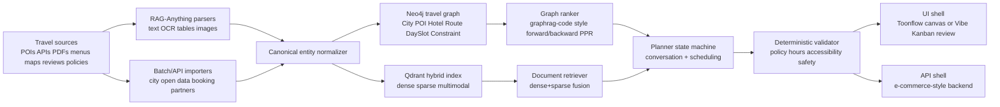
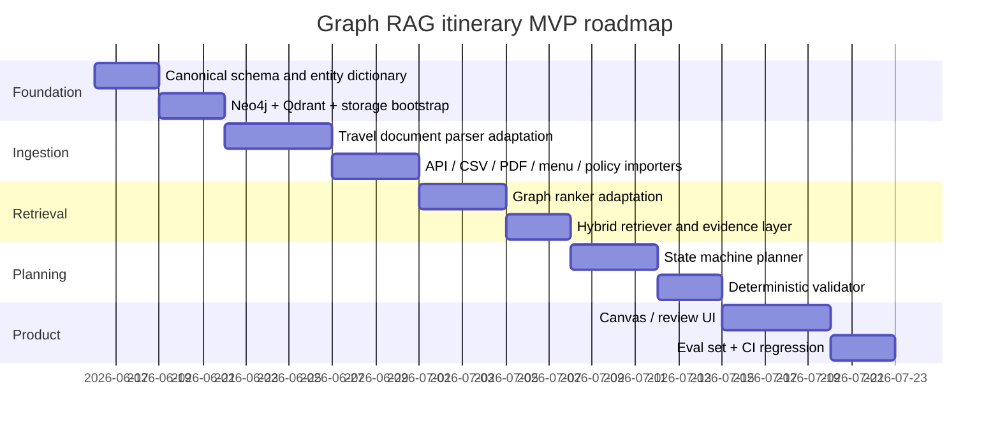

# Graph RAG Research Report for a Travel Itinerary Planner

## Executive Summary

The strongest reusable foundations for a **Graph RAG itinerary planner** are not a single repository, but a **composite stack** assembled from the best ideas across several of the inspected assets. The most directly reusable runtime cores are **bydecom/graphrag-code** for graph indexing and ranking, **HKUDS/RAG-Anything** for multimodal ingestion, **bydecom/conversational-state-machine** for deterministic dialogue flow, **bydecom/medical-citation-agent** for evidence-backed validation, and **bydecom/e-commerce-project** for production infrastructure patterns. **HBAI-Ltd/Toonflow-app** is especially valuable as a product architecture reference because it already combines multi-agent orchestration, persistent memory, an event-graph mindset, and a rich desktop UX shell that can be repurposed for itinerary editing rather than script production. citeturn19view1turn24view1turn24view2turn25view0turn32view0turn30view1turn39view1turn39view2turn41view2turn35view2turn37view0turn42view0turn43view0turn45view0

The best conceptual lesson across the repositories is that **good Graph RAG is rarely “graph only.”** The most useful patterns here combine a graph structure with deterministic extractors, vector search, prompt scaffolding, workflow state, and validators. That matches the official directions of both **Neo4j GraphRAG**, which explicitly combines KG creation with graph, vector, and full-text retrieval, and **LightRAG**, which emphasizes a dual graph-plus-vector retrieval architecture; **Qdrant** further strengthens the case by providing dense+sparse hybrid search with fusion and score-shaping. For a travel planner, that means modeling cities, POIs, routes, hours, budgets, weather constraints, and user preferences as a graph, while still keeping dense/sparse retrieval for documents like attraction pages, transit policies, menus, and PDFs. citeturn44search0turn44search4turn44search11turn44search17turn44search3turn44search7turn44search24turn44search1turn44search12turn44search22

The repositories fall into four buckets. First, **runtime engines**: Toonflow, Understand-Anything, RAG-Anything, graphrag-code, conversational-state-machine, medical-citation-agent, e-commerce-project, and vibe-kanban. Second, **learning and pattern libraries**: awesome-llm-apps and ai-agents-for-beginners. Third, **prompt and skill corpora**: system-prompts-and-models-of-ai-tools and colleague-skill. Fourth, **data-only or inaccessible assets**: Nemotron-Personas-Vietnam and container-bay-plan-validator. For your use-case, the recommended MVP path is: **RAG-Anything for ingestion → Neo4j + Qdrant for indexing → graphrag-code-inspired graph ranking → conversational-state-machine for planner flow → medical-citation-agent-style validator → Toonflow-style canvas UI or e-commerce-project-style backend shell**. citeturn42view0turn17view0turn19view2turn19view0turn32view0turn34view0turn39view2turn35view2turn45view3turn12view1turn10view0turn44search0turn44search1turn44search19

One limitation matters. I attempted to perform actual `git clone` operations, but the execution container in this environment does not have working GitHub DNS/network access. So this report is based on **direct GitHub tree inspection, manifest inspection, README inspection, and direct reading of the most Graph-RAG-relevant source files** exposed through the repository web UI. Where source code was private or inaccessible, I note that explicitly.

## Method and Evidence

I evaluated each repository and the dataset using the same lens: **What can be borrowed for a travel Graph RAG planner?** Specifically, I prioritized files and modules connected to **RAG, graph construction, retrieval, vector indexing, prompt skill design, planning, memory, validation, APIs, and evaluation**. In practice, that meant inspecting manifests, top-level trees, “src” trees, and source files whose names or README descriptions indicated relevance to `rag`, `graph`, `retriev`, `vector`, `prompt`, `planner`, `agent`, `mcp`, `memory`, `embed`, or `skill`. The strongest official references for the target architecture are Neo4j GraphRAG, Qdrant hybrid search, MCP, and LightRAG. citeturn44search0turn44search4turn44search11turn44search17turn44search1turn44search12turn44search22turn44search19turn44search6turn44search3turn44search7turn44search24

Two consequences follow from that method. First, for large example collections or educational repositories, there is often **no single “core file”** to explain line-by-line; the right output there is an architectural and pattern extraction rather than a deep runtime dissection. Second, for repositories with real engines, I focused the line-by-line reading on files that materially affect a Graph RAG itinerary system: **`raganything.py`, `processor.py`, `query.py`, `graph_engine.py`, `indexer.py`, `mcp_server.py`, `extractor.py`, and `verifier.py`**, plus entrypoint/manifests and top-level trees. citeturn31view0turn29view0turn30view1turn30view2turn24view1turn24view2turn25view0turn39view2turn41view0turn41view1turn41view2

The evaluation criteria I used were practical rather than academic. I scored each asset on **maturity**, **Graph-RAG relevance**, **ease of adaptation**, **UI/product leverage**, **validator potential**, **production usefulness**, and **risk**. For itinerary planning specifically, I treated the essential end-to-end flow as: **ingest travel documents and APIs → normalize into entities and relations → index graph and vectors → retrieve candidates under constraints → plan day-by-day schedule → validate feasibility → expose through an API/UI**. That pipeline is reflected in the blueprint later in this report. citeturn44search0turn44search1turn44search3turn44search19

## Repository Comparison

The table below is the concise comparison view you asked for. It lists every repository and the dataset explicitly, with a direct recommendation for Graph RAG suitability.

| Repo or dataset | Maturity | RAG-relevant components | Ease of adaptation | Recommended next step |
|---|---|---|---|---|
| **HBAI-Ltd/Toonflow-app** | Mature product shell | Electron desktop app; `src/agents/`, `src/routes/`, Socket.IO, SQLite/Knex, graphlib, local memory, event-graph adaptation mindset | Medium | Reuse as **itinerary canvas + multi-agent supervisor UI**, but move retrieval into Neo4j/Qdrant services. citeturn42view0turn43view0turn45view0turn46view0 |
| **Egonex-AI/Understand-Anything** | Mature OSS tooling | Static analysis, knowledge-graph framing, `understand-anything-plugin/src/*builder.ts`, `packages/core`, `packages/dashboard`, tree-sitter dependencies | Medium | Borrow its **deterministic extractor + dashboard** pattern to build an explorable travel KG. citeturn17view0turn19view2turn20view0turn20view1 |
| **Shubhamsaboo/awesome-llm-apps** | High as a catalog, low as a single app | `rag_tutorials/`, `mcp_ai_agents/`, memory tutorials, assistants examples | Easy for cherry-picking, not for forking wholesale | Treat as a **pattern library**, not a base repo. Copy only isolated examples. citeturn11view1turn12view0 |
| **x1xhlol/system-prompts-and-models-of-ai-tools** | High as a corpus | Prompt collections and model/tool inventories | Easy for content reuse | Use it to **benchmark and refine your system prompts**, not as runtime code. citeturn11view2turn12view2 |
| **microsoft/ai-agents-for-beginners** | High as curriculum | Lessons on agentic design, tool use, planning, agentic RAG, MCP, multi-agent patterns | Easy for team enablement | Use as **training material** for team architecture choices; do not fork it as your product. citeturn11view0turn12view3 |
| **HKUDS/RAG-Anything** | Very strong ingest core | `raganything.py`, `processor.py`, `query.py`, `parser.py`, LightRAG integration, multimodal parsing, mixed query modes | Medium | Make this your **document ingestion and multimodal retrieval layer**. citeturn19view0turn27view0turn32view0turn30view1turn30view2 |
| **titanwings/colleague-skill** | Medium as a skill framework | Skill externalization; Deno/skill workflow; declarative prompt packaging | Easy | Use as the model for **versioned itinerary skills** and operator-editable prompts. citeturn11view3turn12view0 |
| **BloopAI/vibe-kanban** | Large systems project | Rust workspace, `crates/mcp`, `crates/server`, `crates/tauri-app`, workspace orchestration | Hard for MVP | Reuse later as a **review/ops shell** if you need human-in-the-loop itinerary production. citeturn14view3turn45view3 |
| **bydecom/conversational-state-machine** | Good focused backend | Express/TypeScript, Prisma, `backend/src/models`, `routes`, `services`, tests, Google GenAI client | Easy | Use as **planner dialogue orchestration** in front of your Graph RAG retriever. citeturn32view4turn34view0 |
| **bydecom/graphrag-code** | Excellent Graph RAG kernel | `indexer.py`, `graph_engine.py`, SQLite symbol/edge store, rustworkx graph, forward/backward PPR, MCP server | Easy-to-medium | Use as the **core graph ranking engine**; adapt nodes/edges from code symbols to travel entities. citeturn19view1turn24view1turn24view2turn25view0turn26view3 |
| **bydecom/medical-citation-agent** | Good validator pattern | Deterministic extraction, line-level citations, FastMCP, safety guardrails, Pydantic models | Easy | Convert into a **travel policy and schedule validator** with evidence-backed claims. citeturn35view3turn36view0turn39view2turn41view0turn41view2 |
| **bydecom/e-commerce-project** | Strong production shell | Express 5 + TypeScript + Prisma, Redis, RabbitMQ, S3/MinIO, Qdrant, Gemini, Angular, Docker Compose | Medium | Reuse as **production backend/devops shell** for auth, jobs, media, and vector APIs. citeturn35view2turn37view0turn37view1turn38view0turn39view0 |
| **bydecom/container-bay-plan-validator** | Not assessable | Repository is private/inaccessible | Not assessable | No code adaptation possible until access is granted. citeturn12view1 |
| **nvidia/Nemotron-Personas-Vietnam** | Useful dataset, not a runtime | 71.7k rows with persona-oriented prompt fields | Easy for prompt tuning | Use for **Vietnamese persona conditioning**, not factual retrieval ground truth. citeturn10view0 |

## Detailed Repository Analyses

Below I go repository by repository, explicitly listing the key observed paths, the architecture, the RAG/Graph-RAG relevance, the main strengths and weaknesses, and exactly how I would adapt each one toward a travel itinerary MVP.

**HBAI-Ltd/Toonflow-app.** The observed top-level tree includes `.github/workflows`, `data/`, `docs/`, `scripts/`, `src/`, `Dockerfile`, `electron-builder.yml`, `package.json`, and TypeScript configuration. Inside `src/`, the relevant paths are `agents/`, `lib/`, `middleware/`, `routes/`, `socket/`, `types/`, `utils/`, `app.ts`, `core.ts`, `env.ts`, `router.ts`, and `logger.ts`. Inside `src/agents/`, the tree exposes two main agent families: `productionAgent/` and `scriptAgent/`. The root README describes three-tier agent collaboration, persistent memory backed by local ONNX vector retrieval, externalized skill files, and a chapter-event graph used to preserve context during adaptation. The manifest shows an Electron/Express stack, SQLite/Knex, Socket.IO, graphlib, multiple AI SDK provider adapters, and local tooling for build/desktop packaging. That makes Toonflow a **product architecture reference**, not a Graph-RAG library. For travel, the most reusable idea is the **event graph + canvas + layered-agents** combination: replace story chapters/events with destinations/day-slots/activities, reuse the canvas for itinerary editing, and bolt a real graph/vector backend behind the existing agent UX. The main weaknesses are that the graph is application-level rather than a first-class graph database, the Node engine constraint is not meaningful, and the README exposes default admin credentials, which would need immediate hardening in any adaptation. citeturn42view0turn43view0turn45view0turn45view1turn46view0turn46view1turn46view2

**Egonex-AI/Understand-Anything.** The root manifest identifies the repo as a pnpm monorepo for “LLM intelligence + static analysis” that produces interactive dashboards, with keywords including `knowledge-graph`, `tree-sitter`, `static-analysis`, and `codebase-analysis`. The observed relevant tree is `understand-anything-plugin/src/` with `context-builder.ts`, `diff-analyzer.ts`, `explain-builder.ts`, `index.ts`, `onboard-builder.ts`, `understand-chat.ts`, and tests; plus `understand-anything-plugin/packages/core/` and `understand-anything-plugin/packages/dashboard/`. The top-level package scripts build the core package, run tests, and launch the dashboard; the manifest also pins tree-sitter language bindings as built dependencies. Architecturally, this is a deterministic-first extractor that builds structured context and then hands it to differentiated builder modules for explanation, onboarding, diff analysis, or interactive chat. For a travel planner, that pattern maps almost one-to-one: **context-builder** becomes “trip context builder,” **onboard-builder** becomes “destination onboarding summary,” and **dashboard** becomes a POI/route/constraint graph explorer. The weakness is that the graph appears to be an internal application abstraction rather than a dedicated graph DB integration, so you would still need Neo4j or another graph runtime for production-scale itinerary retrieval. Still, as a **travel KG extractor and explainer UI**, it is unusually valuable. citeturn17view0turn19view2turn19view3turn20view0turn20view1

**Shubhamsaboo/awesome-llm-apps.** This is not a cohesive runtime codebase; it is a repository of examples and tutorials. The top-level tree exposes directories such as `advanced_tools_frameworks/`, `ai_apps/`, `chat_with_X_tutorials/`, `llm_apps_with_memory_tutorials/`, `mcp_ai_agents/`, `openai_assistants/`, and `rag_tutorials/`, plus a `requirements.txt` and project docs. That makes its value mostly **combinatorial**: it gives you many isolated patterns for things like memory, tool use, assistants, and RAG, but it does not give you one architecture to fork. For Graph RAG itinerary planning, the best use is selective borrowing: one example for embedding/vector wiring, another for MCP tools, another for conversational memory, and perhaps another for eval scaffolding. Its main weakness is exactly that breadth: without strong curation, it can easily push a beginner toward a fragmented architecture. citeturn11view1turn12view0

**x1xhlol/system-prompts-and-models-of-ai-tools.** This repository is best understood as a **prompt and tool-behavior corpus**, not an application. The repo README positions it around system prompts and tool/model behavior, and the tree is centered on documentation/prompt assets rather than a runtime service. That makes it useful for sharpening your itinerary planner’s **system prompt, tool routing prompt, safety prompt, and critique/replan prompt**. It is especially useful for comparative prompt design: what tone should your planner use, how much chain-of-tools structure should be exposed, how should tool outputs be grounded, and where should policy boundaries sit. The main risk is copy-paste prompt cargo-culting; prompts from other tools often assume capabilities, safeguards, or UX structures that your planner will not actually have. For Graph RAG, treat this repo as **prompt research material** only. citeturn11view2turn12view2

**microsoft/ai-agents-for-beginners.** This is a curriculum rather than a product repo, but it is unusually relevant because its lesson sequence explicitly covers agentic RAG, planning, multi-agent design, trustworthy agents, tool use, and MCP. The top-level structure includes ordered lesson folders and quickstarts that encode a clear pedagogy: first agent basics, then frameworks, design patterns, agentic RAG, planning, productionization, and MCP. For a team building your planner, that means this repo is best used as the **training plan** for the engineering process: it gives a shared vocabulary for tool choice, planner design, reflection, memory, and agent control boundaries. The weakness is that examples are educational and intentionally simplified; you should not mistake a lesson notebook for production retrieval infrastructure. citeturn11view0turn12view3

**HKUDS/RAG-Anything.** This is the strongest **document ingestion and multimodal retrieval** base among the inspected repositories. The package is a Python project named `raganything` requiring Python 3.10+, depending on `lightrag-hku`, `mineru[core]`, `huggingface_hub`, and `tqdm`, with optional extras for image, OCR, markdown, and office handling. The main source tree contains `base.py`, `config.py`, `parser.py`, `processor.py`, `query.py`, `raganything.py`, and related prompt, callback, and utility modules. The central class is a `@dataclass` named `RAGAnything` that mixes in `QueryMixin`, `ProcessorMixin`, and `BatchMixin`; it wires in a `LightRAG` instance plus LLM, vision, embedding, and configuration objects, and explicitly exposes LightRAG storage-related parameters like KV, vector, graph, doc status, chunking, rerank, and token limits. `RAGAnythingConfig` carries environment-backed config for working directories, parser choice, multimodal processing toggles, batch concurrency, and supported extensions. In `processor.py`, `ProcessorMixin` handles cache key construction from file paths and parser configuration, maintains document status, stores parse results, and dispatches parsing based on document type. In `query.py`, the `aquery` method delegates pure-text retrieval to LightRAG with modes including `local`, `global`, `hybrid`, `naive`, `mix`, and `bypass`; `aquery_with_multimodal` enhances the query with images, tables, and equations; and `aquery_vlm_enhanced` rewrites retrieved image paths into multimodal content for a vision-language model. That is extremely transferable to travel, where itineraries are grounded not just in plain text but also PDFs, scanned tickets, museum maps, menus, brochures, and tables of schedules. The main missing pieces for travel are **geo-awareness, temporal feasibility, opening-hours semantics, routing constraints, and clearer graph schema control** outside LightRAG internals. citeturn27view0turn19view0turn22view2turn32view0turn32view2turn29view0turn30view1turn30view2turn28view1turn28view2

**titanwings/colleague-skill.** This repository appears to be a **skill externalization framework**, with a README emphasizing an elegant skill system and Deno-based runtime ideas, plus skill-oriented project files rather than a retrieval stack. Even without a graph engine, it is directly relevant to your problem because itinerary planning benefits from **file-based skill versioning**: “family itinerary,” “rainy-day fallback,” “foodie trip,” “accessible trip,” “budget-first trip,” and “romantic weekend” should be editable, testable, and version-controlled as prompt assets rather than buried in source code. Its weakness is the lack of first-class retrieval or graph execution. I would use it to shape your **skill pack structure**, not your indexer. citeturn11view3turn12view0

**BloopAI/vibe-kanban.** This is a systems-heavy application built as a large Rust workspace with many crates, including `crates/server`, `crates/mcp`, `crates/tauri-app`, `crates/db`, and many supporting infrastructure crates. The observed `Cargo.toml` declares a workspace with many members and shared dependencies like Tokio, Axum, Tower HTTP, tracing, git2, and schema tooling. That means the repo is architecturally powerful but **too large and too general** to serve as the retrieval core for a new Graph-RAG itinerary MVP. Where it *does* help is in the operational layer: if you eventually want a Tauri desktop shell, review boards, live collaboration, or a kanban-like workflow where AI proposes itinerary variants and humans approve them, vibe-kanban offers better inspiration than code-RAG repos do. For MVP purposes, I would put it on the “later phase” list. citeturn14view3turn43view2turn45view3

**bydecom/conversational-state-machine.** This repo is a strong fit for the **planner-control layer** of your system. The backend tree includes `prisma/`, `src/models/`, `src/routes/`, `src/services/`, tests, and `src/index.ts`; the backend package uses Express, Prisma, CORS, dotenv, `@google/generative-ai`, TypeScript, tsx, and Vitest, with scripts for dev, build, tests, and database push/seed. This is exactly the sort of deterministic scaffolding you want around a travel planner: a state machine that moves the user from intent capture to clarification to retrieval to draft itinerary to critique to replan to final export, with explicit branching rules rather than an LLM improvising the whole conversation. The weakness is that retrieval is absent; it is not a Graph RAG repo. But used correctly, that is a strength: your graph/vector engine should remain a service that the state machine calls, so conversation control and retrieval quality do not get entangled. citeturn32view4turn34view0turn34view1

**bydecom/graphrag-code.** This is the most important repository for your Graph RAG work. The source tree `src/graphrag_code/` contains `cli_agent.py`, `export_graph.py`, `graph_engine.py`, `indexer.py`, and `mcp_server.py`. `graph_engine.py` defines `GraphRAGCodeEngine`, which loads a SQLite-backed graph into an in-memory `rustworkx` directed graph, maintains mappings from SQLite IDs to graph indices, resolves ambiguous symbol names, extracts precise source blocks, expands seeds through interface/implementation relations, runs forward and reverse Personalized PageRank, merges the scores with a tunable backward-weight policy, removes seed nodes from the final candidate set, and returns ranked contexts with separate forward and backward score contributions. The crucial insight is not “code search”; it is the **retrieval strategy**. In travel, forward edges correspond naturally to “recommended next activity,” “transit connection,” or “nearby follow-up,” while backward edges correspond to “what upstream constraints make this candidate relevant,” such as user theme preferences, starting location, mobility constraints, or day-slot compatibility. `indexer.py` is also valuable. It initializes normalized SQLite tables for files, symbols, and edges; uses `tree_sitter_python`; adds route decorator detection for semantically meaningful endpoint nodes; and builds edges that the graph engine can rank. For travel, the adaptation is obvious: replace source files and symbols with POIs, neighborhoods, hotels, restaurants, attraction slots, transit stops, and temporal constraint nodes, then replace AST extraction with your travel ingestion pipeline. This repo is the **cleanest kernel** for itinerary Graph RAG ranking because it already separates deterministic indexing from graph-based retrieval. citeturn19view1turn24view1turn24view2turn24view3turn25view0turn26view0turn26view3

**bydecom/medical-citation-agent.** This is the cleanest validator pattern in the set. The source tree is small and understandable: `src/extractor.py`, `src/mcp_server.py`, `src/models.py`, `src/safety_rules.json`, and `src/verifier.py`. `mcp_server.py` is an ideal tiny example of a useful tool server: it instantiates `FastMCP`, defines one tool `extract_claims(document_path: str)`, loads normalized sentences, extracts claims, deduplicates them, and then passes them through a guardrail. `extractor.py` is deterministic-first: `load_openfda_text` reads specific text-bearing fields from label JSON, splits them into numbered sentences, then `find_claims` applies regex pattern matches and entity extraction to produce a `MedicalClaim` with a precise `CitationSource`. `verifier.py` loads JSON rules and rejects claims that mention sensitive drug-condition pairs without explicit contraindication phrasing. This is extremely transferable to travel. You need exactly this for **opening-hours validation, cancellation-policy validation, museum-day-closure validation, age/accessibility claims, and transit disruption policy checks**. The big lesson is that not everything should be done with an LLM; itinerary systems need deterministic validators with citations. citeturn35view3turn36view0turn39view2turn41view0turn41view1turn41view2turn41view3

**bydecom/e-commerce-project.** This is the best production shell if you want your itinerary planner to become a real platform. The root README states the backend stack as Express 5, TypeScript, Prisma, Redis, RabbitMQ, S3/MinIO, Gmail/Mailpit, Gemini, and Qdrant, while the source tree exposes `backend/src/modules/ai`, `location`, `product`, `order`, `upload`, and many other modules. The backend manifest confirms production-grade dependencies, including `@qdrant/js-client-rest`, `@google/genai`, Redis, RabbitMQ, rate limits, PDF generation, Prisma, and Zod. Architecturally, this repo separates infra concerns well: storage, cache, queue, workers, object storage, and typed validation are already in place. That is very attractive for a travel planner because “product search” becomes “activity search,” “location” already remains “location,” “upload” supports artifacts, “order” can become booking/request workflows, and the AI/Qdrant layer can back itinerary retrieval. The weakness is domain weight: you will drag along many unnecessary e-commerce abstractions unless you are careful. If you start from this repo, make the first milestone a **hard domain pruning** before adding Neo4j. citeturn35view2turn35view1turn37view0turn37view1turn38view0turn39view0

**bydecom/container-bay-plan-validator.** This repository is effectively not assessable from the accessible source because the code is private/inaccessible. I cannot responsibly describe its architecture or recommend code reuse beyond saying the name suggests a deterministic validation problem that *conceptually* aligns with itinerary feasibility checking. No adaptation plan should depend on this repo until source access is available. citeturn12view1

**nvidia/Nemotron-Personas-Vietnam.** The dataset page shows roughly **71.7k rows** with prompt-oriented columns and is clearly designed for persona/system-prompt style conditioning rather than factual travel grounding. That makes it useful for a very specific slice of your planner: if you want a Vietnamese-language assistant that can shift persona or tone, or if you want localized prompt variations for VN users, this dataset may help. It is **not** a travel knowledge base, **not** an itinerary graph corpus, and **not** an evaluation ground truth for retrieval correctness. Its biggest value is cultural and linguistic adaptation in the prompt layer. citeturn10view0

**The course, prompt, and skill repositories as a set.** `awesome-llm-apps`, `ai-agents-for-beginners`, `system-prompts-and-models-of-ai-tools`, and `colleague-skill` are best treated as **meta-assets** rather than runtime dependencies. Together, they cover prompt design, skills-as-files, agent design patterns, RAG tutorials, memory examples, and MCP patterns. They will make your architecture decisions better, but they should not become the center of your codebase. A common beginner mistake is to over-fit to tutorial repositories instead of building a coherent planner service boundary around retrieval, state, and validation. citeturn11view1turn11view2turn11view3turn11view0turn12view0turn12view2turn12view3

The most reusable end-to-end combination is shown below.



That blueprint aligns with the explicit GraphRAG, LightRAG, Qdrant, and MCP patterns in the official references and the inspected repositories. Neo4j’s GraphRAG package supports KG creation and multiple retriever types; LightRAG emphasizes graph-plus-vector retrieval; Qdrant supports hybrid dense/sparse fusion; and MCP provides a standard way to expose your validators and tools to planners and UI clients. citeturn44search0turn44search4turn44search11turn44search17turn44search3turn44search7turn44search24turn44search1turn44search22turn44search19turn44search6

## Graph RAG Travel MVP Blueprint

The right Graph RAG architecture for travel is a **hybrid of entity-graph retrieval and document retrieval**. Graphs answer questions like “what is close, compatible, and sequenceable?” Documents answer questions like “what is the opening-hours exception, cancellation rule, or transit note?” The graph should be authoritative for structure; the vector store should be authoritative for semantic recall over messy text. This division is consistent with both the official Neo4j GraphRAG package and LightRAG’s dual retrieval framing, while Qdrant’s hybrid query model fits the document side well. citeturn44search0turn44search4turn44search17turn44search3turn44search7turn44search1turn44search12

A practical **travel graph schema** looks like this:

```text
(:Country)-[:HAS_CITY]->(:City)
(:City)-[:HAS_DISTRICT]->(:District)
(:District)<-[:LOCATED_IN]-(:POI)
(:POI)-[:TAGGED_AS]->(:Theme)
(:POI)-[:SUITABLE_FOR]->(:Persona)
(:POI)-[:OPEN_ON]->(:DayOfWeek)
(:POI)-[:CLOSES_AT]->(:TimeRule)
(:POI)-[:NEAR_TO {minutes_walk}]->(:POI)
(:POI)-[:CONNECTED_BY {mode, duration_min, cost}]->(:POI)
(:Restaurant:POI)-[:SERVES]->(:Cuisine)
(:Hotel)-[:NEAR_TO]->(:POI)
(:Traveler)-[:PREFERS]->(:Theme)
(:Traveler)-[:AVOIDS]->(:Constraint)
(:Itinerary)-[:HAS_DAY]->(:DayPlan)-[:HAS_SLOT]->(:TimeSlot)
(:TimeSlot)-[:ASSIGNS]->(:POI)
(:Document)-[:EVIDENCE_FOR]->(:POI|:Policy|:TimeRule)
```

A few **Cypher patterns** matter immediately.

```cypher
CREATE CONSTRAINT poi_id IF NOT EXISTS
FOR (p:POI) REQUIRE p.id IS UNIQUE;

CREATE CONSTRAINT city_id IF NOT EXISTS
FOR (c:City) REQUIRE c.id IS UNIQUE;

MERGE (c:City {id: $city_id})
SET c.name = $city_name, c.country = $country

MERGE (p:POI {id: $poi_id})
SET p.name = $name,
    p.category = $category,
    p.lat = $lat,
    p.lon = $lon,
    p.avg_visit_min = $avg_visit_min,
    p.avg_cost = $avg_cost,
    p.rating = $rating,
    p.source_doc_id = $source_doc_id

MERGE (p)-[:LOCATED_IN]->(c)

UNWIND $themes AS theme
MERGE (t:Theme {name: theme})
MERGE (p)-[:TAGGED_AS]->(t);
```

```cypher
MATCH (u:Traveler {id: $traveler_id})-[:PREFERS]->(t:Theme)<-[:TAGGED_AS]-(p:POI)-[:LOCATED_IN]->(c:City {id: $city_id})
WHERE p.avg_cost <= $max_cost
  AND p.avg_visit_min <= $max_slot_min
RETURN p
ORDER BY p.rating DESC
LIMIT 50;
```

```cypher
MATCH (a:POI {id: $from_id})-[r:CONNECTED_BY]->(b:POI)
WHERE r.mode IN $modes
RETURN b.id, r.duration_min, r.cost
ORDER BY r.duration_min ASC
LIMIT 20;
```

The most direct code adaptation is to port **graphrag-code’s graph ranker** from code symbols to travel entities. Conceptually, “seed nodes” become user intent nodes: destination, themes, starting hotel, budget bucket, and mandatory attractions. Forward propagation finds promising follow-on activities; backward propagation surfaces upstream compatibility and blast-radius constraints, such as which POIs become poor choices once time or mobility is limited. That is very close to the two-direction PPR merge already implemented in `graph_engine.py`. citeturn24view1turn24view2turn24view3turn25view0

A minimal adaptation patch looks like this:

```diff
diff --git a/src/graphrag_code/graph_engine.py b/src/graphrag_code/graph_engine.py
@@
-class GraphRAGCodeEngine:
+class TravelGraphEngine:
@@
-    def __init__(self, db_path="graphrag_code.sqlite"):
+    def __init__(self, db_path="travel_graph.sqlite"):
         self.db_path = db_path
         self.graph = rx.PyDiGraph()
@@
-    def resolve_symbol(self, symbol_name: str):
+    def resolve_entity(self, entity_name: str):
         """
-        Resolve a symbol name into a structured (index, candidates) result.
+        Resolve a travel entity name into a structured (index, candidates) result.
         """
@@
-    def get_context_ppr(self, seed_name: str, top_k: int = 5,
+    def rank_candidates(self, seed_name: str, top_k: int = 20,
                         backward_weight: float = DEFAULT_BACKWARD_WEIGHT):
         """
-        Runs Personalized PageRank in BOTH edge directions and merges the results.
+        Runs bidirectional Personalized PageRank over the travel graph.
+        Forward edges: next-best activities, nearby places, transit links.
+        Backward edges: preferences, constraints, day-slot compatibility.
         """
```

The second critical adaptation is to make **RAG-Anything** emit travel-normalized entities rather than only LightRAG-ready chunks. You want brochures, policy PDFs, menus, and transit tables to produce nodes like `POI`, `Policy`, `OpeningHours`, `PriceBand`, `Cuisine`, and `AccessibilityFeature`, while still flowing into document/vector indexing.

```diff
diff --git a/raganything/processor.py b/raganything/processor.py
@@
 from raganything.utils import (
     separate_content,
     insert_text_content,
     insert_text_content_with_multimodal_content,
     get_processor_for_type,
@@
 )
+from travel_graph.normalize import extract_travel_entities
@@
     async def parse_document(
         self,
         file_path: str,
@@
-        return content_list, doc_id
+        entities, relations = extract_travel_entities(content_list, source_file=file_path)
+        return {
+            "content_list": content_list,
+            "doc_id": doc_id,
+            "entities": entities,
+            "relations": relations,
+        }
```

The third critical adaptation is to put **conversation control outside the retriever**, using a state machine like the one in `conversational-state-machine`. The planner should never ask the graph “make me a plan” in one shot. It should ask smaller, typed questions.

```diff
diff --git a/backend/src/routes/itinerary.ts b/backend/src/routes/itinerary.ts
new file mode 100644
+import { Router } from "express";
+import { z } from "zod";
+import { buildDraftItinerary } from "../services/itinerary.service";
+
+const router = Router();
+
+const DraftRequest = z.object({
+  city: z.string(),
+  days: z.number().int().min(1).max(14),
+  budget: z.number().nonnegative(),
+  themes: z.array(z.string()).default([]),
+  constraints: z.array(z.string()).default([]),
+  hotel_lat: z.number().optional(),
+  hotel_lon: z.number().optional()
+});
+
+router.post("/draft", async (req, res) => {
+  const input = DraftRequest.parse(req.body);
+  const result = await buildDraftItinerary(input);
+  res.json(result);
+});
+
+export default router;
```

```ts
// backend/src/services/itinerary.service.ts
export async function buildDraftItinerary(input: DraftInput) {
  // 1. Retrieve graph seeds from city + themes + constraints
  // 2. Rank POIs with graph engine
  // 3. Pull supporting docs with Qdrant hybrid search
  // 4. Construct day slots with travel-time and opening-hours checks
  // 5. Call validator service before returning
}
```

The fourth adaptation is to copy **medical-citation-agent’s deterministic validator pattern** into travel.

```diff
diff --git a/src/verifier.py b/src/verifier.py
@@
-class SafetyGuardrail:
+class TravelGuardrail:
@@
-    def check(self, claim: MedicalClaim) -> bool:
+    def check(self, claim: TravelClaim) -> bool:
         """
-        Filter claims that mention critical drug–condition pairs...
+        Filter unsupported travel claims such as:
+        - "open late" without a cited schedule source
+        - "wheelchair accessible" without evidence
+        - "family friendly" if age restrictions conflict
+        - "easy walk" when graph travel time exceeds threshold
         """
```

The fifth adaptation is product-facing: use **Toonflow’s UI shell** or **vibe-kanban’s ops shell** to make plans editable rather than only generated. The idea is not to copy the whole app. The idea is to copy the product pattern: a graph/canvas board where AI proposes itinerary nodes and a human drags, swaps, pins, rejects, and revalidates them. Toonflow’s event-graph and infinite-canvas mindset map especially well to day-by-day travel planning. citeturn42view0turn46view0

A simple **retriever fusion layer** tying Neo4j and Qdrant together can look like this:

```python
from dataclasses import dataclass
from typing import List, Dict, Any

@dataclass
class RetrievalCandidate:
    entity_id: str
    graph_score: float
    vector_score: float
    payload: Dict[str, Any]

def fuse_scores(graph_hits, vector_hits, alpha: float = 0.65) -> List[RetrievalCandidate]:
    by_id: Dict[str, RetrievalCandidate] = {}

    for hit in graph_hits:
        by_id[hit["entity_id"]] = RetrievalCandidate(
            entity_id=hit["entity_id"],
            graph_score=float(hit["score"]),
            vector_score=0.0,
            payload=hit,
        )

    for hit in vector_hits:
        cid = hit["entity_id"]
        if cid not in by_id:
            by_id[cid] = RetrievalCandidate(
                entity_id=cid,
                graph_score=0.0,
                vector_score=float(hit["score"]),
                payload=hit,
            )
        else:
            by_id[cid].vector_score = float(hit["score"])
            by_id[cid].payload.update(hit)

    scored = list(by_id.values())
    scored.sort(
        key=lambda x: alpha * x.graph_score + (1.0 - alpha) * x.vector_score,
        reverse=True,
    )
    return scored
```

A basic **planning loop** should remain deterministic around the edges:

```python
def plan_itinerary(user_request, graph_engine, vector_store, validator):
    seeds = extract_seeds(user_request)  # city, themes, hotel, budget, constraints
    graph_hits = graph_engine.rank_candidates(seeds["primary_seed"], top_k=80)
    vector_hits = vector_store.hybrid_search(user_request["query"], top_k=80)

    fused = fuse_scores(graph_hits, vector_hits)
    days = initialize_day_slots(user_request)

    for day in days:
        while day.has_open_slots():
            candidate = next_best_feasible(fused, day, user_request)
            if candidate is None:
                break
            if validator.is_feasible(candidate, day, user_request):
                day.assign(candidate)

    return repair_and_justify(days, validator)
```

The final architectural point is a human one: **do not let the model invent itinerary constraints silently**. Bring every important decision into one of three buckets: graph-supported, doc-supported, or model-inferred. Deterministic validators and line-level evidence are especially important for things like opening hours, age limits, dress codes, transit availability, and accessibility claims. That lesson comes straight from the deterministic-first design of medical-citation-agent. citeturn39view2turn41view0turn41view2

Here is the recommended roadmap, with effort and risk.



A more granular effort view:

| Work item | Best source repo | Effort | Risk |
|---|---|---:|---|
| Travel entity schema, Cypher, seed extraction | graphrag-code + Neo4j GraphRAG docs | 12–18h | Medium |
| Multimodal travel ingest from PDFs/images/tables | RAG-Anything | 24–36h | Medium |
| Graph ranking over POIs and routes | graphrag-code | 20–30h | Medium |
| Hybrid dense+sparse search tuning | e-commerce-project + Qdrant docs | 12–20h | Medium |
| Planner dialogue flow and replanning | conversational-state-machine | 16–24h | Medium |
| Deterministic validators with evidence | medical-citation-agent | 12–18h | Low |
| Canvas/review UI | Toonflow-app or vibe-kanban | 24–40h | High |
| Production packaging, jobs, storage, auth | e-commerce-project | 20–36h | Medium |
| Vietnamese persona/UX tone conditioning | Nemotron-Personas-Vietnam | 8–16h | Low |
| Prompt and skill pack authoring | colleague-skill + system-prompts repo | 8–14h | Low |

## Evaluation, Operations, and Risk Controls

A travel planner without evaluation is just a fancy demo. I recommend creating a `test_queries.json` fixture early and running it in CI. The file should test **budget, travel time, opening hours, day sequencing, family accessibility, rainy-day fallback, and evidence grounding**.

```json
[
  {
    "id": "hanoi_weekend_food_culture",
    "query": "Plan 2 days in Hanoi for a couple who love food and history.",
    "constraints": {
      "city": "Hanoi",
      "days": 2,
      "budget_vnd": 3500000,
      "pace": "moderate",
      "walking_limit_min": 25,
      "must_include_themes": ["food", "history"],
      "avoid": ["nightclubs"]
    },
    "expected": {
      "min_pois": 5,
      "must_have_evidence": true,
      "requires_route_feasibility": true
    }
  },
  {
    "id": "danang_family_rain_backup",
    "query": "Create a 3-day Danang itinerary for parents with one child, with indoor backups if it rains.",
    "constraints": {
      "city": "Da Nang",
      "days": 3,
      "group": ["adult", "adult", "child"],
      "pace": "easy",
      "weather_backup": true,
      "must_include_themes": ["family", "scenic"]
    },
    "expected": {
      "rain_backup_count": 3,
      "child_safety_checks": true
    }
  },
  {
    "id": "saigon_accessible_short_trip",
    "query": "I only have 1 day in Ho Chi Minh City and I use a wheelchair.",
    "constraints": {
      "city": "Ho Chi Minh City",
      "days": 1,
      "accessibility": ["wheelchair"],
      "max_transfers": 2,
      "pace": "easy"
    },
    "expected": {
      "must_have_accessibility_evidence": true,
      "max_total_pois": 4
    }
  },
  {
    "id": "kyoto_budget_solo_museums",
    "query": "Plan 4 days in Kyoto for a solo traveler focused on temples and museums under a tight budget.",
    "constraints": {
      "city": "Kyoto",
      "days": 4,
      "budget_usd": 250,
      "must_include_themes": ["temples", "museums"],
      "lodging_fixed": true
    },
    "expected": {
      "daily_budget_check": true,
      "museum_hours_cited": true
    }
  },
  {
    "id": "rome_food_night_train",
    "query": "Build a 2.5-day Rome trip around food, one opera evening, and low walking because of a knee injury.",
    "constraints": {
      "city": "Rome",
      "days": 3,
      "effective_days": 2.5,
      "must_include_themes": ["food", "music"],
      "mobility_constraints": ["low_walking"]
    },
    "expected": {
      "route_time_validated": true,
      "mobility_conflict_count": 0
    }
  }
]
```

The evaluation metrics should be explicit:

| Metric | What it measures | Good target |
|---|---|---|
| **Constraint Satisfaction Rate** | Percentage of hard constraints satisfied in final itinerary | ≥ 0.95 |
| **Temporal Feasibility Rate** | No slot conflicts; opening-hours and transit windows respected | ≥ 0.95 |
| **Travel-Time Feasibility** | Consecutive POIs fit travel duration thresholds | ≥ 0.90 |
| **Evidence Grounding Precision** | Cited claims actually support the stated hours/policies/accessibility facts | ≥ 0.95 |
| **POI Relevance@K** | Whether top retrieved POIs match trip themes and intent | ≥ 0.80 |
| **Diversity Score** | Avoids overly repetitive themes or neighborhoods | Context-dependent |
| **Budget Deviation** | Difference between estimated and target budget | ≤ 10% median |
| **Repair Success Rate** | Fraction of invalid drafts fixed by validator/replanner | ≥ 0.80 |
| **User Satisfaction Proxy** | Human rating on usefulness/coherence | ≥ 4/5 |

For local execution, I would use the repositories in this order:

| Asset | Practical local command set | Notes |
|---|---|---|
| **Toonflow-app** | `yarn && yarn dev`, `yarn dev:gui`, `yarn build`, `yarn dist`, `yarn docker:local` | Scripts are exposed in the root manifest and README. Good for UI-shell experiments. citeturn45view0turn42view0 |
| **Understand-Anything** | `pnpm install`, `pnpm build`, `pnpm dev:dashboard`, `pnpm test` | Root manifest exposes build/test/dashboard scripts. citeturn17view0 |
| **RAG-Anything** | `pip install -e .[all]` | Needs Python ≥3.10, LightRAG/MinerU, and optional OCR/image deps. citeturn27view0turn32view0turn32view2 |
| **conversational-state-machine** | `cd backend && npm install && npm run db:push && npm run dev` | Prisma schema and TS backend structure are already in place. citeturn32view4turn34view0 |
| **graphrag-code** | `pip install -e .` then run indexer / graph engine entrypoints | Exact CLI invocation depends on the repo packaging, but the core engine is clearly modular. citeturn19view1turn24view1 |
| **medical-citation-agent** | `pip install -e .[dev]` and run the project script / `main()` | Pyproject defines `medical-citation-mcp` and FastMCP server entry. citeturn41view3turn39view2 |
| **e-commerce-project** | `docker compose up` plus backend/frontend dev commands by package | Best used as infra shell; includes Docker Compose and backend module boundaries. citeturn35view2turn35view1turn37view1 |
| **vibe-kanban** | `cargo build` plus JS package bootstrap | Large Rust workspace; not a first-step MVP choice. citeturn45view3 |

For Docker Compose, the two additions that matter most are **Neo4j** and **Qdrant**. Qdrant’s official docs are explicit that hybrid search combines dense and sparse retrieval and supports server-side fusion; Neo4j’s GraphRAG docs cover graph-backed retrieval patterns. So for your itinerary stack, add both explicitly rather than trying to force everything through one backend. citeturn44search0turn44search1turn44search22

```yaml
services:
  neo4j:
    image: neo4j:5.26
    ports:
      - "7474:7474"
      - "7687:7687"
    environment:
      NEO4J_AUTH: neo4j/change-me
      NEO4J_PLUGINS: '["apoc"]'
    volumes:
      - ./volumes/neo4j:/data

  qdrant:
    image: qdrant/qdrant:v1.15.2
    ports:
      - "6333:6333"
      - "6334:6334"
    volumes:
      - ./volumes/qdrant:/qdrant/storage
```

The CI recommendation is also clear. Borrow the **GitHub Actions mindset** already present in several inspected repos, but make the pipeline travel-specific. The minimum CI matrix should run: type-checking/linting, deterministic parser tests, graph ranking regression, validator tests, `test_queries.json` eval, and a small nightly freshness job that rechecks official schedules/policies for changed sources. For assets exposed through MCP, validate tool schemas and version negotiation against the MCP spec. citeturn35view3turn35view2turn42view0turn44search19turn44search13

The largest risks are not technical novelty but **security, privacy, and grounding**. Toonflow’s README exposes default credentials, which is unacceptable in a travel product with user profiles or booking surfaces. Understand-Anything and Toonflow both raise code/prompt execution concerns when dynamic provider logic or editable skills are involved. RAG-Anything manipulates local file/image paths and can process office/PDF content, so path safety and sandboxing matter. E-commerce-project introduces all the usual multi-service risks: JWT handling, Redis isolation, queue poisoning, object-store ACLs, and cross-tenant vector leakage. Medical-citation-agent’s lesson applies broadly: user trust collapses when confident factual claims are uncited. For travel, the high-risk claim classes are **opening hours, closures, transit conditions, child/accessibility suitability, and cancellation/refund terms**. citeturn42view0turn17view0turn30view2turn35view2turn39view2turn41view2

If I were choosing a single practical build order for you, it would be this: **RAG-Anything for ingestion, graphrag-code for graph ranking, Neo4j/Qdrant for storage, conversational-state-machine for plan flow, medical-citation-agent-style validators for trust, and either Toonflow or a very thin web UI for editing**. That is the smallest path that both teaches Graph RAG correctly and gets you to a usable itinerary-planning MVP without building unnecessary infrastructure too early. citeturn19view0turn19view1turn34view0turn39view2turn42view0turn44search0turn44search1