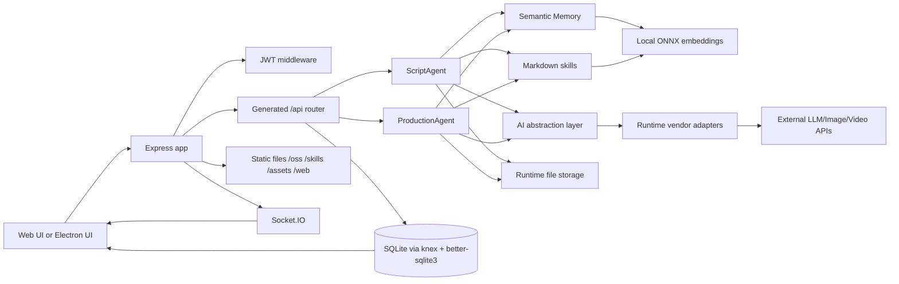
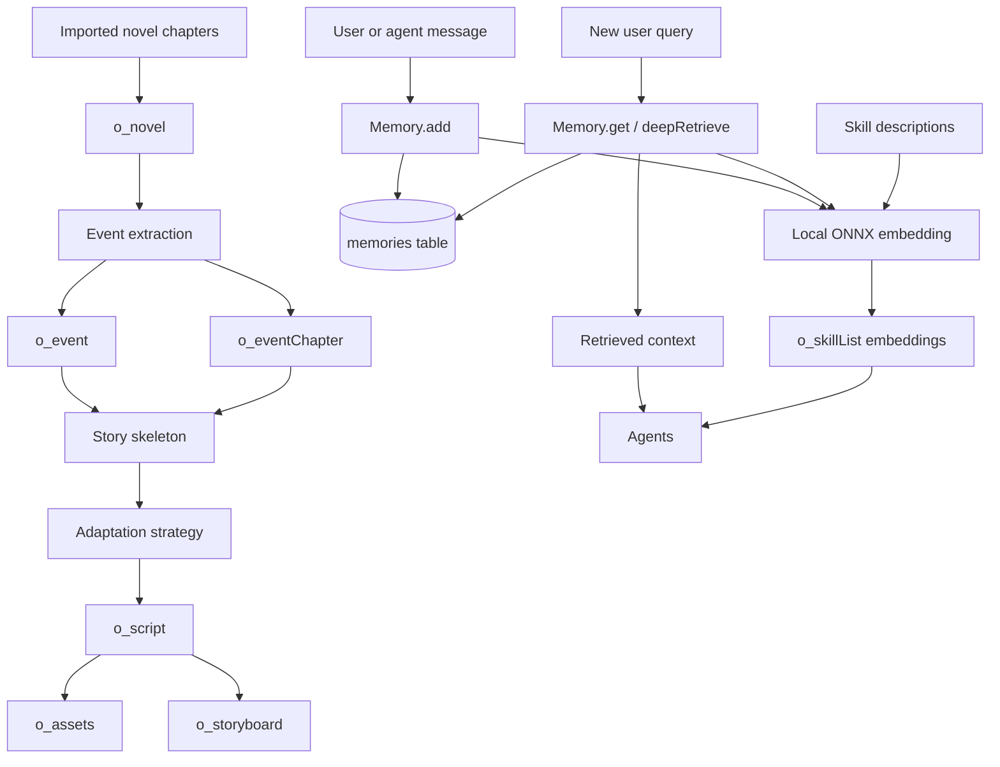
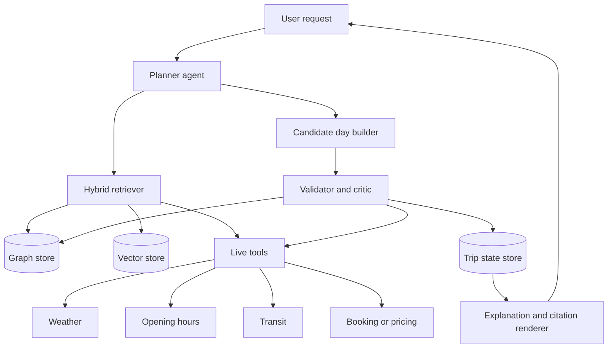

# Technical analysis of Toonflow-app

## Executive summary

Method note: I inspected the repository directly through GitHub primary-source files, including the README, package/build configuration, server bootstrap, routing generator, agent modules, database schema, embedding and memory utilities, Docker and Electron packaging files, and GitHub Actions workflows. I could not complete a local git clone from this execution environment, so where something remains ambiguous, I state that explicitly.

Toonflow-app is not a general-purpose RAG framework. It is a **vertical AI workstation for short-drama production** that spans planning, scriptwriting, storyboarding, asset generation, and video output. The repo combines an Express backend, SQLite persistence, Electron desktop packaging, Socket.IO real-time updates, a programmable multi-provider AI layer, externalized Markdown skills, and a small local ONNX embedding stack for semantic memory and skill metadata. The product positioning in the docs is very clear: it is a closed-loop workflow from planning to final output, with a three-layer agent system, persistent agent memory, and “chapter event graph-driven adaptation.” citeturn19search1turn34search3turn19search12

Architecturally, the repository’s strongest reusable ideas for a future Graph-RAG travel planner are **not** its drama-specific tables or media-generation pipeline. The most reusable pieces are the **filesystem-generated API routing**, **externalized skill/prompt system**, **persistent semantic memory**, **provider abstraction**, and **layered decision/execution/supervision agents**. The current “graph” capability is primarily a **relational event graph** stored in SQLite tables such as `o_event` and `o_eventChapter`, and the current “RAG” capability is a **lightweight local vector recall** mechanism over JSON embeddings stored in SQLite, with brute-force cosine similarity done in application code. That is useful as a stepping stone, but it is not yet a full Graph-RAG stack with a graph database, scalable vector index, hybrid retrieval, or constraint-aware planning. citeturn25view1turn31view3turn31view6turn30view0

The repo is productive and opinionated, but it also carries substantial engineering debt. The most important issues I found are: the Docker image runs a **dev server** rather than a hardened production runtime; package metadata says Node is `>=1.0.0` even though the docs require Node 23.11.1+ or 24; seeded default credentials are `admin/admin123`; passwords are stored in plaintext in the initial DB seed; JWTs are accepted from query parameters; user-editable vendor TypeScript is executed dynamically in a `vm2` VM with `timeout: 0`; and a public GitHub issue reports a high-severity SSRF in `getCodeByLink` that can be chained to extract the seeded admin password. I also found a likely bug in the embedding config loader, where DB rows are iterated into numeric object keys and then read as named properties. citeturn40view3turn9view3turn25view0turn13view2turn41view5turn43view1turn20search1turn30view0

If your goal is to turn this codebase into a **Graph-RAG travel itinerary planner**, my recommendation is to treat Toonflow as a **pattern library**, not as a domain model to extend in place. Keep its prompt-pack pattern, agent layering, semantic memory idea, and provider abstraction. Replace the drama schema with a travel graph, move retrieval to a proper graph-plus-vector architecture, add live tool-based validation for hours/weather/transit, and build a planner that optimizes across time, geography, budget, preferences, and constraints. The result can retain Toonflow’s high-level philosophy while discarding the parts that are tightly coupled to short-drama production. citeturn34search3turn30view0turn31view3turn43view12turn45view7

## Project purpose and repository anatomy

The project’s scope is broad but domain-specific. Toonflow describes itself as an open-source, all-in-one AI short-drama creation tool that turns novels and scripts into animated short dramas. The docs explicitly frame it as a workflow around **planning → scriptwriting → storyboarding → final output**, and they highlight an infinite-canvas production workbench, a three-layer agent collaboration model, persistent ONNX-based memory, programmable vendors, chapter-event-graph-driven adaptation, and file-based skills. The same docs also make clear that this repo already contains built frontend assets for normal users, but **frontend source development happens in a separate `Toonflow-web` repository** whose built `dist` must be copied into `data/web`. citeturn19search1turn34search3turn34search2

A curated repository tree, reconstructed from the README structure section and the directory pages I inspected, looks like this. It is intentionally focused on the files that matter most to architecture and runtime behavior, rather than trying to list every generated or secondary file. citeturn9view4turn6view0turn10view3turn10view5turn28view0turn29view0

```text
Toonflow-app/
├── .github/
│   └── workflows/
│       ├── debug.yml
│       └── release.yml
├── docs/
│   └── README.en.md
├── src/
│   ├── app.ts
│   ├── core.ts
│   ├── router.ts
│   ├── agents/
│   │   ├── scriptAgent/
│   │   │   ├── index.ts
│   │   │   └── tools.ts
│   │   └── productionAgent/
│   │       ├── index.ts
│   │       └── tools.ts
│   ├── lib/
│   │   ├── initDB.ts
│   │   ├── fixDB.ts
│   │   ├── responseFormat.ts
│   │   └── vendor.json
│   └── utils/
│       ├── ai.ts
│       ├── db.ts
│       ├── getPath.ts
│       ├── vendor.ts
│       ├── vm.ts
│       └── agent/
│           ├── embedding.ts
│           ├── memory.ts
│           └── skillsTools.ts
├── Dockerfile
├── electron-builder.yml
├── package.json
├── NOTICES.txt
└── LICENSE
```

At runtime, the system is centered on `src/app.ts`, which creates the Express app and HTTP server, attaches Socket.IO, conditionally generates routes in development, enables `express-ws`, serves static assets from runtime directories, enforces JWT auth after a single login whitelist, dynamically imports the generated router, and finally starts on port `10588` by default. Static resource mounting includes `/oss`, `/skills`, `/assets`, and the built web directory. The auth middleware fetches `tokenKey` from the database, accepts the token from either the `Authorization` header **or the query string**, and exempts only `/api/login/login`. citeturn13view0turn13view1turn13view2turn13view3

The route layer is code-generated. `src/core.ts` scans `src/routes/**/*.ts`, converts file paths into route paths, and rewrites `src/router.ts` only when a route hash changes. The generated `router.ts` then mounts many endpoint families under `/api`, including login, project, script, `scriptAgent`, `production/storyboard`, `production/workbench`, and many `setting/*` endpoints. That is a clean pattern for keeping route registration declarative, though the generated output file becomes very large. citeturn13view4turn13view5turn13view6

The repo’s current macro-architecture can be summarized like this. The diagram below is synthesized from `app.ts`, `core.ts`, `db.ts`, the agent modules, and the README deployment/runtime structure. citeturn13view0turn13view1turn13view2turn13view3turn13view4turn43view3turn9view4



## Runtime, build, dependencies, and deployment

The project documents three main local run modes: `yarn dev` for backend-only development, `yarn dev:gui` for Electron plus backend, and `yarn start` for running the compiled server from `data/serve/app.js`. Packaging commands exist for Windows, macOS, and Linux, and an optional `yarn debug:ai` launches the AI SDK devtools. Cloud deployment in the docs is built around Node 24, Yarn, PM2, and compiled output at `data/serve/app.js`. The Electron packaging file targets NSIS for Windows, DMG for macOS, and AppImage for Linux. citeturn40view0turn9view4turn9view3turn36view0

There are, however, several hidden or under-documented prerequisites that matter in practice. The frontend source is separate, and the backend expects built frontend artifacts in `data/web` when you want a custom UI. The embedding subsystem requires local ONNX model files under `data/models`; if the resolved ONNX path does not exist, `initEmbedding()` throws. The README also says that before running the software you need model service endpoints for text, video, and image generation, and it expects vendor/model configuration to be completed in the settings center. In short, “`yarn install && yarn dev`” is **not** the whole story for anyone who wants the full product experience. citeturn34search2turn30view0turn19search1

The Docker story is functional but inconsistent with the production docs. The `Dockerfile` bases on `node:24-bookworm-slim`, strips Electron-only packages out of `package.json`, sets `NODE_ENV=dev`, exposes port `10588`, and starts `yarn dev`. That means the container runs the **development** backend path, not the compiled production server path recommended by the PM2 deployment instructions. For local experimentation that is fine; for production, it is a red flag because it keeps the dev toolchain in the runtime path and diverges from the cloud-deployment guidance. citeturn34search1turn9view3

The dependency set is modern and ambitious. `package.json` declares Express 5, Socket.IO, `express-ws`, `better-sqlite3`, `knex`, `@huggingface/transformers`, the Vercel AI SDK plus multiple provider packages (`@ai-sdk/openai`, `@ai-sdk/anthropic`, `@ai-sdk/google`, `@ai-sdk/deepseek`, `@ai-sdk/xai`, `@ai-sdk/openai-compatible`), Electron 40, `electron-builder`, `sharp`, `graphlib`, `vm2`, `sucrase`, and `zod`. The repo also includes `NOTICES.txt`, generated with license metadata for these dependencies, and the root repository is Apache-2.0 licensed. That licensing hygiene is a real positive. citeturn40view0turn40view1turn40view2turn20search2turn34search6

There are also important dependency and metadata concerns. The docs say Node 23.11.1+ or 24 is required, the workflows build with Node 24, and the Dockerfile uses Node 24, but `package.json` declares `"node": ">=1.0.0"`. That is plainly inconsistent and will defeat package-manager enforcement. The repo also includes `vm2`, which is then used to execute runtime vendor code, substantially expanding the trust boundary of the application. Finally, while the project mentions Docker and cloud deployment, I did not find a first-class production container path, infrastructure-as-code stack, or Kubernetes manifests in the inspected primary files. citeturn40view3turn9view3turn38view1turn34search1turn40view5turn43view1

A concise view of build/runtime maturity is below.

| Area | What exists now | What is missing or risky |
|---|---|---|
| Local dev | `yarn dev`, `yarn dev:gui`, `yarn start`, packaging commands, AI devtools. citeturn40view0turn9view4 | Full experience still depends on separate frontend source when customizing UI. citeturn34search2 |
| Cloud runtime | PM2 deployment for built `data/serve/app.js`. citeturn9view3 | No strongly opinionated production container path matching the docs. citeturn34search1turn9view3 |
| Docker | Simple containerized backend path exists. citeturn34search1 | Image runs dev server with `NODE_ENV=dev`; not ideal for prod. citeturn34search1 |
| Packaging | Electron builder config for Windows, macOS, Linux. citeturn36view0 | Packaging is desktop-first; server deployment is secondary. citeturn36view0turn9view3 |
| Runtime prerequisites | ONNX models, model vendors, frontend assets are all expected. citeturn30view0turn19search1turn34search2 | Several of these are not automatically provisioned. citeturn30view0turn34search2 |
| Engine metadata | Docs and workflows consistently point to Node 24-level runtime. citeturn9view3turn38view1 | `package.json` engine constraint is effectively meaningless. citeturn40view3 |

## Data model, ingestion, and retrieval

The domain schema is built on SQLite and created through a very large `src/lib/initDB.ts`, with `src/utils/db.ts` opening `data/db2.sqlite` through `knex` and `better-sqlite3`, ensuring the DB file exists, and then running `initDB()` and `fixDB()` at startup. From a runtime perspective, this makes the application pleasantly self-bootstrapping. From a maintainability perspective, it front-loads a huge amount of seed data, schema, and prompt content into one monolithic file. citeturn43view3turn43view4turn24view0

The most important content tables for the short-drama pipeline are visible directly in the schema. `o_project` stores project-level settings and creative metadata; `o_novel` stores chapter-level source text plus extracted event data and extraction state; `o_event` stores event nodes; `o_eventChapter` links events back to source novel chapters; `o_script` stores generated scripts; and downstream tables such as `o_assets` and `o_storyboard` store production outputs. This is why the README can honestly describe the app as “chapter event graph-driven”: the implementation is clearly a **relational graph model**, not a graph database model. It is still graph-shaped, but the graph is expressed through tables and joins rather than property-graph primitives. citeturn25view0turn25view1turn25view3turn25view4turn34search3

The ingestion and transformation flow is also visible from a combination of docs and schema. Users import a novel, extract chapter events, generate a story skeleton and adaptation strategy, produce a structured script, then move into production for storyboarding and video work. The DB tables line up with that pipeline exactly. In practical ETL terms, the app is building a chain of derivations: **raw chapter text → structured events → adaptation plan → script → assets/storyboards/videos**. This is a very good precursor pattern for travel planning, where you will want a similarly staged pipeline from raw source ingest to normalized entities and then to plan synthesis. citeturn19search1turn25view1turn25view3turn25view4

The clearest true RAG implementation in the repo lives in the memory subsystem, not in the drama event schema. `src/utils/agent/embedding.ts` loads a local ONNX embedding model using `@huggingface/transformers`, disables remote model loading, points `transformers` to the local models directory, runs a `feature-extraction` pipeline, and returns mean-pooled normalized vectors. `src/utils/agent/memory.ts` then stores each new message with its embedding in the `memories` table, periodically generates summaries with their own embeddings, and retrieves context using a mix of recent unsummarized messages, recent summaries, and vector similarity over stored messages. A deeper retrieval path first vector-searches summaries, then asks the AI layer to judge relevance, then expands back to original messages. This is a clever compact design for persistent conversational memory, but it is still a **small-scale in-app vector memory**, not a corpus-scale retrieval service. citeturn30view0turn31view2turn31view3turn31view6

The same local embedding infrastructure is also used for skills metadata. `initDB.ts` seeds an `o_skillList` with many skill/reference records, computes embeddings over the skill descriptions with `getEmbedding()`, and stores those embeddings as JSON. This is important: the application is already structured around **retrievable knowledge objects** in Markdown, even though the dominant activation path exposed in `skillsTools.ts` is still a deterministic `activate_skill(name)` tool rather than an explicit graph-aware or semantic-skill selector. That design is highly reusable for a travel planner, where skill files can describe retrieval rules, planning policies, validator behavior, or destination-specific heuristics. citeturn27view0turn27view1turn45view3turn45view4

The repo’s current retrieval architecture, therefore, is best described as follows:

| Retrieval dimension | Current implementation | Assessment for Graph-RAG |
|---|---|---|
| Semantic retrieval | Local ONNX embeddings and cosine similarity over JSON vectors stored in SQLite-backed tables. citeturn30view0turn31view2turn31view3 | Useful prototype pattern, not scalable enough for large travel corpora. |
| Long-context compression | Summaries are generated and embedded, then used for deep recall expansion. citeturn31view3turn31view6 | Good idea to preserve; useful for multi-turn trip planning memory. |
| Graph retrieval | `o_event` plus `o_eventChapter` creates a relational event graph over source chapters. citeturn25view1 | Conceptually valuable, but it is not a graph database or graph-aware retriever yet. |
| Document/skill retrieval | Markdown skill/reference documents are seeded into DB metadata with embeddings; tooling activates skills by name and reads skill resources from disk. citeturn27view0turn27view1turn45view3turn45view4 | Excellent pattern for prompt packs and policy files. |
| Hybrid retrieval | In the inspected files, retrieval combines memory vectors plus direct tool/database reads; there is no visible BM25, reranker, or graph-plus-vector hybrid stage. citeturn31view3turn25view1turn18view7 | This is the biggest gap if the target is Graph-RAG. |

One real code-level issue is worth calling out here because it affects reproducibility of the embedding pipeline. In `embedding.ts`, the code queries `o_setting` for `modelOnnxFile` and `modelDtype`, but then populates `modelObj` via `Object.entries(modelConfigData)`, where `modelConfigData` is the row array from the DB query. That pattern produces numeric keys like `"0"` and `"1"` rather than `modelOnnxFile` and `modelDtype`, yet the code later reads `modelObj.modelOnnxFile` and `modelObj.modelDtype`. Unless another unseen layer is reshaping the data, this looks like a likely config-loading bug. citeturn30view0

The current data flow around ingestion and retrieval looks like this. The diagram is a synthesis of the README pipeline, DB schema, embedding utility, and memory implementation. citeturn19search1turn25view1turn25view3turn25view4turn30view0turn31view3



## Agent orchestration, prompts, and state

The repo’s most distinctive architectural idea is its **agent layering**. The README describes a three-layer system of decision, execution, and supervision. The code supports that claim. In `scriptAgent/index.ts`, `runDecisionAI()` creates a `Memory("scriptAgent", isolationKey)`, stores the user message, loads `script_agent_decision.md` from the runtime skills directory, and later stores the agent’s output back into memory under `assistant:decision`. The same module’s sub-agent factory creates specialized sub-agents with separate `memoryKey` values, including a supervision agent backed by `script_agent_supervision.md`. citeturn34search3turn43view9turn45view8turn45view9

The script-side tool layer is strongly typed and domain-aware. `scriptAgent/tools.ts` defines Zod schemas such as `ScriptSchema` and `planData` with explicit fields for `storySkeleton`, `adaptationStrategy`, and `script`. It exposes tools like `get_novel_events` and `get_novel_text`, which strongly suggests that script generation works by selectively reading structured event data and raw chapter content rather than dumping the entire novel into the context window each time. That is a good design instinct and exactly the sort of tool-mediated retrieval you want to preserve in a travel Graph-RAG planner. citeturn18view6turn18view7

The production-side agent is more elaborate. `productionAgent/index.ts` also creates a persistent `Memory("productionAgent", isolationKey)`, stores incoming user messages, loads `production_agent_decision.md`, and then defines many specialized execution tools such as derived asset analysis, director planning, storyboard panel generation, storyboard table generation, and supervision. Those sub-agents pass skill prompts and only selected tools into the LLM call, often through `activate_skill`, and sometimes require XML-formatted writes into the working area. This is not just prompt orchestration; it is a practical, file-backed **agent workbench** pattern with explicit tool affordances and structured write-back expectations. citeturn43view12turn18view10turn45view6turn45view7

The prompt system is externalized by design. The docs say core prompts for ScriptAgent and ProductionAgent are extracted into Markdown skill files. The `skillsTools.ts` module then operationalizes that design through tools like `activate_skill`, which loads a named skill and its bundled resource files into context, and `read_skill_file`, which reads resource files only from an already activated skill directory. That combination of externalized prompts plus constrained resource access is one of the best reusable parts of the repo. It gives you editable prompt packs without scattering giant system prompts throughout the TypeScript codebase. citeturn34search3turn45view3turn45view4

The AI abstraction layer is another strong reusable component. In `ai.ts`, text generation routes through `generateText()` and `streamText()`, with dynamic model resolution and optional reasoning extraction middleware in the streaming path. The same module wraps image, video, and audio operations and delegates actual provider-specific behavior to vendor functions resolved at runtime. This gives the rest of the application a stable API such as `u.Ai.Text(...)`, `u.Ai.Image(...)`, and `u.Ai.Video(...)`, which is exactly the sort of boundary you want if a future travel planner needs to mix LLMs, embedders, map tools, search APIs, and validation tools. citeturn41view7turn41view8turn41view10turn41view11turn41view12

The vendor system is unusually powerful and unusually risky. `vendor.ts` writes vendor TypeScript code into the runtime data path, reads it back, transpiles it with `sucrase`, and evaluates it via `u.vm(...)`. The VM implementation in `vm.ts` constructs a sandbox, places libraries like `fetch`, `axios`, `FormData`, `jsonwebtoken`, and `crypto` in scope, and runs the code in a `vm2` `VM` with `eval: false` and `wasm: false` but also `timeout: 0`. This is flexible enough to let operators create or modify provider adapters without changing source code or restarting the system, exactly as the README promises. It also means the application is intentionally executing dynamic code that came from a settings surface, which is a serious trust-boundary concern for any production deployment. citeturn41view5turn43view1turn34search3

One subtle operational detail worth keeping in mind is that `productionAgent/tools.ts` creates a socket queue with an 800 ms delay and a mutable `workMap`, suggesting that UI-facing production operations are intentionally serialized or rate-limited to keep workbench updates coherent. That is a small but useful design clue: the authors were thinking not only about LLM orchestration but also about human-facing state progression in a live UI. citeturn18view11

## Engineering quality, operational posture, and risks

On CI/CD, the repository is better at **building and packaging** than it is at **testing behavior**. `debug.yml` runs on pushes to `main` and `dev`, on PRs to `main`, and via manual dispatch. It builds Windows, macOS, and Linux artifacts across architectures. `release.yml` triggers on version tags `v*` or manual dispatch, performs the same cross-platform packaging, gathers installers, and publishes a GitHub Release with `softprops/action-gh-release`. That is a solid release automation story for a desktop application. But `package.json` has no `test` script, and the workflows emphasize packaging, not unit tests, integration tests, schema checks, or evaluation harnesses. citeturn38view0turn38view2turn38view4turn39view0turn39view2turn40view0

Operationally, observability is basic. `app.ts` uses `morgan("dev")` and a great deal of `console.log` / `console.warn`, while the docs recommend PM2 commands such as `pm2 logs` and `pm2 monit`. There is also an optional `yarn debug:ai` path for the AI SDK devtools. What I did **not** see in the inspected files was built-in tracing, metrics emission, structured logging, request IDs, or domain-level dashboards. For a desktop creator tool that may be acceptable; for a Graph-RAG travel planner handling much more live data and more brittle external dependencies, it will not be enough. citeturn13view0turn9view3turn9view4

Scalability is the biggest architectural limitation if you want to adapt this directly. SQLite plus `better-sqlite3` is fast and simple for single-node local workflows, and the docs even show PM2 cluster mode for server deployment. But the retrieval code in `memory.ts` performs an application-level scan over all candidate rows, computes cosine similarity in process, sorts the results, and only then returns top matches. That means semantic recall cost grows linearly with the size of the memory table. Combined with SQLite file locking and PM2 multi-process clustering, that is a reasonable small-team desktop/server tradeoff but a poor foundation for a multi-user, high-write, travel-itinerary platform with live sources and large knowledge corpora. That conclusion is an inference from the code and deployment model, not a claim that the current app is already failing. citeturn43view3turn31view2turn31view3turn9view3

The most serious risk area is security. The initial DB seed inserts an `admin` user with plaintext password `admin123`, and the README repeats those default credentials as the first-login path. The auth middleware accepts bearer tokens from the query string as well as headers. The runtime vendor system executes dynamic TypeScript in a VM sandbox. And a public repo issue reports a high-severity SSRF in `/api/setting/vendorConfig/getCodeByLink` that can be chained to the internal `/api/setting/loginConfig/getUser` endpoint to exfiltrate the admin password. Even if that issue gets fixed upstream later, the current inspected state should be treated as **development-grade**, not hardened. citeturn25view0turn19search1turn13view2turn41view5turn43view1turn20search1

The main bugs and anti-patterns I would prioritize are below.

| Finding | Why it matters | Evidence |
|---|---|---|
| `package.json` declares Node `>=1.0.0` while docs/workflows/docker expect Node 23.11.1+ or 24 | Environment checks are effectively disabled, making installs less reproducible | citeturn40view3turn9view3turn38view1turn34search1 |
| Default admin credentials and plaintext password seed | Major security weakness on first launch and in misconfigured deployments | citeturn25view0turn19search1 |
| JWT accepted from query params | Leaks tokens into logs, caches, browser history, and referrers | citeturn13view2 |
| Vendor runtime executes user-editable TypeScript in `vm2` with `timeout: 0` | Flexible but significantly expands the trust boundary | citeturn41view5turn43view1 |
| Public SSRF issue in `getCodeByLink` | Confirms a real exploit path against internal services and seeded credentials | citeturn20search1 |
| Embedding config parsing likely broken | ONNX model overrides may silently fail because row arrays are read as object keys | citeturn30view0 |
| `writeCode()` writes vendor files redundantly | Small but real code smell and unnecessary file I/O | citeturn41view5 |
| Brute-force in-process vector search over all messages | Retrieval latency and DB pressure will grow linearly with usage | citeturn31view2turn31view3 |
| `initDB.ts` is a giant schema-and-seed monolith | Hard to review, test, migrate, or reason about safely | citeturn24view0 |
| Docker image runs dev path instead of prod path | Production behavior diverges from documented PM2 deployment path | citeturn34search1turn9view3 |

Overall code quality is therefore mixed. The repository has several genuinely thoughtful architectural patterns, especially around agent modularity, skill externalization, and provider abstraction. It also shows signs of fast product evolution: huge generated router artifacts, monolithic initialization code, dynamic runtime code loading, and weak security defaults. For a personal tool or tightly controlled desktop workflow, that can still be very productive. For a travel Graph-RAG product that may serve real users, you should assume substantial refactoring rather than incremental extension. citeturn13view4turn24view0turn41view5turn43view1

## Roadmap to a Graph-RAG travel itinerary planner

The best way to adapt Toonflow into a travel itinerary planner is to preserve its **orchestration shell** while replacing almost all of its **domain core**. Concretely, keep the route-generation idea, the prompt/skill file externalization, the typed tool schemas, the model-provider abstraction, and the persistent conversational memory concept. Replace the short-drama schema, media-generation workflow, and SQLite-based retrieval layers with a travel knowledge graph, scalable vector retrieval, and constraint-aware planning/validation. That recommendation follows directly from the repo’s current strengths and limits: it already knows how to coordinate agents and prompts, but its graph and retrieval capabilities are still lightweight and domain-bound. citeturn13view4turn30view0turn31view3turn34search3turn43view12

A clean side-by-side comparison looks like this.

| Current Toonflow component | Recommended travel Graph-RAG component |
|---|---|
| `o_novel`, `o_event`, `o_eventChapter` relational story graph. citeturn25view1 | `Place`, `Region`, `POI`, `TransitStop`, `TransitEdge`, `OpeningHours`, `Stay`, `Trip`, `DayPlan`, `Constraint`, `Preference`, `SourceChunk`, `Citation` in a graph-capable store |
| SQLite + `better-sqlite3` + JSON embeddings. citeturn43view3turn31view3 | Postgres plus `pgvector`, or Neo4j plus a vector store, depending on operational preference |
| Local ONNX embedding via `transformers` and mean-pooled cosine search. citeturn30view0 | Dedicated embedding service plus ANN index, optionally still with local fallback for privacy-sensitive modes |
| Memory retrieval over recent messages and summaries. citeturn31view3turn31view6 | User/session memory plus destination corpus retrieval, graph neighborhood expansion, and live API checks |
| File-based prompt skills and `activate_skill`. citeturn45view3turn45view4 | Keep this pattern; create planner, retriever, validator, safety, and locale prompt packs |
| Layered decision/execution/supervision agents. citeturn43view9turn45view9turn43view12turn45view7 | Keep the layering, but rename around planner, retrieval, feasibility validator, and refinement critic |
| Production workbench oriented to assets/storyboards/videos. citeturn13view6 | Itinerary workbench oriented to destinations, days, reservations, travel legs, and conflict resolution |
| Dynamic vendor TypeScript in runtime VM. citeturn41view5turn43view1 | Safer adapter plugin layer with signed modules or build-time registration for production |

A recommended graph schema for travel might start like this:

```cypher
CREATE CONSTRAINT place_id IF NOT EXISTS
FOR (p:Place) REQUIRE p.id IS UNIQUE;

CREATE CONSTRAINT trip_id IF NOT EXISTS
FOR (t:Trip) REQUIRE t.id IS UNIQUE;

CREATE CONSTRAINT source_chunk_id IF NOT EXISTS
FOR (s:SourceChunk) REQUIRE s.id IS UNIQUE;

CREATE CONSTRAINT stay_id IF NOT EXISTS
FOR (s:Stay) REQUIRE s.id IS UNIQUE;

/*
Core nodes
- Place {id, name, kind, lat, lon, avg_visit_min, price_level, rating, city, country}
- Category {name}
- Region {id, name}
- Trip {id, user_id, start_date, end_date, budget, pace}
- DayPlan {trip_id, day_index, start_time, end_time}
- Constraint {type, value}
- SourceChunk {id, source_id, text, embedding_id, freshness, provenance}
- TransitEdge {mode, duration_min, cost, last_updated}
*/

```

A few example graph queries that will matter in itinerary planning:

```cypher
// Find candidate POIs near the user's lodging that match preferences
MATCH (trip:Trip {id: $tripId})-[:HAS_STAY]->(stay:Stay)
MATCH (trip)-[:LIKES]->(c:Category)<-[:IN_CATEGORY]-(p:Place)
WHERE p.city = stay.city
  AND distance(point({latitude:p.lat, longitude:p.lon}),
               point({latitude:stay.lat, longitude:stay.lon})) < 3000
RETURN p.id, p.name, p.avg_visit_min, p.price_level
ORDER BY p.rating DESC
LIMIT 30;
```

```cypher
// Expand feasible next hops for a given day plan node
MATCH (d:DayPlan {trip_id: $tripId, day_index: $dayIndex})-[:CURRENT_AT]->(from:Place)
MATCH (from)-[e:CAN_REACH]->(to:Place)
WHERE e.mode IN $allowedModes
  AND e.duration_min <= $maxLegMinutes
  AND NOT (d)-[:VISITS]->(to)
RETURN to.id, to.name, e.mode, e.duration_min, e.cost
ORDER BY e.duration_min ASC, to.rating DESC
LIMIT 50;
```

The retrieval layer should be explicitly hybrid. A good replacement for Toonflow’s current memory-oriented retrieval would look something like this:

```ts
type RetrievedEvidence = {
  id: string;
  kind: "graph_node" | "graph_path" | "chunk" | "live_fact";
  text: string;
  score: number;
  citations: string[];
};

async function hybridRetrieve(query: string, ctx: TripContext): Promise<RetrievedEvidence[]> {
  const entities = await extractEntities(query, ctx);            // city, neighborhood, date, cuisine, walking tolerance
  const graphHits = await graphSearch(entities, ctx);            // POIs, routes, neighborhoods, constraints
  const vectorHits = await vectorSearch(query, ctx);             // reviews, descriptions, travel notes, policy chunks
  const liveFacts = await fetchLiveChecks(ctx);                  // weather, closures, transit disruptions, opening-hours deltas

  const merged = mergeAndNormalize([...graphHits, ...vectorHits, ...liveFacts]);
  const reranked = await rerankForItineraryIntent(query, ctx, merged);

  return reranked.slice(0, 20);
}
```

The planner itself should be constraint-aware rather than purely generative. Toonflow’s layered agents already suggest a good mapping:

- **Decision layer** becomes the **trip planner** that decomposes goals into day-level targets and retrieval sub-questions.
- **Execution layer** becomes the **candidate builder** that proposes POIs, routes, and time blocks.
- **Supervision layer** becomes the **validator/critic** that checks hours, geographic coherence, transit feasibility, meal spacing, pace, budget, and weather fallback.

A practical planner loop would look like this:

```python
def plan_trip(user_request, profile, evidence):
    trip = initialize_trip_state(user_request, profile)

    for day in trip.days:
        candidates = retrieve_day_candidates(day, trip, evidence)
        scored = score_candidates(
            candidates,
            weights={
                "preference_match": 0.30,
                "travel_efficiency": 0.25,
                "opening_hours_fit": 0.20,
                "budget_fit": 0.15,
                "novelty_diversity": 0.10,
            },
        )
        draft_day = beam_search_itinerary(day, scored, beam_width=8)
        validated_day = validate_and_repair(
            draft_day,
            checks=[
                check_time_window,
                check_opening_hours,
                check_transit_feasibility,
                check_budget,
                check_meal_spacing,
                check_weather_risk,
            ],
        )
        trip.assign(day.index, validated_day)

    return global_trip_review(trip)
```

The most important code-level refactors I would make are these:

| Priority | Refactor | Estimated effort | Why it matters |
|---|---:|---:|---|
| P0 | Remove default credentials, hash passwords, remove query-string JWT support | 2–3 person-days | Immediate security baseline improvement; should happen before any public deployment |
| P0 | Patch reported SSRF path and audit all runtime fetch surfaces | 2–4 person-days | Existing public issue shows a real exploit chain. citeturn20search1 |
| P0 | Split `initDB.ts` into migrations, seed data, and prompt/skill seeders | 4–6 person-days | Enables maintainable schema evolution and safer reviews |
| P0 | Replace SQLite semantic retrieval with vector-capable storage | 5–8 person-days | Current brute-force JSON-vector search will not support travel-scale corpora. citeturn31view2turn31view3 |
| P0 | Introduce a real travel graph schema and graph store | 4–6 person-days | Core requirement for Graph-RAG itinerary generation |
| P0 | Build ingestion pipelines for POIs, opening hours, transit legs, and source chunks | 6–10 person-days | Necessary to populate graph and citations |
| P0 | Implement hybrid retriever and citation model | 5–8 person-days | Required for reliable answer grounding |
| P0 | Implement planner plus validator agents | 8–12 person-days | Converts retrieval into coherent itineraries instead of unordered recommendations |
| P1 | Keep Markdown skills, but reorganize by planner/retriever/validator/explainer roles | 3–5 person-days | Reuses one of Toonflow’s best patterns. citeturn45view3turn45view4 |
| P1 | Replace runtime-editable vendor TS with safer adapter loading for production | 3–5 person-days | Reduces trust-boundary risk while preserving provider flexibility |
| P1 | Add tests, golden evals, and scenario fixtures | 5–7 person-days | Repo currently builds well but does not test behavior deeply. citeturn40view0turn38view0turn39view2 |
| P1 | Add structured logs, traces, and retriever/planner metrics | 3–4 person-days | Necessary for debugging live itinerary failures |
| P1 | Align deployment on a production container path and add infra manifests | 3–5 person-days | Removes current dev/prod drift between Docker and PM2. citeturn34search1turn9view3 |

If I were turning this into a travel system, I would make the following **specific substitutions** in the existing code organization:

```text
src/agents/scriptAgent        -> src/agents/plannerAgent
src/agents/productionAgent    -> src/agents/validatorAgent + src/agents/executorAgent
src/lib/initDB.ts             -> db/migrations/* + db/seeds/*
src/utils/agent/memory.ts     -> src/retrieval/sessionMemory.ts
src/utils/agent/embedding.ts  -> src/retrieval/embeddingService.ts
src/utils/agent/skillsTools.ts-> src/prompts/skillRegistry.ts
src/utils/ai.ts               -> keep, but separate LLM vs tool adapters more cleanly
src/routes/project/*          -> src/routes/trips/*
src/routes/scriptAgent/*      -> src/routes/planner/*
src/routes/production/*       -> src/routes/itinerary/*
```

The proposed target architecture for a travel Graph-RAG planner would look like this:



My bottom-line recommendation is straightforward. **Do not** try to “add travel” to Toonflow by extending its drama tables and workbench APIs. **Do** reuse its strongest abstractions: file-backed skills, layered agents, semantic memory, route generation, and provider indirection. Then rebuild the data core around a travel graph plus vector retrieval and live validators. That path gives you the best of both worlds: Toonflow’s practical orchestration lessons, without dragging short-drama-specific technical debt into a completely different product domain. citeturn34search3turn31view3turn45view3turn43view12