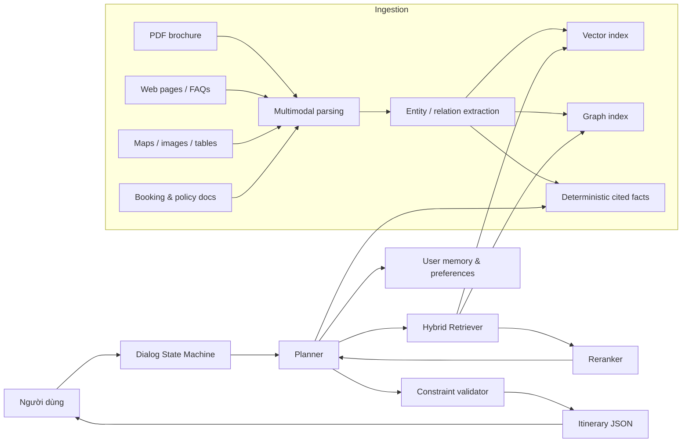

# Static code review cho Graph RAG du lịch và itinerary planner từ các kho mã bạn đã đưa

## Tóm tắt điều hành

Nếu mục tiêu của bạn là xây một **Graph RAG cho du lịch để lên lịch trình cá nhân hóa**, thì bộ tham chiếu mạnh nhất trong danh sách này không phải chỉ một repo, mà là một **stack ý tưởng ghép lại**. Về phần ingest và retrieval, `HKUDS/RAG-Anything` là repo phù hợp nhất để học cách đi từ tài liệu đa phương thức sang retrieval lai vector + graph; `bydecom/graphrag-code` là repo gọn nhất để học tư duy **graph-first retriever**; `Egonex-AI/Understand-Anything` cho bạn góc nhìn về **interactive knowledge graph** và tìm kiếm trên graph; còn `bydecom/conversational-state-machine` là repo rất hợp để làm phần **slot filling, hold/resume, context switching** cho hội thoại itinerary. `microsoft/ai-agents-for-beginners` không phải codebase production, nhưng lại là tài liệu học tốt nhất để hiểu **agentic RAG, planning, memory** trước khi code. citeturn23view0turn25view0turn45view2turn45view5turn44view0turn45view1turn32view0turn45view4turn26view0turn27view0turn27view1turn45view3

Về góc độ “đóng gói thành sản phẩm”, repo đáng học nhất là `HBAI-Ltd/Toonflow-app` và `bydecom/e-commerce-project`. `Toonflow-app` cho thấy cách đóng gói một quy trình agent phức tạp thành **desktop app có memory cục bộ, skill file, vendor layer có thể lập trình, và graph điều hướng theo miền bài toán**; tuy domain là short-video, nhưng pattern của nó rất hợp để chuyển sang itinerary planner. `e-commerce-project` lại cho bạn phần “xương sống hệ thống” như Docker, Redis, RabbitMQ, Qdrant, Prisma, Angular, cấu hình runtime và vận hành production mà một travel planner thật sự sẽ cần khi đi ra production. citeturn38view0turn41view0turn42view0turn43view0turn45view0turn37view0turn45view7

Về độ tin cậy câu trả lời, repo đáng học nhất là `bydecom/medical-citation-agent`. Nó không làm Graph RAG du lịch trực tiếp, nhưng cách repo này ép pipeline đi theo hướng **deterministic-first, extraction trước, citation trước, summary sau** là thứ cực kỳ nên mang sang du lịch cho các thông tin nhạy như visa, opening hours, cancellation rules, regulation, transit policy, hay child-accessibility. Nếu bạn kết hợp pattern grounding này với Graph RAG, chất lượng sản phẩm sẽ tốt hơn rất nhiều so với kiểu “retrieve rồi để LLM tự kể lại”. citeturn36view0turn49view1

Về cá nhân hóa phong cách và user simulation cho thị trường Việt Nam, hai nguồn đáng tận dụng là `titanwings/colleague-skill` và dataset `nvidia/Nemotron-Personas-Vietnam`. Repo đầu tiên giúp bạn nghĩ theo hướng **skill hóa persona và phong cách đối thoại**; dataset thứ hai cho thấy một corpus lớn với 100k persona có trường nghề nghiệp, sở thích, mục tiêu, vùng miền, học vấn, tuổi, giới tính, hobby, và đặc điểm văn hóa — rất hữu ích để test planner theo nhiều kiểu traveler khác nhau, đặc biệt với tiếng Việt. citeturn50view1turn48view2turn48view3

Kết luận ngắn gọn của tôi là: **đừng cố chép nguyên một repo**. Hướng đúng là ghép các mảnh mạnh nhất: lấy **multimodal ingestion + hybrid retrieval** từ `RAG-Anything`, lấy **graph traversal abstraction** từ `graphrag-code`, lấy **dialog/state orchestration** từ `conversational-state-machine`, lấy **memory + planning pattern** từ `ai-agents-for-beginners`, lấy **grounded citation discipline** từ `medical-citation-agent`, lấy **product shell và local skill/memory ideas** từ `Toonflow-app`, rồi đặt tất cả lên một nền production kiểu `e-commerce-project`. citeturn23view0turn25view0turn45view2turn45view5turn32view0turn45view4turn27view0turn27view1turn49view1turn38view0turn41view0turn42view0turn37view0turn45view7

## Phạm vi review và so sánh nhanh

Báo cáo này là **static analysis בלבד**: tôi không thực thi mã nguồn không tin cậy. Với repo lớn, tôi ưu tiên đúng nhóm file bạn yêu cầu: `README`, cây thư mục gốc, `package.json`/`pyproject.toml`, Docker/config, các thư mục `src/`, `app/`, `services/`, `retriever/`, `graph/`, `planner/`, `prompts/`, `tests/`, notebook và tài liệu architecture. Những repo không lộ source thật hoặc chỉ có README được tôi đánh dấu rõ ở phần hạn chế.

```text
https://github.com/HBAI-Ltd/Toonflow-app
https://github.com/Egonex-AI/Understand-Anything
https://github.com/Shubhamsaboo/awesome-llm-apps
https://github.com/x1xhlol/system-prompts-and-models-of-ai-tools
https://github.com/microsoft/ai-agents-for-beginners
https://github.com/HKUDS/RAG-Anything
https://github.com/titanwings/colleague-skill
https://github.com/BloopAI/vibe-kanban
https://github.com/bydecom/conversational-state-machine
https://github.com/bydecom/graphrag-code
https://github.com/bydecom/medical-citation-agent
https://github.com/bydecom/e-commerce-project
https://github.com/bydecom/container-bay-plan-validator
https://huggingface.co/datasets/nvidia/Nemotron-Personas-Vietnam
```

Bảng dưới đây là “bản đồ quyết định” của tôi: repo nào đáng lấy làm lõi Graph RAG, repo nào chỉ nên lấy ý tưởng, repo nào nên tránh đặt ở critical path. Các đánh giá “độ liên quan”, “dễ tái dùng”, “maturity” là kết luận phân tích kỹ thuật của tôi dựa trên README, tree, config, tests, và cấu trúc modules hiện diện công khai. citeturn38view0turn45view0turn45view1turn48view0turn50view0turn45view3turn45view2turn50view1turn50view2turn45view4turn45view5turn36view0turn37view0turn46view0turn48view3

| Nguồn | Liên quan Graph RAG | Dễ tái dùng | Maturity | License | Ngôn ngữ chính | Hành động khuyến nghị |
|---|---|---:|---|---|---|---|
| `HKUDS/RAG-Anything` | Rất cao | Trung bình | Cao | MIT | Python | Dùng cho ingest PDF/Office/Image/Table và retrieval lai vector+graph |
| `bydecom/graphrag-code` | Rất cao | Cao | Trung bình | MIT | Python | Dùng làm mẫu graph retriever, PPR, MCP server |
| `bydecom/conversational-state-machine` | Rất cao cho planner | Cao | Trung bình | MIT | TypeScript | Dùng cho slot filling, hold/resume, context switching |
| `Egonex-AI/Understand-Anything` | Cao | Trung bình | Cao | MIT | TypeScript | Dùng để học UI graph, embedding search, schema graph |
| `microsoft/ai-agents-for-beginners` | Cao về kiến thức | Cao | Cao | MIT | Markdown + notebooks + sample code | Dùng làm tài liệu design cho planning/memory/agentic RAG |
| `HBAI-Ltd/Toonflow-app` | Cao về product pattern | Trung bình | Cao | Apache-2.0 + điều khoản thương mại bổ sung | TypeScript / Electron | Học local memory, skill files, programmable vendor, graph-driven workflow | 
| `bydecom/medical-citation-agent` | Trung bình nhưng rất quan trọng cho grounding | Trung bình | Trung bình | Không thấy license rõ trong root tree đã duyệt | Python | Dùng pattern “extract → cite → summarize”, không dùng nguyên domain logic |
| `bydecom/e-commerce-project` | Trung bình | Trung bình | Trung bình–cao | ISC theo README | TypeScript | Học hạ tầng production, Qdrant, jobs, Docker, runtime config | 
| `Shubhamsaboo/awesome-llm-apps` | Trung bình | Trung bình | Cao | Apache-2.0 | Mixed | Chỉ cherry-pick template nhỏ, không lấy cả repo |
| `titanwings/colleague-skill` | Trung bình cho personalization | Trung bình | Cao | MIT | Prompt-centric + Python tooling | Dùng cho persona/skill layer |
| `BloopAI/vibe-kanban` | Thấp cho runtime Graph RAG | Thấp | Cao nhưng sunset | Apache-2.0 | Rust + TypeScript | Chỉ học UX/workflow nội bộ, không làm dependency lõi |
| `x1xhlol/system-prompts-and-models-of-ai-tools` | Thấp cho kiến trúc, trung bình cho nghiên cứu prompt | Thấp | Cao về độ tập hợp | GPL-3.0 | Markdown/Text | Chỉ dùng để tham khảo prompt/tool idiom, tránh sao chép verbatim |
| `bydecom/container-bay-plan-validator` | Thấp cho code reuse, cao cho tư duy validator | Rất thấp | Thấp về transparency | Không thấy license rõ; source thực không lộ | README architecture | Chỉ lấy ý tưởng deterministic validator |
| `nvidia/Nemotron-Personas-Vietnam` | Trung bình cho personalization/test | Cao | Trung bình | Chưa xác minh license trong pass này | Dataset/Parquet text | Dùng cho persona simulation và evaluation tiếng Việt |

Nguồn cho đánh giá từng hàng nằm ở các repo roots, README và tree liên quan: `RAG-Anything` citeturn23view0turn24view0turn25view0turn45view2, `graphrag-code` citeturn34view0turn35view0turn45view5, `conversational-state-machine` citeturn30view0turn32view0turn45view4, `Understand-Anything` citeturn44view0turn45view1, `ai-agents-for-beginners` citeturn26view0turn27view0turn27view1turn45view3, `Toonflow-app` citeturn38view0turn41view0turn42view0turn43view0turn45view0, `medical-citation-agent` citeturn36view0turn49view1turn50view3, `e-commerce-project` citeturn37view0turn45view7, `awesome-llm-apps` citeturn48view0, `colleague-skill` citeturn48view2turn50view1, `vibe-kanban` citeturn49view0turn50view2, `system-prompts-and-models-of-ai-tools` citeturn48view1turn50view0, `container-bay-plan-validator` citeturn46view0, `Nemotron-Personas-Vietnam` citeturn48view3

## Phân tích kỹ các repo cốt lõi cho Graph RAG và itinerary planner

**`HBAI-Ltd/Toonflow-app`** — Đây là repo “không phải du lịch nhưng rất đáng học” vì nó chứng minh được một pattern hiếm gặp: từ một quy trình sáng tạo nhiều bước, repo đóng gói thành **workspace có vòng đời rõ ràng**, có **ba tầng agent** (“quyết định, thực thi, giám sát”), có **memory dài hạn cục bộ**, có **skill externalization** ra Markdown, có **vendor layer có thể code trực tiếp**, và có **event graph** để điều hướng context thay vì nhồi toàn bộ context vào prompt. README mô tả rõ pipeline “planning → script → storyboard → production”, memory dựa trên **local ONNX vector retrieval**, “chapter event graph” cho adaptation, và skill files cho `ScriptAgent`/`ProductionAgent`; tree công khai còn cho thấy `data/skills/*`, `src/agents/*`, `data/models/all-MiniLM-L6-v2/onnx`, và `src/lib/initDB.ts`/`responseFormat.ts`, tức là logic này không chỉ nằm trong marketing README mà thật sự ăn vào codebase. citeturn38view0turn13view0turn14view0turn15view0turn15view1turn39view0turn41view0turn42view0turn43view0

Với travel planner, phần đáng giữ lại là: **memory cục bộ** cho sở thích dài hạn của user; **skills dạng file** để bạn chỉnh prompt planner/retriever/validator mà không rebuild; **graph-driven context fetch** để kế hoạch ngày 2 chỉ gọi đúng phần liên quan đến nơi ở, chặng di chuyển, giờ mở cửa, chứ không nhét toàn bộ trip vào prompt; và **programmable provider layer** để đổi giữa OpenAI/Gemini/Claude/local model. Phần nên viết lại gần như hoàn toàn là schema domain: thay “chapter, storyboard, assets, panel” bằng “trip, day, stop, transfer, ticket, meal, hotel, constraint”. Tôi cũng đánh giá repo này là **medium-high effort** để integrate vì domain gốc dính mạnh với video production, nhưng **high value** để học product architecture. citeturn38view0turn42view0turn41view0

Điểm mạnh lớn nhất của repo là tính **local-first** và khả năng **programmability**; điểm yếu và technical debt lớn nhất nằm ở **bề mặt bảo mật**. README public hóa tài khoản mặc định `admin/admin123` ở phần quick start và phần cài đặt local; đồng thời nó mô tả việc có thể viết logic nhà cung cấp bằng TypeScript trực tiếp trong settings và áp dụng ngay không cần đổi source hay restart; trong `package.json` còn có dependency `vm2` ở line 626 của snippet đã duyệt. Ba chi tiết này cộng lại nghĩa là bạn phải cực kỳ cẩn thận nếu học theo pattern “user-editable provider code” cho travel app, vì chỗ này rất dễ trở thành bề mặt RCE/sandbox escape hoặc privilege escalation nếu triển khai kém. Thêm nữa, README ghi **Apache-2.0 nhưng kèm điều khoản thương mại bổ sung**, nên nếu bạn định copy code trực tiếp vào sản phẩm thương mại, phần licensing phải đọc kỹ, không nên chỉ nhìn badge Apache. citeturn38view0turn12view0turn45view0

Về test và reproducibility, repo có nhiều commits, có Dockerfile, có local build bằng Docker, nhưng trong pass này tôi **không thấy tree test rõ ràng** ở root đã duyệt; README cũng yêu cầu nhiều dịch vụ model bên ngoài và cloud/server setup khá nặng, kể cả hướng dẫn cloud deploy dùng Node 24.x. Vì vậy, review của tôi là: **đọc để học pattern sản phẩm**, **không dùng làm point-of-start codebase** cho Graph RAG travel trừ khi bạn đang muốn làm desktop app local-first. citeturn38view0turn45view0

**`Egonex-AI/Understand-Anything`** — Repo này phù hợp với bạn nếu bạn muốn hiểu **làm thế nào biến một corpus thành interactive knowledge graph mà người dùng/agent có thể explore, search, và hỏi đáp**. Root README mô tả mục tiêu “turn any code into an interactive knowledge graph”; tree lại cho thấy đây không phải demo mỏng mà là monorepo có `agents/`, `graphs/`, `understand-anything-plugin/`, dashboard package, và trong `packages/core/src` có hẳn các module `analyzer/`, `languages/`, `persistence/`, `embedding-search.ts`, `search.ts`, `schema.ts`, `staleness.ts`. Đó là dấu hiệu của một hệ thống đã nghĩ đến **schema hóa graph**, **persistence**, **embedding lookup**, **phân tích thay đổi/staleness**, và cả **agent prompts** như `graph-reviewer.md`, `knowledge-graph-guide.md`, `tour-builder.md`. citeturn17view0turn19view0turn21view0turn21view1turn21view2turn22view0turn44view0turn45view1

Điểm mạnh nhất cho use case du lịch không nằm ở code-domain của repo, mà nằm ở **UI/UX graph reasoning** và **layer abstraction**. Nếu bạn muốn người dùng hoặc internal admin có thể “đi một vòng” trong tri thức — từ city → district → POI → transport segment → nearby restaurant → opening-hours conflict — thì repo này cho bạn tư duy tốt hơn hầu hết các RAG repo chỉ có search box. Tôi sẽ giữ lại interface giữa `embedding-search.ts`, `search.ts`, `schema.ts`, `persistence/`, nhưng thay hoàn toàn analyzer để ingest **POI, route, hotel, opening hours, seasonal constraints, user preference** thay vì AST/code semantics. Tôi **không thấy** adapter graph DB kiểu Neo4j/Memgraph/Arango ở tree đã duyệt; suy luận kỹ thuật của tôi là repo này đang thiên về **application-level graph representation + persistence nội bộ**, không phải graph database adapter-first design. citeturn44view0turn45view1

Điểm yếu của repo cho travel là: nó vẫn là **plugin-centric knowledge graph cho code**, nên nhiều thứ như `fingerprint`, `staleness`, `change-classifier` có thể overfit vào source tree hơn là world graph. Ngoài ra, nếu bạn copy nguyên, bạn sẽ phải gỡ khá nhiều assumptions về file/path/module/language. Nhưng về mức effort, tôi chấm **medium** chứ không high, vì layer decomposition của repo khá rõ: analyzer, persistence, embedding search, schema, UI. Nếu bạn muốn làm một “Graph Explorer cho lịch trình”, đây là repo rất đáng mổ xẻ. citeturn44view0

**`HKUDS/RAG-Anything`** — Đây là repo gần nhất với “Graph RAG cho du lịch cấp production về ingest”. README mô tả một pipeline rõ ràng: **Document Parsing → Content Analysis → Knowledge Graph → Intelligent Retrieval**, và nhấn mạnh **multimodal knowledge graph**, **vector-graph fusion**, **modality-aware ranking**, cũng như parser stack gồm `MinerU`, hỗ trợ PDF/Office/Image và các thành phần ảnh/bảng/công thức. Tree package `raganything/` cũng khớp với README: có `parser.py`, `modalprocessors.py`, `processor.py`, `query.py`, `raganything.py`, `prompt_manager.py`, `config.py`. Với travel, đây là thứ bạn cần nếu nguồn tri thức của bạn đến từ brochure, PDF schedules, museum guide, scan menu, fare tables, visa docs, resort leaflets, map screenshot, thậm chí ảnh biển báo. citeturn23view0turn24view0turn25view0turn25view1

Điểm mạnh kỹ thuật lớn nhất là repo **không xem RAG như text chunking đơn thuần**; nó coi tài liệu là **heterogeneous multimodal object** và cố giữ cấu trúc, quan hệ, hierarchy. Đó là đúng hướng cho du lịch, vì travel knowledge thường không sạch kiểu “paragraph QA”. Tuy vậy, đây cũng là chỗ technical debt vận hành xuất hiện: README gọi project là **beta**, phụ thuộc `mineru[core]`, `lightrag-hku`, optional `paddleocr`, cần **LibreOffice** để xử lý Office docs, cần model download ngoài, và parser stack khá nặng. Nghĩa là nếu bạn dùng đúng repo này làm ingestion service gốc, chi phí ops, build CI, fallback path, caching, và sandboxing document conversion sẽ tăng mạnh. citeturn25view0turn25view1turn45view2

Cách tận dụng thông minh nhất không phải là “nhét cả repo vào backend chính”, mà là tách nó thành **ingestion service**. Bạn nên giữ các ý tưởng: `parser.py`, `modalprocessors.py`, `processor.py`, `query.py` và “vector-graph fusion”; nhưng với itinerary planner, tôi khuyên **graph index nên tái hiện ở domain layer riêng**: ví dụ node `POI`, `Stay`, `DaySlot`, `TransportLeg`, `PolicyDoc`, `FoodVenue`; edge `located_in`, `reachable_by`, `open_during`, `conflicts_with`, `nearby`, `requires_booking`, `family_friendly`. Như vậy bạn vừa giữ được sức mạnh ingest đa phương thức của RAG-Anything, vừa không khóa logic planner vào graph structure của một framework research-first. Tôi chấm effort tích hợp là **high** nhưng payoff cũng **high** nếu dữ liệu của bạn đa phương thức. citeturn23view0turn24view0turn25view0

**`bydecom/graphrag-code`** — Nếu bạn cần một repo nhỏ, tập trung, ít nhiễu để học “Graph RAG nên trông như thế nào ở lớp retriever”, đây là repo nên đọc trước tiên. Root page mô tả repo là **Python-native code knowledge graph** dùng **tree-sitter AST graph** và **Personalized PageRank hai chiều** để trả structural context qua MCP; tree confirm các module cốt lõi: `graph_engine.py`, `indexer.py`, `mcp_server.py`, `cli_agent.py`, `export_graph.py`; đồng thời tree tests cũng có riêng `test_graph_engine.py`, `test_graph_engine_extended.py`, `test_eval_retrieval.py`, `test_indexer.py`, `test_mcp_server.py`. Đây là dấu hiệu của một codebase tuy nhỏ nhưng có “xương sống” chuẩn: graph engine, indexer, export, MCP, evaluation, tests. citeturn45view5turn34view0turn35view0

Thứ đáng học nhất ở repo này là **abstraction**, không phải AST. Đừng bị domain codebase làm bạn phân tâm. Về bản chất, repo đang dạy bạn cách xây một graph để trả lời câu hỏi mà vector search thường làm kém: “thành phần nào gọi cái gì”, “thằng nào phụ thuộc vào cluster nào”, “nên mở rộng neighborhood theo cạnh nào”, “seed set nào cần cho traversal”. Trong travel, AST node có thể đổi thành `Destination`, `POI`, `Hotel`, `TransitHub`, `Train`, `Flight`, `Activity`, `Constraint`, `BudgetBucket`, `WeatherSnapshot`; edge traversal hai chiều có thể dùng để đi từ user intent → candidate nodes → supporting neighbors → conflicting constraints. Tôi sẽ giữ logic “seed → bidirectional graph walk → merge & rerank” và viết lại indexer để sinh travel graph, không giữ parser code. citeturn45view5turn34view0

Điểm yếu của repo là nó **không phải multimodal**, **không có world-knowledge ingestion**, và design ban đầu vẫn gắn chặt với tree-sitter/code semantics. `.env.example` cũng cho thấy repo trông như một tool nhỏ, có API key LLM placeholder và SQLite file riêng, phù hợp cho demo/tool hơn là một multi-tenant service. Nhưng chính vì vậy effort để lấy “linh hồn” của repo lại thấp hơn: tôi chấm **low-medium** cho việc tái hiện graph engine idea trong planner du lịch của bạn. citeturn35view1turn45view5

**`bydecom/conversational-state-machine`** — Đây là repo mà tôi đánh giá là **rất đúng bài** cho phần lập kế hoạch hội thoại của itinerary assistant. Root README mô tả thẳng mục tiêu “enterprise dialog management patterns on an LLM-native stack — slot filling, context switching, hold/resume queue”; tree backend có `prisma/`, `src/models`, `src/routes`, `src/services`, `src/test`, còn dưới `src/services` có các file tên cực kỳ nói lên ý định kiến trúc: `state.machine.ts`, `context.service.ts`, `context-switch.policy.ts`, `entity-validator.service.ts`, `nlu.engine.ts`, `schema.builder.ts`, `catalog.service.ts`. Đây đúng là các module mà một conversational planner du lịch nên có. citeturn45view4turn28view0turn30view0turn32view0

Cách reuse lý tưởng là: dùng `state.machine.ts` để encode vòng đời hỏi đáp như “điểm đến chưa rõ → đã có điểm đến nhưng thiếu ngày → đã có ngày nhưng thiếu budget → có conflict giữa pace và distance → hold booking intent → resume itinerary refinement”; dùng `entity-validator.service.ts` để chuẩn hóa city, airport, district, date range, currency; dùng `context-switch.policy.ts` để cho phép user chuyển ngữ cảnh linh hoạt kiểu “quên đi Đà Lạt, đổi sang Quy Nhơn”, “thêm 1 ngày nữa”, “hãy ưu tiên trẻ em”, “đừng dùng taxi”. `schema.builder.ts` và `catalog.service.ts` cũng gợi ý một pattern cực hay: build schema và catalog domain riêng chứ không buộc model suy luận tự do hoàn toàn. citeturn32view0turn45view4

Điểm yếu là repo này **không phải retriever**, **không phải graph store**, và env hiện tại là demo-level: `.env.example` dùng `DATABASE_URL="file:./prisma/dev.db"` và `GEMINI_API_KEY`, phù hợp cho local prototype. Dù vậy, đây lại là điểm cộng cho bạn lúc mới học: nó đủ nhỏ để hiểu state flow, đủ cấu trúc để mở rộng, và đủ gần bài toán “itinerary as conversation” hơn nhiều repo RAG thuần retrieval. Tôi chấm effort tích hợp là **low**, và thực sự khuyên bạn dùng repo này làm tham chiếu cho planner orchestration layer. citeturn33view0turn29view0

**`microsoft/ai-agents-for-beginners`** — Đây không phải source code production để copy, nhưng là phần tài liệu onboarding tốt nhất trong danh sách nếu bạn còn mới với RAG/Graph RAG. `05-agentic-rag` giải thích đúng bản chất agentic RAG là loop **LLM → tool → LLM → tool**; `07-planning-design` dùng ví dụ **“Generate a 3-day travel itinerary”** để dạy decomposition thành subtasks như flight, hotel, car rental, personalization; `13-agent-memory` nói rất rõ về working memory, long-term memory, và còn nêu notebook dùng **Mem0 + Azure AI Search** và **Cognee** để xây **structured memory / knowledge graph backed by embeddings**. Đây chính là cầu nối khái niệm giữa RAG, Planner và Memory mà bạn cần trước khi ghép các repo khác. citeturn26view0turn27view0turn27view1turn45view3

Lời khuyên của tôi là: đừng “reuse code”, hãy **reuse mental model**. Cụ thể, lấy từ lesson này ba thứ. Thứ nhất, planner nên tạo **structured subtasks** thay vì chạy prompt free-form. Thứ hai, memory nên tách “working memory” với “long-term preference memory”. Thứ ba, agentic RAG phải có **maker-checker loop** để nếu kết quả retrieval kém thì rewrite query, đổi retriever, hoặc bổ sung source. Chỗ yếu của repo là nó vẫn là course repo: nhiều ví dụ Azure-centric, notebook-centric, và intentionally educational chứ không tối ưu cho DX production. Nhưng cho việc “học kỹ để làm đúng từ đầu”, nó rất có giá trị. citeturn26view0turn27view0turn27view1

## Phân tích các repo bổ trợ cho grounding, personalization và product hóa

**`bydecom/medical-citation-agent`** — Executive summary ngắn là: đây là repo hay nhất để học **grounding có thể kiểm chứng**. README mô tả pipeline rất thẳng: `load_openfda_text()` → regex matcher → `extract_entities()` bằng scispaCy → dedup → `SafetyGuardrail.check()` → MCP server; project structure công khai cũng khớp, với `src/models.py`, `mcp_server.py`, `extractor.py`, `verifier.py`, `safety_rules.json`, bộ `tests/`, và harness `eval_matching.py`. Nó còn nêu rõ có **96 regression tests**, benchmark nội bộ, và triết lý “LLM không ở critical path extraction”. Đối với du lịch, ý tưởng lớn ở đây là: **mọi claim nhạy cảm nên đi qua deterministic extractor có citation, rồi mới cho model tóm tắt**. citeturn49view1turn36view0

Điểm mạnh: kiến trúc rõ, grounding mạnh, MCP-ready, dễ audit. Điểm yếu: Corpus hiện tại hẹp, domain-specific, cần cài model sciSpaCy thủ công từ URL ngoài, và public tree đã duyệt **không cho thấy file LICENSE/badge license rõ ràng** như các repo khác, nên nếu bạn muốn tái sử dụng code trực tiếp thì phải kiểm tra licensing riêng. Với itinerary planner, tôi sẽ không lấy regex/NER medical, nhưng sẽ sao chép pattern kỹ thuật để tạo các stage như `extract_visa_rules`, `extract_opening_hours`, `extract_ticket_policies`, `extract_transfer_durations`, mỗi claim đều đi kèm `source_id`, `line_start`, `line_end`, `raw_text`. Effort tích hợp: **medium**, payoff: **rất cao về trust**. citeturn49view1turn36view0turn50view3

**`bydecom/e-commerce-project`** — Repo này quan trọng vì nó cho thấy hình hài của một hệ thống production thực tế hơn là một demo RAG. README ghi rõ monorepo gồm Express 5 + TypeScript + Prisma backend, Angular 17 frontend, Redis, RabbitMQ, MinIO/S3, PostgreSQL, Qdrant, Gemini, Docker Compose, và mô tả cây `backend/src/modules/ai`, `feedback`, `inventory`, `order`, `payment`, `upload`, cùng local infra có cả Qdrant. Điều này nói với bạn một chuyện rất thực dụng: nếu Graph RAG itinerary planner của bạn thành công, bạn sẽ sớm cần **jobs bất đồng bộ**, **cache**, **vector DB**, **asset storage**, **auth**, **runtime config**, **analytics**, chứ không còn là notebook + FAISS nữa. citeturn37view0turn45view7

Điểm mạnh của repo là productization pattern và infra cohesion. Điểm yếu là domain logic e-commerce rất nặng, monorepo lớn, và phần license ở README ghi **ISC License (see backend/package.json)** chứ không phải LICENSE root rõ ràng như nhiều repo khác, nên việc tái sử dụng trực tiếp nên cẩn thận. Với project của bạn, tôi sẽ không lấy module business, mà chỉ học: cấu hình Docker local, bootstrapping Qdrant, phân tách worker/API, caching, config DB-backed, logging, và cách để AI/vector search sống như một module sản phẩm chứ không phải script riêng. Effort tái dùng là **medium-high** nếu copy code; **medium** nếu chỉ lấy kiến trúc. citeturn37view0turn45view7

**`Shubhamsaboo/awesome-llm-apps`** — Đây là “thư viện template”, không phải một hệ thống. Tree cho thấy repo chứa `advanced_ai_agents`, `advanced_llm_apps`, `mcp_ai_agents`, `rag_tutorials`, `awesome_agent_skills`, `starter_ai_agents`, v.v.; README tự mô tả là “100+ AI Agent & RAG apps you can actually run” và gọi repo là cookbook của các template self-contained. Tôi xem repo này là **điểm tìm mẫu** chứ không phải “base repo”. Nếu bạn cần ví dụ nhanh về basic RAG agent, MCP agent, voice agent hay skill agent, repo này hữu ích; nhưng nếu bạn cố mang cả repo vào tư duy kiến trúc thì nó sẽ làm bạn loạn vì mỗi template có assumptions khác nhau. citeturn47view0turn48view0

Điểm mạnh: breadth rất lớn, license Apache-2.0, giá trị cho việc khoanh vùng pattern. Điểm yếu: **fragmentation**, chất lượng mỗi subproject có thể chênh nhau, và rất nhiều template nghĩa là **integration debt cực lớn** nếu bạn không chọn lọc. Với Graph RAG du lịch, tôi chỉ khuyên lấy tối đa 1–2 template nhỏ từ `rag_tutorials` hoặc `mcp_ai_agents` để học cách bootstrap endpoint, rồi bỏ. Effort tích hợp: **low** nếu cherry-pick một template; **high** nếu định gom nhiều phần. citeturn48view0

**`titanwings/colleague-skill`** — Repo này không cung cấp Graph RAG core, nhưng lại rất hữu ích cho **personalization layer**. Tree có `prompts/`, `references/`, `skills/colleague`, `tests/`, `tools/`, `INSTALL.md`, `SKILL.md`, và README giải thích mục tiêu “source material + your description → an AI Skill that genuinely thinks like them”. Nói cách khác, repo đang giải bài toán **skill hóa persona**, biến source materials thành style/behavior package. Với travel planner, đây là nơi bạn nên học cách tách **tri thức fact** ra khỏi **phong cách ra quyết định/diễn đạt**. citeturn47view2turn48view2turn50view1

Điểm mạnh của repo là có cộng đồng, MIT license, và framing về skill rất mạnh. Điểm yếu là nó prompt-centric, factual grounding yếu nếu dùng đơn độc. Cách tận dụng tốt nhất là dùng repo này để xây **traveler archetype skills** như “digital nomad tối ưu công việc”, “gia đình có trẻ nhỏ”, “foodie thích trải nghiệm”, “du khách tiết kiệm”, “couple chụp ảnh”, hoặc **companion persona** để planner thay đổi tone/ưu tiên. Tôi sẽ không để skill này quyết định facts; nó chỉ nên chỉnh scoring, tone, suggestion style, và trade-off explanation. Effort tích hợp: **medium**. citeturn50view1turn48view2

**`BloopAI/vibe-kanban`** — Repo này chủ yếu liên quan đến **workflow của team phát triển** hơn là runtime của itinerary planner. README nói rõ đây là công cụ planning/review cho coding agents, có kanban issues, workspaces, built-in review, preview browser, và hỗ trợ nhiều coding agents; tree cho thấy đây là monorepo lớn với `crates/`, `packages/`, `npx-cli/`, `shared/`, Rust + TypeScript, Dockerfile, Cargo, pnpm workspace. Tuy nhiên README cũng ghi rất rõ: **“Vibe Kanban is sunsetting.”** Vì vậy, dù repo có maturity cao và Apache-2.0, tôi khuyên không nên đem nó vào critical path của sản phẩm bạn. citeturn49view0turn50view2

Điểm mạnh là mindset về task planning và review loop. Điểm yếu là sunset risk và domain mismatch. Nếu bạn dùng nó, hãy dùng như inspiration cho **admin/backoffice**: ví dụ board review quality của extracted POIs, unresolved source conflicts, jobs enrich failed, hay human-in-the-loop review cho route suggestions. Đừng dùng nó làm base code cho travel planner. Effort tái dùng trực tiếp: **high** và không đáng. citeturn49view0turn50view2

**`x1xhlol/system-prompts-and-models-of-ai-tools`** — Repo này là một **corpus prompt/tool/model mapping** cho rất nhiều công cụ AI. Tree cho thấy thư mục theo vendor/tool rất lớn; root page xác nhận có `LICENSE.md` và repo nav cho biết GPL-3.0. Giá trị của repo này nằm ở **nghiên cứu prompt idiom**, cách các tool lớn mô tả tool-use, agenda, behavior shaping, safety, internal tool schemas. Nó không phải Graph RAG runtime, không phải planner engine, và tôi không khuyên dùng nó như nền tảng sản phẩm. citeturn48view1turn50view0

Rủi ro nằm ở **provenance, freshness, legal/ethical reuse**. Với một travel planner thương mại, bạn càng không nên copy verbatim system prompt từ repo này vào app của mình, đặc biệt khi repo chứa prompt nội bộ của nhiều nền tảng. Cách dùng an toàn là: đọc để học **pattern thiết kế prompt/tool interface**, rồi tự viết prompt của bạn bằng domain travel và ràng buộc của riêng bạn. Do GPL-3.0 hiện diện ở root page, nếu bạn định kéo code/text trực tiếp vào sản phẩm thì càng phải cẩn thận hơn. Tôi chấm repo này là **nghiên cứu tham khảo**, không phải **reuse code**. citeturn50view0

## Repo thiếu mã công khai và dữ liệu tham chiếu

**`bydecom/container-bay-plan-validator`** — Repo này cho một bài học hữu ích nhưng theo kiểu “ý tưởng hơn là code”. Root page chỉ lộ `README.md`; chính README lại ghi `> Private Repository`, rồi mô tả kiến trúc với `main.py`, `file_reader.py`, `bay_object.py`, `validator.py`, `visualizer.py`, `pdf_module.py`, `requirements.txt` như thể source thật nằm nơi khác hoặc không public đầy đủ. Vì vậy, tôi **không xem đây là repo có thể static review đầy đủ ở mức code**, mà là một README kiến trúc. citeturn46view0

Dù vậy, repo mang một ý tưởng rất có giá trị cho itinerary planning: **deterministic validator sau planner**. Trong logistics, họ parse dữ liệu thành spatial matrix rồi áp business rules. Trong travel, bạn cũng nên làm tương tự: sau khi LLM/planner tạo lịch trình, phải có một validator kiểm tra **opening hours, travel-time feasibility, meal cadence, budget caps, transit buffers, check-in/check-out feasibility, child/senior accessibility, booking prerequisites**. Đây là pattern mà nhiều app du lịch dùng LLM đang thiếu. Nhưng vì source không hiện diện công khai, effort reuse thực tế là **high**; reuse conceptual thì **high value**. citeturn46view0

**`nvidia/Nemotron-Personas-Vietnam`** — Hugging Face dataset này có `default/train` 100k rows trong viewer, với các trường như `persona`, `professional_persona`, `sports_persona`, `arts_persona`, `cultural_background`, `skills_and_expertise`, `hobbies_and_interests`, `career_goals_and_ambitions`, `sex`, `age`, `marital_status`, `education_level`, `occupation`, `zone`, `region`, `country`. Đây là một nguồn rất hợp để bạn xây **test harness cho personalization tiếng Việt**, ví dụ sinh ra nhiều traveler profiles khác nhau và xem planner có thay đổi đề xuất hợp lý không. citeturn48view3

Điểm mạnh là quy mô đủ lớn để chạy simulation và A/B evaluation, đặc biệt cho thị trường Việt Nam. Điểm yếu là dataset persona **không thể được dùng như nguồn sự thật về user thật**, và trong pass này tôi **chưa xác minh được license/terms trên dataset card** nên nếu bạn định dùng cho training/commercial use, cần kiểm tra tiếp trước khi ingest vào pipeline thực tế. Cách dùng khôn ngoan nhất là dùng nó cho **offline evaluation, synthetic user simulation, prompt tuning, traveler archetype generation**, không dùng để suy diễn profile thật của user. citeturn48view3

## Kiến trúc Graph RAG du lịch tôi khuyên bạn nên xây

Từ các repo trên, kiến trúc tốt nhất cho bạn không phải “Graph RAG thuần graph DB” hay “RAG thuần vector”, mà là một **hybrid system** có ba lớp: **multimodal ingestion**, **hybrid retriever**, và **planner có state machine + validator**. Ý tưởng trực tiếp lấy từ `RAG-Anything` là ingest đa phương thức và vector-graph fusion; từ `graphrag-code` là graph traversal quanh seed nodes; từ `conversational-state-machine` là stateful planner; từ `medical-citation-agent` là citation-first grounding; từ `Toonflow-app` là local memory/skill files; từ `ai-agents-for-beginners` là decomposition và maker-checker loop. citeturn25view0turn45view5turn32view0turn49view1turn38view0turn27view0turn27view1



Cụ thể hơn, graph schema lõi của travel planner nên có ít nhất các node: `City`, `Area`, `POI`, `Hotel`, `Restaurant`, `TransportHub`, `TransportLeg`, `DayPlan`, `TimeWindow`, `PolicyDoc`, `UserPreference`, `TravelerPersona`; và các edge: `located_in`, `nearby`, `reachable_by`, `open_during`, `cost_range`, `requires_booking`, `suitable_for`, `conflicts_with`, `preferred_by`, `depends_on`, `same_day_feasible_with`. Điểm quan trọng là **graph không thay vector search**, mà vector search chỉ làm giai đoạn candidate generation; graph mới làm bước reasoning structural, expansion, conflict detection, và itinerary coherence. Đó là chỗ nhiều app “RAG du lịch” hiện nay còn bỏ trống. citeturn25view0turn45view5turn44view0turn32view0

Đây là pseudo-code tôi khuyên bạn dùng để “kết hôn” các pattern từ `RAG-Anything`, `graphrag-code`, `medical-citation-agent`, và `conversational-state-machine`:

```python
class HybridTravelRetriever:
    def __init__(self, vector_store, graph_store, citation_store, linker, reranker):
        self.vector_store = vector_store
        self.graph_store = graph_store
        self.citation_store = citation_store
        self.linker = linker
        self.reranker = reranker

    def search(self, user_query: str, dialog_state: dict) -> list[dict]:
        structured_query = build_structured_query(user_query, dialog_state)
        vec_hits = self.vector_store.search(structured_query, top_k=24)

        seed_nodes = self.linker.from_hits_and_slots(
            vec_hits,
            destination=dialog_state.get("destination"),
            date_range=dialog_state.get("date_range"),
            budget=dialog_state.get("budget"),
            traveler_type=dialog_state.get("traveler_type"),
        )

        graph_hits = self.graph_store.bidirectional_walk(
            seeds=seed_nodes,
            edge_filter=[
                "located_in",
                "nearby",
                "reachable_by",
                "open_during",
                "suitable_for",
                "conflicts_with",
            ],
            depth=2,
        )

        cited_facts = self.citation_store.lookup(graph_hits + vec_hits)

        merged = normalize_candidates(vec_hits, graph_hits, cited_facts)
        return self.reranker.rank(
            merged,
            factors={
                "distance_feasibility": dialog_state.get("pace"),
                "opening_hours_match": True,
                "budget_match": True,
                "family_fit": dialog_state.get("family_mode"),
                "source_quality": True,
            },
        )
```

Planner nên chạy như một **state machine có tool loop**, không phải một prompt chain dài. Ví dụ planner tạo `TripRequirements`, gọi retriever, tạo `DraftDayPlans`, gọi validator, nếu fail thì quay lại planner với `violations`. Pattern này khớp trực tiếp với lesson planning/memory của Microsoft và service decomposition của `conversational-state-machine`. citeturn27view0turn27view1turn32view0

```python
class ItineraryPlanner:
    def plan(self, user_msg, state):
        state = update_slots(state, user_msg)

        if missing_required_slots(state):
            return ask_for_missing_slots(state)

        candidates = retriever.search(user_msg, state)
        draft = build_day_plan(candidates, state)
        violations = validate(draft, rules=[
            "opening_hours",
            "travel_time_buffer",
            "hotel_checkin_checkout",
            "budget_cap",
            "meal_spacing",
            "weather_risk",
            "booking_prerequisites",
        ])

        if violations:
            repaired_query = rewrite_query_from_violations(user_msg, state, violations)
            repaired_candidates = retriever.search(repaired_query, state)
            draft = repair_plan(draft, repaired_candidates, violations)

        return attach_citations_and_explanations(draft)
```

Về memory, tôi khuyên chia làm ba kho riêng. **Working memory**: slot hội thoại hiện tại và unresolved constraints. **Preference memory**: ngân sách, pace, food preferences, child mode, avoidance patterns, style. **Trip memory**: per-trip named entities, booked items, rejected options, visited places. Pattern này khớp triết lý trong `Toonflow-app` về memory nhiều lớp và lesson `13-agent-memory` của Microsoft về short-term/long-term/structured memory. Nếu bạn trộn hết vào một vector DB, hệ thống sẽ nhanh chóng rối. citeturn38view0turn27view1

Cuối cùng, việc grounding nên tách hẳn ra thành **Fact Extraction Service**. Những thứ như visa, ferry cutoff time, train baggage rules, museum closing day, seasonal opening times, refund policy, shuttle schedule nên được extract thành **cited facts nodes** trước, với `source_id`, `valid_from`, `valid_to`, `raw_text`, `confidence`, `last_verified_at`. Đó là chỗ bạn áp pattern của `medical-citation-agent`: facts có citation trước, narrative sau. Với travel, cách này quan trọng hơn nhiều so với chỉ tăng `k` của retriever. citeturn49view1

## Checklist ưu tiên để build Graph RAG itinerary planner và các giới hạn còn mở

Tôi sẽ đi theo roadmap này nếu ở vị trí của bạn.

1. **Bản đơn giản nhưng đúng kiến trúc**: dựng `conversational-state-machine` style planner trước, chỉ với slot `destination`, `date_range`, `budget`, `traveler_type`, `pace`, `constraints`. Đừng vội làm graph DB trước khi state machine chạy ổn. citeturn32view0turn45view4  
2. **Làm vector RAG có citation trước**: ingest text docs sạch, trích facts có citation kiểu `medical-citation-agent`, rồi mới cho model trả lời. Nếu bước này chưa ổn, Graph RAG chưa giúp được nhiều. citeturn49view1turn36view0  
3. **Thêm graph layer cho coherence**: dùng pattern của `graphrag-code` để tạo neighborhood expansion trên các node `POI/Transport/Stay/Policy`, rồi dùng graph để phát hiện conflict và tìm alternatives gần kề. citeturn45view5turn34view0  
4. **Nâng cấp ingestion đa phương thức**: khi text-only đã chạy, đưa PDF schedules, brochure, image/table docs vào bằng pattern từ `RAG-Anything`. Không nên làm bước này đầu tiên nếu bạn còn đang học RAG. citeturn23view0turn25view0  
5. **Bổ sung personalization layer**: lấy traveler archetype từ `colleague-skill` + `Nemotron-Personas-Vietnam` để thử scoring/prompt variations, nhưng giữ facts tách khỏi persona. citeturn50view1turn48view3  
6. **Đóng gói thành sản phẩm**: học `Toonflow-app` cho skill files + memory + local-first ideas; học `e-commerce-project` cho Qdrant, Docker, jobs, config, frontend/backoffice. citeturn38view0turn42view0turn37view0turn45view7  
7. **Không để repo tham khảo kéo kiến trúc đi lệch**: `awesome-llm-apps` chỉ để lấy ví dụ nhỏ; `vibe-kanban` chỉ để học internal workflow; `system-prompts-and-models-of-ai-tools` chỉ để học prompt idiom, không dùng làm đáy hệ thống. citeturn48view0turn49view0turn50view2turn50view0  

Open questions và limitations cần bạn nhớ khi ra quyết định. `container-bay-plan-validator` không lộ source công khai nên chỉ review được README-level architecture; `medical-citation-agent` và dataset `Nemotron-Personas-Vietnam` cần kiểm tra license/terms sâu hơn trước khi dùng thương mại; `Toonflow-app` có nuance license vì README nêu Apache-2.0 nhưng kèm điều khoản thương mại bổ sung; và với vài monorepo rất lớn, review này đã đi theo load-bearing paths thay vì mọi leaf file nhỏ trong toàn bộ tree. Các chỗ đó tôi đã đánh dấu rõ trong phần tương ứng để bạn tránh hiểu nhầm mức độ certainty. citeturn46view0turn36view0turn50view3turn48view3turn45view0

Nếu chỉ chọn **một stack tham chiếu tối thiểu** để bắt đầu Graph RAG du lịch, lựa chọn của tôi sẽ là: **`conversational-state-machine` + `graphrag-code` + `medical-citation-agent` + `ai-agents-for-beginners`** cho giai đoạn học và prototype; sau đó mới bơm **`RAG-Anything`** và **`e-commerce-project`** vào khi bạn đã chắc các loop cơ bản hoạt động. Khi sản phẩm bắt đầu cần UX/personalization sâu hơn, mới quay lại học thêm `Toonflow-app` và `colleague-skill`. Đó là con đường ít rủi ro nhất, học nhanh nhất, và phù hợp nhất với một người đang “mới học RAG” nhưng muốn đi tới Graph RAG thật sự chứ không dừng ở demo. citeturn45view4turn45view5turn49view1turn27view0turn27view1turn23view0turn25view0turn37view0turn38view0turn50view1