# Bài học từ các repo để xây Graph-RAG lập lịch trình du lịch

## Tóm tắt điều hành

Từ toàn bộ tập nguồn bạn gửi, bốn tài nguyên có giá trị trực tiếp nhất cho một **Graph-RAG travel itinerary planner** là **Toonflow-app**, **Understand-Anything**, **RAG-Anything**, và **graphrag-code**. Toonflow cho thấy cách tổ chức **agent nhiều tầng + memory + tool wiring + skill prompts** trong một ứng dụng stateful; Understand-Anything cho thấy cách biến tri thức thành **knowledge graph có thể chat/search/explore** và cách dựng **context builder** từ graph; RAG-Anything cho thấy một pipeline **ingest tài liệu đa phương thức → knowledge graph → hybrid retrieval**; còn graphrag-code cho thấy một hướng **graph retrieval có tính thuật toán rõ ràng** bằng **bidirectional Personalized PageRank** và một MCP surface rất sạch cho agent gọi dùng. citeturn13search0turn14view0turn17view0turn30view0turn39view0turn18view0turn42view1turn19view0turn23view2turn25view1

Nếu chuyển hoá sang bài toán du lịch, kết luận quan trọng nhất là: **graph không nên thay thế retriever truyền thống; graph nên là lớp ràng buộc, làm giàu ngữ cảnh, và kiểm soát tính mạch lạc kế hoạch**. Nghĩa là bạn vẫn cần lexical/vector retrieval cho “địa điểm nào phù hợp”, nhưng sau đó phải dùng graph để nối các thực thể như **Place, Destination, TimeSlot, TransportLeg, UserPref, Itinerary** và để kiểm tra các ràng buộc như **opening_hours, travel_time, duration, price_level, category fit, geographic adjacency, sequence feasibility**. Mẫu “deterministic-first” từ medical-citation-agent và container-bay-plan-validator đặc biệt quan trọng: bước trả lời cuối không nên chỉ dựa vào LLM, mà cần một **validator phi-ngẫu nhiên** để loại itinerary bất khả thi. citeturn19view1turn19view3turn23view2turn39view1turn42view2

Nhóm repo còn lại cho bạn ba lớp bổ trợ. **conversational-state-machine** gợi ý cách quản lý hội thoại nhiều lượt, slot filling, hold/resume và context switching cho chuyện “đổi ngày, đổi ngân sách, giữ khách sạn nhưng bỏ bảo tàng”; **e-commerce-project** cho thấy cách đưa AI/search vào một hệ thống production-grade có CI/CD, queue, cache, vector search; còn **Nemotron-Personas-Vietnam** rất hữu ích để mô hình hoá **persona/personalization bằng tiếng Việt**, nhưng không nên được dùng như nguồn facts về điểm đến hay giờ mở cửa. **awesome-llm-apps**, **ai-agents-for-beginners**, **system-prompts-and-models-of-ai-tools**, **vibe-kanban**, và **colleague-skill** chủ yếu có giá trị ở mức pattern, prompt, orchestration, và khám phá sản phẩm. citeturn18view3turn19view2turn20view0turn17view1turn17view2turn17view3turn18view2turn18view1

Kết luận thực dụng nhất cho bạn là: **MVP tốt nhất không phải “full Graph-RAG ngay từ đầu”, mà là “hybrid retrieval + graph schema tối thiểu + deterministic validator + session state machine”**. Sau khi MVP ổn định, mới tăng dần sang multimodal ingest, reranking mạnh hơn, route optimization, persona adaptation, và evaluation harness. Cách đi này phù hợp với những gì các repo mạnh nhất trong danh sách đang làm: mỗi repo đều rất tốt ở một trục, nhưng **không repo nào tự nó đã là một travel planner hoàn chỉnh với geo/time constraints**. citeturn13search0turn30view0turn42view2turn19view0turn18view3turn19view1turn19view3

## Phương pháp đọc nguồn

Tôi đã đọc trực tiếp các **repo page, README, cấu trúc thư mục, raw source files và test trees** được công khai trên GitHub/Hugging Face. Môi trường hiện tại không cho phép `git clone` trực tiếp, nên phần “đọc từng dòng” được thực hiện bằng cách đọc source đã xuất bản, ưu tiên đặc biệt vào các mô-đun lõi liên quan tới **retrieval, indexing, prompt templates, agent/planner, graph logic, tests, setup và security handling**.

Tôi dùng ba tiêu chí để phân nhóm. **RAG relevance** đo mức repo giúp trực tiếp cho pipeline retrieve-ground-plan. **Graph usage** chỉ ra repo có graph như một primitive thật sự hay chỉ dùng “graph” theo nghĩa trình bày. **Maturity** là đánh giá của tôi, dựa trên breadth của docs, tests, packaging, deployment, và mức rõ ràng của concerns vận hành.

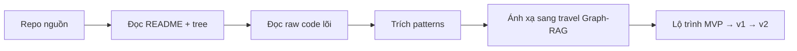

## Ma trận so sánh và sơ đồ kiến trúc repo

Bảng dưới đây tổng hợp 14 tài nguyên theo những chiều bạn yêu cầu. Cột **Maturity** là đánh giá của tôi; cột **License** chỉ điền khi tôi xác nhận được từ package/pyproject/README đã kiểm, còn không sẽ ghi là chưa xác nhận rõ.

| Tài nguyên | Mục đích chính | RAG relevance | Graph usage | Vector store / retrieval | Framework / stack nổi bật | Ngôn ngữ | Maturity | License | Nguồn |
|---|---|---:|---:|---|---|---|---|---|---|
| Toonflow-app | AI workstation cho short drama: planning → script → production; có persistent memory, chapter event graph, skill files | Medium | Có | Local ONNX semantic memory; không thấy vector DB riêng | Node.js, TypeScript, Express, SQLite, Vercel AI SDK, HF Transformers ONNX, Socket.IO, Electron, Docker | TypeScript | MVP đến prod-leaning | Chưa xác nhận rõ trong nguồn đã kiểm | citeturn13search0turn14view0turn15view0 |
| Understand-Anything | Multi-agent phân tích codebase/KB/docs và tạo interactive knowledge graph + dashboard | High | Có | SearchEngine trên graph nodes; có module `embedding-search.ts`, không thấy vector DB riêng ở nguồn đã kiểm | TypeScript monorepo, pnpm, graphology, vitest, dashboard packages | TypeScript | MVP đến prod-leaning | MIT | citeturn17view0turn28view0turn31view0turn33view2turn40view0 |
| awesome-llm-apps | Bộ sưu tập 100+ agent/RAG apps runnable để học pattern | Medium | Tuỳ app | Tuỳ app | Mixed examples | Hỗn hợp | Mixed | Chưa xác nhận rõ | citeturn17view1 |
| system-prompts-and-models-of-ai-tools | Bộ sưu tập system prompts, models và tool metadata của nhiều AI tools | Low | Không | Không phải repo retrieval engine | Prompt/reference repository | Hỗn hợp | Reference | Chưa xác nhận rõ | citeturn17view2 |
| ai-agents-for-beginners | 12 lessons để học cách build AI agents | Low đến Medium | Không nêu graph cụ thể | Không phải Graph-RAG framework | Example/tutorial repository | Hỗn hợp | Educational | Chưa xác nhận rõ | citeturn17view3 |
| RAG-Anything | All-in-One multimodal RAG: parsing, content analysis, multimodal KG, hybrid retrieval | High | Có | LightRAG-based storage + hybrid retrieval; examples dùng OpenAI embeddings | Python, MinerU, LightRAG, huggingface_hub, pytest | Python | Research/MVP | MIT | citeturn18view0turn42view1turn42view3turn43view0 |
| colleague-skill | Skill/prompt-oriented “digital life” project | Low | Không rõ | Không rõ | Skills/content driven | Hỗn hợp | Experimental | Chưa xác nhận rõ | citeturn18view1 |
| vibe-kanban | Kanban/task orchestration cho coding agents | Low đến Medium | Không | Không rõ | Agent workflow product | Hỗn hợp | MVP | Chưa xác nhận rõ | citeturn18view2 |
| conversational-state-machine | Enterprise dialog management: slot filling, context switching, hold/resume queue | Medium | Có theo nghĩa state graph | Không phải retriever; state machine/dialog engine | LLM-native dialog patterns | Chưa xác nhận rõ | MVP | Chưa xác nhận rõ | citeturn18view3 |
| graphrag-code | Code knowledge graph với AST + bidirectional PPR + MCP | High | Có | Không dùng vector store; SQLite + rustworkx graph + PPR | Python, tree-sitter, rustworkx, MCP, litellm, pytest | Python | Alpha/MVP | MIT | citeturn19view0turn26view0turn27view0 |
| medical-citation-agent | MCP tool trích medical claims có citations kiểm chứng; deterministic-first | Medium đến High | Không | Deterministic extraction, không LLM trong critical path | MCP-oriented tool | Chưa xác nhận rõ | MVP | Chưa xác nhận rõ | citeturn19view1 |
| e-commerce-project | Full-stack production e-commerce, có Gemini AI + Qdrant vector search + CI/CD/rollback | Medium | Không | Qdrant vector search | Express 5, TypeScript, Prisma, Angular, RabbitMQ, Redis, S3/CDN, CI/CD | TypeScript | Prod-leaning | Chưa xác nhận rõ | citeturn19view2 |
| container-bay-plan-validator | Engine xác thực kế hoạch xếp container từ Excel thành spatial matrices | Medium gián tiếp | Không | Không; deterministic validator | Python desktop/validator | Python | MVP | Chưa xác nhận rõ | citeturn19view3 |
| Nemotron-Personas-Vietnam | 100k persona tiếng Việt tổng hợp, có `travel_persona` và nhiều trường nhân khẩu học/sở thích | Medium cho personalization | Không | Dataset, không phải retriever | Hugging Face dataset, parquet | Dữ liệu | Data asset | CC-BY-4.0 | citeturn20view0 |

Dưới đây là **mini architecture diagrams** cực ngắn cho từng tài nguyên, đủ để bạn nhìn ra data flow cốt lõi.

**Toonflow-app** — UI/canvas, backend Express/SQLite, hai agent chính, memory và skill files được kéo vào pipeline quyết định/thực thi. citeturn13search0turn14view0

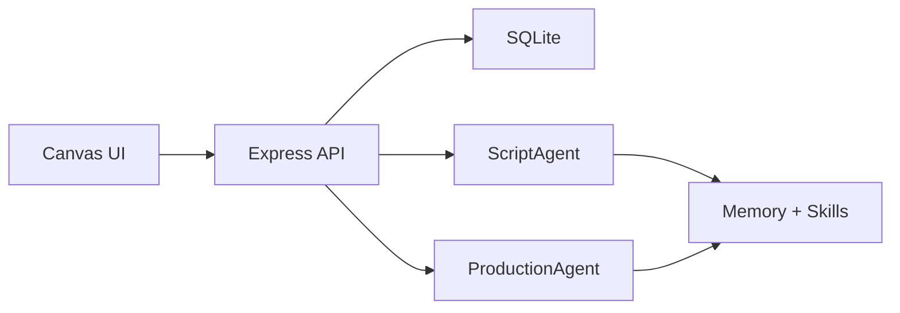

**Understand-Anything** — scan project/KB, dựng knowledge graph JSON, rồi mở dashboard/chat/diff/onboard trên graph đó. citeturn30view0turn31view0turn39view0turn39view1

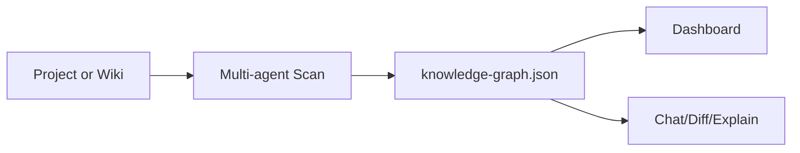

**awesome-llm-apps** — kho ví dụ để tham khảo triển khai agent/RAG, không phải một framework thống nhất. citeturn17view1

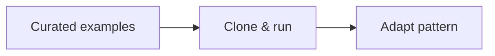

**system-prompts-and-models-of-ai-tools** — kho prompt/tool metadata phục vụ reverse engineering prompt design. citeturn17view2

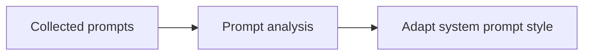

**ai-agents-for-beginners** — lesson → example → exercise; hữu ích cho onboarding đội ngũ hơn là làm core runtime. citeturn17view3

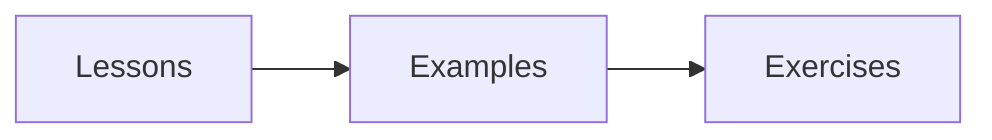

**RAG-Anything** — parsing đa phương thức, modal processors, KG index, hybrid retrieval. citeturn42view1turn42view2turn41view0

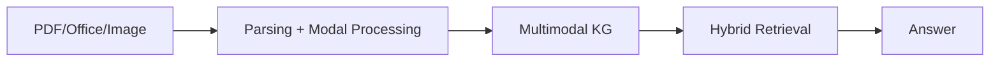

**colleague-skill** — skill-first/project-prompt oriented; giá trị nằm ở packaging skill hơn là retrieval. citeturn18view1

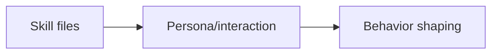

**vibe-kanban** — task board cho coding agents; hữu ích nếu muốn planner nhiều bước có human oversight. citeturn18view2

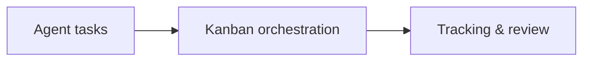

**conversational-state-machine** — user turn đi qua state machine, slot filling và queue hold/resume. citeturn18view3

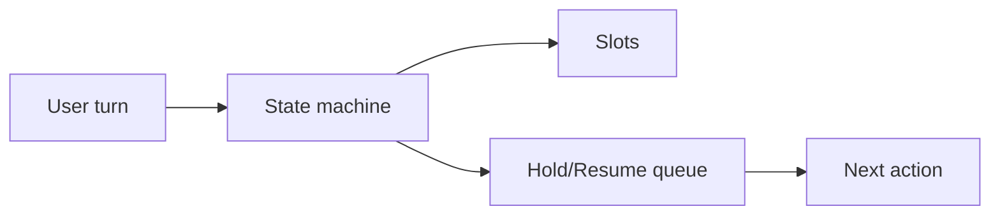

**graphrag-code** — tree-sitter AST vào SQLite, load in-memory graph bằng rustworkx, rồi PPR/MCP phục vụ agent. citeturn19view0turn21view0turn25view3

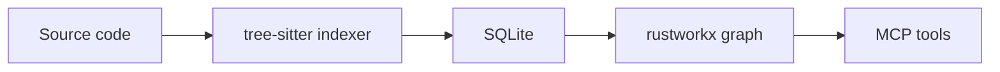

**medical-citation-agent** — documents chuẩn hoá → claim extraction → verifiable citations, không để LLM nằm trên critical path. citeturn19view1

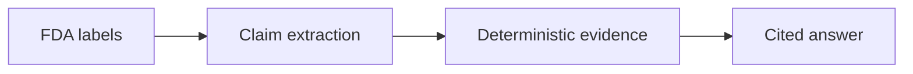

**e-commerce-project** — frontend/backend/infrastructure có AI + vector search, quan trọng vì maturity production. citeturn19view2

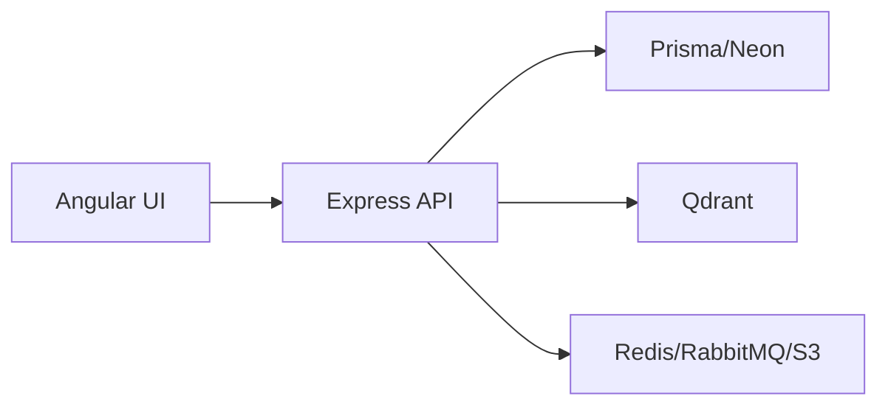

**container-bay-plan-validator** — Excel logistics → spatial matrix → deterministic validation; bài học lớn là tách validator khỏi generator. citeturn19view3

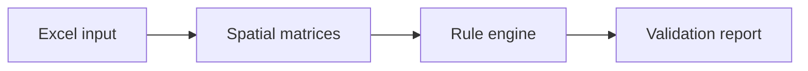

**Nemotron-Personas-Vietnam** — persona records tiếng Việt đi vào lớp personalization, không dùng làm knowledge base facts. citeturn20view0

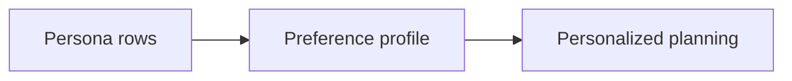

## Các bài học kiến trúc quan trọng

**Toonflow-app là bài học tốt nhất về “agent application có state thật”.** README mô tả rõ ba mảnh cực đáng học: **three-layer agent collaboration**, **persistent memory dựa trên local ONNX vector retrieval**, và **chapter event graph-driven adaptation**; cùng với đó, toàn bộ công cụ được externalize thành **skill Markdown files**. Về runtime, repo dùng Node/TypeScript/Express/SQLite/Vercel AI SDK/@huggingface/transformers/Socket.IO/Electron/Docker. Ở góc setup và vận hành, tài liệu có cả `yarn dev:gui`, build Docker, deploy PM2, và đặc biệt nêu login mặc định `admin/admin123`, đây là một red flag bảo mật nếu bạn bê nguyên pattern vận hành mà không thay secret ngay. citeturn13search0

Ở mức code, `runDecisionAI` chính là “tim” của design này. Nó thêm turn người dùng vào memory, đọc skill prompt từ file Markdown, dựng memory prompt, rồi stream model với cả **memory tools + business tools + subagents** trên cùng một call. Dạng wiring này hợp với travel planner hơn hẳn một chatbot đơn khối vì bạn sẽ sớm cần tách **router**, **retriever**, **planner**, **validator**, và có thể thêm **booking-check tool** sau này. Đáng chú ý, phần tool surface trong `src/agents/scriptAgent/tools.ts` không chỉ là “tool giả”; nó truy dữ liệu thật từ DB như `get_novel_events`, `get_planData`, `get_novel_text`, `get_script_content`. Đây là mẫu rất tốt để bạn biến itinerary builder thành một **tool-augmented planner** thay vì nhét toàn bộ dữ liệu vào prompt. citeturn12view1turn14view0turn15view3

Một mẩu code rất đáng học là việc Toonflow dùng memory như first-class primitive, không phải phần thêm thắt:

```ts
await memory.add("user", text, { createTime: userMessageTime });
```

Chính sau đó nó mới nạp skill và mở tool/subagent. Về mặt kiến trúc, điều này ngụ ý rằng với du lịch, **UserPref** và **trip session memory** phải là dữ liệu có cấu trúc và được viết vào state store trước, không nên chỉ dựa vào “conversation history” thô. Ngoài ra, route `getPlanData.ts` cho thấy cách workspace được materialize thành state rõ ràng với `storySkeleton`, `adaptationStrategy`, rồi ghép thêm danh sách script từ DB; travel planner có thể học y nguyên pattern này cho `trip_goal`, `budget`, `stay_constraints`, `selected_places`, `draft_itinerary`. citeturn14view0turn16view0

Điểm yếu khi mang Toonflow sang travel là graph ở đây chủ yếu phục vụ **chapter events**, chứ chưa có những quan hệ kiểu **distance, opening window, transit mode, geographic containment, time feasibility**. Nhưng cái bạn nên lấy lại gần như nguyên xi là **agent decomposition**, **skill files**, **tool calling**, **stateful workspace**, và **streaming message lifecycle**. Với Graph-RAG du lịch, đó là một nền rất mạnh. citeturn13search0turn14view0

**Understand-Anything là repo rõ nhất về cách biến graph thành trải nghiệm chat/search/explain chứ không chỉ là chỉ mục âm thầm.** README nói khá thẳng: pipeline nhiều agent scan project, trích file/function/class/dependency rồi sinh ra `.understand-anything/knowledge-graph.json`; sau đó dashboard, diff analysis, onboarding guide, explain, domain extraction đều đọc lên từ graph đó. Repo cũng công khai hẳn 5 agent cơ bản — `project-scanner`, `file-analyzer`, `architecture-analyzer`, `tour-builder`, `graph-reviewer` — và thêm `domain-analyzer` / `article-analyzer` cho những chế độ chuyên biệt. Ngoài ra, repo này hỗ trợ incremental update, multi-platform install, và test suite có các bài test quanh `compute_batches`, `extract_import_map`, `scan_project`, `merge_batch_graphs`. citeturn30view0turn31view0turn29view1turn28view0

Điểm quý nhất nằm ở `context-builder.ts`. Hàm `buildChatContext` làm ba việc rất cụ thể: tìm node liên quan bằng `SearchEngine`, mở rộng 1-hop theo edges, rồi bốc layer liên quan. Phần lõi nhìn như sau:

```ts
const engine = new SearchEngine(graph.nodes);
const searchResults = engine.search(query, { limit });
```

Sau đó code mở rộng tập matched IDs bằng cách đi qua toàn bộ edge graph và giữ lại nodes/edges/layers liên quan. Đây là baseline cực tốt cho travel Graph-RAG: thay `GraphNode` code component bằng `Place`, `POI`, `TransitStop`, `TimeSlot`, rồi thay 1-hop expansion bằng **multi-hop có điều kiện**. Nhưng chính ở đây cũng lộ giới hạn: **1-hop expansion** và graph search theo query text là quá nông cho itinerary thực. Travel query cần **lọc cứng theo giờ mở cửa/ngân sách/vị trí**, rồi mới hop graph. citeturn39view0

Hàm `buildDiffContext` cũng cực hữu ích nếu bạn nghĩ tới “iterative itinerary editing”. Nó ánh xạ file thay đổi → node thay đổi, tự kéo theo các node `contains`, rồi lấy 1-hop affected nodes và các layer bị ảnh hưởng. Mẩu logic quan trọng là:

```ts
if (edge.type === "contains" && changedNodeIds.has(edge.source))
```

Tương đương trong du lịch sẽ là: nếu user đổi khách sạn hoặc slot buổi sáng, bạn phải lan truyền ảnh hưởng sang các leg di chuyển, các reservation window, và những địa điểm đang nối vào slot đó. Cách Think-in-Impact này mạnh hơn nhiều so với việc “replan từ đầu” ở mọi lượt chat. Repo còn tách dashboard/core/skill packages, và `@understand-anything/skill` dùng `graphology` cùng `graphology-communities-louvain`, cho thấy họ nghiêm túc với graph như một first-class model chứ không chỉ là JSON trình diễn. citeturn39view1turn39view2turn33view2turn40view0

Nếu phải chắt ra một bài học duy nhất từ Understand-Anything, tôi sẽ nói: **hãy để graph trở thành API của cognition**, không chỉ là artifact của indexing. Travel planner cần đúng điều này: sau khi retrieve xong, phần planner, explanation, diff, và UI đều phải nói cùng một “graph language”. citeturn30view0turn31view0turn39view0turn39view1

**graphrag-code là nguồn có giá trị thuật toán rõ ràng nhất cho retrieval trên graph.** README mô tả kiến trúc từ **tree-sitter AST → SQLite → rustworkx Graph → MCP server** và nhấn mạnh core idea là **bidirectional Personalized PageRank** với `backward_weight` để chuyển giữa hai mode: hiểu implementation downstream và blast-radius upstream. `pyproject.toml` xác nhận các dependency cốt lõi là `tree-sitter`, `tree-sitter-python`, `rustworkx`, `mcp`, `litellm`; đồng thời package tự khai báo **Development Status :: 3 - Alpha**. Test tree cũng khá bài bản với `test_indexer.py`, `test_graph_engine.py`, `test_graph_engine_extended.py`, `test_mcp_server.py`, `test_eval_retrieval.py`. citeturn19view0turn26view0turn27view0

Ở tầng indexer, repo xây schema rất rõ ràng với ba bảng `files`, `symbols`, `edges` trong SQLite và index tương ứng; sau đó parse AST bằng tree-sitter, thêm node module, rồi insert function/class/route symbols. Đây là kiểu thiết kế tôi khuyên bạn học cho travel ingest: **ingestion chuẩn hoá thành bảng/node/edge trước, sau đó mới reasoning**. Phần code insert symbol nhìn cực “thực chiến”, không phải demo, vì có dedup cho overload/getter-setter và có incremental parsing nhờ checksum file. citeturn24view3turn24view4

Đoạn retrieval quan trọng nhất là `get_context_ppr`. Hàm này giải thích rất thẳng: chạy PPR trên graph gốc để bắt **downstream dependencies**, chạy PPR trên graph đảo để bắt **upstream callers**, rồi trộn hai score vectors theo `backward_weight`. Hai dòng bản chất là:

```py
forward_scores = dict(rx.pagerank(
backward_scores = dict(rx.pagerank(
```

Sau đó repo còn có logic merge phi tuyến khi `backward_weight` thấp để không cho upstream noise lấn át. Với du lịch, bạn có thể bê nguyên khung này rồi thay semantic của edges: **fwd** là chảy theo “fit vào plan hiện tại”, **bwd** là “impact ngược lên các decision trước đó”, còn phần merge thêm được **geo score**, **time-window score**, **budget-fit score**, và **category-fit score**. Nói ngắn gọn, đây không chỉ là một repo code understanding; nó là một bài học về **graph ranking có thể điều chỉnh mode truy hồi**. citeturn23view2

MCP server của repo này cũng rất gọn. Nó expose các tool `get_pruned_context`, `get_callers`, `get_impact`, `get_context`, `plan_change`, `list_symbols`. Điều cực hay là repo đã phân tách rõ **retrieval API** và **change-planning API**; travel planner nên có API tương tự: `get_candidate_places`, `get_place_context`, `get_plan_impact`, `plan_itinerary_change`, `list_available_slots`. Chỗ này đặc biệt đáng học vì nó biến graph retrieval thành những **tool affordances** mà agent dễ dùng hơn nhiều so với việc agent phải viết query graph ad hoc. citeturn25view1turn25view2turn25view3

**RAG-Anything là nguồn tốt nhất cho ingest dữ liệu du lịch đa phương thức.** README mô tả hệ thống như một **multimodal document processing RAG** xây trên **LightRAG**, có **Multimodal Knowledge Graph**, **Hybrid Intelligent Retrieval**, hỗ trợ text/images/tables/equations, và nêu pipeline rất rõ: **Document Parsing → Content Analysis → Knowledge Graph → Intelligent Retrieval**. Package tree cũng hợp lý cho việc này: `parser.py`, `processor.py`, `modalprocessors.py`, `query.py`, `raganything.py`, `prompt_manager.py`, `prompt.py`. `pyproject.toml` cho thấy dependency cốt lõi là `huggingface_hub`, `lightrag-hku<1.5`, `mineru[core]`, và optional extras cho image/markdown/OCR; test tree lại trải rộng từ parser, content insertion, embedding examples, resilience, prompt language tới LightRAG API wiring. citeturn18view0turn41view0turn42view1turn42view2turn42view3turn43view0

Điểm quan trọng nhất cho travel là repo này **không giả định knowledge only comes from text paragraphs**. Trong thực tế du lịch, dữ liệu bạn phải nuốt rất nhiều thứ lởm chởm: brochure PDF, menu PDF, ảnh bảng giá, bảng giờ mở cửa, bản đồ tuyến, thông tin từ guidebook, bài review có xen ảnh/bảng. Ví dụ công khai trong README cho thấy họ khởi tạo `LightRAG(...)`, gắn embedding function, rồi gọi `rag.aquery_with_multimodal(..., mode="hybrid")`; phần khác còn dùng `process_document_complete(...)` để ingest tài liệu mới vào cùng working dir đã có LightRAG. Với travel planner, đây là phần bạn dùng để xây “travel memory lake” từ tài liệu chưa chuẩn hoá. citeturn42view0

Nhưng RAG-Anything **không phải planner**. Nó mạnh ở ingest + hybrid retrieval + multimodal KG, chứ không giải quyết scheduling feasibility, route ordering, hay user-stateful editing. Nói cách khác: đây là “tai mắt” của hệ thống du lịch, chưa phải “não điều độ”. Nếu bạn dùng repo này, tôi khuyên để nó làm **ingestion sidecar** hoặc **document RAG service** thay vì ép nó thành trung tâm planner. citeturn42view1turn42view2

**Nhóm repo phụ trợ tạo ra những bài học mà bốn repo trên chưa có.** `conversational-state-machine` cho bạn đúng thứ mà hầu hết Graph-RAG demo thiếu: **dialog management** thực thụ, gồm slot filling, context switching, hold/resume queue. Với travel planner, đây là phần giữ cho hội thoại không vỡ khi user nói “giữ chuyến bay, đổi khách sạn, mà thêm một quán cà phê gần bảo tàng”. `medical-citation-agent` nhắc bạn rằng phần citation/evidence nên “deterministic-first”; `container-bay-plan-validator` nhắc rằng generator và validator phải tách riêng; `e-commerce-project` chứng minh vector search/AI chỉ thực sự hữu dụng khi được đặt trong bối cảnh **cache, queue, CI/CD, rollback, tests**; còn `Nemotron-Personas-Vietnam` đủ giàu để sinh **persona priors bằng tiếng Việt** với các cột như `travel_persona`, `cultural_background`, `skills_and_expertise`, `hobbies_and_interests`, `age`, `region`, `zone`, nhưng không phải truth source về du lịch. citeturn18view3turn19view1turn19view3turn19view2turn20view0

Ngược lại, `awesome-llm-apps`, `system-prompts-and-models-of-ai-tools`, `ai-agents-for-beginners`, `vibe-kanban`, và `colleague-skill` nên được xem là **nguồn pattern thứ cấp**: tốt để học cách người khác đóng gói agent, prompts, workflows, task boards, skill-oriented UX; nhưng nếu mục tiêu là Graph-RAG du lịch có chất liệu production, chúng không phải những chỗ tôi sẽ copy lõi retrieval/planning từ đó. citeturn17view1turn17view2turn17view3turn18view2turn18view1

## Kiến trúc đề xuất cho planner du lịch

Nếu chưng cất những gì tốt nhất từ các repo, kiến trúc phù hợp nhất cho bạn là: **Toonflow-style tool-wired agents + Understand-Anything-style graph context layer + graphrag-code-style weighted graph retrieval + RAG-Anything-style multimodal ingest + deterministic validator theo tinh thần medical/container repos + conversational state machine cho multi-turn edits**. citeturn14view0turn39view0turn23view2turn42view2turn19view1turn19view3turn18view3

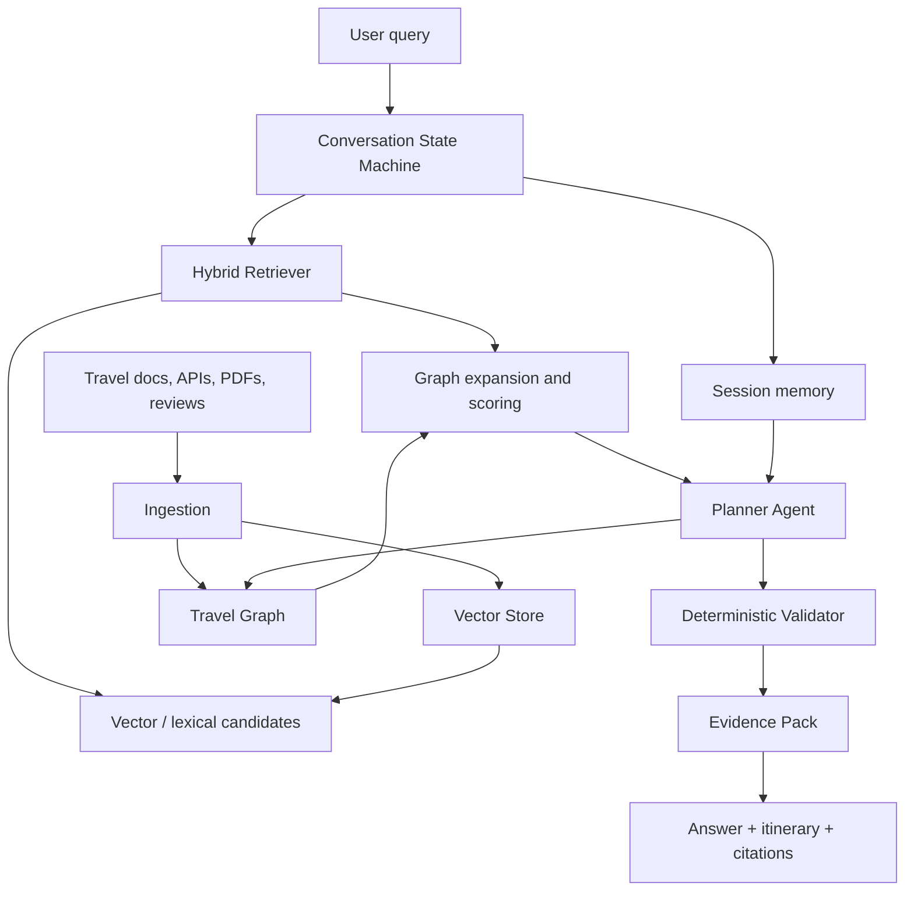

Phần schema, theo tôi, nên bắt đầu rất “ít nhưng sai không nổi”: `Place`, `Area`, `TransitStop`, `TimeSlot`, `BudgetBand`, `UserPref`, `TripRequest`, `Itinerary`, `Evidence`. Quan hệ tối thiểu nên có `LOCATED_IN`, `NEAR`, `OPEN_DURING`, `REQUIRES_DURATION`, `HAS_PRICE_LEVEL`, `MATCHES_PREF`, `CONNECTED_BY`, `PRECEDES`, `SUPPORTED_BY`. Đừng cố nổ lớn với ontology du lịch quá sớm; cái bạn cần là **graph đủ giàu để planner kiểm feasibility**, không phải graph đẹp để demo.

Từ các repo đã đọc, tôi khuyên **không dùng graph như nơi trả lời cuối cùng**. Thay vào đó, hãy dùng pipeline bốn tầng. Tầng đầu là **candidate generation** bằng keyword/vector/multimodal retrieval. Tầng hai là **graph expansion and scoring** để nối candidate với area, transit, opening hours, adjacency, category fit. Tầng ba là **planning** để tạo itinerary nháp theo slot. Tầng bốn là **deterministic validation** để loại phương án sai. Mô hình này ăn khớp rất tự nhiên với `buildChatContext` của Understand-Anything, `get_context_ppr` của graphrag-code, ও pattern validator của các repo determinisitic. citeturn39view0turn23view2turn19view1turn19view3

Bảng dưới đây là **reuse/adaptation matrix** thực dụng nhất.

| Nguồn | Tệp / module | Nên làm gì | Vì sao |
|---|---|---|---|
| Toonflow-app | `data/skills/*`, `runDecisionAI`, tools wiring | Reuse pattern | Skill prompts ngoài source + memory/tools/subagent wiring rất hợp để dựng `router/planner/validator` cho du lịch. citeturn13search0turn14view0turn12view1 |
| Toonflow-app | `getPlanData.ts` | Refactor ý tưởng workspace state | Có mẫu lưu trạng thái workspace có cấu trúc; đổi sang `trip_request`, `draft_itinerary`, `selected_places`, `constraints`. citeturn16view0 |
| Understand-Anything | `src/context-builder.ts` | Reuse trực tiếp rồi patch | Đây là baseline rất tốt cho `buildTravelContext`, chỉ thiếu multi-hop, filters và weights du lịch. citeturn39view0 |
| Understand-Anything | `src/diff-analyzer.ts` | Reuse ý tưởng change impact | Chuyển từ file-diff sang plan-diff khi user đổi ngày/slot/budget. citeturn39view1 |
| Understand-Anything | multi-agent scan + dashboard | Reuse ý tưởng UI/inspection | Travel graph rất cần dashboard debug để nhìn itinerary graph và provenance. citeturn31view0 |
| graphrag-code | `get_context_ppr`, MCP tools | Port thuật toán | Đây là ý tưởng retrieval graph mạnh nhất trong list; cần thay edge semantics sang geo/time/travel. citeturn23view2turn25view1 |
| RAG-Anything | `parser.py`, `processor.py`, `modalprocessors.py`, `query.py` | Reuse thành sidecar ingest | Hợp để nhập brochure, menu PDF, timetable, map legend, guidebook scan. citeturn41view0turn42view2 |
| conversational-state-machine | dialog/state patterns | Reuse khái niệm, không cần copy thô | Travel planning là bài toán conversational refinement nhiều lượt. citeturn18view3 |
| medical-citation-agent | deterministic evidence mindset | Reuse nguyên tắc | Câu trả lời phải gắn kèm source span/evidence thay vì chỉ “LLM said so”. citeturn19view1 |
| container-bay-plan-validator | validator-first mindset | Reuse nguyên tắc | Itinerary phải qua validator thời gian/không gian giống cách logistics plan phải qua rule engine. citeturn19view3 |
| e-commerce-project | deployment/CI/ops patterns | Reuse vận hành | Queue, cache, vector search, tests, rollback là pattern production hoá tốt. citeturn19view2 |
| Nemotron-Personas-Vietnam | persona fields | Reuse làm personalization prior | Tốt để suy ra taste/pace/budget tendency bằng tiếng Việt; không dùng làm facts. citeturn20view0 |

Patch đầu tiên tôi khuyên là chuyển `buildChatContext` của Understand-Anything thành `buildTravelContext`:

```diff
- const engine = new SearchEngine(graph.nodes);
- const searchResults = engine.search(query, { limit });
- const expandedIds = new Set(matchedIds);
- for (const edge of graph.edges) { ...1-hop... }

+ const searchResults = hybridSearch(query, {
+   textIndex,
+   vectorIndex,
+   metadataFilters: { city, budget, categories, timeWindow }
+ });
+ const expandedIds = weightedExpand(searchResults, {
+   maxHops: 2,
+   edgeTypes: ["NEAR", "LOCATED_IN", "CONNECTED_BY", "SIMILAR_STYLE"],
+   weights: { NEAR: 0.9, CONNECTED_BY: 0.7, SIMILAR_STYLE: 0.5 }
+ });
+ const feasibleIds = filterByOpeningHoursAndDuration(expandedIds, request);
```

Lý do patch này là vì baseline hiện tại của Understand-Anything rất hợp cho **context assembly**, nhưng chưa hề có khái niệm **hard feasibility filters**. citeturn39view0

Patch thứ hai là lấy merge-scoring từ graphrag-code rồi thêm geo/time:

```diff
- merged_scores[idx] = fwd + (bwd * backward_weight * (fwd + 1e-4))

+ merged_scores[idx] =
+   alpha * fwd_dependency
+ + beta  * bwd_plan_impact
+ + gamma * geo_proximity
+ + delta * opening_hours_fit
+ + eta   * preference_fit
+ - zeta  * price_penalty
+ - theta * transfer_penalty
```

Ở code understanding, `fwd` và `bwd` mang nghĩa dependency/caller; ở travel planner, tôi sẽ diễn giải lại thành **“fit để thêm vào plan hiện tại”** và **“ảnh hưởng ngược lên cấu trúc plan hiện tại”**. Đây là chỗ Graph-RAG du lịch thật sự bắt đầu khác code GraphRAG. citeturn23view2turn25view2

Patch thứ ba là giữ nguyên tinh thần skill files của Toonflow:

```diff
- data/skills/script_agent_decision.md
- data/skills/script_execution_script.md

+ data/skills/travel_router.md
+ data/skills/travel_retriever.md
+ data/skills/travel_planner.md
+ data/skills/travel_validator.md
+ data/skills/travel_explainer.md
```

Bạn sẽ đi nhanh hơn rất nhiều nếu prompt không bị hardcode rải rác. Toonflow cho thấy skill Markdown bên ngoài source giúp tuning nhanh, phân vai agent rõ, và giảm đau khi phải tinh chỉnh behavior. citeturn13search0turn14view0

Patch cuối cùng là mượn tinh thần “evidence-first”:

```diff
+ interface Evidence {
+   source_id: string
+   source_type: "api" | "doc" | "user_doc" | "cached_fact"
+   snippet: string
+   retrieved_at: string
+   confidence: number
+   supports: string[]
+ }
+
+ interface ItineraryItem {
+   place_id: string
+   start_time: string
+   end_time: string
+   justification: string
+   evidence: Evidence[]
+   validator_flags: string[]
+ }
```

Mục tiêu là để mỗi item trong itinerary đều có thể trả lời câu hỏi “**vì sao đề xuất chỗ này, dựa trên dữ liệu nào, và có pass validator chưa?**” — đúng tinh thần của medical-citation-agent và container validator. citeturn19view1turn19view3

Về **tech stack đề xuất**, nếu bạn muốn tốc độ triển khai cao nhất, tôi nghiêng về một kiến trúc **Python-first cho retrieval/planning + TypeScript cho admin/debug UI**. Cụ thể: một service ingestion tách riêng để nuốt docs đa phương thức; một travel graph service; một planner service; và một conversation service. Nếu team bạn mạnh TypeScript hơn Python, phương án cân bằng là **TS backend chính** nhưng để một **Python ingest sidecar** kiểu RAG-Anything. Với dữ liệu, tôi khuyên tách ba lớp: **relational/geo store** cho facts và slot constraints, **vector store** cho semantic search, và **graph store** cho expansion/traversal. Nếu muốn tiết kiệm, MVP có thể tạm dùng relational + vector + graph in-memory; đến v1 mới đẩy sang graph DB chuyên dụng.

Điểm quan trọng hơn chuyện chọn sản phẩm nào là **ranh giới trách nhiệm**. Facts du lịch phải đi vào store có provenance; graph chỉ nên đọc từ sources đã chuẩn hoá; planner không được phép sửa facts; validator không được gọi LLM. Khi tách đúng boundary như vậy, bạn sẽ tránh được kiểu bug rất phổ biến của Graph-RAG: retriever trả candidate tốt nhưng planner vẫn bịa giờ, bịa quãng đường, hoặc xếp trùng slot.

## Lộ trình triển khai và checklist an toàn

Lộ trình tốt nhất là đi theo ba pha thay vì build “super Graph-RAG” từ đầu.

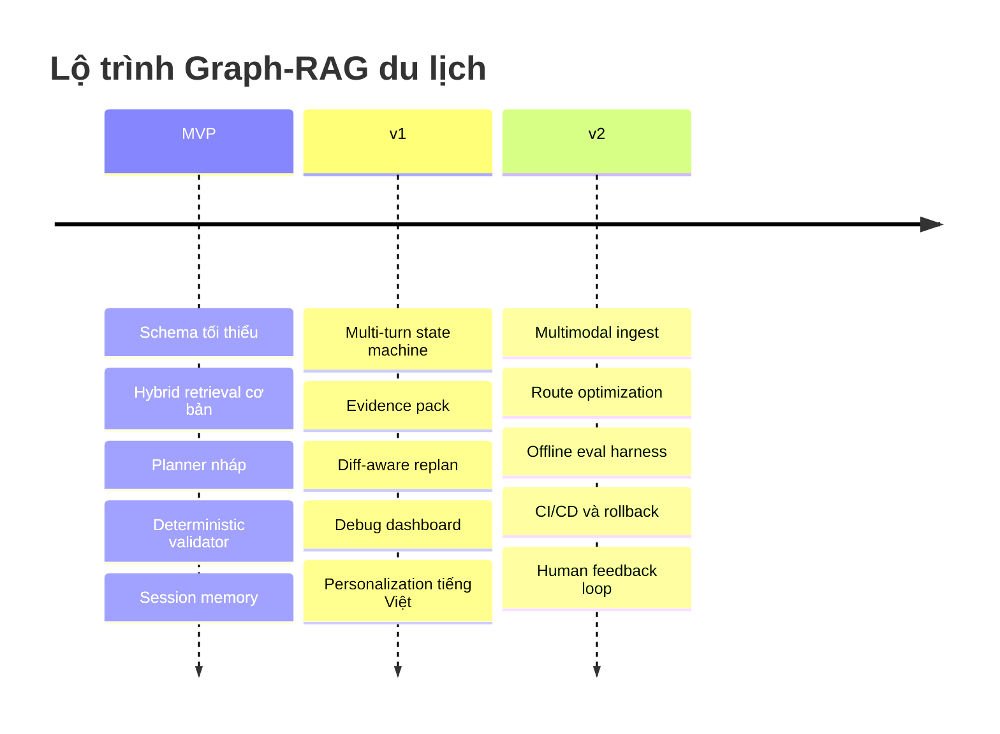

Bảng dưới đây là roadmap thực dụng, theo person-days ước lượng cho một đội nhỏ 1–2 người kỹ thuật.

| Pha | Milestone | Kết quả đầu ra | Ước lượng |
|---|---|---|---:|
| MVP | Thiết kế schema `Place/Destination/TimeSlot/UserPref/Itinerary/Evidence` | ERD, migrations, metadata contract | 4–6 pd |
| MVP | Ingestion facts nguồn chuẩn | API adapters + loaders + canonical IDs | 5–7 pd |
| MVP | Hybrid retrieval cơ bản | keyword + vector + metadata filters | 6–8 pd |
| MVP | Graph context expansion | 1–2 hop weighted expansion | 4–6 pd |
| MVP | Planner nháp + validator | itinerary draft + feasibility checks | 8–10 pd |
| MVP | Session memory + tools | user prefs/stateful edits | 4–5 pd |
| v1 | Conversational state machine | slot filling, hold/resume, context switching | 5–7 pd |
| v1 | Evidence pack + citing answer | mỗi itinerary item có provenance | 4–6 pd |
| v1 | Replan diff-aware | đổi một constraint không phải tính lại tất cả | 4–6 pd |
| v1 | Debug dashboard | graph explorer + itinerary trace | 5–8 pd |
| v1 | Persona personalization | dùng dataset VN làm prior | 4–5 pd |
| v2 | Multimodal ingest sidecar | PDF/menu/brochure/map ingestion | 8–12 pd |
| v2 | Route optimization | greedy insertion + local search/solver | 8–12 pd |
| v2 | Eval harness + CI/CD | benchmark, regression tests, rollback | 6–10 pd |

Một điểm rất đáng học từ graphrag-code là họ giữ một **retrieval-only benchmark tái lập** với Precision@k thay vì trộn hết vào đánh giá LLM. Với travel planner, tôi cũng khuyên tách evaluation thành hai mặt: **retrieval quality** và **plan quality**. Retrieval có thể dùng `Precision@5`, `Recall@20`, `Evidence coverage`, `Metadata filter accuracy`; plan quality có thể dùng `Constraint violation rate`, `Itinerary feasibility rate`, `Travel-time error`, `Edit stability`, `User revision turns`, `Personalization acceptance`. Ý tưởng giữ benchmark retrieval độc lập được hỗ trợ rất rõ trong graphrag-code. citeturn19view0turn21view4

Một `test_queries.json` mẫu cho MVP nên trông gần như thế này:

```json
[
  {
    "id": "sgn_half_day_food_walk",
    "query": "mình ở quận 1, có 4 tiếng chiều nay, thích cà phê và đồ ăn đường phố, ngân sách vừa phải",
    "constraints": {
      "city": "Ho Chi Minh City",
      "time_window": ["2026-06-14T14:00:00+07:00", "2026-06-14T18:00:00+07:00"],
      "budget_level": "medium",
      "walking_only": true
    }
  },
  {
    "id": "hanoi_family_rainy_day",
    "query": "lịch trình cho gia đình có trẻ nhỏ ở Hà Nội, trời mưa, cần chỗ trong nhà",
    "constraints": {
      "city": "Hanoi",
      "group_type": "family",
      "weather_sensitive": true,
      "indoor_preferred": true
    }
  },
  {
    "id": "danang_couple_sunset",
    "query": "đi chơi kiểu lãng mạn ở Đà Nẵng từ chiều đến tối, muốn ngắm hoàng hôn và ăn tối",
    "constraints": {
      "city": "Da Nang",
      "time_window": ["2026-06-15T16:00:00+07:00", "2026-06-15T21:00:00+07:00"],
      "vibe": "romantic"
    }
  },
  {
    "id": "hcm_fast_replan",
    "query": "giữ quán cà phê đầu tiên nhưng đổi phần còn lại vì bảo tàng đóng cửa",
    "constraints": {
      "preserve_items": ["coffee_stop_1"],
      "closed_places": ["museum_x"]
    }
  }
]
```

Bộ test tối thiểu tôi nghĩ bạn nên có ngay từ MVP gồm ba lớp. Lớp một là **schema tests**: opening hours parser, timezone normalization, duration arithmetic, budget band mapping. Lớp hai là **retrieval tests**: query → top-k candidates, metadata filter fidelity, graph expansion correctness. Lớp ba là **validator tests**: không overlap slot, không vượt thời gian di chuyển, không đến nơi đã đóng cửa, không vượt ngân sách khi constraint là cứng.

Checklist bảo mật, provenance và chống hallucination nên giữ rất chặt:

- **Không bao giờ giữ credential mặc định trong production.** Toonflow công khai login mặc định `admin/admin123`; đó là ví dụ rất rõ vì sao secret rotation phải là checklist đầu tiên. citeturn13search0
- **Tất cả API keys phải đi qua secret manager hoặc ít nhất env vars, không hardcode trong examples triển khai thật.** Toonflow và RAG-Anything đều cho thấy cấu hình endpoint/API qua biến môi trường hoặc biến cấu hình. citeturn13search0turn42view0
- **LLM không được là nơi quyết định feasibility cuối cùng.** Hãy giữ validator theo kiểu deterministic-first như medical-citation-agent và container-bay-plan-validator. citeturn19view1turn19view3
- **Mọi itinerary item phải mang evidence pack.** Nếu không trỏ được về source/truy hồi nào, item đó chỉ là gợi ý nháp, chưa đủ điều kiện trả ra như kết luận.
- **Tách “persona priors” khỏi “destination facts”.** Dataset Nemotron-Personas-Vietnam rất hữu ích cho phong cách/nhịp độ/sở thích, nhưng không được dùng để suy ra giờ mở cửa, giá vé, quãng đường hay địa điểm thực. citeturn20view0
- **Giữ regression suite và vận hành tử tế ngay từ sớm.** `e-commerce-project` là tín hiệu tốt rằng AI/search trong production cần queue, cache, tests, CI/CD, rollback chứ không chỉ cần prompt tốt. citeturn19view2
- **Lưu version của graph và itinerary decisions.** Nếu không có diff-aware replan thì mỗi lần user sửa một chút bạn sẽ mất ổn định hành vi.
- **Ưu tiên “explainable failure” hơn “plausible answer”.** Nếu validator fail, hệ thống nên nói rõ thất bại ở đâu: slot quá ngắn, quãng đường quá xa, địa điểm chưa có evidence, hoặc opening hours conflict.

Tóm lại, nếu tôi phải chọn một chiến lược xây dựng cho bạn ngay bây giờ, tôi sẽ đi theo công thức sau: **Toonflow cho orchestration, Understand-Anything cho context assembly và graph UX, graphrag-code cho graph ranking, RAG-Anything cho ingest tài liệu đa phương thức, conversational-state-machine cho session dialog, medical-citation-agent + container-bay-plan-validator cho grounding và validation, e-commerce-project cho production hygiene, và Nemotron-Personas-Vietnam cho personalization tiếng Việt**. Đó là tổ hợp mạnh nhất và thực dụng nhất mà tôi rút ra được từ toàn bộ tập nguồn bạn đưa. citeturn13search0turn39view0turn23view2turn42view2turn18view3turn19view1turn19view3turn19view2turn20view0