# Graph RAG Design Lessons from the Repository Corpus

## Executive summary

Across the fourteen sources you provided, the most valuable building blocks for a **travel Graph RAG** are not concentrated in one repository. They are distributed across a few different architectural styles. **Understand-Anything** is the strongest reference for a typed, inspectable, validated knowledge graph with structural retrieval and context packaging. **GraphRAG-Code** is the clearest reference for graph-native ranking, especially bidirectional Personalized PageRank over a directed graph. **Toonflow-app** is unusually useful for agent memory design because it explicitly combines short-term conversation state, compressed long-term summaries, and vector recall in one workflow. **RAG-Anything** is the strongest reference for multimodal ingestion and document-centric graph construction. **Medical Citation Agent** and **Container Bay Plan Validator** are strong references for deterministic grounding and validation layers, which are exactly what a travel planner needs when dates, opening hours, fare rules, and connection feasibility matter. citeturn45view0turn30view3turn37view0turn39view0turn42view0turn42view1turn42view3turn20view1turn20view2

The corpus also separates nicely into **direct Graph RAG references** and **supporting operational references**. Direct references are the repos that either build graphs, retrieve from them, or ground outputs with deterministic evidence: **Understand-Anything**, **GraphRAG-Code**, **RAG-Anything**, **Toonflow-app**, and **Medical Citation Agent**. Supporting references contribute orchestration, team workflow, or production practices rather than graph retrieval itself: **Conversational State Machine**, **E-Commerce Platform**, **Vibe Kanban**, **AI Agents for Beginners**, **Awesome LLM Apps**, **colleague-skill**, **system-prompts-and-models-of-ai-tools**, plus the persona dataset. citeturn45view0turn42view0turn39view0turn44view3turn42view1turn43view0turn42view2turn45view1turn44view2turn44view0turn43view1turn44view1turn43view3

For a travel system, the best composite design is this: **multimodal travel-document ingestion from RAG-Anything**, **typed travel graph schemas and one-hop context packaging from Understand-Anything**, **graph-native ranking from GraphRAG-Code**, **conversation memory from Toonflow**, **state-machine orchestration from Conversational State Machine**, **deterministic claim citation from Medical Citation Agent**, and **hard-rule validation from Container Bay Plan Validator**. This gives you an architecture that can answer “What should I do in Da Nang tomorrow?” and also survive hard questions like “Can I realistically do these four attractions, within budget, across opening hours, with two children, in rain, and cite where the transit constraints came from?” citeturn39view0turn45view0turn42view0turn44view3turn43view0turn42view1turn42view3

The biggest technical mistake to avoid is building “Graph RAG” as only a vector search with graph-flavored naming. Several of these repos show the difference between true graph-aware behavior and ordinary semantic retrieval. **Understand-Anything** explicitly models node and edge types, validates graph structure, and expands search results through relationships. **GraphRAG-Code** explicitly runs graph ranking in both edge directions. **Toonflow-app**, by contrast, shows a strong memory pattern but still performs vector search over all rows in a local table rather than over a first-class graph. For travel, you want both: a **real travel graph** and a **vector layer attached to graph nodes and evidence chunks**. citeturn30view0turn30view1turn30view3turn37view0turn42view0turn20view1turn20view2

## Research scope and method

I analyzed the repositories and dataset primarily through their **README files, package manifests, top-level trees, selected source files, and visible tests or docs**. For the Graph-RAG-heavy projects, I drilled into concrete code paths and schema files. For very large or less directly relevant repositories, I prioritized the highest-leverage source paths and marked anything that remained **unspecified in the visible excerpts** rather than pretending certainty.

The exact URLs you gave were:

```text
https://github.com/HBAI-Ltd/Toonflow-app
https://github.com/Egonex-AI/Understand-Anything
https://github.com/Shubhamsaboo/awesome-llm-apps
https://github.com/x1xhlol/system-prompts-and-models-of-ai-tools
https://github.com/microsoft/ai-agents-for-beginners
https://github.com/HKUDS/RAG-Anything
https://github.com/titanwings/colleague-skill
https://github.com/BloopAI/vibe-kanban
https://github.com/bydecom/conversational-state-machine
https://github.com/bydecom/graphrag-code
https://github.com/bydecom/medical-citation-agent
https://github.com/bydecom/e-commerce-project
https://github.com/bydecom/container-bay-plan-validator
https://huggingface.co/datasets/nvidia/Nemotron-Personas-Vietnam
```

At a corpus level, the sources expose seven recurring concerns that matter directly to travel Graph RAG: **schema quality**, **retrieval strategy**, **multimodal ingestion**, **dialogue state**, **deterministic validation**, **citation fidelity**, and **operational hardening**. Those themes recur in different forms across the repo set. citeturn45view0turn39view0turn44view3turn42view1turn43view0turn42view3turn42view2

A useful way to interpret this corpus is as a division of labor rather than a winner-take-all competition:

| Design concern | Best source in this corpus | Why it matters for travel Graph RAG |
|---|---|---|
| Typed graph schema and graph validation | Understand-Anything | It exposes explicit node/edge enums, graph validation, layers, and tour/context abstractions. citeturn30view0turn30view1turn30view3 |
| Graph-native ranking | GraphRAG-Code | It treats the graph as the retrieval object and uses bidirectional PPR instead of only embeddings. citeturn42view0 |
| Memory layering | Toonflow-app | It combines short-term state, summaries, and semantic recall in a single memory service. citeturn20view0turn20view1turn20view2 |
| Multimodal ingestion | RAG-Anything | It is document-centric and designed for images, tables, equations, and heterogeneous files. citeturn39view0turn40view0 |
| Deterministic evidence and citation | Medical Citation Agent | It extracts claims and exact evidence without LLMs in the critical path. citeturn42view1 |
| Conversation orchestration | Conversational State Machine | It models context switching, hold/resume, and slot progress explicitly. citeturn43view0 |
| Rule validation | Container Bay Plan Validator | It demonstrates deterministic rule engines separated from UI and ingestion. citeturn42view3 |

## Cross-repo findings for Graph RAG

A strong travel Graph RAG needs **three data planes**, and this corpus maps cleanly onto them. The first plane is the **knowledge plane**: POIs, neighborhoods, venues, routes, ticket rules, supplier content, and temporal availability. The second plane is the **evidence plane**: web snippets, official pages, extracted brochures, maps, PDFs, reviews, and policy text that justify graph facts. The third plane is the **user-state plane**: traveler preferences, budget, family composition, mobility constraints, weather tolerance, and current itinerary drafts. **Understand-Anything** gives the cleanest example of a typed graph plane; **Medical Citation Agent** gives the cleanest example of evidence extraction; **Toonflow-app** gives the cleanest example of layered user-state memory. citeturn30view0turn30view1turn37view0turn42view1turn20view0turn20view1turn20view2

The corpus also shows that **retrieval should not be monolithic**. A good travel planner will often need: keyword or fuzzy retrieval for entity lookup, vector retrieval for semantic similarity, graph traversal or ranking for relationship-aware recall, and deterministic filters for constraints. **Understand-Anything** implements fuzzy graph-node search with Fuse over `name`, `tags`, `summary`, and `languageNotes`, then expands one hop through edges. **GraphRAG-Code** goes further by ranking over a directed graph with forward and reverse Personalized PageRank. **Toonflow-app** uses dense recall over stored message embeddings. In other words, the repositories collectively argue for a **hybrid retriever**, not a single retriever. citeturn31view0turn37view0turn42view0turn20view1turn20view2

Another important lesson is that **schema design is not optional**. **Understand-Anything** explicitly enumerates node types such as `file`, `function`, `class`, `module`, `concept`, `service`, `table`, `endpoint`, `pipeline`, `schema`, `resource`, `domain`, `flow`, `step`, `article`, `entity`, `topic`, `claim`, and `source`, and edge types spanning structural, behavioral, data-flow, dependency, semantic, and infrastructure relations. That explicitness is what makes downstream retrieval intelligible and debuggable. A travel graph should be designed with the same discipline: for example `City`, `District`, `Venue`, `POI`, `Activity`, `TransitLeg`, `Pass`, `PolicyClaim`, `EvidenceChunk`, `TimeWindow`, `WeatherScenario`, `TravelerProfile`, and `ItineraryDraft`, rather than a generic “document” node for everything. citeturn30view3turn30view0turn30view1

The corpus repeatedly argues for **deterministic validators outside the LLM**. The strongest examples are **Medical Citation Agent**, which deliberately keeps LLMs out of the extraction path, and **Container Bay Plan Validator**, which separates parsing, state, validation logic, and visualization. A travel planner needs the same separation. Whether a venue is open, whether a transfer is physically possible, whether a museum pass covers admission, or whether a day exceeds walking tolerance should be checked by deterministic code after the LLM proposes a plan. citeturn42view1turn42view3

Finally, the less direct repositories are still useful because production Graph RAG systems fail on **workflow** and **governance**, not just on retrieval. **E-Commerce Platform** is relevant because it shows how vector search, queues, caches, and cloud services get operationalized. **Vibe Kanban** is relevant because human review loops around AI workflows matter. **AI Agents for Beginners** is relevant because its lesson structure lines up with the disciplines your team will need: planning, multi-agent coordination, context engineering, memory, and security. citeturn42view2turn45view1turn44view2

## Core repository analyses

### Toonflow-app

**High-level purpose and Graph RAG relevance**

Toonflow is a desktop AI short-drama production system organized around a creative workflow of planning, scriptwriting, storyboard generation, asset generation, and video output. Its README explicitly calls out an infinite-canvas workspace, a three-layer agent system, persistent agent memory backed by local ONNX vector retrieval, editable provider logic, event-graph-driven adaptation, and Markdown skill files. For Graph RAG, it is most useful as a reference for **agent memory**, **skills-as-files**, and **typed production objects**, even though it is not a general-purpose graph retrieval engine. citeturn44view3turn17view0turn18view0turn20view1turn20view2

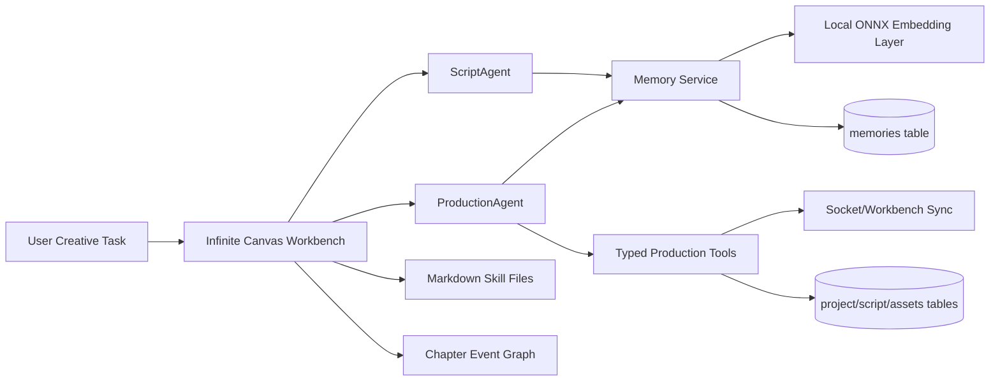

This diagram is synthesized from the README and the inspected `embedding.ts`, `memory.ts`, `productionAgent/index.ts`, and `productionAgent/tools.ts` paths. citeturn44view3turn19view0turn20view0turn20view1turn20view2turn20view3turn15view1turn15view2turn16view2

**Key files and code paths**

The highest-leverage paths I inspected are summarized below. citeturn17view0turn18view0turn19view0turn20view0turn20view1turn20view2turn20view3turn15view1turn15view2turn16view2

| File path | Role | Important functions or structures | Lines to inspect |
|---|---|---|---|
| `src/utils/agent/embedding.ts` | Local embedding layer | `initEmbedding`, `getEmbedding`, `cosineSimilarity`, `disposeEmbedding`; uses local ONNX model path and disables remote-model downloads | ~342–418 in visible excerpt |
| `src/utils/agent/memory.ts` | Layered memory and RAG | `vectorSearch`, `add`, summary generation, `get`, `deepRetrieve`, `getTools` | ~724–1040 in visible excerpts |
| `src/agents/productionAgent/tools.ts` | Typed production schema and tool layer | `assetItemSchema`, `storyboardSchema`, `flowDataSchema`, `get_flowData`, `add_deriveAsset` | ~846–1121 in visible excerpt |
| `src/agents/productionAgent/index.ts` | Skill-driven sub-agent orchestration | `run_sub_agent_derive_assets`, `run_sub_agent_generate_assets`, `run_sub_agent_storyboard_*` | ~1553–1803 in visible excerpts |
| `src/utils/agent/skillsTools.ts` | Skill activation layer | Path visible; implementation not opened deeply in the current slice | Unspecified in visible excerpt |

**Observed schema and travel-graph mapping**

Toonflow already contains concrete typed entities you can reinterpret as graph nodes. citeturn16view2turn20view0turn20view1turn20view2

| Observed entity | Observed attributes | Natural graph mapping for travel |
|---|---|---|
| `assetItemSchema` | `id`, `name`, `type`, `prompt`, `desc`, `derive[]` | `TravelAsset` or `POIAsset`; e.g., venue photos, neighborhood cards, ticket products |
| `deriveAssetSchema` | `assetsId`, `name`, `desc`, `src`, `state`, `type` | `DerivedArtifact`; e.g., map crop, summarized ticket option, weather overlay |
| `storyboardSchema` | `id`, `duration`, `prompt`, `associateAssetsIds`, `src`, `index` | `ItineraryStep`; `associateAssetsIds` becomes `USES_PLACE`, `USES_ROUTE`, `USES_TICKET` |
| `flowDataSchema` | `script`, `scriptPlan`, `assets`, `storyboardTable`, `storyboard` | `ItineraryDraft` composed of narrative, plan, evidence assets, and sequenced steps |
| `memories` messages and summaries | content, embedding, related message ids, summarized flag | `UserStateMemory`, `ConversationSummary`, `PreferenceRecall` |

**Retrieval, embedding, and LLM integrations**

`embedding.ts` imports `onnxruntime-web` and `@huggingface/transformers`, loads a local model from the configured models directory, explicitly sets `allowRemoteModels = false`, and then uses a `feature-extraction` pipeline with mean pooling and normalization. `memory.ts` stores embeddings in a DB table, computes cosine similarity over parsed embedding arrays, and combines three views when answering: recent unsummarized messages, recent summaries, and dense recall over all messages. `deepRetrieve()` first vector-searches summaries, then asks an LLM to judge relevant summaries, then expands back to the referenced raw messages. citeturn19view0turn20view0turn20view1turn20view2turn20view3

**Strengths, weaknesses, technical debt, security, and privacy**

The main strength is architectural clarity. Toonflow already separates **agent execution**, **memory**, **typed workbench state**, and **skill files**. That makes it much easier to transplant ideas into travel than a monolithic chatbot would be. The memory design is particularly strong for beginners because it is conceptually simple: add message, summarize batches, persist embeddings, recall semantically, and expose deep retrieval as a tool. citeturn20view0turn20view1turn20view2turn20view3

The main weakness is that the “graph” concept is still domain-specific and partial. The README mentions a chapter event graph, but the inspected source paths expose mostly production objects and memory rows, not a generalized graph database or graph query layer. The vector search in `memory.ts` also scans all messages in the isolation key and sorts by cosine similarity in-process, which is fine for low-scale creative sessions but not for a travel assistant that may need cross-user evaluation corpora, high-cardinality evidence stores, or fresh supplier data. citeturn44view3turn20view1turn20view2

A security-positive detail is that remote embedding model downloads are disabled in `embedding.ts`. A security concern is the README’s “programmable vendor system” and editable skill files: that is powerful, but in a travel product it means you need strong permission boundaries, audit trails, and sandboxing so that supplier adapters or skill prompts cannot become an uncontrolled execution or prompt-injection surface. That second point is an inference from the visible architecture, not an explicit vulnerability report. citeturn19view0turn44view3

**Prioritized recommendations for adapting Toonflow patterns to travel Graph RAG**

| Recommendation | Concrete change | Effort | Risk |
|---|---|---:|---:|
| Replace workbench objects with a typed travel graph | Introduce `travel_schema.py/ts` with nodes for `City`, `POI`, `Activity`, `TransitLeg`, `Pass`, `EvidenceChunk`, `TravelerProfile`, `ItineraryDraft` | Medium | Small |
| Upgrade memory from table-scan vector recall to graph-attached memory | Preserve Toonflow’s short-term/summary/semantic split, but store summaries and evidence chunks as graph nodes with vector indexes | Medium | Medium |
| Reuse skill-file architecture for travel sub-agents | Create skill files for `trip_brief`, `route_repair`, `weather_replan`, `budget_optimizer`, `visa_policy_citer` | Small | Small |
| Add deterministic validators | Add validators for opening hours, walking time, transfer slack, budget, age restrictions, and weather conflicts | Medium | Small |
| Add source-grounded evidence writing | Every itinerary step should point to evidence chunk ids and policy ids, not only narrative text | Medium | Medium |

### Understand-Anything

**High-level purpose and Graph RAG relevance**

Understand-Anything is the strongest **graph-first** repository in your corpus. Its README says it turns code, knowledge bases, or docs into an interactive knowledge graph for exploration, search, and question answering. The repo structure shows a plugin package, a core package, dashboard support, agent prompts, and tests. The core package includes explicit graph schemas, analyzers, search engines, and context builders. For Graph RAG learning, this is the best reference for **schema rigor**, **graph validation**, **retrieval over graph nodes**, and **context assembly for downstream agents**. citeturn45view0turn24view0turn24view1turn24view2turn27view0

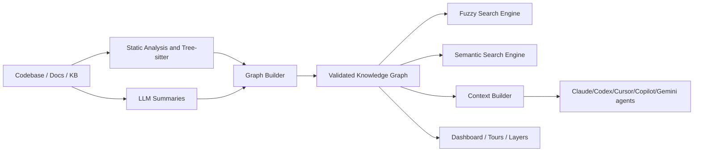

This diagram is synthesized from the README plus the visible package tree, `schema.ts`, `graph-builder.ts`, `search.ts`, `embedding-search.ts`, `llm-analyzer.ts`, and `context-builder.ts`. citeturn45view0turn24view0turn27view0turn30view0turn30view1turn30view3turn31view0turn31view3turn35view2turn37view0

**Key files and code paths**

The table below summarizes the most important paths to study if your goal is Graph RAG craftsmanship. citeturn21view0turn23view0turn26view0turn27view0turn30view0turn30view1turn30view3turn31view0turn31view3turn32view0turn34view2turn35view2turn37view0

| File path | Role | Important functions or structures | Lines to inspect |
|---|---|---|---|
| `package.json` | Monorepo entry | Declares description, workspaces, build/test scripts, and keywords including `knowledge-graph`, `tree-sitter`, `static-analysis` | ~358–458 visible |
| `understand-anything-plugin/package.json` | Skill/plugin package | Depends on `@understand-anything/core`, `graphology`, `graphology-communities-louvain` | ~280–317 visible |
| `understand-anything-plugin/packages/core/package.json` | Core parser/search package | Depends on `fuse.js`, `web-tree-sitter`, multiple tree-sitter language grammars | ~356–457 visible |
| `understand-anything-plugin/packages/core/src/schema.ts` | Explicit graph schema | `GraphNodeSchema`, `GraphEdgeSchema`, `KnowledgeGraphSchema`, validation and normalization | ~1564–2327 visible |
| `understand-anything-plugin/packages/core/src/analyzer/graph-builder.ts` | Graph construction | file/function/class node creation, contains/imports/calls edges, non-code node support | ~1090–1491 visible |
| `understand-anything-plugin/packages/core/src/search.ts` | Fuzzy retrieval | `SearchEngine`, Fuse options, typed search and result limiting | ~373–476 visible |
| `understand-anything-plugin/packages/core/src/embedding-search.ts` | Semantic retrieval | `SemanticSearchEngine`, cosine similarity | ~406–496 visible |
| `understand-anything-plugin/packages/core/src/analyzer/llm-analyzer.ts` | LLM metadata generation | file-level and project-level prompt builders, JSON parsing | ~613–904 visible |
| `understand-anything-plugin/src/context-builder.ts` | Context packaging | `buildChatContext`, one-hop expansion, markdown formatting for prompt context | ~531–785 visible |

**Graph schema and how to map it to a travel knowledge graph**

This repository is especially useful because its schema is not implicit. It is explicit and already broad enough to inspire a travel schema. citeturn30view0turn30view1turn30view3

| Observed graph construct | Observed values or fields | Travel Graph RAG translation |
|---|---|---|
| Node types | `file`, `function`, `class`, `module`, `concept`, `config`, `document`, `service`, `table`, `endpoint`, `pipeline`, `schema`, `resource`, `domain`, `flow`, `step`, `article`, `entity`, `topic`, `claim`, `source` | Replace with `City`, `Neighborhood`, `POI`, `Activity`, `TransitLeg`, `PolicyClaim`, `EvidenceChunk`, `Hotel`, `Restaurant`, `Pass`, `ItineraryDraft`, `TravelerProfile`, `WeatherScenario` |
| Node fields | `id`, `type`, `name`, optional `filePath`, optional `lineRange`, `summary`, `tags`, `complexity`, optional `languageNotes`, optional domain and knowledge meta | Keep the same structure pattern, but rename file-specific fields to `source_uri`, `evidence_span`, `geo`, `opening_hours`, `price_range`, `rating_summary`, `time_window` |
| Edge types | Structural, behavioral, data-flow, dependency, semantic, infrastructure categories; examples include `contains`, `calls`, `reads_from`, `writes_to`, `depends_on`, `related`, `serves`, `triggers` | Replace with `LOCATED_IN`, `NEAR`, `REQUIRES_PASS`, `USES_TRANSIT`, `OPEN_DURING`, `SUITABLE_FOR`, `SUPPORTED_BY_EVIDENCE`, `ALTERNATIVE_TO`, `SEQUENCE_BEFORE`, `BLOCKED_BY_WEATHER` |
| Layers | Index of coherent logical layers with `id`, `name`, `description`, `nodeIds` | Use layers like `Destination`, `Transport`, `Food`, `Family`, `Safety`, `Evidence`, `User State` |
| Tours | Ordered guided exploration steps over node ids | Use guided itinerary narratives or explanation traces |

**Retrieval, embedding, and LLM integrations**

This repo cleanly separates several retrieval methods. `search.ts` builds a Fuse index using `name`, `tags`, `summary`, and `languageNotes`, then optionally filters by node types and returns `nodeId` plus score. `embedding-search.ts` defines a separate semantic search engine over precomputed node embeddings. `context-builder.ts` shows the retrieval-to-prompt path clearly: fuzzy search for relevant nodes, one-hop expansion through connected edges, collection of relevant layers, and prompt-friendly markdown formatting. `llm-analyzer.ts` shows how file summaries and project summaries are requested from an LLM and parsed back into structured objects. citeturn31view0turn31view3turn35view2turn37view0

**Strengths, weaknesses, technical debt, security, and privacy**

Its biggest strength is that it treats graph building as a **software engineering problem** rather than as a vague RAG concept. The schema is typed. The graph is validated. Retrieval is modular. Context building is explicit. The graph builder distinguishes not just files and functions but non-code definitions, services, endpoints, resources, and pipeline steps. That discipline is exactly what you want in travel. citeturn30view3turn34view2turn37view0

The main limitation is domain fit, not architecture quality. This graph is optimized for code/knowledge exploration, not for temporal-spatial planning. Its one-hop expansion is simple and interpretable, but travel planning often needs **path search across multiple edge types**, **time-aware reachability**, and **constraint-aware subgraph extraction**. Its semantic search engine is also deliberately lightweight; in a travel system you would likely want vector indexes in a purpose-built store rather than just a `Map<string, number[]>`. citeturn31view3turn37view0

The security concern is obvious but manageable: when used with external coding agents, sensitive codebases or proprietary docs may be summarized by remote LLM providers, depending on plugin configuration. That is an architectural threat surface rather than a specific defect. The repo’s multi-plugin support makes adoption easy, but it also means you should design strong opt-in data egress rules if you borrow its plugin pattern. citeturn45view0turn35view2

**Prioritized recommendations for adapting Understand-Anything to travel**

| Recommendation | Concrete change | Effort | Risk |
|---|---|---:|---:|
| Fork the schema, not the domain | Keep the explicit node/edge validation pattern, but redefine node/edge enums for travel entities and itinerary relations | Medium | Small |
| Replace one-hop-only context assembly with constrained path expansion | Add weighted k-hop traversal, time-window filters, and top-k path extraction over `SEQUENCE_BEFORE`, `USES_TRANSIT`, `OPEN_DURING`, `NEAR` | Medium | Medium |
| Promote evidence chunks to first-class nodes | Model official pages, timetables, ticket terms, and opening-hours snippets as `EvidenceChunk` or `Source` nodes | Small | Small |
| Add freshness/versioning fields to nodes and edges | Travel facts decay quickly; add `valid_from`, `valid_to`, `last_verified_at`, and source confidence | Small | Medium |
| Add itinerary-controller modules | Reuse layers/tours to drive explainable itinerary plans and “why this recommendation?” views | Medium | Small |

### RAG-Anything

**High-level purpose and Graph RAG relevance**

RAG-Anything is a multimodal, document-centric RAG framework that describes itself as an all-in-one system for processing PDFs, Office documents, images, tables, equations, charts, and other heterogeneous formats. The README explicitly says it is built on **LightRAG**, uses **MinerU** for document parsing, and builds a **multimodal knowledge graph** to support hybrid retrieval across modalities. For travel Graph RAG, this is the best reference when you care about ingesting supplier brochures, brochures, museum PDFs, transit maps, schedules, menus, or scanned travel rules into a structured retrieval pipeline. citeturn39view0turn40view0turn40view1turn40view3turn40view4

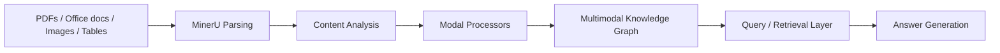

This diagram is synthesized from the README’s architecture description and the visible module layout under `raganything/`. citeturn39view0turn38view0turn40view0

**Key files and code paths**

I could confirm the module layout clearly from the repository tree, but I did not open enough of each internal file to claim line-specific behavior for every module. Where that is the case, I mark the lines as unspecified. citeturn38view0turn39view0turn40view0

| File path | Role | Important functions or structures | Lines to inspect |
|---|---|---|---|
| `pyproject.toml` | Package/dependency manifest | `lightrag-hku<1.5`, `mineru[core]`, optional image/text/paddleocr/markdown extras | ~407–557 visible |
| `requirements.txt` | Minimal install surface | `huggingface_hub`, `lightrag-hku`, `mineru[core]`, `tqdm` | fully visible |
| `raganything/raganything.py` | Main orchestration entrypoint | End-to-end runtime entry; internal lines not deeply inspected here | Unspecified in current excerpt |
| `raganything/query.py` | Retrieval/query layer | Query-time orchestration; internal lines not deeply inspected here | Unspecified in current excerpt |
| `raganything/parser.py` | Parsing stage | Document parsing path; internal lines not deeply inspected here | Unspecified in current excerpt |
| `raganything/processor.py` | Processing pipeline | Post-parse processing; internal lines not deeply inspected here | Unspecified in current excerpt |
| `raganything/modalprocessors.py` | Modality-aware handlers | Image/table/equation/etc. processors; internal lines not deeply inspected here | Unspecified in current excerpt |

**Observed data model and travel graph translation**

The README, rather than the opened code slices, provides the clearest view of the conceptual schema. citeturn39view0

| Observed conceptual entity | README evidence | Travel-graph translation |
|---|---|---|
| Multimodal elements | Text, images, tables, equations, charts, multimedia | Official guide pages, venue images, transit tables, fare matrices, route maps |
| Cross-modal relationships | “Cross-modal relationship mapping” and preserved document hierarchy | `HAS_IMAGE`, `HAS_TIMETABLE`, `MAPS_TO_AREA`, `POLICY_SUPPORTED_BY`, `MENU_OF`, `SCHEDULE_FOR` |
| Hierarchical structure | README mentions preserved hierarchy and `belongs_to` chains | `Country -> City -> District -> Venue -> Room/Attraction`, plus document section nesting |
| Weighted relevance | Weighted relationship scoring | Edge weights for trust, freshness, spatial proximity, and itinerary utility |

**Retrieval, embeddings, and LLM integrations**

The concrete package metadata matters here more than the partially inspected source. `pyproject.toml` declares **LightRAG**, **MinerU**, and **huggingface_hub** as dependencies, with optional OCR, markdown rendering, and media support via `paddleocr`, `pypdfium2`, `Pillow`, `reportlab`, `weasyprint`, and `pygments`. The README frames retrieval as “hybrid intelligent retrieval” over a multimodal knowledge graph rather than as plain text chunking. citeturn40view0turn40view1turn40view3turn40view4turn39view0

**Strengths, weaknesses, technical debt, security, and privacy**

Its biggest strength is breadth. If your travel product needs to ingest mixed media at scale, this repo is far more relevant than a text-only RAG tutorial. It is also philosophically aligned with real travel data, which often arrives as PDFs, screenshots, price sheets, timetables, brochures, posters, and scanned notices rather than clean API objects. citeturn39view0turn40view0

Its weakness is that it is more of a **document understanding framework** than a finished travel planner substrate. The README tells you a lot about multimodal parsing and multimodal graph indexing, but less about user-state graphs, temporal constraint solving, or deterministic plan validation. In a travel system, that means you should borrow it primarily for **ingestion and evidence graph construction**, not as your sole retrieval-and-planning engine. citeturn39view0

The privacy risk is substantial in deployment terms: travel documents may contain passports, reservation IDs, family details, or payment-adjacent information. Any multimodal processing pipeline needs strict retention policies and a preference for local or tightly controlled processing when feasible. That is an inference from the problem class, not a claim the repo itself makes. The package’s optional OCR and image tooling simply make this risk more relevant in practice. citeturn40view0turn40view3

**Prioritized recommendations for adapting RAG-Anything to travel**

| Recommendation | Concrete change | Effort | Risk |
|---|---|---:|---:|
| Use it as your ingestion subsystem, not your entire stack | Route PDFs, schedules, maps, menus, brochures, and rules through it; write extracted entities into your travel graph | Large | Medium |
| Make evidence chunks explicit and citable | Preserve section ids, page numbers, OCR confidence, and element bounding boxes on ingest | Medium | Medium |
| Add travel-specific modality processors | Specialize parsers for timetables, ticket matrices, opening-hours tables, route maps, and floor maps | Medium | Medium |
| Separate document graph from planning graph | Keep a document/evidence graph distinct from the user itinerary graph, then bridge them through citations | Medium | Small |
| Add evaluation suites for OCR and table extraction | Regression-test extraction of time tables, operating windows, and rates | Medium | Small |

### bydecom/graphrag-code

**High-level purpose and Graph RAG relevance**

GraphRAG-Code is a code retrieval engine centered on a **bidirectional Personalized PageRank** approach over a directed AST-derived graph. Its README explicitly states that it ranks structurally related code, extracts exact source blocks rather than only metadata, stores an index in SQLite, loads an in-memory graph with `rustworkx`, exposes the system through FastMCP, and supports two query modes using a tunable `backward_weight` to trade off downstream dependency context against upstream blast-radius. That is a very strong retrieval idea for travel too. citeturn42view0

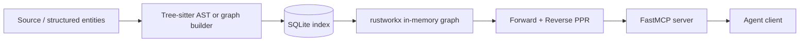

The diagram is directly synthesized from the README’s own embedded architecture sketch and surrounding explanation. citeturn42view0

**Key files and code paths**

The root README exposes a healthy retrieval research layout even without drilling into every source file. citeturn42view0

| File path | Role | Important functions or structures | Lines to inspect |
|---|---|---|---|
| `src/graphrag_code` | Main implementation | Core graph build and ranking logic | Unspecified in current excerpt |
| `eval/cases` | Retrieval evaluation cases | Benchmark inputs and expected structural retrieval behavior | Unspecified in current excerpt |
| `eval_retrieval.py` | Retrieval evaluation runner | Likely benchmark harness for structural QA | Unspecified in current excerpt |
| `benchmark_suite.py` | Overall benchmark driver | Reproducible benchmark path | Unspecified in current excerpt |
| `ablation_runner.py` | Ablation experiments | Compare retrieval variants and parameters | Unspecified in current excerpt |
| `integration` | MCP or client integration | End-to-end usage from agents | Unspecified in current excerpt |
| `docs/RESEARCH.md` | Methodology and threats to validity | Retrieval research framing | Referenced from README |

**Graph schema and travel-graph translation**

The repo is code-oriented, but the retrieval ideas transfer extremely well. citeturn42view0

| Code-graph concept | Travel-graph analog |
|---|---|
| File / AST node | POI, route, ticket rule, supplier, or itinerary step |
| Forward PPR over dependencies | “What does this itinerary step require downstream?” |
| Reverse PPR over reverse graph | “What upstream traveler preferences or constraints most affect this outcome?” |
| Exact source block extraction | Exact evidence chunk extraction from travel docs or official pages |
| Tunable backward weight | Tunable balance between destination-centric and user-centric retrieval |

**Retrieval, embeddings, and LLM integrations**

The repo’s visible description highlights **Tree-sitter AST parsing**, **SQLite indexing**, **rustworkx graph execution**, and **FastMCP** exposure. It is notable that the headline method is graph ranking, not embeddings. That is precisely why it is valuable to you: it can teach your travel system how to retrieve “what matters because of structure,” not merely “what sounds semantically similar.” citeturn42view0

**Strengths, weaknesses, technical debt, security, and privacy**

Its strongest contribution is methodological discipline. This repo explicitly separates core retrieval, examples, integration, tests, evaluation cases, and ablations. It also makes an honest benchmarking claim centered on structural retrieval rather than vague “better answers.” That mindset is worth copying. citeturn42view0

Its main weakness for travel is that it is still **code topology first**. You will need to redesign the node and edge semantics for temporal-spatial domains, and you will probably need freshness-aware weights and multimodal evidence nodes on top of the graph core. citeturn42view0

**Prioritized recommendations for adapting GraphRAG-Code ideas to travel**

| Recommendation | Concrete change | Effort | Risk |
|---|---|---:|---:|
| Reuse bidirectional PPR as a travel re-ranker | Run forward PPR from candidate itinerary steps and reverse PPR from traveler constraints, then merge scores | Medium | Medium |
| Preserve exact-evidence extraction | Return top-ranked evidence chunks, not only top-ranked entities | Small | Small |
| Add freshness and temporal weights | Weight edges by recency, live availability, schedule confidence, and seasonal relevance | Medium | Medium |
| Benchmark structure-aware retrieval explicitly | Build eval sets around “find the trip impact of this closure/weather/pass rule” | Medium | Small |
| Keep MCP exposure | Expose retrieval tools to planner/orchestrator agents through a clean tool protocol | Small | Small |

### bydecom/medical-citation-agent

**High-level purpose and Graph RAG relevance**

Medical Citation Agent is a deterministic-first MCP tool for extracting cited medical claims from FDA drug labels. The README describes a pipeline over OpenFDA JSON using a sentence splitter with line indexing, regex pattern matching, `scispacy` NER, a safety guardrail, and an MCP server, with no LLM in the extraction path. In a travel product, this is not about medicine; it is about **citation fidelity**. This repo is your best reference for a subsystem that turns source text into **verifiable claims with exact evidence spans**. citeturn42view1

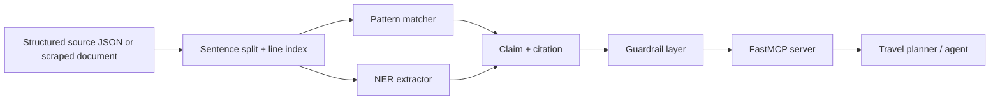

This diagram is a direct adaptation of the README’s visible architecture and its explicit two-layer safety framing. citeturn42view1

**Key paths, schema mapping, and travel reuse**

The visible README is the primary source available in the current inspection slice. Runtime source paths were not individually opened, so those specifics remain unspecified here. citeturn42view1

| Concern | Observed design | Travel Graph RAG adaptation |
|---|---|---|
| Input | OpenFDA label JSON | Official tourism pages, visa pages, operator fare rules, museum policies, opening-hours bulletins |
| Evidence indexing | Document id + start line + raw text | `source_uri`, `document_id`, `section_id`, `line_span`, `snapshot_hash`, `raw_text` |
| Extraction | Regex + NER, deterministic-first | Pattern and parser layer for rules like refund windows, age limits, closure notices, ticket exclusions |
| Graph role | Graph optional, not foundational for cite-extract | Keep your citation layer document-first, then attach claims to graph nodes and itinerary steps |
| LLM posture | No LLM in critical extraction path | Same for travel facts with legal or operational consequences |

**Strengths, weaknesses, technical debt, security, and privacy**

Its strength is narrowness. It knows exactly what it is optimizing for: extracting claims with exact citations. That is the correct posture for high-stakes travel subdomains too, such as visa rules, refund clauses, closure notices, ferry schedules, or pass terms. citeturn42view1

Its weakness is also its narrowness. It is not a planner, and it is not a multi-hop graph reasoner. You should pair a subsystem like this with graph retrieval and itinerary optimization, not confuse it for a full assistant. citeturn42view1

**Prioritized recommendations for adapting Medical Citation Agent ideas to travel**

| Recommendation | Concrete change | Effort | Risk |
|---|---|---:|---:|
| Build a travel-policy citation service | Parse official travel policy pages into exact evidence chunks and claim objects | Medium | Small |
| Add rule templates by content type | Separate extractors for visas, opening hours, rail terms, attraction passes, and closure notices | Medium | Small |
| Require citations on all hard constraints | Any itinerary blocker should cite evidence; soft suggestions can remain uncited | Small | Small |
| Add citation regression tests | Ensure updates to parsers do not silently shift evidence spans | Small | Small |
| Keep planning and extraction separate | Planner consumes cited claims; extractor never fabricates them | Small | Small |

## Supporting repository and dataset analyses

### bydecom/conversational-state-machine

This repo implements enterprise dialog patterns such as **context switching**, **slot filling**, **interruption policies**, and a **hold/resume task queue**. The README example shows one task being paused while another runs, then resumed from the correct slot afterward. That is exactly what a travel planner needs when a user moves from “plan Kyoto day one” to “actually, check flights first” and then returns to the local plan without losing state. The top-level tree shows `backend`, `frontend`, `docs`, and `package.json`, but the internal runtime code paths were not opened in detail here. citeturn43view0

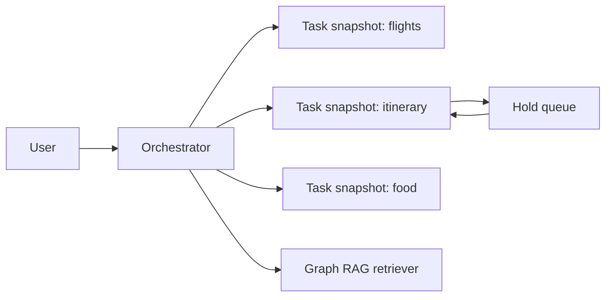

| Practical takeaway | Travel adaptation | Effort | Risk |
|---|---|---:|---:|
| Serializable task snapshots | Store each itinerary sub-problem as resumable state | Medium | Small |
| Hold/resume queue | Let users interrupt one trip-planning thread with another | Medium | Small |
| Slot filling | Make budget, city, dates, mobility, children, and cuisine explicit slots | Small | Small |
| Policy-driven interruptions | Decide whether to pause, reject, merge, or branch tasks | Medium | Medium |

### bydecom/e-commerce-project

This monorepo is not a Graph RAG system, but it is a strong **productionization reference**. The README exposes a backend on Express 5 and TypeScript, an Angular frontend, RabbitMQ, Redis, S3-compatible storage, Prisma with PostgreSQL/Neon, and—most relevant to you—**Google Gemini** and **Qdrant vector search**. It also documents production services such as PM2 on EC2, CloudFront, serverless Redis, and message brokers. If your travel Graph RAG is headed toward production, this repo shows how vector features fit into a broader ops stack. citeturn42view2

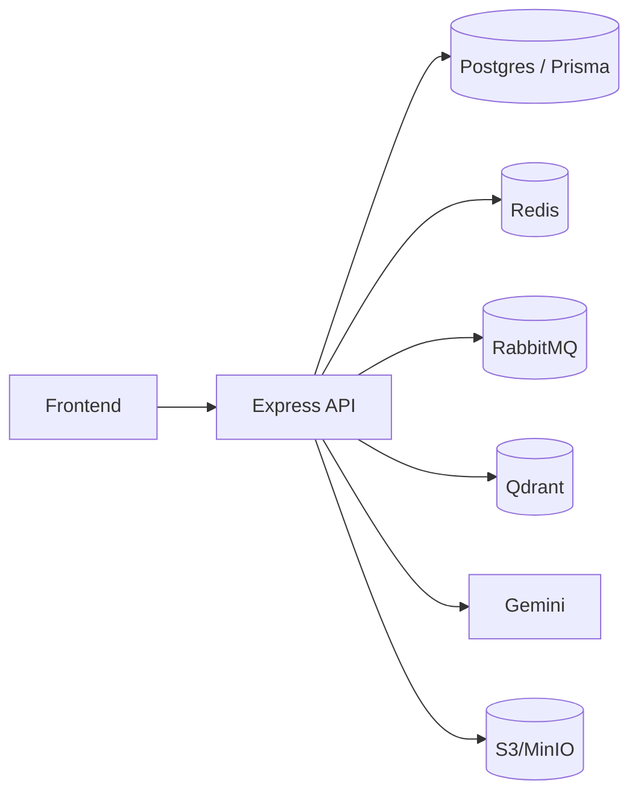

| Practical takeaway | Travel adaptation | Effort | Risk |
|---|---|---:|---:|
| Qdrant already normalized in stack | Use Qdrant for embeddings over evidence chunks and POI summaries | Small | Small |
| Queue-driven background jobs | Async refresh of schedules, weather enrichments, and source recrawls | Medium | Small |
| Redis for transient state | Cache route lookups and short-lived itinerary plans | Small | Small |
| Production infra patterns | Reuse CI/CD and cloud hardening patterns around your Graph RAG services | Medium | Medium |

### microsoft/ai-agents-for-beginners

This repository is best treated as **curriculum**, not implementation. Its visible lesson tree includes planning and design, multi-agent systems, metacognition, production, agentic protocols, context engineering, agent memory, Microsoft agent frameworks, browser use, and security. For a team building travel Graph RAG, this is valuable because it frames the disciplines you need around retrieval, not just the code itself. citeturn44view2

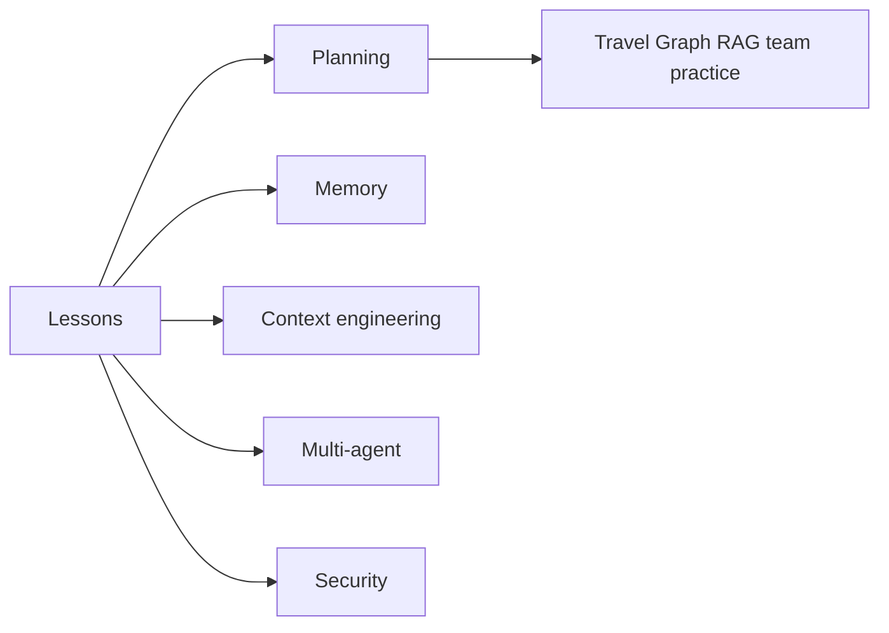

| Practical takeaway | Travel adaptation | Effort | Risk |
|---|---|---:|---:|
| Planning lessons | Train your planner/orchestrator design | Small | Small |
| Context engineering lessons | Improve evidence packaging and prompt windows | Small | Small |
| Agent memory lessons | Help define user-state and session memory policies | Small | Small |
| Security lessons | Bring in prompt-injection and tool-permission discipline early | Small | Small |

### Shubhamsaboo/awesome-llm-apps

This repo is a vast **pattern library** of runnable AI agent and RAG projects. The visible tree includes `advanced_ai_agents`, `advanced_llm_apps`, `mcp_ai_agents`, `rag_tutorials`, `starter_ai_agents`, `voice_ai_agents`, and `awesome_agent_skills`. That makes it useful as a scouting ground for examples, but not as a coherent architecture in itself. citeturn44view0

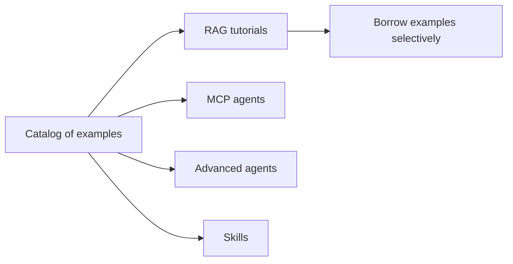

| Practical takeaway | Travel adaptation | Effort | Risk |
|---|---|---:|---:|
| Use as example bank | Borrow isolated patterns, not whole-system architecture | Small | Small |
| Mine RAG tutorials | Compare chunking, eval, retrievers, and agents | Small | Small |
| Mine MCP examples | Expose travel retrievers and validators as tools | Small | Small |
| Do not overfit to heterogeneity | Keep your own architecture opinionated | Small | Medium |

### x1xhlol/system-prompts-and-models-of-ai-tools

This repository is a **comparative archive**, not an implementation. The visible tree shows folders for many AI tools and assistants, including Cursor, Anthropic, Augment Code, Devin AI, Junie, Kiro, Perplexity, Replit, Windsurf, and others. For Graph RAG work, its best use is to study how tool ecosystems shape prompts and internal tool taxonomies—not to use it as a primary code reference. citeturn44view1

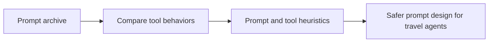

| Practical takeaway | Travel adaptation | Effort | Risk |
|---|---|---:|---:|
| Use for prompt comparisons | Study tool instruction patterns for retrieval, planning, and safety | Small | Medium |
| Do not treat as canonical truth | Provenance and legal posture vary by folder | Small | Medium |
| Extract only stable design ideas | For example tool-choice patterns and response framing | Small | Small |

### titanwings/colleague-skill

The visible tree shows a repo organized around `prompts`, `references`, `skills/colleague`, `tests`, and `tools`, which makes it a decent reference for **skills-as-packaged-units** and **prompt/test organization**, even though it is not a Graph RAG codebase. Because internal runtime files were not deeply opened, I would treat this repo primarily as a **packaging pattern**. citeturn43view1

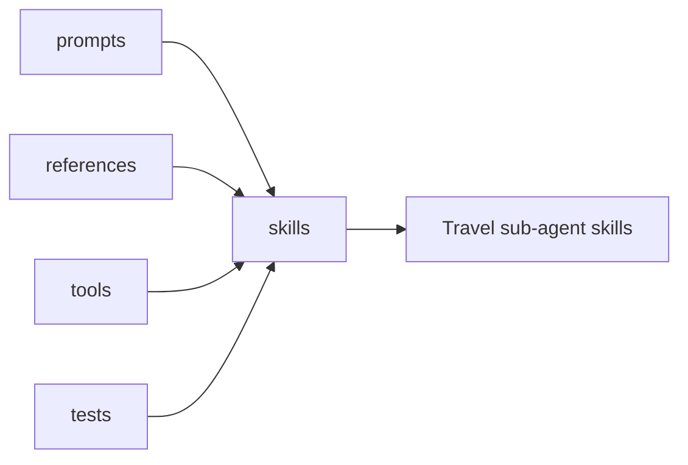

| Practical takeaway | Travel adaptation | Effort | Risk |
|---|---|---:|---:|
| Skill foldering | Package itinerary, dining, route repair, family-mode, and accessibility skills separately | Small | Small |
| Keep references alongside prompts | Attach trusted examples and instruction notes to each travel skill | Small | Small |
| Add tests per skill | Regression-test prompt behavior and tool invocation patterns | Small | Small |

### BloopAI/vibe-kanban

Vibe Kanban is explicitly about **planning and review around coding agents**. The README describes kanban issues, workspaces, diff review, browser preview, and the ability to switch among many coding agents. It is also a large Rust-plus-Node monorepo and notes that the product is sunsetting. This is not a Graph RAG implementation, but it is very relevant if your engineering team wants strong **human-in-the-loop workflow** around AI-generated itinerary logic or retrieval changes. citeturn45view1

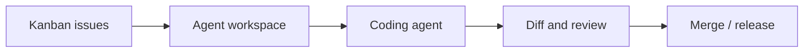

| Practical takeaway | Travel adaptation | Effort | Risk |
|---|---|---:|---:|
| Workflow discipline | Put retrieval changes, schema changes, and evaluation failures on boards with review gates | Small | Small |
| Fast workspace model | Spin up isolated eval sandboxes for graph/ranker iterations | Medium | Small |
| Sunset warning | Use ideas, not the product lifecycle as a dependency | Small | Small |

### bydecom/container-bay-plan-validator

This is one of the most transferable supporting repos because it demonstrates a **deterministic validator architecture** very clearly. The README shows a modular split between `main.py`, `file_reader.py`, `bay_object.py`, `validator.py`, `visualizer.py`, `UI_Components`, and `pdf_module.py`, with Pandas-based data handling and a rules engine independent of the parser and UI. Your travel Graph RAG should absolutely borrow this separation. citeturn42view3


| Practical takeaway | Travel adaptation | Effort | Risk |
|---|---|---:|---:|
| Parser-state-validator separation | Keep travel extraction, itinerary state, and hard validation in separate modules | Medium | Small |
| Deterministic rule engine | Validate time windows, budgets, walking limits, transit feasibility, and age constraints outside the LLM | Medium | Small |
| Matrix/constraint mindset | Think of itineraries as constrained schedules, not prose blobs | Small | Small |

### nvidia/Nemotron-Personas-Vietnam dataset

The visible Hugging Face viewer shows a **100k-row train split** with fields including `travel_persona`, `professional_persona`, `sports_persona`, `arts_persona`, `culinary_persona`, `persona`, `cultural_background`, `skills_and_expertise`, `hobbies_and_interests`, demographic fields like `sex`, `age`, `marital_status`, `education_level`, `occupation`, and region fields. This is extremely useful for **personalization prompts**, **simulation**, and **evaluation personas** in a Vietnamese travel assistant. The visible excerpt does not fully expose licensing, generation method, or intended-use caveats, so those remain unspecified here. citeturn43view3

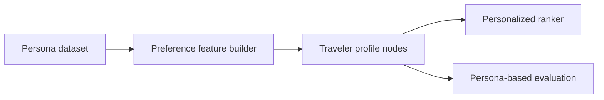

| Practical takeaway | Travel adaptation | Effort | Risk |
|---|---|---:|---:|
| Use `travel_persona` and related fields for simulations | Generate benchmark travelers with distinct preference profiles | Small | Small |
| Turn rows into profile nodes | Create `TravelerProfile` nodes with tastes, budget sensitivity, activity preferences, and family context | Medium | Medium |
| Use for offline evaluation, not blind personalization | Validate recommendation diversity and plan suitability across personas | Small | Small |
| Watch stereotype amplification | Treat persona fields as priors to test against, not as destiny | Small | Medium |

## Travel Graph RAG blueprint

The composite architecture below is the clearest “best of this corpus” design for your use case. It is a true Graph RAG system because the graph is a first-class substrate, but it also respects multimodality, evidence citation, deterministic validation, and conversation state. The design directly combines the strongest ideas from **Understand-Anything**, **GraphRAG-Code**, **RAG-Anything**, **Toonflow**, **Medical Citation Agent**, **Conversational State Machine**, **Container Bay Plan Validator**, and the persona dataset. citeturn45view0turn42view0turn39view0turn44view3turn42view1turn43view0turn42view3turn43view3

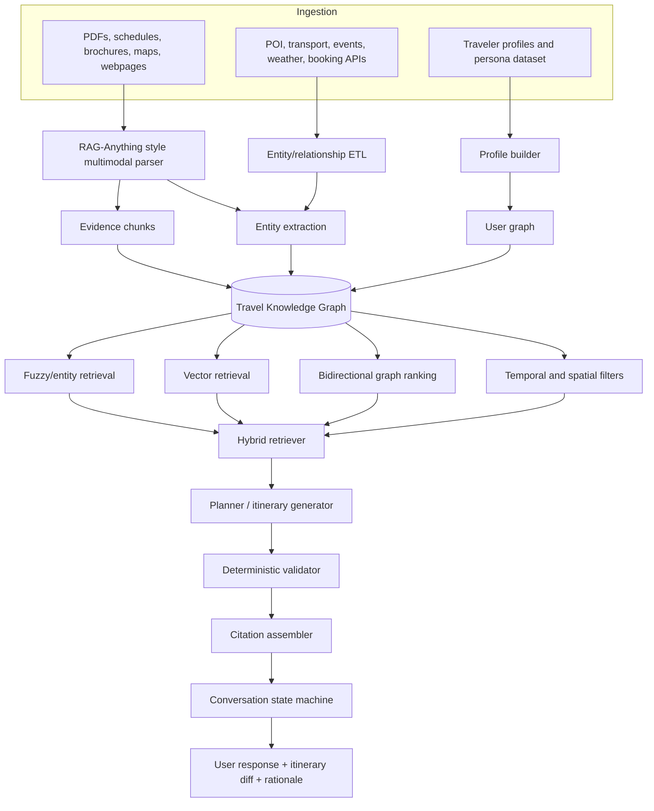

### Recommended travel graph schema

A travel graph should be explicit in the same way Understand-Anything is explicit. That means enumerated node and edge types, not vague JSON dumps. The following schema is the practical minimum:

| Node type | Core attributes | Representative edges |
|---|---|---|
| `City`, `District`, `Area` | geo, timezone, tags | `CONTAINS`, `NEAR`, `CONNECTED_TO` |
| `POI`, `Venue`, `Restaurant`, `Hotel` | geo, hours, price, family-friendliness, accessibility, source refs | `LOCATED_IN`, `OPEN_DURING`, `SUITABLE_FOR`, `ALTERNATIVE_TO` |
| `Activity` | duration, intensity, indoors/outdoors, age fit | `AT_VENUE`, `REQUIRES_PASS`, `BLOCKED_BY_WEATHER` |
| `TransitLeg`, `RoutePattern` | duration, cost, operator, frequency | `FROM`, `TO`, `RUNS_DURING`, `USED_BY` |
| `PolicyClaim`, `EvidenceChunk`, `Source` | source uri, snapshot hash, line span, confidence, freshness | `SUPPORTED_BY`, `CITED_FROM`, `OVERRIDES`, `VALID_UNTIL` |
| `TravelerProfile`, `Preference`, `Constraint` | budget, pace, dietary rules, children, mobility, language | `PREFERS`, `AVOIDS`, `CONSTRAINS`, `MATCHES` |
| `ItineraryDraft`, `DayPlan`, `ItineraryStep` | day index, sequence, slack, total walk, total cost | `HAS_STEP`, `SEQUENCE_BEFORE`, `USES_TRANSIT`, `USES_EVIDENCE` |

### Hybrid retriever pseudocode

This design is inspired by Toonflow’s layered memory, Understand-Anything’s fuzzy search and one-hop expansion, GraphRAG-Code’s bidirectional PPR, and Medical Citation Agent’s evidence discipline. citeturn20view1turn20view2turn31view0turn37view0turn42view0turn42view1

```python
def hybrid_retrieve(query, user_state, graph, vector_index, k=20):
    # 1. Parse query into entities, constraints, and intent
    parsed = parse_query(query, user_state)

    # 2. Candidate generation
    lexical_hits = fuzzy_search_nodes(
        graph,
        text=query,
        allowed_types=["City", "Area", "POI", "Activity", "TransitLeg", "PolicyClaim"]
    )
    semantic_hits = vector_index.search(
        text=query,
        filters={"fresh": True},
        top_k=5 * k
    )
    profile_hits = retrieve_profile_memories(user_state, graph)
    evidence_hits = retrieve_recent_high_trust_evidence(graph, parsed)

    # 3. Anchor set
    anchors = union_top_ids(lexical_hits, semantic_hits, profile_hits, evidence_hits)

    # 4. Graph expansion
    subgraph = expand_k_hops(
        graph,
        anchors=anchors,
        max_hops=2,
        allowed_edges=[
            "LOCATED_IN", "NEAR", "USES_TRANSIT", "REQUIRES_PASS",
            "SUPPORTED_BY", "OPEN_DURING", "SUITABLE_FOR",
            "SEQUENCE_BEFORE", "BLOCKED_BY_WEATHER"
        ]
    )

    # 5. Graph-native ranking
    forward_scores = personalized_pagerank(subgraph, seeds=anchors, direction="forward")
    backward_scores = personalized_pagerank(
        reverse_graph(subgraph),
        seeds=constraint_seed_nodes(parsed, user_state),
        direction="reverse"
    )

    # 6. Score fusion
    scores = {}
    for node in subgraph.nodes:
        scores[node.id] = (
            0.25 * lexical_score(node.id, lexical_hits) +
            0.25 * semantic_score(node.id, semantic_hits) +
            0.30 * forward_scores.get(node.id, 0.0) +
            0.20 * backward_scores.get(node.id, 0.0)
        )

    # 7. Deterministic pruning
    feasible = [
        node for node in subgraph.nodes
        if passes_time_filters(node, parsed)
        and passes_budget_filters(node, user_state)
        and passes_age_or_accessibility_filters(node, user_state)
    ]

    # 8. Return ranked entities + supporting evidence
    ranked = sort_desc(feasible, key=lambda n: scores[n.id])[:k]
    evidence = collect_supporting_evidence(graph, ranked)
    return ranked, evidence
```

### Planner pseudocode

The planner should be stateful and interruptible, borrowing the task-snapshot idea from Conversational State Machine. citeturn43view0

```python
def generate_itinerary(goal, user_state, travel_graph):
    snapshot = load_or_start_task(user_state.session_id, task_type="itinerary")

    ranked_nodes, evidence = hybrid_retrieve(goal, user_state, travel_graph, vector_index)
    day_slots = build_time_buckets(user_state.trip_dates, user_state.daily_start, user_state.daily_end)

    draft = []
    for day in day_slots:
        candidates = filter_by_day_feasibility(ranked_nodes, day, user_state)
        route = solve_day_route(
            candidates=candidates,
            start_location=user_state.hotel_or_anchor,
            objective_weights={
                "preference_match": 0.35,
                "travel_efficiency": 0.25,
                "freshness": 0.10,
                "cost_fit": 0.15,
                "weather_robustness": 0.15
            }
        )
        draft.append(route)

    validated = validate_itinerary(draft, user_state, travel_graph)
    cited = attach_citations(validated, evidence, travel_graph)

    save_task_snapshot(snapshot, cited)
    return cited
```

### Validator pseudocode

The validator should look much more like Container Bay Plan Validator than like a prompt. It should be deterministic, modular, and composable. citeturn42view3

```python
def validate_itinerary(draft, user_state, graph):
    errors = []
    warnings = []

    for day in draft:
        if total_cost(day) > user_state.budget_per_day:
            errors.append(("budget_exceeded", day.id))

        if total_walk_minutes(day) > user_state.max_walk_minutes:
            warnings.append(("walk_high", day.id))

        for step in day.steps:
            if not venue_open(step.venue, step.start_time, graph):
                errors.append(("closed_venue", step.id))

            if conflicts_with_weather(step, user_state.weather_forecast, graph):
                warnings.append(("weather_conflict", step.id))

            if not transit_connection_feasible(step.prev, step, graph):
                errors.append(("transfer_infeasible", step.id))

            if not policy_constraints_hold(step, user_state, graph):
                errors.append(("policy_constraint", step.id))

    return {
        "ok": len(errors) == 0,
        "errors": errors,
        "warnings": warnings,
        "draft": draft
    }
```

### Evaluation design and metrics

A travel Graph RAG should be evaluated on four layers, not one. This is where the research-minded repos are especially helpful: **GraphRAG-Code** for retrieval benchmarks, **Medical Citation Agent** for grounding fidelity, and **Container Bay Plan Validator** for rule correctness. citeturn42view0turn42view1turn42view3

| Layer | Metric | What “good” looks like |
|---|---|---|
| Entity retrieval | Recall@k, MRR, path coverage | Correct POIs, routes, passes, and policy nodes appear near top |
| Evidence grounding | Citation precision, evidence-span exactness, unsupported-claim rate | Every hard planner claim is backed by evidence chunks |
| Planning quality | Feasibility rate, transfer-validity rate, budget-validity rate, opening-hours validity | Recommended day plans survive deterministic validation |
| Personalization | Persona-match score, diversity score, satisfaction proxy | Different profiles get meaningfully different but still feasible plans |

A practical evaluation harness should include **gold subgraphs**, **gold evidence chunks**, and **gold day plans** for at least a few dozen destinations. Start small but formal. The critical thing is not the size of the benchmark on day one; it is that retrieval, grounding, and validation are measured separately instead of being blended into one subjective score. citeturn42view0turn42view1

### Prioritized implementation roadmap

| Phase | What to build | Main inspirations | Effort | Risk |
|---|---|---|---:|---:|
| Foundation | Typed travel graph schema, graph store, evidence-chunk model | Understand-Anything, Medical Citation Agent | Medium | Small |
| Ingestion | Multimodal ETL for PDFs, brochures, menus, maps, schedules | RAG-Anything | Large | Medium |
| Retrieval | Hybrid retriever with fuzzy + vector + bidirectional graph ranking | Understand-Anything, GraphRAG-Code, Toonflow | Large | Medium |
| Orchestration | Stateful planner with task snapshots and slot-filling | Conversational State Machine, Toonflow | Medium | Medium |
| Validation | Deterministic itinerary validator and repair loop | Container Bay Plan Validator, Medical Citation Agent | Medium | Small |
| Production | Queueing, caching, vector infra, cloud rollout, CI/CD | E-Commerce Platform, Vibe Kanban | Medium | Medium |
| Personalization | Persona-driven ranking and offline simulation harness | Nemotron-Personas-Vietnam | Medium | Medium |

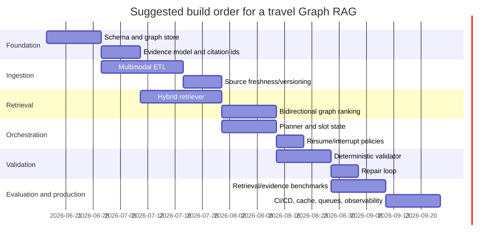

### Final recommendations

If you want the shortest possible answer to “what should I copy first,” it is this. Copy **schema rigor** from Understand-Anything, **ranking strategy** from GraphRAG-Code, **memory layering** from Toonflow, **document ingestion** from RAG-Anything, **evidence discipline** from Medical Citation Agent, **state orchestration** from Conversational State Machine, and **hard validation** from Container Bay Plan Validator. Use the E-Commerce repo for production patterns, the dataset for benchmarking personalization, and the other repos mostly as reference libraries rather than as core architectural foundations. citeturn45view0turn42view0turn44view3turn39view0turn42view1turn43view0turn42view3turn42view2turn43view3

If you are just getting started with Graph RAG, the single most important mental model from this corpus is this: **the graph explains structure, the vectors explain similarity, the citations explain truth, and the validator explains feasibility**. A travel planner needs all four. citeturn30view3turn42view0turn42view1turn42view3