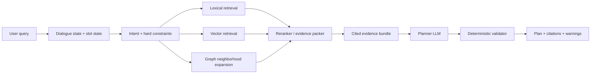
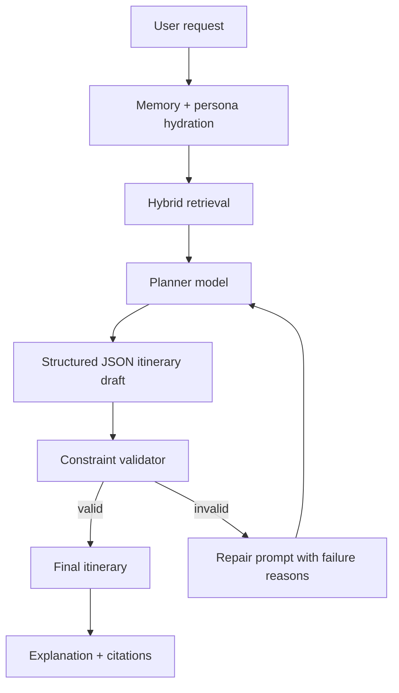
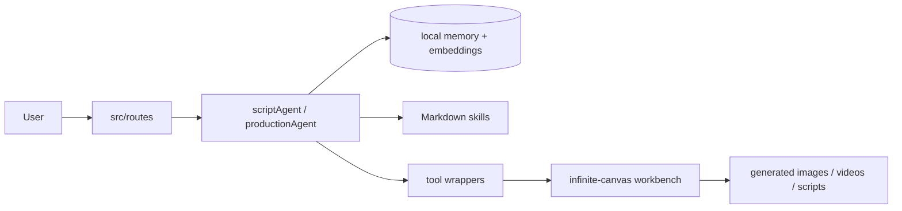
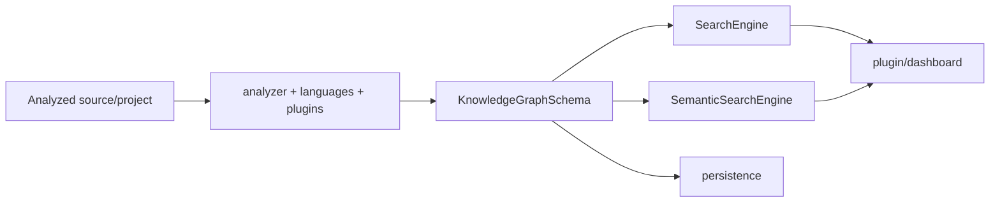

# Lessons from Open Repositories for a Graph RAG Travel Itinerary Planner

## Executive Summary

Across the repositories you provided, the strongest design pattern for a travel itinerary Graph RAG system is **not** “just add a knowledge graph.” The winning pattern is a layered system where **dialogue state**, **typed graph retrieval**, **multimodal ingestion**, **deterministic validation**, and **operational reliability** are kept separate and then stitched together with a planner. The clearest exemplars are: **Toonflow-app** for multi-agent orchestration, local memory, skill-file externalization, and graph-shaped production workflows; **Understand-Anything** for typed knowledge-graph schemas plus lexical and semantic retrieval; **RAG-Anything** for multimodal parsing and LightRAG-backed hybrid retrieval; **conversational-state-machine** for slot filling, interruption handling, and hold/resume; **graphrag-code** for graph traversal and structural ranking; **medical-citation-agent** for deterministic citation-first grounding; and **e-commerce-project** for production engineering, CI/CD, queues, caches, and zero-downtime concerns. citeturn29view0turn35view4turn36view0turn39view0turn40view1turn41view0turn43view1turn43view2turn20view0turn25view0turn27view0turn45view1turn45view2turn45view3turn46view0

For a travel planner specifically, the most reusable ideas are these. From **Toonflow-app**, copy the separation between a decision agent, sub-agents, memory, tools, and editable skill files. From **Understand-Anything**, copy the idea that a graph should be explicitly typed and queryable by both lexical and semantic search. From **RAG-Anything**, copy the ingestion layer for PDFs, tables, images, and mixed-content travel collateral. From **conversational-state-machine**, copy the explicit runtime for slot filling and context switching. From **container-bay-plan-validator** and **medical-citation-agent**, copy the principle that hard constraints and factual citations should be enforced by deterministic code, not by the LLM. From **Nemotron-Personas-Vietnam**, copy the persona-conditioning pattern for Vietnamese users, especially the structured travel and hobby fields. citeturn29view1turn39view1turn40view2turn43view2turn20view3turn27view0turn45view1turn45view3turn46view1turn46view2

My highest-confidence recommendation is to build your MVP around this stack: **typed travel graph + vector store + citation store + state machine + deterministic validator + one planner model**. If you try to make a single agent do retrieval, planning, grounding, compliance with opening hours, weather, budget, and conversational memory all at once, you will reproduce the exact failure modes these repos are trying to avoid. citeturn29view1turn39view4turn43view2turn27view2turn45view1turn45view3turn46view1

A compact mapping from repo to travel-planner lesson is below.

| Travel-planner need | Best source repo | What to reuse |
|---|---|---|
| Multi-agent orchestration with editable instructions | `HBAI-Ltd/Toonflow-app` | Decision/execution split, Markdown skill files, local memory, route/tool architecture citeturn29view1turn35view4turn36view2turn40view1 |
| Typed Graph RAG schema | `Egonex-AI/Understand-Anything` | `KnowledgeGraphSchema`, lexical search, semantic search, layered graph/tour structure citeturn41view0turn42view0turn43view1turn43view2 |
| Multimodal ingestion | `HKUDS/RAG-Anything` | content-list interface, parser options, LightRAG integration, VLM-assisted query expansion citeturn20view1turn20view3turn25view0turn27view2 |
| Dialogue runtime | `bydecom/conversational-state-machine` | slot filling, interruption policy, hold/resume queue, backend/frontend split citeturn45view1turn47view0 |
| Graph traversal relevance | `bydecom/graphrag-code` | bidirectional PPR over graph, AST-style structure traversal, MCP exposure pattern citeturn45view2turn48view0 |
| Deterministic evidence grounding | `bydecom/medical-citation-agent` | regex/NER extraction, MCP interface, exact citation discipline, tests-first mindset citeturn45view3turn48view1 |
| Production robustness | `bydecom/e-commerce-project` | monorepo ops, queues, Redis, Docker Compose, workflows, rollback mentality citeturn46view0 |
| Deterministic hard-constraint validation | `bydecom/container-bay-plan-validator` | rule engine separated from LLM, matrix-style feasibility checks citeturn46view1 |
| Persona-driven Vietnamese personalization | `nvidia/Nemotron-Personas-Vietnam` | structured persona fields including travel interests and demographics citeturn46view2 |

## Target Architecture for a Travel Graph RAG System

A travel itinerary planner should treat the world as both a **graph** and a **schedule**. The graph captures entities and relationships. The schedule captures time, ordering, feasibility, and conflicts.

```mermaid
erDiagram
    USER ||--o{ TRIP : owns
    USER ||--o{ PERSONA_PROFILE : has
    TRIP ||--o{ DAY_PLAN : contains
    DAY_PLAN ||--o{ TIME_SLOT : allocates
    CITY ||--o{ ATTRACTION : contains
    CITY ||--o{ RESTAURANT : contains
    CITY ||--o{ HOTEL : contains
    CITY ||--o{ TRANSIT_NODE : contains
    ATTRACTION ||--o{ EVIDENCE_CHUNK : grounded_by
    RESTAURANT ||--o{ EVIDENCE_CHUNK : grounded_by
    HOTEL ||--o{ EVIDENCE_CHUNK : grounded_by
    TRANSIT_EDGE }o--|| TRANSIT_NODE : from
    TRANSIT_EDGE }o--|| TRANSIT_NODE : to
    TIME_SLOT }o--|| ATTRACTION : visit
    TIME_SLOT }o--|| RESTAURANT : dine
    TIME_SLOT }o--|| HOTEL : stay
    PERSONA_PROFILE ||--o{ PREFERENCE_EDGE : implies
    TRIP ||--o{ CONSTRAINT : limited_by
    WEATHER_WINDOW ||--o{ ATTRACTION : affects
    OPENING_HOURS ||--|| ATTRACTION : defines
```

The entity model above is the travel analogue of what **Understand-Anything** does with `project`, `nodes`, `edges`, `layers`, and `tour`, plus what **RAG-Anything** does with mixed content and what **conversational-state-machine** implies about explicit runtime state. citeturn43view2turn20view3turn45view1

The retrieval layer should be hybrid from day one.



This retrieval flow is directly justified by the combination of **Fuse-based lexical search** and **embedding-based semantic search** in **Understand-Anything**, the **query modes** and **LightRAG** integration in **RAG-Anything**, and the **deterministic citation discipline** in **medical-citation-agent**. citeturn42view0turn43view1turn25view0turn27view0turn45view3turn48view1

The planner should not be the validator.



That separation is the deepest cross-repo lesson. **Toonflow-app** separates decision, execution, tools, and memory. **container-bay-plan-validator** separates ingestion and rule validation. **medical-citation-agent** removes the LLM from the critical factual extraction path. citeturn29view1turn35view4turn36view2turn46view1turn45view3turn48view1

A practical source-to-component mapping for your system is below.

| Target component | Reuse pattern | Source |
|---|---|---|
| Persona hydration | structured user profile fields for preferences, age, region, hobbies, travel persona | `Nemotron-Personas-Vietnam` citeturn46view2 |
| Graph schema | nodes, edges, layers, tour-like narrative path | `Understand-Anything` citeturn43view2 |
| Multimodal document parser | brochures, PDFs, menus, route maps, screenshots | `RAG-Anything` citeturn20view1turn20view3 |
| Conversation runtime | slot state, interruption, context switching | `conversational-state-machine` citeturn45view1turn47view0 |
| Agent prompt/skill management | externalized Markdown skills + tool activation | `Toonflow-app`, `colleague-skill` citeturn40view1turn40view2turn44view3 |
| Production operations | queueing, cache, Docker Compose, workflows | `e-commerce-project` citeturn46view0 |
| Fact grounding | deterministic citation layer | `medical-citation-agent` citeturn45view3turn48view1 |
| Hard constraint validator | non-LLM schedule/budget/opening-hours/route validator | `container-bay-plan-validator` pattern citeturn46view1 |

## Deep Dives on the Highest-Value Repositories

**Toonflow-app**

**Purpose and scope.** Toonflow is an Electron/TypeScript desktop application for turning novels and scripts into animated short dramas. What matters for you is not the media domain; it is the architecture. The repo explicitly advertises an infinite-canvas workbench, a three-layer agent collaboration system, persistent local ONNX-backed agent memory, programmable providers, chapter event graphs, and Markdown skill files for prompt externalization. The official tree shows a large `src/routes` API surface, dedicated `scriptAgent` and `productionAgent` modules, socket communication, and utility layers. citeturn29view1turn29view3turn31view0turn31view1



This is a very strong template for a travel planner because it already encodes the idea that **planning happens in an open-ended workspace**, while tools and durable memory remain separate from the model. citeturn29view1turn31view0turn31view1

Observed key paths from the official README and tree:

| Path | Role in the system |
|---|---|
| `src/agents/scriptAgent` | script-side planning and sub-agents |
| `src/agents/productionAgent` | production-side planning and tool execution |
| `src/routes/*` | very broad API surface for project, script, production, settings, tasks |
| `src/utils/agent/memory.ts` | local conversational memory and vector search |
| `src/utils/agent/skillsTools.ts` | skill activation and guarded file reading |
| `src/core.ts` | route generation |
| `src/router.ts` | route registry |
| `Dockerfile`, `electron-builder.yml`, `package.json` | build and packaging surface | 
citeturn29view3turn31view0turn31view1

Selected line-level file/function mapping:

| File | Notable logic | Why it matters for Graph RAG travel |
|---|---|---|
| `src/core.ts` | `fileNameToRoutePath()` and `generateRouter()` convert `src/routes/**/*.ts` into mounted API routes, around lines 365–427 | Good pattern for keeping travel tools modular and auto-registered rather than hard-coded citeturn30view0 |
| `src/agents/scriptAgent/index.ts` | imports `Memory`; `buildMemPrompt()` composes RAG + summaries + short-term memory; `runDecisionAI()` adds memory, loads Markdown skill, injects project info, and streams tool-augmented responses; `createSubAgent()` spawns specialized sub-agents like story skeleton and adaptation strategy, roughly lines 831–1118 | This is almost a direct blueprint for a travel planning agent that delegates to sub-agents مثل “city selector,” “transport planner,” “restaurant selector,” and “repair agent” citeturn35view4 |
| `src/agents/productionAgent/index.ts` | imports `Memory` and skill helpers; `runDecisionAI()` exists; `createSubAgent()` fans out to derive-assets, director plan, storyboard panel, storyboard table, supervision flows around lines 1224–1820 | Replace media sub-agents with trip-subtasks: lodging, transport, activities, contingency planner, budget repair citeturn36view0turn36view1turn36view2turn36view3 |
| `src/agents/productionAgent/tools.ts` | tool registry includes `get_flowData`, `add_deriveAsset`, `generate_storyboard`, and socket-queued execution | The pattern to copy is the **declarative tool registry** and throttled execution, not the media-specific tool names citeturn36view4 |
| `src/utils/agent/memory.ts` | `vectorSearch()`, `Memory` class, `get()` returning `shortTerm`, `summaries`, and `rag`, plus `deepRetrieve()` and `getTools()` around lines 726–1038 | This is one of the cleanest “small local memory RAG” implementations in the whole set citeturn39view0turn39view1turn39view3turn39view4 |
| `src/utils/agent/skillsTools.ts` | `useSkill()`, `buildSkillPrompt()`, `createSkillTools()`, `activate_skill`, `read_skill_file`, and path-boundary checks around lines 989–1220 | Excellent pattern for turning travel heuristics into editable skill packs with basic file-access guardrails citeturn40view0turn40view1turn40view2turn40view4 |

**Data model and retrieval pattern.** The memory layer retrieves three kinds of context: recent unsummarized messages, recent summaries, and vector-searched message retrieval (`rag`). `deepRetrieve()` first vector-searches summaries, then asks AI to judge summary relevance, then expands back to original messages. That “summary-first, expansion-later” idea is especially valuable for long trip-planning sessions. The agent also injects structured project data such as name, type, intro, style, ratio, and chapter counts before planning. citeturn39view1turn39view4turn35view4

**Strengths.** The repo has a mature “LLM application skeleton”: explicit route organization, strong tool surfaces, modular agents, persistent memory, and isolated skill files. It is also already opinionated about structured workspaces rather than linear chats, which is exactly what a multi-day itinerary builder needs. citeturn29view1turn31view1turn35view4turn40view1

**Weaknesses and technical debt.** It is not a Graph RAG framework in the strict sense; the “event graph” concept is domain-specific and not exposed as a general graph query layer from the files I inspected. The system is also large, with a very broad route layer that could become a maintenance burden, and I did not see strong public CI/test evidence in the root pages I inspected. citeturn29view2turn31view1

**Security and privacy concerns.** The README quick-start exposes default credentials (`admin` / `admin123`), which is unacceptable for any networked or even semi-shared deployment. The repo also supports programmable provider logic and depends on `vm2`, so sandboxing and code-execution boundaries deserve a careful security review before reuse. Skill-file tooling does include path-boundary checks, which is a good sign. citeturn29view0turn38view3turn40view2

**What to adapt for a travel Graph RAG planner.** Reuse the architecture, not the media domain. Keep the same decomposition: a **decision agent** interprets the user, a **retrieval layer** hydrates graph facts and citations, **sub-agents** fill narrow planning tasks, and a **validator** approves or rejects the draft itinerary. The memory pattern can be reused almost directly.

```python
def build_travel_context(user_query, session_id):
    mem = memory.get(user_query)   # shortTerm, summaries, rag
    graph_hits = graph.retrieve(user_query, state=current_trip_state(session_id))
    citations = citation_store.lookup(graph_hits)
    return {
        "dialogue_memory": mem,
        "graph_hits": graph_hits,
        "citations": citations,
    }
```

That is the single best repo to study if you want to understand how a real, tool-heavy LLM app is assembled from many cooperating layers. citeturn39view1turn39view4turn35view4

**Tests, CI, reproducibility, license, deployment.** Packaging is explicit through Electron build tooling and a Dockerfile. The README’s own file tree identifies an Apache-2.0 license. CI and formal test coverage were not clearly surfaced in the inspected pages, so I would treat reproducibility as “manual build is clear; automated quality gates are not yet clearly visible.” citeturn29view3turn38view0

**Understand-Anything**

**Purpose and scope.** Understand-Anything is a code-understanding system whose root plugin workspace has `packages/core`, `packages/dashboard`, and `packages/shared`. The most important part is the `core` package, where the repo keeps analyzers, persistence, search, embeddings, and a typed knowledge-graph schema. That makes it directly relevant to a tourist knowledge graph, even though its original domain is codebases, not travel. citeturn14view0turn19view0turn41view0



Observed key paths:

| Path | Role |
|---|---|
| `understand-anything-plugin/packages/core/src/analyzer` | graph extraction / analysis logic |
| `.../core/src/persistence` | stored graph/persistence layer |
| `.../core/src/search.ts` | lexical retrieval |
| `.../core/src/embedding-search.ts` | semantic retrieval |
| `.../core/src/schema.ts` | graph schema and validation |
| `.../core/src/__tests__` | package tests |
| `.../.github/workflows` | CI/workflow surface |
citeturn41view0turn18view0turn18view1turn18view2turn22view1

Selected line-level mapping:

| File | Notable logic | Travel adaptation |
|---|---|---|
| `packages/core/src/search.ts` | `SearchEngine` uses Fuse.js over `name`, `tags`, `summary`, `languageNotes`, with extended token search and optional type filters | Replace `languageNotes` with travel-specific attributes like neighborhood notes, vibe, accessibility, or cuisine tags citeturn42view0 |
| `packages/core/src/embedding-search.ts` | `cosineSimilarity()` and `SemanticSearchEngine` store node embeddings and rank by `1 - similarity` with optional thresholds and type filters | Reuse almost literally for attraction/restaurant/hotel semantic retrieval citeturn43view1 |
| `packages/core/src/schema.ts` | `KnowledgeGraphSchema` includes `version`, optional `kind`, `project`, `nodes`, `edges`, `layers`, and `tour`; `ProjectMeta` stores languages, frameworks, description, timestamp, commit hash | The hidden treasure here is the `layers` plus `tour` idea: your travel graph can expose both data structure and curated narrative traversal for itinerary explanations citeturn43view2 |

**Data schema and example travel adaptation.** The repo’s schema suggests a very strong travel model: `project` becomes `destination bundle`, `nodes` become POIs/transit/hotels/events, `edges` become walk/ride/depends-on/nearby/works-for-budget, `layers` become “transport,” “food,” “history,” “family-friendly,” and `tour` becomes a candidate itinerary path. That is a better starting point than an untyped property graph because it bakes in validation and presentation structure. citeturn43view2

**Strengths.** Explicit schema, explicit search separation, tests in the core package, and a clear division between extraction, persistence, and query. This is exactly how you avoid “mystery JSON soup” in Graph RAG projects. citeturn41view0turn18view0turn22view1

**Weaknesses and risks.** The repo is built for codebases, so the node ontology is not travel-native. You will still need a custom extractor for attractions, opening hours, ticket policies, neighborhoods, and transit constraints. Also, because the system persists analyzed structure and embeddings, you should assume IP/privacy sensitivity if you later index partner data, internal travel inventories, or unpublished rates. citeturn41view0turn43view1turn43view2

**What to adapt.** I would adopt its schema-first mindset almost wholesale. Your travel graph should be validated on ingest, not only at query time.

```python
TravelGraphSchema = {
  "version": "1.0",
  "trip_context": {...},
  "nodes": [...],    # city, poi, hotel, restaurant, transit, event, evidence
  "edges": [...],    # nearby, transit_to, fits_budget, family_friendly, weather_sensitive
  "layers": [...],   # food, culture, nightlife, transport, kids
  "tour": [...],     # candidate itinerary traversal
}
```

This repo is the best blueprint in your list for the **typed graph contract** that a travel planner should revolve around. citeturn43view2

**Tests, CI, reproducibility, license, deployment.** The core package has `__tests__`, and the repo includes `.github/workflows`. The workspace structure is explicit in the root package manifest. A `LICENSE` file is present at the repo root, but the exact license text was not confirmed from the pages I inspected, so I would verify it before production reuse. citeturn13view0turn18view0turn18view3

**RAG-Anything**

**Purpose and scope.** RAG-Anything positions itself as an “all-in-one RAG framework” for mixed-content documents. The README explicitly describes one interface for interleaved text, diagrams, tables, and mathematical content, and the package structure shows a first-class Python package plus tests, docs, examples, reproduce scripts, and workflows. Most importantly, the framework can be initialized on top of an existing **LightRAG** instance. citeturn20view0turn20view3turn21view0turn22view0turn23view0

```mermaid
flowchart LR
    Docs[PDF / docx / pptx / images / markdown] --> Parser[MinerU / Docling / PaddleOCR]
    Parser --> Content[text | image | table | equation]
    Content --> Processor[ProcessorMixin]
    Processor --> LightRAG[(kv + vector + graph + doc_status)]
    Query[query / multimodal query / VLM-enhanced query] --> QueryMixin
    QueryMixin --> LightRAG
    QueryMixin --> Vision[VLM / vision model]
```

Observed key paths:

| Path | Role |
|---|---|
| `raganything/raganything.py` | main class and LightRAG integration |
| `raganything/processor.py` | document processing and cache/doc-state management |
| `raganything/query.py` | text, multimodal, and VLM-enhanced query logic |
| `raganything/config.py` | configuration dataclass |
| `raganything/modalprocessors.py` | typed processors for images/tables/equations |
| `tests/*` | broad test surface |
| `.github/workflows/linting.yaml`, `pypi-publish.yml` | quality and release |
citeturn21view0turn22view0turn23view0

Selected line-level mapping:

| File | Notable logic | Travel adaptation |
|---|---|---|
| `raganything/raganything.py` | `RAGAnything` dataclass mixes in query, processing, and batch operations, and can use a preinitialized `LightRAG`; `_initialize_processors()` creates multimodal processors | Strong pattern for separating core engine orchestration from modality-specific processors citeturn25view0turn27view3 |
| `raganything/config.py` | `RAGAnythingConfig` is a centralized dataclass with environment-backed settings | Use a similar config object for parser choice, embedding backend, evidence storage, and travel graph toggles citeturn27view4 |
| `raganything/query.py` | `aquery()` supports modes `local`, `global`, `hybrid`, `naive`, `mix`, `bypass`; `aquery_with_multimodal()` and `aquery_vlm_enhanced()` enrich retrieval with multimodal reasoning; image/table/equation descriptions are generated with modality-specific prompts | This is highly relevant if you need to ingest travel PDFs, menus, maps, transit posters, screenshots, and signboards, then query them coherently citeturn27view0turn27view2turn26view2 |
| `raganything/processor.py` | `ProcessorMixin` manages document status, parse cache, content-based document IDs, multimodal completion flags, and parsing cache persistence | Excellent operational pattern for idempotent ingestion of travel documents and recurring updates citeturn26view0turn28view0 |

**Data sources and schemas.** The README exposes an extremely useful content-list schema for direct insertion. Example items include `{"type": "text", "text": "...", "page_idx": 0}` and `{"type": "image", "img_path": "/absolute/path/to/figure1.jpg"}`. That means your upstream travel collectors can normalize brochures, attraction PDFs, travel blogs, or scraped site pages into a single internal content schema before indexing. citeturn20view3

**Strengths.** This is the strongest multimodal ingestion layer in the whole set. It is already designed for mixed documents, it has a nontrivial test surface, and it exposes both low-level content insertion and high-level end-to-end document processing. citeturn20view1turn20view3turn22view0

**Weaknesses and risks.** As with most rich RAG frameworks, this repo is powerful but infrastructure-heavy. You need parser installations, model functions, and careful storage lifecycle management. The query layer can also pass absolute image paths and base64 VLM content, so local path hygiene and safe-directory policies are important if you deploy this beyond a single trusted environment. citeturn20view3turn26view2turn27view2

**What to adapt.** Use RAG-Anything as the **travel document ingestion subsystem**, not as the whole planner. Feed it travel guides, restaurant menus, museum PDFs, station maps, ticketing screenshots, weather advisories, and neighborhood brochures; then extract typed entities into your own travel graph. A pragmatic pattern is:

```python
content_list = parse_anything(travel_document)
rag.insert(content_list)
entities = entity_extractor(content_list)   # city, poi, food, hours, prices, transit
graph.upsert(entities)
```

That lets the multimodal index act as a **grounding substrate**, while your travel graph stays clean and typed. citeturn20view3turn25view0

**Tests, CI, reproducibility, license, deployment.** This repo is unusually strong here: a substantial `tests` directory, clear workflows for linting and PyPI publishing, examples, docs, and a formal Python package. A `LICENSE` file is present, but I did not confirm the exact SPDX identifier from the inspected pages, so verify before commercial deployment. citeturn22view0turn22view1turn23view0

**Conversational-state-machine**

**Purpose and scope.** The README defines this repo as an implementation of enterprise dialog-management patterns such as context switching, slot filling, interruption policies, and a hold/resume task queue, built on an “LLM-native stack.” The repo is a small monorepo with `backend`, `frontend`, `docs`, and a root workspace package file. citeturn45view1turn47view0

Observed key paths:

| Path | Role |
|---|---|
| `backend` | runtime and test surface |
| `frontend` | UI |
| `docs` | documentation |
| root `package.json` | workspace, scripts, backend/frontend build/test/dev |
citeturn45view1turn47view0

**Line-level mapping and stack.** The root `package.json` declares a workspace over `backend` and `frontend`, scripts for `dev`, `test`, and `build`, and uses `concurrently` to run the two sides together. The README frames flows as data rather than config files. That suggests a design in which the itinerary conversation is executed by a state runtime rather than improvised by prompt alone. citeturn47view0turn45view1

**Why it matters for travel.** Travel planning is fundamentally slot-filling heavy: destination, dates, budget, transport tolerance, dietary needs, mobility/accessibility constraints, party size, kid-friendly vs nightlife, weather risk tolerance, and “hard must-do” places. A state machine protects you from losing these constraints when the user interrupts with questions like “also make it vegetarian,” “switch Da Nang to Hoi An,” or “pause and explain day two only.” The repo’s stated hold/resume queue is especially relevant for long planning sessions. citeturn45view1

**Strengths and weaknesses.** The idea is exactly right for your use case. The public snapshot is small, however, so its detailed backend runtime internals were not inspectable from the pages I captured; I therefore would treat it as a **pattern repo** more than a drop-in engine unless deeper code review confirms maturity. The repo includes an MIT license. citeturn45view1turn47view0

**What to adapt.** Use this repo’s philosophy to create a travel state object such as:

```json
{
  "destination": "Hanoi",
  "dates": ["2026-08-14", "2026-08-18"],
  "budget": "mid-range",
  "party": {"adults": 2, "children": 1},
  "dietary": ["vegetarian"],
  "mobility": ["avoid long stairs"],
  "must_do": ["street food", "Temple of Literature"],
  "avoid": ["motorbike-heavy routes"]
}
```

The state machine should own this object; the planner should only propose itineraries that satisfy it.

**Tests, CI, reproducibility, license, deployment.** The root package exposes a backend test command, workspaces, and a frontend/backend build flow. License is MIT. CI was not explicitly inspected beyond the repo’s public GitHub Actions tab presence. citeturn47view0turn45view1

**graphrag-code**

**Purpose and scope.** The repo describes itself as a Python-native code knowledge graph using tree-sitter AST parsing plus **bidirectional Personalized PageRank** and MCP delivery, explicitly aiming to provide precise structural context with lower token cost. The repo structure shows a serious engineering shape: `src/graphrag_code`, `tests`, `eval/cases`, `integration`, `examples`, and docs. The `pyproject.toml` confirms Python packaging, tree-sitter, rustworkx, MCP, LiteLLM, and optional research dependencies. citeturn45view2turn48view0

Observed key paths:

| Path | Role |
|---|---|
| `src/graphrag_code` | main package |
| `tests` | automated tests |
| `eval/cases` | retrieval/evaluation cases |
| `integration` | integration layer |
| `examples` | usage examples |
| `docs` | docs |
| `ablation_runner.py`, `benchmark_suite.py`, `eval_retrieval.py` | evaluation tooling |
citeturn45view2

**Why it matters for travel.** Even though the domain is code, the **retrieval idea** is highly transferable. Travel planning also has directional structure: “what is near this POI,” “what transit connects this hotel to that museum,” “what restaurants fit the evening slot after this attraction,” and “what alternatives preserve budget while changing weather-sensitive nodes.” Bidirectional PPR over a typed travel graph can outperform naive k-hop expansion because it favors nodes that are both reachable from the user’s intent and structurally central to satisfying the itinerary. citeturn45view2turn48view0

**Strengths.** Clear graph-centric ambition, Python packaging, test/eval apparatus, MCP exposure, and a concrete focus on token-efficient structural retrieval. citeturn45view2turn48view0

**Weaknesses and caveats.** The repo is early-stage (`Development Status :: 3 - Alpha` in the package metadata), and the inspected pages did not expose lower-level node/edge schemas or source functions beyond the package manifest. I would reuse the **ranking and evaluation idea** before reusing it as-is. citeturn48view0

**What to adapt.** Implement a travel version of “bidirectional PPR” where seed nodes come from both **user-intent nodes** and **constraint nodes**:

```python
seeds = intent_nodes + constraint_nodes + state_machine.focus_nodes
ranked = bidirectional_ppr(graph, seeds, edge_weights={
    "nearby": 0.8,
    "transit_to": 1.0,
    "fits_budget": 1.2,
    "open_during_slot": 1.5,
    "weather_sensitive": -0.7
})
```

That is likely to be much stronger than plain vector similarity when the user asks for something structurally constrained like “a rainy-day Kyoto day plan near Gion with two quiet cafes and no walking segment over 15 minutes.”

**Tests, CI, reproducibility, license, deployment.** The repo includes tests, evaluation cases, integration examples, and a Python package manifest with MIT licensing. This makes it a strong research prototype but still not obviously production-ready. citeturn45view2turn48view0

**medical-citation-agent**

**Purpose and scope.** This repo explicitly states that it is a deterministic-first MCP tool that extracts medical claims from FDA drug labels with exact citations, using a regex + NER pipeline and **no LLM in the critical extraction path**. The repo contains `src`, `tests`, docs, GitHub workflows, and helper scripts like `fetch_labels.py`, `check_labels.py`, and `spot_check.py`. Its package metadata shows `fastmcp`, `pydantic`, `scispacy`, and `pytest`. citeturn45view3turn48view1

Observed key paths:

| Path | Role |
|---|---|
| `src` | MCP server and extraction logic |
| `tests` | tests |
| `fetch_labels.py` / `check_labels.py` / `spot_check.py` | ingestion and validation utilities |
| `.github/workflows` | CI surface |
| `pyproject.toml` | packaging and dependencies |
citeturn45view3turn48view1

**Why it matters for travel.** Your travel planner will also need claims that should **not** be hallucinated: opening hours, child restrictions, reservation requirements, ferry schedules, visa rules, closure notes, and ticket inclusions. The medical domain is different, but the pattern is exactly what you need: deterministic extraction into a citation-bearing store, with the LLM consuming cited facts rather than inventing them. citeturn45view3turn48view1

**Strengths.** The repo is opinionated about evidence, not just generation. MCP entry points, tests, and lightweight dependencies make it operationally reusable as a subsystem. citeturn45view3turn48view1

**Weaknesses and caveats.** It is domain-specific and currently modeled around FDA label language rather than travel text. For travel, you will need new extractors for hours, prices, transport frequency, booking constraints, and geospatial references. License was not visible in the pages I inspected, so treat it as unspecified until confirmed. citeturn45view3turn48view1

**What to adapt.** Build a `travel-citation-agent` with regex/parsing rules for:

- hours expressions
- date ranges
- ticket prices and currencies
- booking requirements
- closed-on / seasonal notes
- address and geocoordinate mentions
- transport duration claims

Make the output schema something like:

```json
{
  "entity_id": "poi:temple-of-literature",
  "claim_type": "opening_hours",
  "claim_text": "Open Tue-Sun 08:00-17:00",
  "source_doc": "official-site-page",
  "citation": {"section": "Visitor Information", "span": "lines 18-22"},
  "confidence": 0.97
}
```

That one subsystem will do more to improve trust than any prompt hack.

**e-commerce-project**

**Purpose and scope.** The repo describes itself as a production-grade full-stack monorepo with Express 5 + TypeScript + Prisma on the backend, Angular 17 on the frontend, Docker Compose infrastructure, RabbitMQ, Redis, object storage, payment integration, Gemini AI, and Qdrant vector search. The root tree shows `backend`, `frontend`, `docs`, `contexts`, `.github/workflows`, and both `docker-compose.yml` and `docker-compose.prod.yml`. The README also describes local infrastructure including PostgreSQL, Redis, MinIO, Mailpit, and RabbitMQ. citeturn46view0

This repo is not useful because it is “about shopping.” It is useful because it appears to be the most production-aware repository in the set. If you want your travel planner to survive real users, this is the repo to study for background jobs, cache layers, deployment, rollback, and operational topology. citeturn46view0

Observed key paths:

| Path | Role |
|---|---|
| `backend` | service layer |
| `frontend` | client |
| `docs` | documentation |
| `contexts` | environment/context assets |
| `.github/workflows` | CI/CD |
| `docker-compose.yml`, `docker-compose.prod.yml` | infra orchestration |
citeturn46view0

**Travel adaptation.** Use its ops mindset for:
- async document ingestion jobs
- cache invalidation for stale hours/weather
- durable queues for re-index jobs
- zero-downtime deployments
- observability around tool failures and retriever latency

If you later ingest live feeds from partners or booking APIs, this kind of production envelope becomes mandatory.

**Strengths and caveats.** Operational maturity appears much higher than in the smaller demos, but the inspected pages did not expose deeper file/function details in backend/frontend internals, so I would treat this repo mainly as a **deployment and architecture reference** unless you separately review those code paths. License was not visibly confirmed from the inspected pages. citeturn46view0turn48view2

## Supporting Repositories and Dataset

The remaining repos are still useful, but they are better treated as **pattern libraries, corpora, or narrow subsystems** than as the center of your travel planner.

| Source | High-level purpose and scope | Observed structure | Graph/RAG/travel lesson | Caveats for reuse | Evidence |
|---|---|---|---|---|---|
| `Shubhamsaboo/awesome-llm-apps` | Large catalog of runnable AI agent and RAG applications. | Root categories include `advanced_ai_agents`, `advanced_llm_apps`, `ai_agent_framework_crash_course`, `awesome_agent_skills`, `mcp_ai_agents`, `rag_tutorials`, `starter_ai_agents`, `voice_ai_agents`, and workflows. | Best used as a pattern index when you need a concrete example of a subproblem, especially RAG, MCP, or agent tooling. | It is a collection repo, not one architecture. Reuse snippets selectively, not wholesale. | citeturn44view0 |
| `x1xhlol/system-prompts-and-models-of-ai-tools` | Corpus of system prompts, internal tools, and model notes from many AI products. | Vendor-organized directories such as `Anthropic`, `Cursor Prompts`, `Devin AI`, `Google`, `Junie`, `Kiro`, `Lovable`, and many others, plus `.github`. | Very useful as a **prompt analysis corpus** to study tool-use prompting, planning instruction style, and defended tool schemas. | This is not a runtime framework; there are legal/ethical and maintenance concerns around prompt leakage and provenance. The root page also showed a partial loading error, so treat details conservatively. | citeturn44view1 |
| `microsoft/ai-agents-for-beginners` | A 12-lesson course on building AI agents. | Lesson folders include `05-agentic-rag`, `07-planning-design`, `08-multi-agent`, `10-ai-agents-production`, `11-agentic-protocols`, plus `.agents/skills`, `.devcontainer`, and `.github`. | Excellent educational scaffold for your team: it covers precisely the concepts your system needs. | Educational repos rarely solve integration and scale issues end-to-end; treat it as onboarding and pattern vocabulary. | citeturn44view2 |
| `titanwings/colleague-skill` | Skill-oriented prompt repository framed around “digital life” / colleague skills. | Branch shown as `dot-skill`; root includes `docs`, `prompts`, `references`, `skills/colleague`, `tests`, `tools`, `INSTALL.md`, `ROADMAP.md`, `CITATION.cff`, and `SKILL.md`. | Good reference for **skill packaging** and prompt/resource organization. | More of a skill-content repo than a Graph RAG engine. | citeturn44view3 |
| `BloopAI/vibe-kanban` | Productivity layer for Claude Code, Codex, and other coding agents. | Root shows Rust and JS/TS polyglot structure: `.cargo`, `crates`, `packages`, `npx-cli`, `shared`, `docs`, `.github`. | Useful for operator workflow concepts: task boards, handoffs, review loops, agent productivity surfaces. | Focus is coding-agent ops, not retrieval quality or grounded itinerary planning. | citeturn45view0 |
| `bydecom/container-bay-plan-validator` | Deterministic validator for maritime stowage plans. | Public snapshot showed only `README.md`; the README describes Excel ingestion into 2D/3D matrix representations and explicit safety-rule validation. | Strong conceptual template for your **hard-constraint validator**: opening-hours checks, geospatial feasibility, transit-time feasibility, budget feasibility, family-accessibility rules. | Current public repo is effectively documentation-only from the inspected pages; implementation details are unspecified. | citeturn46view1 |
| `nvidia/Nemotron-Personas-Vietnam` | Structured Vietnamese persona dataset. | Dataset viewer shows one `train` split with 100k rows and fields like `professional_persona`, `sports_persona`, `arts_persona`, `travel_persona`, `culinary_persona`, `persona`, `cultural_background`, `skills_and_expertise`, `hobbies_and_interests`, `sex`, `age`, `marital_status`, `education_level`, `occupation`, `zone`, `region`, and `country`. | This is a strong personalization substrate for Vietnamese itinerary generation, reranking, and style conditioning. | Persona data can overfit or stereotype if used naively. Use it for controlled personalization, not hard demographic assumptions. | citeturn46view2 |

The dataset is particularly relevant because it already contains a `travel_persona` field and rich lifestyle context. The viewer also exposes a concrete example describing a Saigon office worker whose travel preferences include places like Dinh Độc Lập and Chợ Bến Thành, alongside cuisine and cultural interests. That makes it suitable for **persona-conditioned retrieval and itinerary tone control**. citeturn46view2

## Consolidated Comparison and MVP Integration Plan

The table below synthesizes the repositories by technology, RAG/graph relevance, planner usefulness, operational maturity, and reuse readiness.

| Source | Tech stack observed | Graph / RAG features | Embeddings / vector hints | Planner / dialogue logic | Tests / CI / reproducibility | Reuse readiness for travel Graph RAG |
|---|---|---|---|---|---|---|
| Toonflow-app | Electron, Express 5, Socket.IO, TypeScript, SQLite, AI SDKs, `graphlib`, `vm2` citeturn38view0turn38view1turn38view3 | local memory RAG, event-graph-oriented adaptation, tool-heavy agent runtime citeturn29view1turn39view4 | local embeddings via Hugging Face transformers; vector search in memory layer citeturn38view3turn39view4 | strong multi-agent decision/execution split with skill files citeturn35view4turn36view2turn40view1 | packaging clear; CI/test posture less explicit from inspected pages citeturn29view3turn38view0 | **Very high** for orchestration and memory; moderate for graph retrieval |
| Understand-Anything | Monorepo plugin/dashboard/shared/core workspace in TypeScript/JS citeturn12view0turn41view0 | typed knowledge graph, lexical search, semantic search, layers, tour path citeturn42view0turn43view1turn43view2 | explicit embedding map for nodes citeturn43view1 | not a dialogue planner; good retriever foundation | core tests + workflows present citeturn41view0turn18view3 | **Very high** for graph schema and retrieval |
| RAG-Anything | Python package on LightRAG with parser ecosystem citeturn20view1turn25view0 | multimodal RAG, LightRAG integration, query modes, VLM enhancement citeturn20view3turn27view0turn27view2 | pluggable embedding functions; vector + graph via LightRAG citeturn20view3turn25view0 | no dialogue planner; strong document indexing/query substrate | strong tests and workflows citeturn22view0turn23view0 | **Very high** for ingestion and grounding |
| awesome-llm-apps | Multi-example repo, mixed stacks citeturn44view0 | many RAG and agent examples but no single core graph runtime | varies by example | varies by example | workflows present | **Medium** as a pattern library |
| system-prompts-and-models-of-ai-tools | corpus repo, vendor-organized folders citeturn44view1 | no direct runtime; prompt/system-tooling corpus | none as runtime | indirect prompt inspiration | not a reproducible application | **Low** for code reuse, **medium** for prompt research |
| ai-agents-for-beginners | educational multi-lesson repo citeturn44view2 | includes agentic RAG and planning lessons | varies by lesson | includes planning, multi-agent, production lessons | devcontainer + workflows + structured lessons citeturn44view2 | **Medium-high** for team onboarding |
| colleague-skill | skill/prompt/test/tools repo citeturn44view3 | not retrieval-centric | unspecified | skill packaging and prompt resources | tests present | **Medium** for skill engineering |
| vibe-kanban | Rust + JS/TS polyglot product repo citeturn45view0 | not primarily Graph RAG | unspecified | workflow/task planning for coding agents | large active repo structure | **Medium** for operator workflow inspiration |
| conversational-state-machine | Node workspace with backend/frontend citeturn45view1turn47view0 | no Graph RAG; state runtime | unspecified | slot filling, context switching, hold/resume | backend test script exists citeturn47view0 | **Very high** for conversation state layer |
| graphrag-code | Python, tree-sitter, rustworkx, MCP, LiteLLM citeturn48view0 | AST graph, bidirectional PPR, MCP, eval harness citeturn45view2turn48view0 | no explicit vector DB; graph ranking focused | planner not primary; retrieval is primary | tests + eval + examples + docs citeturn45view2turn48view0 | **High** for graph ranking ideas |
| medical-citation-agent | Python, FastMCP, Pydantic, SciSpacy citeturn48view1 | deterministic citation extraction, no LLM in critical path citeturn45view3turn48view1 | no vector DB required | not a planner; evidence subsystem | tests + workflows citeturn45view3turn48view1 | **Very high** for grounding/citation subsystem |
| e-commerce-project | Express/TS + Prisma + Angular + Docker + RabbitMQ + Redis + object storage + AI/Qdrant citeturn46view0 | vector search present, but graph not central | Qdrant mentioned in repo description citeturn46view0 | business workflows more than agent planning | workflows, Docker Compose, production framing citeturn46view0 | **High** for ops and deployment |
| container-bay-plan-validator | Python desktop engine described in README citeturn46view1 | not RAG; deterministic matrix validation | none | strict rule validation | reproducibility limited from public snapshot | **High** as a design principle, **low** as direct code reuse |
| Nemotron-Personas-Vietnam | Hugging Face dataset | no graph runtime; structured personas | none | useful for user modeling | dataset viewer/parquet available | **High** for personalization and evaluation cohorts citeturn46view2 |

A practical MVP integration plan is below. The effort numbers are deliberately open-ended person-day estimates, because actual speed depends heavily on your data acquisition and UI expectations.

| Milestone | Deliverable | Main repos to borrow from | Estimate |
|---|---|---|---|
| Graph contract and ingestion | typed `TravelGraphSchema`, entity/edge ontology, ingest from CSV/JSON/scraped pages | Understand-Anything, RAG-Anything | 5–9 person-days |
| Multimodal grounding layer | PDF/image/menu/brochure ingestion into citation store and evidence chunks | RAG-Anything, medical-citation-agent | 6–10 person-days |
| Dialogue runtime | travel slot state, interruption policy, hold/resume, user preference memory | conversational-state-machine, Toonflow-app, Nemotron dataset | 5–8 person-days |
| Retrieval layer | lexical + vector + graph-neighborhood retrieval + reranking | Understand-Anything, graphrag-code, Toonflow memory pattern | 6–10 person-days |
| Planner and repair loop | structured JSON itinerary generator with constraint-aware replan | Toonflow-app agent structure | 4–7 person-days |
| Deterministic validator | opening hours, travel time, budget, overlap, weather-sensitive activity checks | container-bay-plan-validator pattern, medical-citation-agent discipline | 5–9 person-days |
| Production envelope | queues, cache, jobs, Docker, observability, rollback | e-commerce-project | 6–12 person-days |
| Evaluation harness | scenario suite, regression checks, citation coverage, itinerary feasibility metrics | graphrag-code eval pattern, medical-citation-agent tests | 4–7 person-days |

The main delivery risk is **ontology drift**: if you begin with fuzzy, under-specified travel nodes, retrieval quality and validation logic will both collapse. The second risk is **citation mismatch**, where the planner cites a chunk that is semantically related but not truly supporting the booked action. The third is **state drift**, where a user’s preference update does not fully propagate through retrieval, planning, and validation. The repos above strongly suggest the right mitigation: typed schemas, separate state runtime, deterministic validators, and test cases that run outside the model. citeturn43view2turn45view1turn45view3turn46view1

A lean planner loop that reflects these lessons would look like this:

```python
def plan_trip(user_query, session):
    state = state_machine.update(session, user_query)
    persona = persona_store.hydrate(session.user_id)
    graph_hits = hybrid_retriever.search(user_query, state, persona)
    citations = citation_store.bundle(graph_hits)
    draft = planner_llm.generate(
        state=state,
        persona=persona,
        evidence=citations,
        output_schema=ItinerarySchema
    )
    result = validator.check(draft, graph, calendars, prices, weather)
    if not result.valid:
        draft = planner_llm.repair(draft, failures=result.failures, evidence=citations)
    return formatter.render(draft, citations)
```

## Evaluation Metrics and Test Query Suite

A Graph RAG itinerary planner should be judged on both **planning quality** and **grounding quality**. Those are separable.

| Metric | What it measures | Good target for MVP |
|---|---|---|
| Grounded fact precision | percentage of factual claims supported by the cited evidence | above 0.9 on audited samples |
| Citation usefulness | whether a human can verify each cited claim quickly | above 0.85 |
| Itinerary feasibility | no overlap, impossible transfers, closed venues, or broken budgets | above 0.9 |
| Preference satisfaction | how often must-do items and preferences are respected | above 0.85 |
| Repair success | fraction of invalid draft plans fixed within one repair loop | above 0.8 |
| State consistency | user changes propagate correctly across subsequent turns | above 0.9 |
| Diversity under constraints | plans are not trivially repetitive while still feasible | task-dependent |
| Latency | end-to-end response including retrieval and validation | keep predictable, preferably under a few seconds for common cases |

The most useful test suite is scenario-based. You want adversarial, realistic travel prompts rather than synthetic one-liners.

| Test query | What it exercises | Pass condition |
|---|---|---|
| “Plan 3 days in Da Nang for two adults and one child, vegetarian-friendly, avoid long stair climbs, budget \$120/day.” | persona + family constraints + dietary + accessibility + budget | no inaccessible POIs, meal suggestions are vegetarian-friendly, per-day budget respected |
| “I land in Hanoi at 14:30. Give me a rainy-day evening plan near the Old Quarter with no taxi ride over 20 minutes.” | weather-sensitive retrieval + geospatial constraints + transit-time checks | all candidate stops plausible in rain and reachable within limit |
| “I want a Kyoto itinerary heavy on temples, but swap day two into an anime/cafe day and keep the total cost the same.” | mid-conversation state update + repair planning | day two changes without silently breaking other days or total budget |
| “Show me only places that are open after 19:00 on Monday and cite where you got the opening hours.” | citation discipline + hours extraction | every opening-hours claim has usable evidence |
| “Make a Ho Chi Minh City food crawl for a 62-year-old traveler with low walking tolerance and a strong interest in history.” | persona conditioning + soft preference balance | route has short hops and still mixes history/food sensibly |
| “I changed my hotel to District 7. Replan days one and two without touching day three.” | scoped replan + persistent state | only affected days change |
| “Plan a 1-day trip in Hoi An with one photo spot at sunrise, one cultural stop, one coffee break, and no total walking segment above 12 minutes.” | fine-grained slot planning + movement validation | slot composition and walking constraints honored |
| “Use only official sources if possible, and warn me where the evidence isn’t official.” | source-quality attribution | official sources preferred and lower-confidence evidence clearly flagged |
| “Give me alternatives if the weather becomes heavy rain.” | contingency planning | itinerary has valid fallback branches |
| “I need the same itinerary in English and Vietnamese, but keep the factual citations identical.” | multilingual generation on shared evidence | wording differs by language; facts and evidence stay aligned |

The Vietnamese persona dataset can also be used to build evaluation cohorts. For example, you can sample personas by age, region, occupation, and `travel_persona` field, then verify whether the planner changes tone and priorities appropriately without stereotyping or violating explicit constraints. citeturn46view2

From a deployment standpoint, I would keep licensing conservative. **Toonflow-app** is clearly marked Apache-2.0 in its README tree, **conversational-state-machine** is MIT, and **graphrag-code** declares MIT in `pyproject.toml`. For several others, a `LICENSE` file exists but the exact license text was not confirmed from the inspected pages, and for some smaller repos the license is effectively unspecified from the public surface I reviewed. Verify those before commercial reuse. citeturn29view3turn45view1turn48view0

The short conclusion is this: build your travel planner from **Understand-Anything’s schema discipline**, **RAG-Anything’s ingestion**, **Toonflow’s orchestration**, **conversational-state-machine’s runtime**, **graphrag-code’s graph ranking ideas**, **medical-citation-agent’s evidence discipline**, **container-bay-plan-validator’s validator mindset**, **e-commerce-project’s production envelope**, and **Nemotron-Personas-Vietnam’s personalization structure**. If you do that, you will not merely have a “Graph RAG chatbot.” You will have a planner that can remember, retrieve, justify, repair, and prove why its itinerary is safe to trust. citeturn29view1turn43view2turn20view3turn45view1turn45view2turn45view3turn46view0turn46view1turn46view2