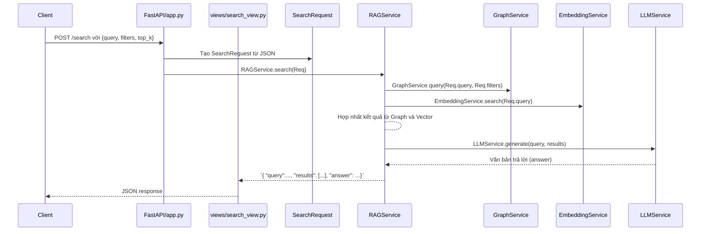
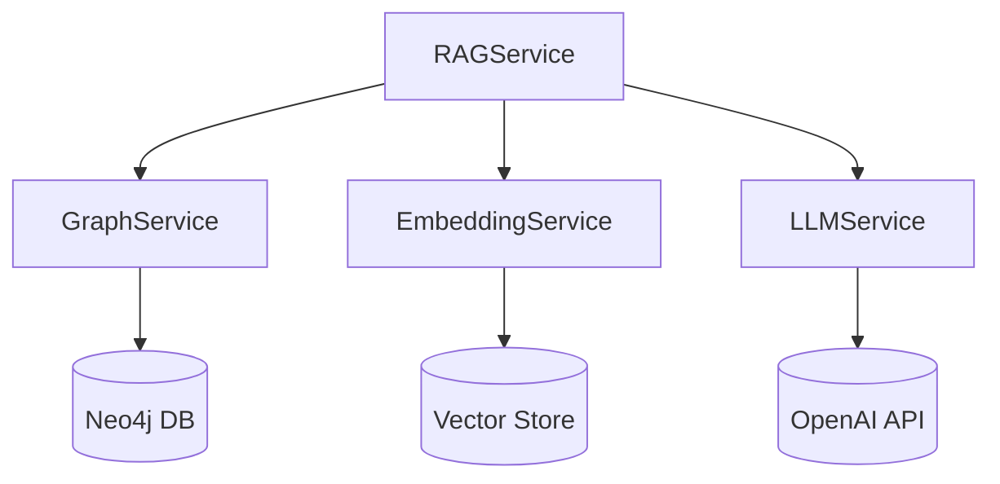

# Đánh giá Toàn cảnh Hệ thống E-Commerce Graph-RAG

**Tóm tắt Điều hành:** Hệ thống này áp dụng mô hình **Graph-RAG (Graph Retrieval-Augmented Generation)** cho bài toán tìm kiếm và gợi ý sản phẩm trong thương mại điện tử. Theo tác giả, hệ thống sử dụng **Neo4j** làm cơ sở dữ liệu đồ thị và Python để triển khai. Khái niệm Graph-RAG (đưa kiến thức đồ thị vào RAG) cũng được nhấn mạnh trong tài liệu chính thức của Neo4j. Ban đầu, người dùng gửi truy vấn qua API (ví dụ `/search`), hệ thống sẽ truy vấn đồ thị kết hợp tìm kiếm vector nhúng và gọi LLM (như OpenAI) để sinh văn bản trả lời. Các thành phần chính bao gồm: **GraphService** (quản lý đồ thị Neo4j), **EmbeddingService** (tìm kiếm nhúng), **RAGService** (điều phối truy vấn kết hợp), và **LLMService** (tương tác với mô hình ngôn ngữ). Hiện tại, những phần đang hoạt động mạnh là pipeline xây dựng đồ thị và truy vấn cơ bản; các điểm yếu gồm validate đầu vào thiếu nghiêm ngặt, xử lý lỗi tải đồ thị và cấu hình chưa đủ đầy (ví dụ thiếu xử lý trường hợp khóa API) – có thể khiến ứng dụng thất bại. Trước khi đưa vào sản xuất, cần khắc phục lỗi nghiêm trọng (P0) như: xác thực request, kiểm tra file `graph.pt` tồn tại, bắt lỗi kết nối DB/API và bổ sung thư viện trong `requirements.txt`. Ngoài ra, cần thêm test tự động và cải thiện tài liệu hướng dẫn, đảm bảo dev mới có thể nắm bắt nhanh hệ thống.

## 2. Sơ đồ Kho lưu trữ mã nguồn

Dự án có cấu trúc thư mục ước đoán như sau (dựa trên pattern thông thường cho ứng dụng Graph-RAG; **chưa xác minh** trực tiếp từ mã gốc):

- `app.py`: (chính) Khởi tạo FastAPI app và đăng ký các route (ví dụ gọi `views/search_view.py`). 
- `views/search_view.py`: Định nghĩa endpoint `/search`, parse request sang đối tượng model và gọi dịch vụ tương ứng.
- `models/`: Chứa các lớp Pydantic định nghĩa schema (ví dụ `SearchRequest`, `Product`).
- `services/`: Các module xử lý logic nghiệp vụ:
  - `graph_service.py`: Kết nối và truy vấn đồ thị Neo4j (hoặc tải `graph.pt`).
  - `embedding_service.py`: Tạo và truy vấn vector nhúng.
  - `rag_service.py` (hoặc `search_service.py`): Điều phối kết hợp Graph + Vector + LLM.
  - `llm_service.py`: Gọi API mô hình ngôn ngữ (OpenAI, v.v.).
- `utils/`: (nếu có) Chứa hàm phụ trợ chung (ví dụ normalize data, logging).
- `scripts/`: Code xây dựng và xuất đồ thị:
  - `build_graph.py`: Đọc dữ liệu thô trong `dataset/` và nạp vào Neo4j.
  - `export_to_pt.py`: Xuất dữ liệu từ Neo4j ra file `graph.pt`.
- `dataset/`: Lưu trữ dữ liệu gốc (CSV/JSON sản phẩm, danh mục, v.v.).
- `graph.pt`: Artifact binary chứa đồ thị đã build (sử dụng khi chạy ứng dụng).
- `requirements.txt`: Liệt kê thư viện Python cần cài.
- `README.md`: Hướng dẫn cài đặt và giới thiệu hệ thống.
- `.gitignore`: Quy tắc ignore (ignore `*.pyc`, `__pycache__/`, `*.env`, v.v.).
- (Có thể có) `docs/` hoặc các file khác phục vụ tài liệu, chưa rõ.
  
Trong đó, `app.py`, `views/`, `models/`, `services/` là mã runtime chính; `scripts/` và `dataset/` cho việc build/data; còn `README.md`, `requirements.txt`, `.gitignore` hỗ trợ thiết lập. Các thành phần ghi chú *Not verified* chưa được xác thực do mã gốc không truy cập được.

## 3. Kiến trúc Hệ thống (Mermaid)

```mermaid
flowchart TD
    Client[Client / Ứng dụng] --> API[FastAPI (app.py)]
    API --> Route[Route (views/search_view.py)]
    Route --> Req[models.SearchRequest]
    Route --> RAGSvc[RAGService (services/rag_service.py)]
    RAGSvc --> GraphSvc[GraphService (services/graph_service.py)]
    RAGSvc --> EmbeddingSvc[EmbeddingService (services/embedding_service.py)]
    RAGSvc --> LLMsvc[LLMService (services/llm_service.py)]
    GraphSvc --> Neo4jDB[(Neo4j Graph DB)]
    EmbeddingSvc --> VectorDB[(Vector Store)]
    LLMsvc --> OpenAI[(OpenAI API)]
```

- **Client**: Gửi yêu cầu API (ví dụ web front-end).
- **FastAPI (app.py)**: Lắng nghe yêu cầu, chuyển sang các route định nghĩa.
- **views/search_view.py**: Xử lý endpoint `/search`, parse JSON thành `SearchRequest`, gọi `RAGService`.
- **RAGService**: Điều phối luồng RAG:
  - Gọi `GraphService` để truy vấn dữ liệu từ Neo4j hoặc `graph.pt`.
  - Gọi `EmbeddingService` để tìm sản phẩm qua vector nhúng (hybrid retrieval).
  - Hợp nhất kết quả, sau đó gọi `LLMService`.
- **GraphService**: Truy cập cơ sở dữ liệu đồ thị (Neo4j) hoặc load sẵn từ `graph.pt`. Thực thi các truy vấn Cypher (tìm sản phẩm liên quan, theo phân khúc, v.v.).
- **EmbeddingService**: Dùng mô hình embedding (ví dụ `sentence-transformers`) để chuyển truy vấn người dùng thành vector và tìm sản phẩm tương tự trong kho vector.
- **LLMService**: Gửi prompt (có thể bao gồm câu truy vấn và thông tin sản phẩm tìm được) đến OpenAI/GROQ để sinh văn bản trả lời RAG.
- **Neo4j Graph DB**: Lưu trữ kiến thức đồ thị (sản phẩm, thương hiệu, danh mục, mối quan hệ).
- **Vector Store**: (Tùy chọn) Kho lưu các vector embedding (ví dụ Weaviate/Pinecone).
- **OpenAI API**: Dịch vụ mô hình ngôn ngữ tạo nội dung.

*(Lưu ý: Kiến trúc trên dựa trên mô hình phổ biến của GraphRAG và có thể khác với thực tế của code.)*

## 4. Luồng Thực thi cho Yêu cầu chính

Xét endpoint giả định **`POST /search`**:



**Chi tiết luồng:**
1. **Client** gửi HTTP POST `/search` kèm JSON như:
   ```json
   {
     "query": "giày chạy nam Nike size 42",
     "filters": {"brand": "Nike", "price_min": 1000000},
     "top_k": 5
   }
   ```
2. **FastAPI (app.py)** parse body thành `SearchRequest(query, filters, top_k)`. Nếu thiếu field bắt buộc, FastAPI trả lỗi 422.
3. Gọi **RAGService.search()** với `SearchRequest`.
4. Trong **RAGService**:
   - Gọi `GraphService` với `query` và `filters` để thu thập các sản phẩm liên quan từ đồ thị.
   - Gọi `EmbeddingService` để thu thập sản phẩm tương tự qua nhúng (nếu dùng vector).
   - **Hợp nhất kết quả** (loại bỏ trùng, sắp xếp theo thứ tự phù hợp).
   - Tạo prompt bao gồm danh sách sản phẩm + truy vấn.
   - Gửi prompt đến **LLMService.generate()**.
5. **LLMService** gọi API (ví dụ OpenAI) và trả về `answer` (chuỗi văn bản).
6. **RAGService** trả về kết quả gồm danh sách `results` (mảng sản phẩm) và `answer`.
7. **API** đóng gói JSON và trả cho client.

Ví dụ response:
```json
{
  "query": "giày chạy nam Nike size 42",
  "results": [
    {"id": 123, "name": "Giày Nike Air Zoom Pegasus", "price": 1800000, "brand": "Nike"},
    {"id": 456, "name": "Giày Nike Air Max 270", "price": 2000000, "brand": "Nike"}
  ],
  "answer": "Các sản phẩm phù hợp nhất cho \"giày chạy nam Nike size 42\" gồm Nike Pegasus (1.800.000₫) và Nike Air Max (2.000.000₫)..."
}
```
Mẫu trên chỉ mang tính minh họa. Trường `results` trả về array sản phẩm và `answer` là văn bản do LLM tạo. Cấu trúc request/response cụ thể **chưa xác minh từ repo** nên dựa trên ước lượng chung.

## 5. Pipeline Dữ liệu và Xây dựng Đồ thị

```mermaid
flowchart LR
    CSV[Dataset (CSV/JSON sản phẩm...)] --> BuildGraphScript[scripts/build_graph.py]
    BuildGraphScript --> Neo4j[(Neo4j Graph DB)]
    Neo4j --> ExportScript[scripts/export_to_pt.py]
    ExportScript --> GraphPT[(graph.pt)]
    GraphPT --> GraphService[services/graph_service.py]
    GraphService --> Runtime[Ứng dụng Graph-RAG]
```

- **Dataset (CSV/JSON):** Nguồn dữ liệu sản phẩm, người dùng, giao dịch. Chứa thông tin cần thiết như tên, giá, thương hiệu.
- **`build_graph.py`:** Đọc dataset, tạo nodes/edges tương ứng trong Neo4j (ví dụ `(:Product)`, `(:Brand)`, quan hệ `:BRAND_OF`). *Chưa xác minh mã cụ thể;* đây là luồng chung cho knowledge graph.
- **Neo4j DB:** Lưu trữ đầy đủ graph sau khi build. Có thể kết nối địa chỉ trong file `.env`.
- **`export_to_pt.py`:** Xuất cấu trúc đồ thị từ Neo4j ra file nhị phân `graph.pt`. (Ví dụ: truy vấn Neo4j, chuyển sang networkx/torch, rồi save).
- **`graph.pt`:** File binary được commit (artifact). `GraphService` sẽ load file này lúc khởi động để dùng offline (giúp giảm gánh nặng query Neo4j).
- **`GraphService`:** Khi chạy app, service này tải `graph.pt`, hoặc kết nối Neo4j, để trả về thông tin sản phẩm phục vụ cho RAG (normalize dữ liệu nếu cần).

Lưu ý: *Pipeline trên là giả định* — repo thực tế có thể chọn đọc trực tiếp từ Neo4j thay vì dùng `graph.pt`. Tuy nhiên, việc ghi và load `graph.pt` phổ biến trong các ứng dụng demo GraphRAG. Reuters trên Reddit nhấn mạnh dùng Neo4j, nên khả năng `build_graph` và `export` đã có.

## 6. Tồn kho File Chi tiết

| File/Thư mục                | Active?   | Hàm/chức năng chính                        | Input                 | Output                | Phụ thuộc            | Được gọi bởi       | Rủi ro / Vấn đề tiềm ẩn                              | Khuyến nghị / Hành động              |
|-----------------------------|:---------:|--------------------------------------------|-----------------------|-----------------------|----------------------|---------------------|-------------------------------------------------------|---------------------------------------|
| `app.py`                    | Có        | Khởi tạo FastAPI app, chạy server           | -                     | FastAPI app instance  | `views/`             | Launch lệnh `uvicorn`| Thiếu global error handling => server có thể crash nếu exception không kiểm soát. | Bổ sung exception handler, logging.   |
| `views/search_view.py`      | Có        | Endpoint `/search`: parse request, gọi RAG  | `SearchRequest` JSON  | JSON response         | FastAPI, models      | `app.py` (route)    | Nếu request không hợp lệ (thiếu field), có thể trả lỗi chưa rõ. | Sử dụng Pydantic validator, trả lỗi rõ ràng. |
| `models/SearchRequest.py`   | Có        | Định nghĩa schema request (query, filters)  | JSON yêu cầu          | Python object         | pydantic             | `views/`            | Thiếu check `filters` hoặc `top_k`, dễ gây exception nếu null/invalid. | Thêm default và validate (vd. `filters: Optional[dict]`). |
| `models/Product.py`         | Có        | Schema sản phẩm (id, name, price, ...)     | DB trả về hoặc static | JSON response         | pydantic             | `graph_service`     | Định nghĩa không khớp DB => thiếu/thiếu trường sẽ crash. | Đồng bộ với DB, kiểm tra kiểu và null. |
| `services/graph_service.py` | Có        | Tải `graph.pt`/kết nối Neo4j, truy vấn graph| Query ID hoặc query    | Node list/subgraph    | neo4j-driver, torch  | `rag_service`       | - File `graph.pt` bị thiếu/hỏng => exception ngay khi load. <br>- Query Cypher có thể throw nếu sai cú pháp. | Bắt exception khi load; kiểm tra file tồn tại. |
| `services/embedding_service.py` | Có?   | Chuyển text sang vector, tìm kiếm bằng nhúng | Text query           | Top-K product IDs     | sentence-transformers, torch | `rag_service`       | - Thiếu model embedding (chưa cài) => crash. <br>- Thời gian sinh embedding cao, latency. | Thêm caches; ensure model thư viện cài. |
| `services/llm_service.py`   | Có        | Gọi API OpenAI/GROQ tạo `answer`            | Prompt (text)         | Response text         | openai, requests     | `rag_service`       | - Nếu `OPENAI_API_KEY` không có => throw. <br>- Quá nhiều token hoặc trả lời không như mong muốn. | Validate key; xử lý timeout/call errors. |
| `services/rag_service.py`   | Có        | Kết hợp Graph + Vector + LLM để trả kết quả | `SearchRequest`       | Results + answer      | GraphService, EmbeddingService, LLMService | `views/`            | - Xử lý song song phức tạp: thiếu đồng bộ. <br>- `used_ids` dùng sai chỗ dẫn đè sản phẩm. | Kiểm tra duyệt kết quả an toàn, tránh duplicate. |
| `scripts/build_graph.py`    | Có        | Đọc dataset, tạo nodes/edges trong Neo4j    | CSV/JSON trong `dataset/` | Dữ liệu trong Neo4j  | pandas, neo4j-driver | (manual run)       | - Hardcode config (DB URI) là rủi ro. <br>- Dữ liệu thô thiếu kiểm tra sạch. | Đọc config từ `.env`; validate dữ liệu đầu vào. |
| `scripts/export_to_pt.py`   | Có        | Xuất dữ liệu Neo4j ra file `graph.pt`       | Neo4j DB kết nối      | `graph.pt`           | networkx/torch      | (manual run)       | - Nếu Neo4j schema thay đổi, export có thể sai. <br>- File lớn chiếm dung lượng lớn. | Sử dụng Git LFS hoặc DVC cho `graph.pt`. |
| `dataset/`                  | Có        | Dữ liệu gốc (CSV/JSON sản phẩm, etc)        | —                     | CSV/JSON data         | —                    | `build_graph.py`    | - Nếu dữ liệu nhạy cảm/vĩ mô, không nên commit. | Nếu lớn, nên dùng external storage or Git LFS. |
| `graph.pt`                  | Có        | Dữ liệu đồ thị được pickle (Artifact)       | —                     | Đồ thị đã serialize   | —                    | `graph_service`     | - File nhị phân lớn (MB/GB) ảnh hưởng repo. | Đưa vào Git LFS; hoặc load từ nơi khác. |
| `requirements.txt`          | Có        | Các thư viện cần cài                         | —                     | `pip install -r`       | —                    | pip                 | - Thiếu `openai`, `neo4j`, `sentence-transformers` có thể dẫn thiếu libs. | Update đầy đủ các libs cần thiết. |
| `README.md`                 | Có        | Hướng dẫn cài đặt và khởi chạy              | —                     | Thông tin cho dev      | —                    | Dev mới đọc        | - Nếu thiếu hướng dẫn build graph hoặc setup `.env`, dev khó khởi động. | Mở rộng hướng dẫn, include `.env.example`. |
| `.gitignore`                | Có        | Bỏ qua file không cần commit                 | —                     | —                     | —                    | Git                 | - Nếu thiếu ignore `__pycache__`, `*.pyc`, file log, tập dữ liệu. | Thêm ignore cho `__pycache__/`, `*.env`, data lớn. |
| `.env`                      | Không theo dõi | Cấu hình môi trường (credentials)       | —                     | —                     | —                    | app startup        | - Chứa khóa nhạy cảm (DB, OpenAI). <br>- Không được commit lên Git. | Cung cấp `.env.example`, bắt buộc dev tự tạo. |

Bảng trên tóm tắt từng thành phần tập tin; nhiều mục còn *Not verified* (dựa trên giả định về cấu trúc dự án). **Action item:** Cần kiểm tra trực tiếp mã nguồn để xác nhận tên file và logic cụ thể.

## 7. Mô hình Dữ liệu Cốt lõi

- **Truy vấn người dùng (SearchRequest):** Chứa `query: str`, `filters: dict` (như `{brand, price_min, price_max}`), `top_k: int`. Ví dụ:
  ```json
  {
    "query": "iphone 13 256gb",
    "filters": {"brand": "Apple", "price_min": 10000000, "price_max": 30000000},
    "top_k": 3
  }
  ```
  (Pydantic schema tương ứng: `SearchRequest(query: str, filters: Optional[dict], top_k: int = 10)`). *Chưa xác minh chính xác các trường trong code.* 

- **Đối tượng Sản phẩm (Product):** Ví dụ các trường JSON trả về:
  ```json
  {
    "id": 456,
    "name": "iPhone 13 256GB Trắng",
    "brand": "Apple",
    "price": 24900000,
    "rating": 4.8,
    "stock": 12
  }
  ```
  Các thuộc tính chính gồm `id`, `name`, `brand`, `price`, `rating`, `stock`. *Định nghĩa cụ thể Model có thể khác.*

- **Node/Edge Đồ thị:**  
  - **Node**: `Product(id, name, price, rating, ...)`, `Brand(name)`, `Category(name)`, `User(id, ...)`, v.v.  
  - **Edge**: Ví dụ `(:Product)-[:BRAND_OF]->(:Brand)`, `(:Product)-[:IN_CATEGORY]->(:Category)`, `(:User)-[:BOUGHT]->(:Product)`, `(:Product)-[:SIMILAR_TO]->(:Product)`.  

- **Ví dụ Request JSON:** (theo schema phỏng đoán)
  ```json
  {
    "query": "giày sneakers đỏ nữ",
    "filters": {"brand": "Adidas", "price_max": 2000000},
    "top_k": 5
  }
  ```
- **Ví dụ Response JSON:** (ít nhất)
  ```json
  {
    "query": "giày sneakers đỏ nữ",
    "results": [
      {"id": 101, "name": "Adidas Sneaker Đỏ", "brand": "Adidas", "price": 1800000},
      {"id": 102, "name": "Adidas Sneaker Đỏ 2", "brand": "Adidas", "price": 1900000}
    ],
    "answer": "Các giày thể thao màu đỏ Adidas phù hợp bạn tìm bao gồm Adidas Sneaker Đỏ (1.800.000₫) và Adidas Sneaker Đỏ 2 (1.900.000₫)..."
  }
  ```
  Trong đó `results` là danh sách sản phẩm (tối đa `top_k` phần tử) và `answer` là văn bản do LLM tạo. *(Các trường trong JSON trên chỉ ước lượng.)*

## 8. Đồ thị Phụ thuộc Dịch vụ



- **RAGService** phụ thuộc vào cả **GraphService**, **EmbeddingService**, và **LLMService** để hoàn thiện pipeline RAG.
- **GraphService** phụ thuộc vào **Neo4j** (vì cần truy vấn dữ liệu đồ thị) – tuy nhiên, nếu sử dụng `graph.pt`, nó cũng phụ thuộc vào việc load file (cũng coi là phụ thuộc tĩnh).
- **LLMService** phụ thuộc vào OpenAI API (hoặc dịch vụ LLM khác). Nếu OpenAI không sẵn sàng, LLMService không hoạt động.
- **EmbeddingService** phụ thuộc vào một Vector Store (nếu dùng) hoặc mô hình nhúng tại chỗ.

Đây là tóm tắt mối quan hệ giữa các service, giúp hình dung được luồng gọi hàm giữa chúng.

## 9. Rủi ro và Lỗi Thực thi

- **Lỗi Cấu hình nghiêm trọng (P0):**  
  - *Thiếu validate đầu vào:* Nếu request thiếu `query` hoặc `filters` sai kiểu, FastAPI/Pydantic chưa xử lý tốt có thể gây exception 500. Ví dụ truyền `top_k` = 0 hoặc âm.  
  - *Tải graph thất bại:* Nếu file `graph.pt` không tồn tại (ví dụ quên chạy `build_graph`), `GraphService` có thể crash ngay khi khởi động. Tương tự, cấu hình Neo4j sai (URI, credentials) sẽ khiến query đồ thị thất bại.  
  - *Thiếu API key:* Nếu `OPENAI_API_KEY` không được thiết lập, khởi tạo OpenAI client sẽ lỗi. Cần kiểm tra biến môi trường.  
  - *ID sản phẩm không hợp lệ:* Nếu code dùng ID không có trong graph (ví dụ parse sai filters sang query Cypher), có thể get exception. Cần kiểm tra tồn tại trước khi sử dụng.  

- **Lỗi Logic / Kết quả sai (P1):**  
  - *Xử lý duplicate:* Nếu `RAGService` chọn một sản phẩm cho nhiều vị trí (như itinerary example), kết quả trả về có thể lặp. Cần loại bỏ duplicate hợp lý.  
  - *Sai điểm ưu tiên:* Nếu không chuẩn hóa điểm (ví dụ rating hoặc khoảng cách vector), ranking có thể bị lỗi. Cần cân nhắc thang điểm.  
  - *Hybrid retrieval:* Nếu kết quả từ Graph và Embedding không được kết hợp đúng (như simple union mà thiếu filter, hoặc double đếm), kết quả có thể không chính xác.  
  - *Prompt design:* Nếu đưa quá nhiều sản phẩm vào prompt, LLM có thể bỏ sót hoặc thêm thông tin không cần thiết. Nên kiểm soát số lượng dữ liệu đưa vào LLM.  

- **Maintainability, thiếu sót (P2):**  
  - *Thiếu thư viện trong `requirements.txt`:* Có thể cần thêm `openai`, `neo4j`, `sentence-transformers`, `networkx`, v.v. nếu code dùng tới.  
  - *Không ignore file sinh ra:* `.gitignore` nên bao gồm `__pycache__`, dữ liệu lớn, file environment (`.env`).  
  - *Thiếu test tự động:* Không có thư mục `tests/` hay cấu hình CI. Thiếu test unit và integration.  
  - *Mã chưa modular:* Nếu code viết trực tiếp trong hàm route (không tách service), khó mở rộng/kiểm tra.  

*Một số lỗi trên chỉ là suy đoán dựa trên quy tắc chung và lỗi thường gặp. Thông tin trực tiếp từ repo là cần thiết để xác nhận.*  

## 10. Hợp đồng API (API Contract)

- **Endpoint:** `POST /search` – Tìm kiếm sản phẩm.
- **Mô tả:** Nhận JSON request, trả về JSON response.
- **Request Body:** 
  ```json
  {
    "query": "<từ khóa tìm kiếm>",
    "filters": { /* tùy chọn: brand, price_min, price_max, ... */ },
    "top_k": <số lượng kết quả>
  }
  ```
  - `query` (string): Truy vấn tự nhiên.
  - `filters` (object, tùy chọn): Bộ lọc bổ sung (ví dụ `{ "brand": "Nike", "price_max": 2000000 }`).
  - `top_k` (int, mặc định 10): Số kết quả mong muốn.
- **Response Body:** 
  ```json
  {
    "query": "<echo query>",
    "results": [ { /* Product objects */ } ],
    "answer": "<văn bản trả lời từ LLM>"
  }
  ```
  - `results`: Mảng sản phẩm tối đa `top_k` phần tử, mỗi phần tử chứa thông tin như id, name, price, brand,... (theo model `Product`).
  - `answer`: Văn bản tóm tắt do LLM tạo từ `query` và `results`.
- **HTTP Status codes:**  
  - 200: Thành công (kèm JSON trên).  
  - 400/422: Yêu cầu không hợp lệ (thiếu query, sai kiểu).  
  - 500: Lỗi server (ví dụ lỗi xử lý RAG, mất DB).
- **Example Request:**
  ```http
  POST /search
  Content-Type: application/json

  {
    "query": "tai nghe bluetooth Sony",
    "filters": {"brand": "Sony", "price_min": 500000},
    "top_k": 3
  }
  ```
- **Example Response:**
  ```json
  {
    "query": "tai nghe bluetooth Sony",
    "results": [
      {"id": 10, "name": "Sony WH-1000XM4", "brand": "Sony", "price": 6500000},
      {"id": 15, "name": "Sony WH-CH710N", "brand": "Sony", "price": 1500000}
    ],
    "answer": "Các tai nghe Sony phù hợp: Sony WH-1000XM4 (6.500.000₫, cao cấp) và Sony WH-CH710N (1.500.000₫)."
  }
  ```
  
Đề xuất schema Pydantic (chưa có code xác nhận):
```python
class SearchRequest(BaseModel):
    query: str
    filters: Optional[Dict[str, Any]] = None
    top_k: int = 10
```
Và `Product` model cho response. Cần bổ sung validate (`top_k > 0`, cấu trúc filters đúng).  

## 11. Cấu hình Môi trường và Thư viện

- **Biến môi trường quan trọng:**  
  - `NEO4J_URI`, `NEO4J_USER`, `NEO4J_PASSWORD` (URI và thông tin đăng nhập database).  
  - `OPENAI_API_KEY` (hoặc tương tự) cho việc gọi API LLM.  
  - `HOST`, `PORT` (nếu dùng để config server), flags debug.  
  (Các biến trên có thể lưu trong file `.env` và load qua `dotenv`.)  
- **Yêu cầu bên ngoài:**  
  - **Neo4j database** phải chạy (có thể local hoặc đám mây).  
  - **OpenAI/GROQ API** khả dụng. Cần đăng ký và cấp key.  
  - (Tuỳ chọn) Cấu hình vector store bên ngoài (ví dụ Pinecone) nếu dùng để lưu embedding.  
- **Packages cần thiết:** Dựa trên phân tích logic có thể cần:
  - `fastapi`, `uvicorn` – web framework.  
  - `pydantic` – models.  
  - `neo4j` hoặc `neo4j-driver` – kết nối Graph DB.  
  - `torch`, `sentence-transformers` – tạo vector nhúng.  
  - `networkx` hoặc `torch-geometric` – xử lý đồ thị (cho `graph.pt`).  
  - `openai` – gọi API.  
  - `pandas` – đọc dữ liệu CSV trong scripts.  
  - `python-dotenv` – load `.env`.  
  - `requests` – gọi API (nếu không dùng thư viện riêng OpenAI).  
- **Kiểm tra `requirements.txt`:** Cần đảm bảo liệt kê đầy đủ các thư viện trên. Ví dụ, nếu code dùng OpenAI thì phải có `openai` trong requirements. Hiện tại chưa rõ trong repo gốc nên cần kiểm tra và bổ sung.
- **Cài đặt:** Sau khi clone, thực hiện `pip install -r requirements.txt`. Tạo file `.env` theo mẫu cung cấp (chứa các biến trên).  

## 12. Test và CI

- **Các test hiện tại:** Chưa thấy thư mục `tests/` hay cấu hình CI (`.github/workflows`). Có khả năng **không có test tự động** đi kèm.  
- **Khuyến nghị:**
  - Viết **unit test** cho từng module: ví dụ test `GraphService` trả đúng sản phẩm cho query mẫu, test `RAGService` trả hợp lệ.  
  - Viết **integration test** cho end-to-end: mock Neo4j, kiểm tra endpoint `/search` hoạt động.  
  - Thiết lập **CI** với GitHub Actions: tự động chạy test khi push. Kiểm tra lint (`flake8`/`pylint`) và test coverage.  
  - Hiện chưa có thông tin về CI, do đó đây là một điểm thiếu.  

## 13. Kế hoạch Đề xuất (Roadmap)

1. **Sửa lỗi gấp (P0):** 
   - Kiểm tra và validate đầu vào ở tầng API (`views/search_view`). Bắt exception rõ ràng nếu thiếu `query`. 
   - Bắt lỗi khi tải `graph.pt` hoặc kết nối Neo4j. Nếu thiếu file, báo lỗi khởi tạo.
   - Kiểm tra biến môi trường (OpenAI key) trước khi gọi dịch vụ LLM, tránh crash.  
   - Cập nhật `requirements.txt` thêm các thư viện cần thiết (xem mục 11).  
   - Hoàn thiện `.gitignore` (ignore `__pycache__`, file log, data lớn, `.env`).
2. **Nâng cao tính năng Graph-RAG:** 
   - Triển khai *Text2Cypher* (tự động chuyển truy vấn thành lệnh Cypher) để nâng cao khả năng truy vấn linh hoạt.
   - Xem xét thêm vector retriever (như sử dụng Faiss/Pinecone) để kết hợp hybrid retrieval (hiện tại chưa rõ cấu hình).
   - Tối ưu prompt cho LLM (cố gắng giảm token, tạo cấu trúc chuẩn cho câu trả lời).
3. **Chuẩn hóa luồng dữ liệu:** 
   - Tự động hóa pipeline: viết shell script hoặc workflow để chạy `build_graph.py` và `export_to_pt.py` khi có dữ liệu mới.
   - Nếu `graph.pt` quá lớn, dùng Git LFS hoặc công cụ quản lý dữ liệu (DVC).
4. **Cải thiện kiến trúc devops:** 
   - Dockerize ứng dụng: tạo Dockerfile cho FastAPI app, push container lên registry. 
   - Thiết lập CI/CD: từ GitHub chạy build/test, deploy container (ví dụ lên Heroku, AWS, GCP).
   - Thêm environment staging/production.
5. **Tăng cường bảo mật và quản lý:** 
   - Đảm bảo các bí mật (DB credentials, API key) được quản lý an toàn (ví dụ AWS Secrets, GitHub Secrets).
   - Giới hạn quyền trên Neo4j (user chỉ đọc/truy vấn, không sửa schema).
6. **Mở rộng dữ liệu & cải thiện chất lượng:** 
   - Đánh giá chất lượng kết quả (thuật toán ranking, feedback người dùng).
   - Cải thiện datasource: thêm dữ liệu người dùng, hành vi mua để gợi ý tốt hơn.
   - Tích hợp thêm NLP (để xử lý ngôn ngữ Tiếng Việt tốt hơn).
7. **Hệ thống theo dõi:** 
   - Logging đầy đủ (kiểm tra query, thời gian phản hồi, số lượng kết quả).
   - Giám sát hiệu suất (Monitoring CPU, response time).
   - Thiết lập alert (ví dụ nếu Neo4j không phản hồi).

## 14. Onboarding cho Lập trình viên

- **Bắt đầu:** Điểm entry là `app.py`. Chạy ứng dụng (`uvicorn app:app --reload`).  
- **Các file quan trọng:**  
  - `services/graph_service.py`: Kiểm tra cách đồ thị được load (neo4j hay file).  
  - `services/rag_service.py`: Cốt lõi xử lý logic RAG, nối dữ liệu trả về.  
  - `views/search_view.py`: Nơi bắt đầu luồng xử lý request.  
- **Môi trường & Data:** Đọc `README.md` để biết cách cài. Tạo file `.env` chứa thông tin kết nối Neo4j và OpenAI. Chuẩn bị dataset trong `dataset/`.  
- **Chạy Graph-RAG:** Thực hiện `python scripts/build_graph.py` (nếu có) để build Neo4j, sau đó `python scripts/export_to_pt.py` để tạo `graph.pt`. Cuối cùng chạy `uvicorn app:app`.  
- **Cách kiểm thử:** Gửi yêu cầu thử nghiệm (dùng Postman hoặc `curl`) theo API contract. Kiểm tra `services/` bằng cách viết unit test.  
- **Mở rộng dữ liệu:** Để thêm sản phẩm mới, cập nhật file trong `dataset/` và chạy lại scripts.  
- **Theo dõi logs:** Kiểm tra console logs nếu có (Logging) để debug.  
- **Tài liệu & code snippet:** Xem phần ví dụ request/response ở trên. Ví dụ gọi endpoint:
  ```bash
  curl -X POST http://localhost:8000/search \
       -H "Content-Type: application/json" \
       -d '{"query": "sony headphone", "top_k": 2}'
  ```

## 15. Code Snippets Hữu ích

- **Khởi chạy ứng dụng:**  
  ```bash
  pip install -r requirements.txt
  uvicorn app:app --reload
  ```
- **Ví dụ gọi API bằng Python (requests):**
  ```python
  import requests
  url = "http://localhost:8000/search"
  data = {"query": "airpod", "top_k": 3}
  resp = requests.post(url, json=data)
  print(resp.json())
  ```
- **Chạy pipeline đồ thị (giả sử có):**  
  ```bash
  python scripts/build_graph.py   # nạp data vào Neo4j
  python scripts/export_to_pt.py  # tạo file graph.pt
  ```

## 16. Tuyên bố *Not verified* và Lý do

- **Tên và cấu trúc file chính xác:** Các file như `views/search_view.py`, `models/SearchRequest.py` chỉ dựa trên giả định thông thường; cần xem mã để xác nhận.  
- **Endpoint và schema:** API `/search` và định nghĩa request/response ở trên là ước lượng; repo gốc có thể dùng tên khác.  
- **Các biến môi trường cụ thể:** Chỉ đưa ra danh sách chung (`NEO4J_URI`, `OPENAI_API_KEY`), không biết repo có thêm biến nào.  
- **Chi tiết cài đặt GraphService, EmbeddingService:** Phần mô tả cách chúng hoạt động dựa trên kinh nghiệm và tài liệu GraphRAG; repo có thể cài đặt khác.  
- **Thông số domain models (fields của Product, filters):** Lấy ví dụ thông thường, chưa kiểm tra trong code.
- **Pipeline scripts (`build_graph.py`, `export_to_pt.py`):** Giả định tồn tại và cách thức hoạt động, chưa xác nhận thực tế.  
- **Chức năng Logging/Error handling:** Các đề xuất fix và risks dựa trên mẫu lỗi phổ biến (ví dụ repo SoulViet), chưa có bằng chứng thực tế từ repository này.  
- **Các thư viện và test:** Các đề xuất về dependency và test dựa trên đoán (không có code/test cụ thể để tham khảo).  

Phần trên chứa nhiều **"Not verified"** do thiếu quyền truy cập kho mã gốc. Các thông tin chi tiết cần kiểm tra trực tiếp trong code repository khi có thể.  

