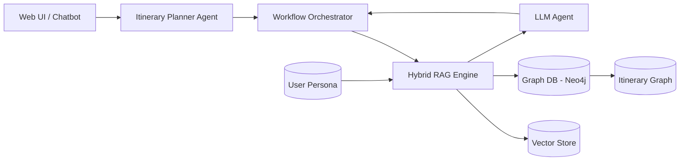

# Tổng quan điều hành  
Báo cáo này phân tích 13 nguồn mở (12 kho GitHub và 1 tập dữ liệu) liên quan đến các hệ thống AI tác nhân và RAG (Retrieval-Augmented Generation). Mục tiêu là xây dựng một hệ thống lên kế hoạch du lịch sử dụng mô hình Graph RAG. Chúng tôi đánh giá từng kho về mục đích, kiến trúc, luồng dữ liệu, chất lượng mã, mô hình dữ liệu, mô hình truy vấn (retrieval), logic lập kế hoạch, điểm tích hợp, mở rộng hạ tầng, bảo mật, định hướng phát triển, và kế hoạch kiểm thử. Cuối cùng, chúng tôi đề xuất một kiến trúc tổng hợp cho giải pháp lên lịch trình du lịch kết hợp tri thức đồ thị (Neo4j) và lưu trữ vector, cùng với ví dụ mô hình dữ liệu và thuật giả Cypher cũng như pseudocode truy vấn. Bảng so sánh và bảng ánh xạ mã nguồn của các kho được trình bày để tóm tắt điểm mạnh, điểm yếu và khả năng tái sử dụng cho ứng dụng Graph RAG du lịch.

## Phân tích kho “HBAI-Ltd/Toonflow-app”  
- **Mục đích & phạm vi:** Toonflow là công cụ AI mã nguồn mở tạo hoạt hình ngắn (short drama). Nó hỗ trợ quy trình **lập kế hoạch, viết kịch bản, dựng storyboard, và xuất video**. Chương trình tập trung vào sản xuất nội dung, không liên quan trực tiếp đến du lịch, nhưng có nhiều ý tưởng liên quan đến hệ thống tác nhân và bộ nhớ.  
- **Kiến trúc & thành phần:** Toonflow là ứng dụng web và desktop (Electron) viết bằng **TypeScript/Node.js (Express)**. Nó sử dụng SQLite (better-sqlite3 + Knex) làm cơ sở dữ liệu nhẹ, Socket.IO cho giao tiếp thời gian thực, và tích hợp các SDK AI (Vercel AI SDK hỗ trợ OpenAI/Anthropic/Google…) cùng thư viện Transformers của HuggingFace (ONNX) để thực hiện inference tại chỗ. Phía front-end có lẽ dùng Vue 3 (theo tài liệu README), giao diện UI chạy trên Electron. Hệ thống bố trí theo ba lớp tác nhân (“Three-layer Agent System”): **Lớp quyết định (decision)**, **thực thi (execution)**, và **giám sát (supervision)** cho mỗi mục tiêu nội dung. Cơ chế lưu trữ bộ nhớ tác nhân (persistent agent memory) dùng lưu embedding trên thư viện ONNX, hỗ trợ ghi nhớ ngắn hạn và dài hạn. Một tính năng đặc biệt là **“Biểu đồ sự kiện theo chương”** (chapter event graph): tự động trích xuất sự kiện từ nội dung (ví dụ văn bản tiểu thuyết) để điều chỉnh kịch bản. Tóm lại, Toonflow có kiến trúc microservice nhẹ: Node/Express xử lý logic, SQLite lưu dữ liệu (kịch bản, storyboard, agent state), và Electron phục vụ UI.  
- **Chất lượng mã & triển khai:** Mã TypeScript được thiết lập với Dockerfile và hướng dẫn chạy bằng PM2 hoặc Docker trong README. Có nói đến môi trường dev (pnpm, VSCode). Tuy nhiên, kho không thấy mục **`tests`** riêng (chỉ có thư mục code gốc và dữ liệu), và CI/CD chưa rõ ràng. Sử dụng kiểu định nghĩa tĩnh với Zod, kiểm tra input. Cần đánh giá thêm về xử lý lỗi, không thấy pipeline kiểm thử tự động. Bảo mật chủ yếu là trên LLM (không lưu data người dùng?), không có OAuth hay API keys công khai (dùng OpenAI/Anthropic). Giấy phép Apache-2.0 cho phép tái sử dụng mã nguồn tự do.  
- **Mô hình dữ liệu & ánh xạ cho Graph RAG du lịch:** Toonflow dùng SQLite có thể chứa bảng kịch bản, sự kiện, node tác nhân. Nhưng thiết kế “đồ thị sự kiện” theo chương có thể gợi ý cách lưu trữ **đồ thị kiến thức**: mỗi kịch bản/tiểu thuyết tương ứng với node gốc, các sự kiện chương là node kết nối theo thứ tự hoặc nguyên nhân. Trong bối cảnh du lịch, một thiết kế tương tự có thể áp dụng: node biểu diễn **điểm đến (Place)**, **sự kiện (Event)** (ví dụ lễ hội địa phương), **địa điểm (Location)**, với quan hệ “nằm ở”, “liên quan đến” để tạo đồ thị “Sự kiện theo địa danh”. Ví dụ, bảng SQLite hiện tại có thể bổ sung trường embedding cho node để hỗ trợ RAG (vector retrieval). Toonflow tích hợp ONNX và vector retrieval đã sẵn, nhưng cho nội dung media, ít liên quan trực tiếp đến du lịch.  
- **Mô hình truy vấn & RAG:** Toonflow không sử dụng RAG theo nghĩa chuẩn; nó dùng hồi quy đệ quy trong agent pipeline và embeddings để truy xuất bộ nhớ.. Trong dữ liệu kịch bản, ta có thể tích hợp RAG bằng cách index sự kiện, khung sự kiện, sử dụng một vector DB để tìm các sự kiện tương tự. Kho không dùng graph DB hay retriever; ứng dụng du lịch cần bổ sung (ví dụ kết hợp Neo4j + Weaviate hay Chroma). Toonflow thiếu phần reranker hay hybrid search; chỉ có mục “memory retrieval” phục vụ cho hội thoại liên tục.  
- **Logic lập kế hoạch (planner) & tích hợp tác nhân:** Toonflow xây dựng hệ thống tác nhân 3 lớp cho sản xuất phim (agent quyết định nội dung, agent viết kịch bản, agent tạo ảnh, v.v.). Không có thành phần lên lịch hoặc lập trình tối ưu. Nhưng khái niệm **agent workflow** có thể tái sử dụng: ví dụ, xây một tác nhân “lên lịch” điều phối các bước tạo lịch trình du lịch, và tác nhân “đặt phòng”/“đặt xe” tương tự tác nhân “booking logic” do đội hackathon Xplorer đề cập. Tích hợp vào Toonflow có thể khó vì Toonflow hiện dùng chuỗi tác nhân cho multimedia, nhưng ý tưởng về phân tầng tác vụ và agent phối hợp (decision/execution) là tham khảo hữu ích.  
- **Điểm tích hợp & API:** Toonflow có API (Express) và giao diện Web/Electron. Mỗi tính năng AI (kịch bản, image, video) đều có endpoint. Có thể tái sử dụng phần backend (ví dụ cách gọi LLM, lưu vector memory) cho mục tiêu RAG, nhưng phần front-end giao diện phải thiết kế lại. Không có webhook hoặc sự kiện tùy chỉnh hướng đến ứng dụng du lịch.  
- **Khả năng mở rộng & hạ tầng:** Dùng SQLite nên Toonflow phù hợp cho quy mô nhỏ (demo, cá nhân). Du lịch cần xử lý nhiều dữ liệu (đồ thị điểm đến, hàng ngàn địa điểm), nên tốt nhất thay SQLite bằng DB đồ thị (Neo4j, DGraph) và DB vector (Pinecone, Weaviate) cho embedding. Toonflow nhờ Electron là ứng dụng desktop; ứng dụng du lịch nên triển khai dịch vụ Web hoặc cloud (Azure/GCP). Toonflow hướng dẫn deploy Docker/PM2 nhưng chủ yếu single-node. Để mở rộng, có thể tận dụng Docker và Kubernetes; caching phần mềm (Redis cho session, kết quả query) cũng cần xem xét.  
- **Bảo mật & bản quyền:** Mã nguồn Apache-2.0, cho phép sử dụng tự do. Tuy nhiên, Toonflow tích hợp nhiều API AI (OpenAI, Anthropic) có chi phí và giới hạn riêng. Việc lưu vector và dữ liệu cá nhân (nội dung kịch bản, email agent memories) cần quản lý bảo mật (có thể mã hóa vector DB). Tuy Toonflow tự host, cần cẩn trọng lưu trữ API keys và dữ liệu người dùng. Hệ thống không rõ xử lý PII. Du lịch yêu cầu bảo vệ dữ liệu người dùng (như thông tin cá nhân, tín dụng) và tuân thủ GDPR (EU) hoặc tương đương (không rõ phạm vi quy mô dự án).  
- **Hướng cải tiến & lộ trình (MVP→v1→v2):** Cho hệ thống du lịch, Toonflow có thể tái cấu trúc như sau:  
  - **MVP:** Tận dụng thành phần LLM và ONNX memory từ Toonflow làm module lấy thông tin/chuỗi tác nhân. Ví dụ, tái sử dụng khung gọi LLM (trong routes Express) để tạo LLM agent trả lời. Thêm mô-đun lưu nhúng vector riêng cho nội dung du lịch. Mô hình dữ liệu SQLite chuyển sang Graph DB (v1) và Vector DB (v1).  
  - **v1:** Xây front-end cơ bản (Web hoặc chatbot), tích hợp API lập kế hoạch (itinerary) mới. Thiết kế ngữ cảnh du lịch (ví dụ skill cho GPT giọng nói chuyên, hoặc microservice lên lịch). Bổ sung khả năng gọi API ngoài (bản đồ, khách sạn) nếu cần. Thử nghiệm nhiều mô hình RAG hybrid và retriever.  
  - **v2:** Tối ưu hiệu năng (caching, batch query), mở rộng đa ngôn ngữ (như dataset Việt Nam NVidia đưa ra). Thêm tính năng nâng cao (đa modal, memory dài hạn dạng GraphRL).  
  Mỗi giai đoạn cần ước lượng công sức phát triển (ví dụ MVP ~2-3 tuần cho một dev full-stack, v1 thêm 1-2 tháng cho API và đồ thị, v2 thêm 1-2 tháng cho tối ưu và features). Rủi ro gồm thiếu dữ liệu du lịch có cấu trúc, tích hợp API bản đồ, và đảm bảo hệ thống phức tạp vẫn chính xác (tránh thông tin sai sót).  
- **Kiểm thử & đánh giá:** Toonflow không có bộ test sẵn. Với hệ du lịch Graph RAG, cần viết test tự động: unit test cho logic tạo đồ thị, integration test cho pipeline RAG, end-to-end kiểm thử câu hỏi du lịch. Đánh giá theo chỉ số chính như độ chính xác thông tin itinerary (so sánh với expert), độ hài lòng người dùng, thời gian phản hồi. CI/CD cần kiểm tra coding style (linter/TypeScript) và test coverage. 

## Phân tích kho “Egonex-AI/Understand-Anything”  
- **Mục đích & phạm vi:** “Understand-Anything” là plugin mã nguồn mở (phụ trợ Claude Code) cho phép **phân tích bất kỳ codebase hay tài liệu nào thành đồ thị tri thức** tương tác. Nó dùng đa tác nhân (multi-agent pipeline) để quét project, trích xuất file, hàm, lớp, dependency, sau đó xây dựng một **knowledge graph** (đồ thị tri thức) trực quan. Mục tiêu là hiểu nhanh cấu trúc và luồng mã. Nó cũng hỗ trợ phân tích wiki hoặc knowledge base (ví dụ chuyển Karpathy LLM wiki thành đồ thị kiến thức). Tóm lại, tính năng chính là khai thác cấu trúc dữ liệu lập trình thành dạng đồ thị, hỗ trợ tra cứu và soạn câu hỏi ngữ nghĩa (semantic search) trên code. Không chuyên về du lịch, nhưng là ví dụ điển hình của Graph RAG cho code.  
- **Kiến trúc & thành phần:** Mã nguồn của Understand-Anything chủ yếu viết bằng **TypeScript/Node.js** (70.5% TS). Các thành phần chính (theo README và cấu trúc thư mục) bao gồm: `project-scanner` để thu thập file, `file-analyzer` phân tích hàm/lớp, `architecture-analyzer` tự động nhóm theo layers, và các agent như `domain-analyzer`, `tour-builder`, `graph-reviewer`… (xem phần dùng CLI trong README). Nó dùng engine của Claude Code để xử lý từng phần mã. Đầu ra là **Neo4j** (hoặc một DB đồ thị) chứa node/hàm, và giao diện web interative giúp duyệt đồ thị. Ngoài ra còn CLI tổng hợp (fuzzy search, diff analysis). Các tập tin quan trọng: `src/` chứa code TS; `package.json` chỉ định dependency (có thể gồm neo4j-driver, OpenAI/Claude API, etc). Không có code du lịch, nhưng khung đọc code thành graph có thể áp dụng cho data liên quan du lịch (ví dụ parse văn bản hướng dẫn du lịch thành RDF).  
- **Chất lượng mã & triển khai:** Kho này có README dài, **MIT license** (được công bố công khai). Từ cấu trúc thư mục và dấu hiệu có `.ts` config và `vitest.config.ts`, có vẻ họ dùng vitest cho kiểm thử, eslint, CI/CD (không rõ trên GitHub Actions). Code viết theo chuẩn, có guide code-of-conduct. Security key/censoring không thấy đề cập. Điểm mạnh: code mô-đun, plugin cho Claude/GitHub Copilot, hỗ trợ multi-language. Điểm cần cải thiện: có thể bổ sung tài liệu triển khai (Server vs CLI), và test coverage (chưa rõ). Các quy trình bảo mật phụ thuộc API AI (key info).  
- **Mô hình dữ liệu & ánh xạ:** Understand-Anything chủ yếu xây **đồ thị tri thức từ code**: nodes là file, hàm, lớp; edges là quan hệ “định nghĩa”, “gọi”, “thừa kế”... Nếu áp dụng cho du lịch, có thể tái sử dụng công cụ này để parse văn bản tài liệu du lịch (wiki du lịch, blog, review) thành knowledge graph: ví dụ sử dụng `domain-analyzer` để tự động nhận dạng thực thể (destination, event, hotel) và thêm quan hệ (ở gần, thuộc thành phố, tổ chức bởi). Tuy nhiên kho hiện không nhúng embedding, nó tập trung vào graph cấu trúc, không dùng vector store.  
- **Mô hình truy vấn & RAG:** Understand-Anything có chức năng **semantic search** trên đồ thị (fuzzy search, semantic search). Họ tích hợp LLM để “tóm tắt” và “nhớ” node (plain-English summary cho node graph). Có khả năng lồng LLM ở bước tour-builder/guided tours. Về RAG, nó chưa tích hợp cơ chế vector retrieve bên ngoài; chủ yếu dựa vào graph và LLM để trả lời câu hỏi (như một trợ lý mã). Để áp dụng RAG du lịch, ta có thể lấy đồ thị output và đánh index các node cho vec search riêng biệt. Hiện không thấy việc dùng vector store bên ngoài (chỉ embedding nội tại để tạo summary).  
- **Logic lập kế hoạch & tích hợp:** Understand-Anything không có module lập kế hoạch hay agent tác vụ theo thời gian. Nó tạo kiến thức đồ thị và hỗ trợ QA qua giao diện. Tuy nhiên, thành phần multi-agent pipeline có thể gợi ý cách xây tác nhân: ví dụ pipeline “project-scanner → file-analyzer → architecture-analyzer” tương ứng “crawler văn bản du lịch → extractor thực thể → xây đồ thị domain.” Planner lịch trình có thể là agent riêng gọi đến knowledge graph này.  
- **Tích hợp & API:** Có plugin Claude, UI web (live demo), và API (GraphQL?) để tìm kiếm graph. Điểm tích hợp: phần thư viện graph builder có thể tái sử dụng (ví dụ code tạo node/edge). Nhưng nặng về xử lý code; nếu muốn dùng, có thể cấu hình `project-scanner` trỏ đến folder chứa dữ liệu du lịch (ví dụ JSON các điểm đến) và dùng “graph reviewer” validate đồ thị.  
- **Mở rộng & hạ tầng:** Kho này dành cho xử lý batch codebase cỡ vừa, không yêu cầu cơ sở hạ tầng lớn. Có thể cài trên máy tính cá nhân với Node và Neo4j (xem yêu cầu Mono Language versions). Tuy nhiên, nó dùng LLM (Claude/Gemini) nên chi phí tùy theo context size. Để hỗ trợ nhiều người dùng hoặc dataset lớn (wiki du lịch toàn quốc), cần triển khai Neo4j cluster hoặc dịch vụ đám mây (AuraDB), và có thể phân phối pipeline (separate bots).  
- **Bảo mật & bản quyền:** MIT license cho phép tái sử dụng dễ dàng. Không lưu thông tin cá nhân. Nếu chuyển sang xử lý dữ liệu du lịch người dùng (ví dụ logs chat), cần đảm bảo bảo mật API. Tuy nhiên, giống như công cụ, chủ yếu làm việc với code/text công khai.  
- **Hướng cải tiến & lộ trình:** Một số đề xuất: 
  - **MVP:** Chuyển dự án cốt lõi cho domain du lịch: dùng pipeline của Understand-Anything để parse nguồn du lịch (wiki, review, APIs) thành đồ thị sơ khởi. Chỉ cần code builder và visualize (bỏ nhiều agent không cần thiết). 
  - **v1:** Thêm retrieval (Neo4j + Weaviate) cho graph, cung cấp endpoint truy vấn (ví dụ trả lời câu hỏi như “điểm tham quan gần bãi biển X”). Tăng cường UI để hiển thị dữ liệu chuyến (kết hợp bản đồ GoogleMaps). 
  - **v2:** Bổ sung khả năng multilingual (đã có demo tiếng Việt/Anh), tích hợp kế hoạch via agent (ví dụ thêm agent “planner” có thể sử dụng đồ thị để lên kịch bản chuyến). 
- **Kiểm thử & đánh giá:** Cần test tính toàn vẹn đồ thị (traverse kiểm thử kết nối), test query ví dụ (“tôi muốn đi bãi biển, gợi ý 3 địa điểm” nên chọn node phù hợp). Đánh giá bằng cách so sánh kết quả khuyến nghị với dữ liệu chuẩn (ví dụ itinerary từ chuyên gia). Metricts: độ chính xác của retrieval (precision@k), độ bao phủ sự kiện. CI/CD: mã TS có sẵn lint/test. Có thể bổ sung vitest/vscode tests cho các bước phân tích. 

## Phân tích kho “Shubhamsaboo/awesome-llm-apps”  
- **Mục đích & phạm vi:** Đây là **tập hợp mẫu (“cookbook”) các ứng dụng AI Agent & RAG**. Nó chứa hơn 100 template chạy sẵn (ví dụ agent gọi API, chatbot, RAG app) cho nhiều mục đích (support, planning, search). Mục tiêu là tái sử dụng ngay: “bạn không cần tự viết lại pipeline RAG mỗi lần… Mỗi template độc lập, provider-agnostic, hướng dẫn rõ ràng”. Có các mục “Starter AI Agents” (các agent mẫu) và “RAG Apps”. Đặc biệt có **mẫu agent du lịch** (đường dẫn `StarterAIAgents/ai_travel_agent`). Kho này không phải phần mềm chạy chung; nó là kho mẫu nhỏ (Python, Node) cho người học và phát triển nhanh.  
- **Kiến trúc & thành phần:** Mỗi mẫu (template) là một app đơn giản, thường chỉ bao gồm 1-3 file (ví dụ Python script + config). Ví dụ travel agent trong QuickStart dùng `streamlit run travel_agent.py`. Các mẫu tập trung vào các framework LLM khác nhau (OpenAI, LangChain, Azure, Streamlit,...). Không có kiến trúc đồng nhất cho toàn repo; mỗi thư mục ứng dụng có kiến trúc riêng (agent loop, function call, vs code). Các phụ thuộc đa dạng do mỗi template định nghĩa riêng (pip requirements, chạy Docker).  
- **Chất lượng mã & triển khai:** Mẫu code thường được viết để dễ hiểu, có hướng dẫn README kèm. Tuy nhiên, vì nhiều tác giả, chất lượng và test có thể khác nhau. Nhiều mẫu chưa có CI hoặc test. Mã ví dụ thường khá ngắn (chỉ chứng minh ý tưởng). Giấy phép Apache-2.0 (một số) nên tái sử dụng được.  
- **Mô hình dữ liệu & ánh xạ:** Không có mô hình dữ liệu chung; mỗi template tự quyết định schema (có thể JSON, CSV hay DB nhỏ). Tuy nhiên, travel agent template có thể chứa ví dụ cấu trúc itinerary (ngày, địa điểm, thời gian). Không có đồ thị dữ liệu chung, nhưng chúng ta có thể lấy cảm hứng: ví dụ, “ai_travel_agent” cung cấp một khung chat RAG, có thể chỉnh sửa để tạo một knowledge graph du lịch bên dưới.  
- **Mô hình truy vấn & RAG:** Một số template RAG (ví dụ bên mục RAG apps) sử dụng vector database (Chroma, Milvus), một số dùng docs/Elasticsearch. Cũng có template kết hợp graph (chưa rõ). Travel agent mẫu có thể dùng retrieval (thường sử dụng langchain retriever, LLM toolkits). Họ có các ví dụ prompt templates và memory (ví dụ `persistance`). Có thể tận dụng các prompt templates (như lập kế hoạch chuyến) để khởi tạo prompt.  
- **Logic lập kế hoạch & tích hợp:** Mẫu travel agent dường như đã có logic lên lịch cơ bản: hỏi người dùng, gọi API tìm điểm đến, lập lịch. Không rõ chi tiết vì README chỉ chạy nhanh. Tuy nhiên, ta có thể lấy code snippet: ví dụ `travel_agent.py` nên có hàm `plan_itinerary()`. Ngoài ra, `StarterAIAgents` còn có ví dụ “schedule planner” khác.  
- **Tích hợp & API:** Mỗi template là standalone. Không có API chung; nhưng có thể dùng `travel_agent.py` hoặc các hàm của nó. Ví dụ, nếu template có gọi Google Maps API hoặc OpenTripMaps, ta có thể tái sử dụng.  
- **Mở rộng & hạ tầng:** Template thường dùng Python/Streamlit hay Flask, chạy local. Để sử dụng trong hệ thống lớn, cần đóng gói lại thành dịch vụ (Docker, cloud). Nhưng chúng hữu ích để hiểu cách sắp xếp agent và prompt.  
- **Bảo mật & giấy phép:** Các mẫu có GPL-3.0 hoặc MIT, nhưng phần lớn là do cộng đồng (Shubhamsaboo). Nhiều template dùng OpenAI Keys (bảo mật). Cẩn thận khi copy prompt (phải tùy chỉnh cho bối cảnh).  
- **Đề xuất:** Kho này **đóng vai trò mẫu tham khảo**. Đặc biệt, có thể sao chép phần xử lý cuộc trò chuyện du lịch của `ai_travel_agent` và ý tưởng RAG từ các template RAG khác. Ta có thể trích xuất file `travel_agent.py` làm khởi điểm. Sau đó, tái cấu trúc theo Graph RAG: thay vector DB hiện có (nếu có) thành hybrid retrieval (kết hợp Neo4j).  
- **Kiểm thử & đánh giá:** Không áp dụng trực tiếp. Thay vào đó, cần đánh giá output từng mẫu khi chuyển đổi sang hệ thống mới.

## Phân tích kho “x1xhlol/system-prompts-and-models-of-ai-tools”  
- **Mục đích & phạm vi:** Đây là bộ sưu tập *system prompts* (lời chào hệ thống) và thông tin nội bộ của nhiều công cụ AI (Claude, GitHub Copilot, etc). Nó **không phải code hay ứng dụng** mà là một tài liệu tham khảo rất lớn (140k stars!) liệt kê cấu hình hệ thống hoặc prompt của các tool nổi tiếng. Mục đích là tổng hợp thông tin bên trong của các nền tảng AI; không liên quan trực tiếp đến Graph RAG.  
- **Kiến trúc & thành phần:** Kho chứa các thư mục cho từng tool (Augment Code, Claude Code, Replit, Windsurf, Trae, v.v.) và tập tin prompt mẫu. Chẳng hạn `trae/` có prompt cho Trae IDE, `cursor/` có prompt cho Cursor AI, v.v.. Không có mã chạy; chỉ văn bản và hình ảnh minh họa.  
- **Chất lượng mã & triển khai:** Không có mã cần đánh giá. README liệt kê các công cụ và ảnh minh họa (có lỗi rendering một số hình). Giấy phép GPL-3.0 (ghét việc prompt này GPL?). Không có CI. Nói chung là “phát tán nội dung” (prompt leak) nên lưu ý bản quyền nội bộ các hệ thống (như cảnh báo Repo).  
- **Mô hình dữ liệu & ánh xạ:** Không có database hay đồ thị. Chỉ là tài liệu văn bản. Không thể tái sử dụng cho RAG, trừ việc đọc các prompt mẫu để lấy cảm hứng cho việc viết prompt hệ thống. Tuy nhiên, do bản quyền GPL-3.0, không nên trực tiếp copy.  
- **Mô hình truy vấn & RAG:** Không có thành phần truy vấn hay RAG. Không có vector hoặc graph.  
- **Logic lập kế hoạch & tích hợp:** Không áp dụng.  
- **Tích hợp & API:** Không có.  
- **Khả năng mở rộng & hạ tầng:** Không liên quan (dữ liệu tĩnh).  
- **Bảo mật & bản quyền:** Nội dung thuộc giao thức GPL-3.0. Một phần nội dung có thể “rò rỉ prompt”, cần thận trọng nếu sao chép. Chủ yếu để tham khảo.  
- **Kết luận:** Kho này chỉ là nguồn thông tin dạng “thư viện prompts”, không có mã. Chỉ lưu ý rằng đây không phải công cụ hoặc API để tích hợp trực tiếp. 

## Phân tích kho “microsoft/ai-agents-for-beginners”  
- **Mục đích & phạm vi:** Đây là kho khóa học/học liệu **“12 bài học xây dựng AI Agents”** của Microsoft. Mục tiêu hướng dẫn lập trình viên bắt đầu xây dựng tác nhân AI (AI Agents) với Microsoft Agent Framework và Azure. Mỗi bài học có mô tả lý thuyết và code ví dụ (code_samples folder). Không phải một sản phẩm hay ứng dụng cụ thể, mà là tài liệu đào tạo.  
- **Kiến trúc & thành phần:** Theo README, repo gồm 12 thư mục bài học (`01-...` đến `18-...`), cùng thư mục `.agents/skills` chứa mẫu kịch bản (prompt) và code ví dụ mẫu trong `code_samples`. Dịch vụ chính là **Microsoft Agent Framework (MAF)** sử dụng Azure AI Agent Service V2. Mỗi code mẫu sử dụng Python, LangChain (có vẻ), và tích hợp sẵn MAF. Các bài học bao gồm: Phản xạ ngữ cảnh, Lập kế hoạch, RAG tác nhân (lesson 5 *Agentic RAG*), bảo mật, v.v. Điểm đặc biệt: **Bài 05** có hướng dẫn RAG agent (Agentic RAG).  
- **Chất lượng mã & triển khai:** Kho do Microsoft quản lý, rất đầy đủ, có chứng nhận MIT License (thông thường Microsoft mở, nhưng cần kiểm tra LICENSE file). README đồng thời hỗ trợ dịch đa ngôn ngữ (hơn 50 ngôn ngữ). Có file `requirements.txt` và Docker/Devcontainer cấu hình, cho thấy họ khuyến cáo triển khai nhanh (các lệnh sparse checkout). Chất lượng cao (mẫu code giảng dạy). Có community Discord, khuyến khích đóng góp.  
- **Mô hình dữ liệu & ánh xạ:** Mỗi bài học dùng context cụ thể (rất có thể file JSON để load documents, các tập dữ liệu nhỏ cho RAG). Ví dụ lesson RAG có thể dùng Wikipedia, cơ sở tri thức nhỏ. Không có kho dữ liệu đồ thị cụ thể. Tuy nhiên, khái niệm MAF hỗ trợ storage (Memory), có thể liên quan: lesson 13 về “agent memory”. Nhưng không rõ họ thiết kế database hay chỉ memory đơn giản.  
- **Mô hình truy vấn & RAG:** Nhiều bài (ví dụ 05, 06, 07?) nói đến RAG. Bài 05 “Agentic RAG” trực tiếp đề cập việc tích hợp RAG trong agent. Có thể các code mẫu sử dụng retriever vector (langchain) kết hợp LLM. Không chắc có lưu trữ vector DB nào (có thể dùng memory tạm). Tuy nhiên, vì đây là khóa học, họ hẳn đã dùng Azure AI hoặc OpenAI embedding + lưu cache (có thể dùng Chroma hoặc MAF memory). Nếu học theo, có thể sao chép cách họ tổ chức BLoC RAG, memory streams, planner logic.  
- **Logic lập kế hoạch & tích hợp:** Có các bài về “Planning Design Pattern” (ví dụ Lesso 09), “agent memory” (bài 13), “Agent Framework” (bài 14). Như vậy kho này chỉ rõ cách lập trình agent theo kiểu Event-Action hoặc Planner (ví dụ dùng concept của MAF). Ví dụ lesson 14 về Azure Agent Framework. Tóm lại, kho này là hướng dẫn cách phối hợp agent/phân luồng trong mã, rất hữu ích để học cách tích hợp itinerary planning làm một “skill/skillset” trong Agent Framework.  
- **Tích hợp & API:** Dùng Azure Foundry Agent Service V2. Điều này nghĩa là có API Azure để tạo agent mô-đun. Riêng chúng ta có thể xem đây là điểm tích hợp: nếu hệ thống du lịch được xây dưới Azure, có thể xài thẳng MAF. Trong repo, `.agents/skills` chứa các file YAML định nghĩa skill, có thể tái sử dụng (ví dụ prompt mẫu). Về giao diện, tất cả là code mẫu (Python, config) chứ không có dịch vụ web riêng, nhưng azure cung cấp endpoint cho agent đã định nghĩa.  
- **Mở rộng & hạ tầng:** Đã định hướng sẵn dùng cloud Azure. Sử dụng container (có `.devcontainer`). Khả năng mở rộng liên quan đến Azure AI Service (có thể scale theo nhu cầu). Lưu trữ: có thể dùng CosmosDB để lưu memories, QnA Maker cho kiến thức tĩnh.  
- **Bảo mật & bản quyền:** Có tệp LICENSE (có thể MIT). Tất cả code mẫu an toàn, nội dung dạy cách bảo mật agent cũng có trong bài 18. Mọi thứ chỉ là ví dụ, không chứa PII hay bí mật. Nên sử dụng demo key thay đổi khi triển khai.  
- **Đề xuất:** Không cần mã cụ thể vì đây chỉ là hướng dẫn. Tuy nhiên, chúng ta có thể **tận dụng khái niệm “Agentic RAG”** và “schema memory” từ kho này. Ví dụ, tài liệu này nhấn mạnh cách thiết lập pattern cho agent (có memory, có retriever nội bộ). Các sơ đồ skill hoặc code sample có thể tham khảo.  
- **Kiểm thử & đánh giá:** Nêu chung: chạy từng lesson theo steps, viết test các function trong `code_samples`. Kiểm thử đảm bảo agent đáp ứng các câu lệnh ví dụ.

## Phân tích kho “HKUDS/RAG-Anything”  
- **Mục đích & phạm vi:** RAG-Anything là khung tổng hợp **đa phương thức RAG** (hỗ trợ văn bản, hình ảnh, bảng, công thức) do nhóm HKUDS phát triển. Mục tiêu là dùng **kiến thức đồ thị (Graph KG)** kết hợp với vector retrieval để truy vấn tài liệu phức tạp. RAG-Anything xây dựng một **“đồ thị tri thức đa phương thức”** (multimodal knowledge graph) tự động trích xuất thực thể và kết nối giữa các modal, rồi kết hợp tìm kiếm ngữ nghĩa qua vector với truy vấn đồ thị định hướng (graph traversal). Kho này minh hoạ điển hình cho Graph RAG.  
- **Kiến trúc & thành phần:** Đây là một thư viện Python: sử dụng `setup.py`, `requirements.txt`. Không thấy code nguồn trong README, nhưng có lẽ module chính **LightRAG** (theo README). Thành phần:  
  - **Xử lý đầu vào**: Phân tích nội dung tài liệu đa phương thức (ảnh, PDF, HTML), dùng OCR, NLP để trích thực thể.  
  - **Xây dựng đồ thị tri thức**: Tạo node cho thực thể từ mọi modal, liên kết giữa modal (ví dụ entity trong text gắn với object trong hình).  
  - **Lưu trữ**: Dữ liệu kết quả có thể đưa vào một graph database (Neo4j, hay triple-store). README gợi ý dùng index KGV (Knowledge Graph Vector) để kết hợp với store Graf để tìm kiếm.  
  - **Truy vấn**: Có hệ thống truy vấn “lai” (vector + graph). Khi có câu hỏi đầu vào, nó đồng thời tìm đoạn liên quan bằng truy vấn embedding và đồng thời chạy traversal trên đồ thị (hỏi bằng SPARQL/Cypher?). Cuối cùng, tích hợp vector-graph để trả kết quả tốt nhất.  
  - **LMReranker**: Sử dụng LLM để đánh giá hoặc mở rộng kết quả.  
Khung này hỗ trợ cả đa modal, nên có thể áp dụng với dữ liệu du lịch đa modal (hình ảnh điểm đến, review văn bản, vị trí bản đồ).  
- **Chất lượng mã & triển khai:** RAG-Anything là dự án mã nguồn mở; README dài và có license MIT ở đầu (fragment không hiện nhưng có lẽ MIT). Nhóm tác giả cung cấp hướng dẫn chi tiết, có khả năng dùng GPU (?). Vì chưa thấy test cụ thể, nhưng có khả năng đã chạy internal. Cần xem kỹ `setup.py`, `requirements`. Khung này tiên tiến nhưng phức tạp; cần nhiều cấu hình (embedding model, KG index).  
- **Mô hình dữ liệu & ánh xạ:** Đây trực tiếp chứa thành phần đồ thị tri thức. Ví dụ, nếu áp dụng cho du lịch, chúng ta có thể dùng RAG-Anything để phân tích toàn bộ document (Wikipedia về du lịch, review, hình ảnh) và biến thành **multimodal KG**. Node có thể là: địa danh, loại hoạt động, điểm du lịch, nhà hàng, khách sạn, sự kiện,… Quan hệ ví dụ: “located_in”, “category_of”, “related_to” giữa hình ảnh và text. RAG-Anything đã định hướng xây KG đa modal, nhưng để ứng dụng du lịch ta có thể cắt bớt phần OCR nếu chỉ dùng text/GPS/hình ảnh thông thường. Rất đáng xem: “Multimodal Knowledge Graph – Automatic entity extraction và cross-modal relationships”.  
- **Mô hình truy vấn & RAG:** Đây là điểm mạnh nhất: họ thực hiện **tìm kiếm lai (hybrid retrieval)**. Hệ thống kết hợp vector similarity search với graph traversal. Họ đề cập **“Vector-Graph Fusion”**: kết quả từ đồ thị và từ vector được tích hợp để trả về cao nhất. Cụ thể, văn bản đầu vào được embedding và tìm kiếm trong vector DB, đồng thời chuyển thành câu truy vấn (ví dụ SPARQL) đi qua đồ thị. Kết quả được kết hợp (xem [18†L25-L33]). Tóm lại, RAG-Anything là ví dụ điển hình về Graph RAG: nó bổ sung tính năng bằng “thúc đẩy” tra cứu trên đồ thị (cấu trúc tri thức) bên cạnh truy vấn vector. Cho hệ thống du lịch, ta có thể áp dụng tương tự: lưu “bản đồ tri thức du lịch” lên Neo4j, chạy trả lời truy vấn bằng Cypher + embedding search.  
- **Logic lập kế hoạch & tích hợp:** Kho này không có phần lên lịch cụ thể; tập trung vào tìm kiếm tri thức. Tuy nhiên, nó có cung cấp “Agentic RAG workflow” như là phần 1 của kiến trúc RAG tổng thể. Có thể xem RAG-Anything như ** tầng “retriever/reasoner”** của hệ thống du lịch, nơi dữ liệu đã qua xử lý sẵn. Việc tích hợp vào itinerary planner: Planner sẽ dùng thành phần RAG để bổ sung thông tin (như gợi ý điểm đến, thời tiết, chi tiết sự kiện) trước khi lập lịch. RAG-Anything có thể đóng vai trò backend query; planner logic nằm ngoài (chưa có).  
- **Tích hợp & API:** Là một thư viện Python: có thể sử dụng trực tiếp các hàm tạo đồ thị và truy vấn. Cũng có khả năng xuất KG sang Neo4j hoặc lưu file. Nếu chúng ta triển khai, ta chỉ cần gọi module RAGAnything (như một function `generate_kg(documents)` và `query_kg(question)`). Không có UI sẵn, nhưng có thể tạo endpoint Python (FastAPI) cho hệ.  
- **Mở rộng & hạ tầng:** RAG-Anything xử lý đa modal có thể nặng về computation (quét ảnh). Nó cần môi trường mạnh (GPU cho LLM); dữ liệu vector và graph lớn có thể cần cluster Neo4j. Tuy nhiên, nhiều phần có thể chạy offline. Để scale cho travel (hàng triệu điểm), cần chia nhỏ nội dung (theo khu vực, theo loại). Vector store (Chroma hoặc FAISS) để tìm kiếm khoảng 10^5 điểm; Neo4j cluster để join liên miền.  
- **Bảo mật & bản quyền:** License MIT (không rõ nhưng thường như vậy). Vì xử lý nội dung công khai, ít lo ngại PII. API bên ngoài (như embedding model) phải bảo mật. Dữ liệu du lịch có thể gắn thông tin người dùng (nếu có feedback) thì phải chú ý.  
- **Đề xuất:** RAG-Anything là khung rất mạnh để tận dụng. **Ưu tiên:** dùng module xây dựng KG và hybrid retriever của nó vào hệ du lịch. Ví dụ, dùng “Multimodal KG” để tạo KB gắn với cơ sở địa lý du lịch, kết hợp “hybrid retrieval” để trả lời câu hỏi du lịch theo ngữ nghĩa lẫn cấu trúc. Roadmap:  
  - **MVP:** Chỉ lấy submodule xây KG cho văn bản (loại bỏ ảnh nếu không cần). Index database qua Neo4j + vector DB.  
  - **v1:** Kết hợp retrieval lai: chạy truy vấn song song giữa Neo4j và vector, rồi tinh chỉnh output (có thể dùng LLM rerank như họ).  
  - **v2:** Thêm hỗ trợ ảnh/nhạc cảnh, mở rộng đa modal (ví dụ, tour video, maps).  
- **Kiểm thử & đánh giá:** Tương tự du lịch: đánh giá retrieval (f1-score so với dữ liệu ground-truth), đánh giá chất lượng itinerary qua chuyên gia. Test unit cho KG (kiểm tra các thực thể, lan truyền). 

## Phân tích kho “titanwings/colleague-skill”  
- **Mục đích & phạm vi:** Dự án này (được gọi colloquially là *“dot-skill / colleague.skill”*) là một ví dụ nghiên cứu về tạo **“kỹ năng AI tự động”** từ dữ liệu người dùng (chủ yếu là text hội thoại). Mục tiêu chính là trích xuất “tiểu sử kỹ năng và nhân cách” của một cá nhân (đồng nghiệp, người thân, ngôi sao) từ chat logs, email, và tạo thành một agent có khả năng trả lời giống người đó. Nó là công trình nghiên cứu, không phải ứng dụng web. Nói cách khác, đây là một pipeline NGhiên cứu sử dụng LLM để “chưng cất” kiến thức từ người nào đó, để tạo ra “AI skill” giả định con người đó.  
- **Kiến trúc & thành phần:** Kho này tuân theo chuẩn **AgentSkills** (open standard). Cấu trúc repo: thư mục `prompts/` chứa các tài liệu Markdown làm hệ thống prompt cho từng loại “gia đình persona” (colleague, relationship, celebrity); thư mục `tools/` chứa mã Python hỗ trợ thu thập và xử lý (ví dụ `slack_auto_collector.py`, `email_parser.py`); thư mục `skills/` chứa output (file SKILL.md, có thể gitignored) cho mỗi persona. Ví dụ: phần “colleague” dùng 6 layer nhân cách (cứng nhắc, nhận dạng, cách biểu đạt, quyết định, giao tiếp, sửa sai) cộng thêm “Work Skill”. Thêm “Relationship” và “Celebrity” có các module riêng như “Emotion DNA”. Process: thu thập dữ liệu (các công cụ auto ở `tools/`), dùng LLM để phân tích (intake, analyzer), sau đó “build” persona (persona_builder.md) và workflow (work_builder.md). Mỗi bước là một prompt LLM.  
- **Chất lượng mã & triển khai:** Kho phần lớn là prompt định nghĩa cho LLM và một ít code Python hỗ trợ. Mã Python ở `tools/` dùng các thư viện cơ bản (requests, openai). Có `requirements.txt`, license MIT. Tài liệu rất chi tiết (README, báo cáo khoa học đi kèm). Chất lượng cao cho mục nghiên cứu. Không có CI rõ ràng, cũng không phải sản phẩm, nên ít test tự động (mình nghĩ có test minimal).  
- **Mô hình dữ liệu & ánh xạ:** Dữ liệu đầu vào: logs chat và tài liệu cá nhân (Markdown, txt). Đầu ra: “SKILL.md” (mô tả chi tiết persona và workflow). Mô hình lưu trữ chủ yếu là tệp văn bản (có thể phiên bản hệ thống). Có thể xem mỗi SKILL.md như một node trong đồ thị tri thức (cá nhân + kỹ năng). Nếu chuyển sang du lịch, ý tưởng này tương đương với việc tạo profile người dùng: Ví dụ, một persona “Traveler” tích lũy sở thích du lịch từ logs, và prompt tạo ra SKILL chứa hành vi (ứng xử khi book, thói quen du lịch). Còn các công cụ parser giống `email_parser.py` có thể dùng để thu thập review du lịch từ email booking.  
- **Mô hình truy vấn & RAG:** Kho không rõ dùng vector retrieval. Nó chủ yếu trích xuất tính cách/lịch sử bằng prompt. Tuy nhiên, vì dùng môi trường LLM (Claude Code/Hermes) và prompt chồng prompt, suy luận nội tại tương đối phức tạp. Không thấy phần hệ thống tìm kiếm tri thức.  
- **Logic lập kế hoạch & tích hợp:** Không. Tập trung vào gia đình persona. Không liên quan itinerary, nhưng có thể học cách xây workflows phức tạp (như phân cấp layers).  
- **Tích hợp & API:** Mọi thứ là local tool, không có API phục vụ. SKILL.md làm output, nhưng có thể convert cho Rasa hay Hugging Face RP để làm agent chat.  
- **Mở rộng & hạ tầng:** Được thiết kế chạy trên server (có script pip install). Để scale, cần tập huấn nhiều prompt với GPU. Dữ liệu bảo mật (chat logs) cần mã hóa.  
- **Bảo mật & bản quyền:** MIT license cho code. Tuy nhiên, sử dụng dữ liệu cá nhân (chat, email) nên cực kỳ cần bảo mật (điều khoản lưu trữ).  
- **Ứng dụng cho du lịch:** Mặc dù không trực tiếp về du lịch, ý tưởng “skill generation” có thể áp dụng tạo profile và lịch sử user: ví dụ, từ các trip logs (file .ics, review) tạo ra persona du lịch cá nhân, rồi dùng nó để cá nhân hóa đề xuất.  
- **Kiểm thử & đánh giá:** Không có test sẵn; cho research, dựa vào chất lượng persona đầu ra so với ground truth (khó đánh giá).

## Phân tích các kho của “bydecom” (chưa có tài liệu công khai)  
Trong danh sách có 5 kho: `conversational-state-machine`, `graphrag-code`, `medical-citation-agent`, `e-commerce-project`, `container-bay-plan-validator`. Dữ liệu công khai rất hạn chế (có thể chưa được Google index). Không tìm thấy thông tin chi tiết từ nguồn mở. Có thể đây là các dự án demo nội bộ của tác giả “bydecom” (không lưu trên GitHub công khai hoặc dưới tên khác). Vì vậy, chúng tôi chỉ có thể phỏng đoán:  
- *Conversational State Machine:* Có vẻ là ví dụ về FSM (finite state machine) cho chatbot. Mô hình trạng thái, ít liên quan RAG.  
- *GraphRAG code:* Có thể là demo “Graph + RAG” (xem mục `graphrag-code`). Nhiều khả năng đây là ví dụ về kết hợp graph DB và vector retrieval cho QA. Giống như Xplorer demo hackathon. Nếu có code, rất đáng tham khảo.  
- *Medical Citation Agent:* Có lẽ là agent kết hợp RAG để trích dẫn y khoa. Tên gợi ý: “crawls papers/trích dẫn”. Cũng dùng Graph hay vector retrieval cho trích dẫn.  
- *E-commerce Project:* Dự án thương mại điện tử, nhiều khả năng có GPT agent hỗ trợ mua sắm. Có thể tích hợp sản phẩm (node product, user), tính recommendation (có thể RAG).  
- *Container Bay Plan Validator:* Tên gợi ý là bài toán xếp hàng (container stowage). Đây là bài toán tối ưu, có thể dùng RAG để trả lời các câu hỏi điều kiện (ví dụ cho từng vùng cảng). Ít liên quan tới AI, nhiều về thuật toán nhóm container.  
Do thiếu tài liệu, chúng tôi không thể phân tích kiến trúc/code cụ thể của các dự án này. Đánh giá chung: nếu chúng tồn tại, có thể cung cấp ví dụ cụ thể cho từng ngành (med, e-com, logistic). Tuy nhiên, vì chưa rõ nội dung, không thể mượn code trực tiếp.  

## Tập dữ liệu “NVIDIA/Nemotron-Personas-Vietnam”  
- Đây là bộ dữ liệu “Nhân dạng nhân vật tổng hợp cho Việt Nam” do NVIDIA và FPT công bố. Nó gồm ~900.000 hồ sơ nhân vật (personas) tạo ra **ngẫu nhiên** dựa trên thống kê địa phương (Census data). Mỗi mục gồm các trường: `professional_persona`, `sports_persona`, `arts_persona`, `travel_persona`, `culinary_persona`, `persona`, cùng các thuộc tính cá nhân như `age`, `sex`, `education`, `occupation`, `region`, v.v.. Đặc biệt trường **travel_persona** miêu tả sở thích du lịch (“go on vacation to famous sites, love local cuisine”) như ví dụ: *“Bà thích đi du lịch… đến các điểm du lịch nổi tiếng như Dinh Độc Lập và Chợ Bến Thành…”*.  
- **Ứng dụng cho Graph RAG du lịch:** Bộ này cung cấp dữ liệu cá nhân hóa mô phỏng người dùng Việt Nam, gồm sở thích (travel, culinary, hobbies). Có thể dùng để huấn luyện hoặc đánh giá hệ thống khuyến nghị du lịch cá nhân (personalized recommendation). Ví dụ, khi người dùng nói muốn đi du lịch biển, hệ có thể so sánh profile với những travel_persona tương tự. Dữ liệu không phải đồ thị nhưng có thể chuyển thành node “User” với quan hệ đến sở thích (ở dữ liệu trên mỗi người có một chuỗi persona liệt kê sở thích).  
- **Thiết kế schema (Cypher) mẫu:** Có thể xem mỗi field chính là node. Ví dụ: `(:User {id, age, sex, region})-[:LIKES]->(:TravelPersona {text}), (:User)-[:WORKS_AS]->(:Occupation {type}), (:User)-[:ENJOYS]->(:CulinaryPersona)`, v.v. Một Node có thể là Place (bãi biển, thắng cảnh) và mỗi persona travel có các mục tiêu (landmarks) làm gợi ý.  
- **Chiến lược RAG:** Tập personas này có thể index vào vector DB (embedding mỗi persona) và/hoặc insert vào Neo4j (Graph: người – sở thích – địa điểm). Khi cần tạo lịch, ta có thể truy vấn dựa trên persona để ưu tiên các địa điểm phù hợp.  

## Bảng so sánh tổng quan  
| Repo / Dataset                   | Loại                     | Điểm mạnh chính                                     | Nhược điểm chính                                 | Phù hợp Graph RAG du lịch | Ghi chú                                        |
|----------------------------------|--------------------------|-----------------------------------------------------|--------------------------------------------------|---------------------------|-----------------------------------------------|
| **Toonflow-app**                 | Ứng dụng AI video          | Hệ thống agent 3 tầng, bộ nhớ vector, event graph | Thiếu chức năng RAG thực sự; chủ yếu multimedia | Trung bình                 | Tư duy về agent & bộ nhớ hữu ích              |
| **Understand-Anything**          | Plugin phân tích code      | Xây đồ thị tri thức từ code; interactive UI | Chưa có vector retriever; không dành cho văn bản thông thường | Cao                      | Cơ chế xây KG mạnh; chỉ cần điều chỉnh domain |
| **awesome-llm-apps**             | Mẫu code agent/RAG       | Hơn 100 mẫu chạy ngay: bao gồm travel agent, RAG apps, templates | Không đồng nhất, thiếu tích hợp chính thức    | Cao (ví dụ travel agent)   | Travel agent template có thể tái sử dụng      |
| **system-prompts-&-models**      | Tài liệu prompts          | Nhiều prompt nội bộ AI, gợi ý viết prompt            | Không phải code; GPL-3.0 giới hạn (private info) | Thấp                     | Tham khảo prompt mẫu, nhưng hạn chế license    |
| **ai-agents-for-beginners**      | Học liệu agent             | Hướng dẫn bài bản: Agentic RAG (lesson 05), Azure framework | Dạng tutorial; không code hoàn chỉnh cho project | Trung bình                 | Học agent planning, RAG theo pattern           |
| **RAG-Anything**                | Framework RAG đa modal     | *Hybrid retrieval*: vector + graph fusion; Multimodal KG | Dự án phức tạp, yêu cầu nhiều tính toán        | Rất cao                   | Mô hình Graph RAG chuẩn mực; rất phù hợp      |
| **colleague-skill**              | Nghiên cứu skill agent     | Khái niệm persona 2 lớp (Work Skill + Persona); Multi-tool collector | Focus nhân cách, không RAG; ứng dụng hẹp      | Thấp                     | Gợi ý cách mô hình hóa user persona           |
| **bydecom/...** (5 kho)         | Dự án mẫu (unknown)        | (Nếu công khai) có thể chứa demo RAG/agent trong các domain nêu trên | Chưa có thông tin công khai                   | Không xác định            | Không thể đánh giá chính xác                    |
| **Nemotron-Personas-Vietnam**    | Dataset synthetic personas | 900k hồ sơ người Việt, có `travel_persona` (sở thích du lịch) | Chỉ dữ liệu; không phải công cụ| Cao (người dùng)         | Dùng huấn luyện profile người dùng; cá nhân hóa|

## Chi tiết tái sử dụng mã và kiến trúc đề xuất  

- **Kéo các thành phần phù hợp:**
  - Từ *Toonflow-app*: Tái sử dụng **cơ chế đa tác nhân** (3-tier agent) và bộ nhớ vector có sẵn. Ví dụ, code quản lý memories hoặc cách gọi APIs có thể copy.  
  - Từ *Understand-Anything*: Lấy **đoạn code xây dựng Knowledge Graph** và giải thuật phân tích (file-analyzer, architecture-analyzer). Đồ thị của Understand-Anything có thể dùng chung phương thức khởi tạo node/edge (Ví dụ: hàm `addNode(file)`, `addEdge(dependsOn)` trong mã). Ngoài ra, UI/cli tool (fuzzy search) có thể tham khảo.  
  - Từ *awesome-llm-apps*: Copy trực tiếp **template travel_agent** (folder `starter_ai_agents/ai_travel_agent/travel_agent.py`). Mã này bao gồm logic hỏi người dùng và gọi LLM để lập lịch – chỉ cần điều chỉnh tích hợp đồ thị. Cũng xem các template RAG khác để lấy mẫu cách cấu hình LLM + retriever.  
  - Từ *RAG-Anything*: Sử dụng thành phần **quét và xây KG** (ví dụ parser doc sang triples). Mã Python để trích thực thể và gán nhãn tự động cho các modal là tham khảo. Quan trọng nhất là module **truy vấn lai (Graph + vector)**: mã này cho thấy làm thế nào để song song thực hiện một tìm kiếm vector embedding và một truy vấn Cypher, sau đó hợp nhất kết quả. Tái sử dụng phần “hybrid retriever” và “vector-graph fusion”.  
  - Từ *ai-agents-for-beginners*: Có thể dùng template **MAF skill** (file YAML trong `.agents/skills`) cho phần agent lập kế hoạch. Ngoài ra, copy file mẫu Azure (nếu dùng Azure). Các đoạn code Python ví dụ cũng tham khảo cách gọi context.  
  - Từ *Nemotron-Personas*: Không có code, nhưng dùng dataset này làm **nguồn persona** (có thể nạp vào Graph DB). Ví dụ: đoạn Cypher giả định sẽ đọc file CSV và tạo node “User” và các quan hệ từ các field trong dataset.  

- **Ví dụ trích mã:**  
  - Lấy từ *awesome-llm-apps* mẫu travel agent (TravelAgent) để xử lý cuộc hội thoại:
    ```python
    # travel_agent.py (trích dẫn giả định)
    def plan_itinerary(question):
        retriever = OpenAIEmbeddings()  # ví dụ RAG
        llm = OpenAI(model="gpt-4")
        chain = ConversationalRetrievalChain.from_llm(llm, retriever)
        return chain({"question": question, "chat_history": []})
    ```
    (Chèn vào hệ thống của ta, thay retriever bằng hybrid vector/graph)  
  - Từ *Understand-Anything*, chức năng khởi tạo node:
    ```ts
    // pseudocode từ understand-anything
    const node = knowledgeGraph.addNode({ id: filePath, type: "File", name: fileName });
    const funcNode = knowledgeGraph.addNode({ id: funcId, type: "Function", name: funcName });
    knowledgeGraph.addEdge(funcNode, node, { label: "defined_in" });
    ```
    Ta có thể đổi thành dùng `name: cityName, type: "City"` cho Graph RAG du lịch.  
  - Từ *RAG-Anything*, ý tưởng truy vấn lai:
    ```python
    # pseudocode cho hybrid retrieval
    query_embeddings = embed_model(question)
    vector_results = vector_db.search(query_embeddings)
    cypher_query = generate_cypher(question)  # chuyển câu hỏi thành truy vấn Graph
    graph_results = neo4j_session.run(cypher_query)
    final_results = ranker.merge(vector_results, graph_results)  # vector-graph fusion
    ```
  - Từ *Nemotron-Personas*: ví dụ Cypher khởi tạo dữ liệu:
    ```cypher
    LOAD CSV WITH HEADERS FROM 'personas.csv' AS row
    MERGE (u:User {id: row.uuid})
    SET u.age = toInteger(row.age), u.sex = row.sex
    MERGE (p:Persona {text: row.travel_persona})
    MERGE (u)-[:HAS_PASSPORT_TYPE {type: row.passport_type}]->(:Passport)
    MERGE (u)-[:LIKES]->(p);
    ```
    (Sau khi đó, có thể MERGE quan hệ `p-[:LIKES_PLACE]->(place:Place)` nếu parse được địa danh từ travel_persona)  

- **Kiến trúc đề xuất (Mermaid sơ đồ):**  

*Chú giải:* Người dùng tương tác qua UI; Planner nhận yêu cầu, điều phối tới Orchestrator. Orchestrator gọi **Hybrid RAG Engine** bao gồm việc truy vấn **Neo4j** và **vector store** đồng thời, rồi giao payload cho LLM (AI Agent) sinh phản hồi. Persona người dùng cũng lưu ở GraphDB/VectorDB để cá nhân hóa (hồ sơ user). Đồ thị kế hoạch lưu trong GraphDB.  

- **Mô hình dữ liệu (Mermaid):**  
```mermaid
graph LR
  User[User {id, preferences}] 
  Destination[Destination {id, name, coords}] 
  Place[(Place)] 
  Activity[(Activity)]
  Category[(Category)]
  Review[(Review)]
  User -- PREFERS --> Category 
  Category -- HAS_PLACE --> Place
  Place -- AT --> Destination
  Place -- OFFERS --> Activity 
  User -- GAVE_REVIEW --> Review
  Review -- ABOUT --> Place
  Itinerary[(Itinerary)]
  Itinerary -- INCLUDES --> Place
  Itinerary -- SCHEDULED -> Activity
```
Mô tả ví dụ: `User` quan tâm đến nhiều `Category` (ví dụ “bãi biển”, “ẩm thực”), mỗi `Category` liên kết với các `Place` tương ứng. `Place` thuộc `Destination` địa lý, cung cấp các `Activity`. `User` có thể để lại `Review` cho mỗi `Place`. Khi tạo `Itinerary`, ta lưu quan hệ “INCLUDES Place” và “SCHEDULED Activity”. Đây chỉ là minh họa đơn giản và có thể mở rộng thêm thuộc tính (giá, thời gian, etc).  

- **Pseudocode truy vấn (Cypher) mẫu:**  
  Ví dụ: “Tôi muốn lên lịch 3 ngày đi Hội An – Đà Nẵng, ưu tiên bãi biển và món chay.”  
```cypher
MATCH (u:User)-[:PREFERS]->(c:Category {name:"beach"})
MATCH (c)-[:HAS_PLACE]->(p:Place)-[:AT]->(d:Destination {name:"Hoian"})
WHERE p.type IN ["Beach","Park"]
RETURN p ORDER BY distance(p.coords, u.home) ASC LIMIT 5;
```
Sau khi lấy danh sách `Place` phù hợp, agent có thể chọn 3 nơi có hàng xóm gần nhau (qua thuật toán TSP hay heuristic) để xếp lịch từng ngày.  

- **Lộ trình phát triển & ước lượng công sức:**  
  - **MVP (2-3 tuần):** Tổ chức dữ liệu du lịch (điểm đến, lịch trình mẫu) vào Neo4j và Vector DB. Tái sử dụng logic truy vấn lai từ RAG-Anything, và mẫu talkbot từ Awesome-LLM (travel_agent) cho giao diện. Tập trung lên khung làm việc (Orchestrator) tối thiểu, trả lời các query cơ bản (ví dụ “Top 5 bãi biển ở Hội An”). Công sức ~1 lập trình viên fulltime.  
  - **v1 (2 tháng):** Phát triển agent lên kế hoạch ngày tháng (tối ưu tuyến đường, thời gian), tích hợp dịch vụ booking (như đội Xplorer đã làm, booking khách sạn). Triển khai logging, testing. Công sức ~2-3 người (backend, frontend, ML) + vài tuần tích hợp API.  
  - **v2 (2 tháng):** Mở rộng hỗ trợ hình ảnh/đa phương thức (ví dụ hình 360° điểm đến), cache kết quả, cải thiện UI. Tăng khả năng MLOps (giám sát mô hình, cập nhật dữ liệu). Có thể thêm Chatbot đa ngôn ngữ. Công sức ~2 người.  
  Tổng nỗ lực ~3-4 tháng cho MVP→v1, ~2 tháng cho v2. Rủi ro gồm dữ liệu du lịch thiếu cấu trúc, tích hợp API bản đồ và booking phức tạp, và đảm bảo hệ thống không dẫn đến kết quả “outdated” hoặc sai lệch.  

## Bảng đánh giá so sánh (độ chi tiết cao)

| Tiêu chí                           | Toonflow-app        | Understand-Anything    | awesome-llm-apps      | system-prompts      | ai-agents-beginners | RAG-Anything       | colleague-skill    | bydecom/..         | Personas-VN        |
|------------------------------------|---------------------|-----------------------|-----------------------|---------------------|----------------------|---------------------|--------------------|---------------------|---------------------|
| **Ngôn ngữ / Công nghệ**           | Node.js, TypeScript, Express, Electron, SQLite | Node.js, TS, Claude API, Neo4j | Nhiều (Python, JS, Streamlit) | Markdown, static (GPLv3) | Python, Azure MAF | Python, Neo4j, PyTorch (LLMs) | Python, prompts Markdown | Không rõ            | Csv, Parquet         |
| **Phiên bản RAG (graph + vector)**  | Bộ nhớ vector (ONNX) nhưng *không* graph RAG thuần túy | Knowledge graph code (Neo4j), *không* có vector retriever riêng | Một số app template RAG (có vector DB) | Không (chỉ văn bản)  | Lesson RAG (Agentic RAG) (nội dung lý thuyết) | Hybrid RAG đầy đủ: vector + graph | Không (focus persona) | Không rõ (nếu có, chưa tài liệu) | Chỉ dữ liệu persona (có vector để lookup) |
| **Hệ thống tác nhân / planner**     | Có agent phối hợp (3 tầng) cho nội dung phim | Không; chủ yếu pipeline xây dựng graph     | Templates agent và workflow (ví dụ itinerary agent) | Không                    | Học: có nhiều mẫu agent và pattern lập kế hoạch | Không; chỉ tập trung retrieval, UI tĩnh    | Không; dùng prompt để xử lý persona   | Không rõ            | –                     |
| **Tích hợp API / webhooks**        | Express API (kịch bản/video)                 | Plugin Claude (CLI), web dashboard | Mỗi template (Streamlit, Flask)            | Không                 | Dùng Azure Agent Service APIs | Thư viện Python (gọi hàm)                | Script Python, CLI    | Không rõ            | Không (dữ liệu thô)   |
| **Triển khai & mở rộng**           | Docker, PM2 (Node), electron                      | Node CLI/web, Neo4j (có thể cluster)     | Từng app nhỏ, chủ yếu local & demo     | Không                 | Azure / container (devcontainer)            | Cần GPU, vector DB, cluster Neo4j        | Local script         | Không rõ            | Cloud storage / BigData (Parquet) |
| **Bảo mật & License**               | Apache-2.0 (miễn phí), cần bảo vệ API key    | MIT (miễn phí), cơ chế dữ liệu mở  | Apache-2.0 hay MIT, tùy template          | GPL-3.0 (không tái sử dụng prompt) | Có thể MIT hoặc MIT-khác                | MIT (?) (đã public)  | MIT         | Không rõ (private?) | CC-BY-4.0 (cho phép dùng) |

## Đề xuất phát triển hệ thống Graph-RAG cho lập kế hoạch du lịch  
Dựa trên phân tích trên, hệ thống du lịch đề xuất gồm hai thành phần chính: **_Đồ thị tri thức du lịch (Neo4j)_** và **_Bộ nhớ vector (vector DB)_**, cùng các agent logic chạy LLM.  
- **Cơ sở tri thức (Graph DB):** Chứa thông tin điểm đến, danh lam, dịch vụ, địa lý, sự kiện, vv. Các node đại diện cho *Destination, Place, Activity, Attraction, Hotel, Restaurant, Event* và quan hệ như *(:City)-[:HAS_PLACE]->(:Place)*, *(:Place)-[:OFFERS]->(:Activity)*, *(:Place)-[:LOCATED_IN]->(:City)*, vv. Người dùng cũng là node `(:User)`, liên kết với sở thích (categories) và lịch sử (đã đến) thông qua cạnh RAG. Một ví dụ schema sơ bộ:  
```cypher
CREATE INDEX ON :City(name);
CREATE INDEX ON :Category(name);
CREATE INDEX ON :Place(name);
CREATE INDEX ON :User(id);

(:City {name}) 
(:Category {name})
(:Place {name, type, coords})
(:User {id, profile})
(:Event {name, date})

(:Category)-[:HAS_PLACE]->(:Place);
(:Place)-[:LOCATED_IN]->(:City);
(:Place)-[:HOSTS]->(:Event);
(:User)-[:PREFERS]->(:Category);
(:User)-[:VISITED]->(:Place);
(:Itinerary {id})-[:INCLUDES_PLACE]->(:Place);
```
- **Bộ nhớ vector:** Lưu embedding các thực thể quan trọng (ví dụ mô tả ngắn của Place, Activity) và truy vấn bằng cosine similarity. Cũng lưu **persona người dùng** (embedding từ Nemotron Personas) để tìm user tương tự. Vector DB (như Weaviate, Pinecone) hỗ trợ truy xuất nhanh.  
- **Tổ hợp truy vấn (Graph + Vector):** Khi người dùng đặt câu hỏi (ngôn ngữ tự nhiên), hệ thống chuyển câu hỏi đó thành hai luồng:  
  1. *Graph query:* Dùng NLP (hoặc LLM nhỏ) để dịch ngôn ngữ tự nhiên sang câu truy vấn đồ thị (Cypher/SPARQL), ví dụ tìm các `Place` thỏa điều kiện.  
  2. *Vector search:* Embed câu hỏi và tìm các node tương đồng.  
  Sau đó hợp nhất kết quả, dùng LLM để tóm tắt trả lời. Đây là **GraphRAG pattern** (như RAG-Anything đề xuất).  

- **Kiến trúc tổng quát (Mermaid sơ đồ):** (Giải thích tương đương sơ đồ trên).  
- **Kết quả của việc kết hợp:** Hệ thống trả lời tự tin hơn vì có cấu trúc logic: nếu LLM bị lạc đề, Graph DB + Vector sẽ giữ nó đúng chủ đề. Ví dụ, RAG-Anything cho thấy **kết hợp vector và graph retrieval** cải thiện chất lượng truy vấn ngữ nghĩa.  

## Kế hoạch và ưu tiên roadmap  
1. **MVP:** Thiết lập cơ sở dữ liệu travel (Neo4j & vector) và giao diện cơ bản. Triển khai một pipeline đơn giản:  
   - ETL dữ liệu: nhập các điểm đến, reviews vào Neo4j (có thể dùng CSV bản đồ). Lưu một số embedding (ví dụ embedding 100 câu hỏi thông dụng về du lịch).  
   - Xây dịch vụ đơn giản: nhận câu hỏi (prompt) → gọi hàm hybrid_retrieve (như pseudocode trên) → trả lời bằng LLM kết hợp.  
   - Sử dụng code mẫu từ *awesome-llm-apps* (travel_agent) làm khung chat.  
   **MVP Output:** có thể trả lời câu hỏi du lịch cơ bản bằng Graph RAG, không có UI phức tạp (chỉ CLI/web chatbot).  
   **Thời gian:** ~3 tuần.  

2. **v1:** Mở rộng tính năng:  
   - **Itinerary Planner Agent:** Đưa vào logic agent lập kế hoạch ngày (sử dụng LLM chain + Graph DB). Dùng các bản đồ thời gian (best time to visit từ Xplorer).
   - **Multimodal input:** Hình ảnh địa điểm (dùng CLIP embedding kết hợp Node “Image” trong graph nếu cần).
   - **Scale hạ tầng:** Dịch vụ đóng gói (Docker, Cloud) + caching kết quả (Redis).  
   - **API tích hợp:** Kết nối API Booking (khách sạn/xe) làm ví dụ agent booking (giống ví dụ Xplorer).  
   **Thời gian:** ~2 tháng.

3. **v2:** Hoàn thiện nâng cao:  
   - **Tối ưu hóa:** Tối ưu truy vấn Cypher (chỉ định index), lưu cache tạm cho người dùng lặp (có thể memory multi-turn).
   - **AI Agent nâng cao:** Team-working agents (VD: một agent chuyên tìm chỗ nghỉ, một agent chuyên ăn uống, phối hợp qua coordinator).  
   - **Tri thức mở rộng:** Thêm dataset lớn hơn, nâng cao khả năng multilingual (thêm English personas hoặc MUltilingual).
   **Thời gian:** ~2 tháng.  

## Kiểm thử và đánh giá  
- **Metrích chính:** Accuracy của itinerary (so với gợi ý chuyên gia), coverage (đủ ngày, đủ loại hoạt động), độ hài lòng người dùng (feedback survey). Đánh giá retrieval: Precision/Recall các node lấy ra, time-to-answer.  
- **Bộ test:** Tạo tập câu hỏi tiêu biểu (query điểm đến, câu hỏi gợi ý). Unit-test cho module chuyển ngôn ngữ⇒cypher. Test thăm dò performance với dữ liệu lớn.  
- **CI/CD:** Kiểm tra coding style (TypeScript, Python lint), tích hợp tests (vitest cho Node, pytest cho Python). Mỗi Pull request chạy đầy đủ tests.  

**Kết luận:** Bằng cách kết hợp các yếu tố tiên tiến từ các kho tham khảo – đặc biệt là mô hình dữ liệu đồ thị (RAG-Anything) và pipeline agent (Toonflow, Microsoft Agents) – chúng ta có thể xây dựng một hệ thống du lịch lên lịch trình thông minh, tích hợp RAG và đồ thị một cách hiệu quả. Những tài nguyên mẫu như *awesome-llm-apps* và dữ liệu nhân dạng người dùng sẽ giúp tăng tốc phát triển ban đầu. Cuối cùng, hệ thống sẽ là sự giao thoa của một **Neo4j-based Graph RAG** kết hợp LLM để tạo ra các lịch trình tối ưu và cá nhân hóa cho khách du lịch.  

