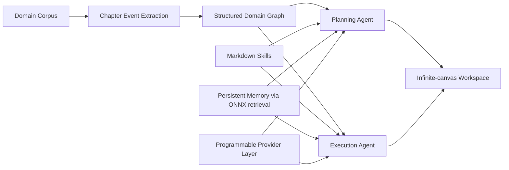
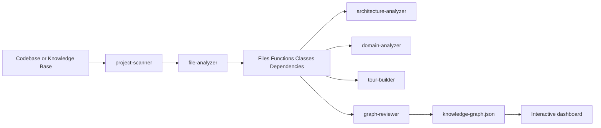
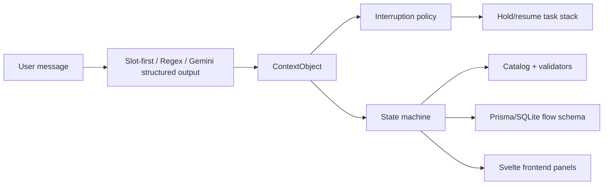
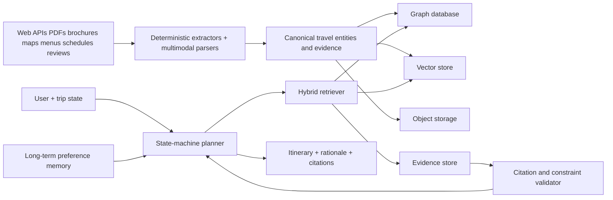

# Deep Technical Review of the Provided Repositories for Building a Graph RAG Travel Planner

## Executive summary

Across the repositories you shared, the most reusable design pattern is not “plain RAG,” but a layered system that combines deterministic extraction, explicit graph structure, constrained agent planning, and verifiable evidence. The clearest examples are Understand-Anything’s Tree-sitter-plus-LLM pipeline for reproducible structural graphs, GraphRAG-Code’s explicit graph database plus bidirectional Personalized PageRank, RAG-Anything’s multimodal parsing and query pipeline built around LightRAG, Conversational State Machine’s schema-driven dialog runtime, and Medical Citation Agent’s deterministic extraction with line-level citations. Put together, those projects point toward a travel system that should not rely on a single vector search over chunks; it should combine a canonical travel graph, vector retrieval, stateful planning, and a citation layer. citeturn16view4turn23view0turn29view0turn30view3turn16view0turn26view3turn27view3

Toonflow-app adds an especially useful product lesson: domain-specific graph extraction and memory are more valuable than generic “chat with docs.” Toonflow explicitly emphasizes persistent agent memory, externalized skill prompts, programmable provider logic, and chapter-event graph extraction, while the starter travel app in awesome-llm-apps shows the opposite end of the spectrum: a fast, simple researcher–planner pipeline that is easy to ship but too weak to guarantee factual, constraint-aware itineraries at scale. The Vietnamese Nemotron persona dataset is a strong supplement for traveler-style adaptation and evaluation, not for factual travel knowledge. citeturn32view2turn32view4turn32view5turn42view0turn40view0turn40view1

The best MVP for your use case is therefore a hybrid stack: multimodal ingestion for brochures, maps, PDFs, menus, and schedules; a graph database for explicit travel entities and relationships; a vector store for fuzzy recall; a state-machine planner for iterative clarification and interruption handling; and a citation-aware verifier for every nontrivial travel fact that reaches the user. That recommendation is not copied from any one repo; it is the synthesis that best fits the repeated patterns visible across the repos you supplied. citeturn29view0turn30view3turn23view0turn16view0turn26view3turn32view2

## Research scope and comparison snapshot

This review is a static source analysis. I inspected repository READMEs, file trees, exposed source files, config files, package manifests, and selected tests/docs where available through the public GitHub and Hugging Face pages you provided. I did not execute untrusted code, and for the larger repositories I prioritized the modules most relevant to RAG, graph construction, retrieval, multimodal processing, planner/agent loops, evaluation, deployment, and security.

| Repository | What it is | Most reusable lesson for your Graph RAG travel planner |
|---|---|---|
| `HBAI-Ltd/Toonflow-app` | TypeScript/Express/Electron AI production backend with persistent memory, externalized skills, provider abstraction, and chapter-event graph extraction. | Borrow the idea of **domain graph extraction + external skills + multi-tier memory**, but avoid coupling the core planner to a domain-specific monolith. citeturn32view2turn32view4turn32view5turn18view4turn34view0 |
| `Egonex-AI/Understand-Anything` | Multi-agent code/knowledge graph system with Tree-sitter facts, LLM semantic enrichment, graph review, tours, and dashboard packaging. | Borrow **deterministic structure first, semantic enrichment second**, plus incremental graph refresh and reviewer agents before publishing graph updates. citeturn14view0turn15view0turn16view4turn35view0turn36view0turn38view0 |
| `Shubhamsaboo/awesome-llm-apps` | Large template repo; includes a simple AI travel agent with researcher + planner and `.ics` export. | Borrow the **fast MVP travel UX**, but replace web-only planning with graph retrieval, validation, and evidence handling. citeturn16view3turn42view0 |
| `x1xhlol/system-prompts-and-models-of-ai-tools` | Large archive of prompts, tool descriptions, and model metadata across many AI products. | Use it as a **prompt-pattern study corpus**, not as a dependency; pay attention to provenance, licensing, and drift. citeturn39view2turn13view0 |
| `microsoft/ai-agents-for-beginners` | Educational course repo with lessons on agentic RAG, planning, memory, trust, protocols, and context engineering. | Borrow the **maker-checker iterative loop** and the idea that agency is mostly about controlled reasoning over tools and memory, not arbitrary autonomy. citeturn39view3turn41view0 |
| `HKUDS/RAG-Anything` | Multimodal document-processing and query stack built around LightRAG, parsers, context extraction, modal processors, and cached multimodal querying. | Borrow the **multimodal ingestion and retrieval layer** for travel PDFs, timetables, brochures, maps, museum guides, and menu scans. citeturn29view0turn30view3turn31view2turn30view7turn29view7 |
| `titanwings/colleague-skill` | Persona/skill distillation project that turns source material plus descriptions into a reusable “skill.” | Borrow the **persona packaging idea** for traveler styles and assistant tone, but keep style separate from factual planning. citeturn14view2 |
| `BloopAI/vibe-kanban` | Planning/review workbench for coding agents with kanban issues, workspaces, diff review, previewing, and multiple agent backends. | Borrow the **operator workflow**: issue-based planning, review surface, and human-in-the-loop feedback loops for itinerary quality control. citeturn42view1turn40view5 |
| `bydecom/conversational-state-machine` | Prisma-backed, interruption-aware dialog runtime with slot filling, LIFO hold/resume queue, and constrained Gemini structured output. | Borrow the **conversation engine** for multi-intent travel planning, pauses, resumptions, and slot constraints. citeturn14view3turn16view0turn15view7 |
| `bydecom/graphrag-code` | AST-to-graph system with SQLite, rustworkx, bidirectional PPR, and MCP tools for contextual retrieval and blast-radius analysis. | Borrow the **explicit graph scoring layer**: graph traversal should rank context differently for explanation vs. impact vs. next-step planning. citeturn14view4turn23view0turn23view2turn24view0 |
| `bydecom/medical-citation-agent` | Deterministic extraction tool with regex + SciSpaCy + line-level citations wrapped as an MCP tool. | Borrow the **evidence abstraction**: every important travel fact shown to users should carry source IDs and line/section references where possible. citeturn14view5turn15view3turn26view3turn27view3 |
| `bydecom/e-commerce-project` | Full-stack production monorepo with Express/Angular/Prisma plus Qdrant, RabbitMQ, S3/MinIO, Redis, and Gemini. | Borrow the **production plumbing**: queues, object storage, vector DB, rate limits, and worker separation. citeturn15view4turn16view2turn18view3 |
| `bydecom/container-bay-plan-validator` | Deterministic parser + state model + rule engine + UI for validating container stowage plans. | Borrow the **constraint-validation architecture** for itinerary feasibility checks, not the maritime domain logic itself. citeturn16view1turn40view2turn40view3turn40view4 |
| `nvidia/Nemotron-Personas-Vietnam` | Synthetic Vietnamese persona dataset with 100k train rows and multiple persona facets including travel persona. | Use it for **persona conditioning and evaluation**, not as factual travel ground truth. citeturn40view0turn40view1 |

## Core repository analyses

**Toonflow-app**

Toonflow is not a travel system, but it is one of the strongest examples here of how a domain product becomes dramatically better when it extracts and stores domain structure instead of repeatedly re-reading long text. Its README highlights an infinite-canvas production workspace, a three-layer agent collaboration model, persistent cross-session memory built on local ONNX vector retrieval, programmable provider logic in TypeScript, chapter-event graph-driven adaptation, and skill-file prompt externalization. Its stack is TypeScript on Express and Electron with SQLite, Socket.IO, Vercel AI SDK integrations, local Hugging Face Transformers ONNX inference, and Docker. The file tree shows domain-localized agents and route groups for novels, scripts, production, tasks, model selection, settings, and agent memory. citeturn32view2turn32view4turn32view5turn18view4turn33view0turn34view0

The architectural lesson is that your travel planner should store a canonical graph of cities, POIs, transport links, constraints, and user intent state, not only free-form chat history. Toonflow’s “event graph” could become a “trip graph”; its persistent memory could become traveler preference memory; its skill files could become domain prompts for “budget trip,” “family trip,” “food trip,” and “visa-sensitive trip.” The main technical risk is that Toonflow appears to concentrate many concerns into a single backend; a travel system should keep provider execution, graph extraction, planning, and validation as separate services or modules. The programmable provider mechanism is powerful, but in a travel product it would need strict sandboxing and secret isolation. citeturn32view2turn32view5turn34view0



The most important files and folders visible in the public tree are summarized below.

| Important path | Why it matters for your use case |
|---|---|
| `src/agents/productionAgent`, `src/agents/scriptAgent` | Shows how Toonflow separates high-level content-planning modules by responsibility. |
| `src/routes/agents`, `src/routes/novel`, `src/routes/script`, `src/routes/production`, `src/routes/task`, `src/routes/setting` | Indicates that runtime orchestration, graph/domain data, and task execution are routed as explicit backend modules. |
| `data/skills/` | Confirms prompt externalization as editable skill files. |
| `data/models/` | Suggests local inference assets are treated as first-class runtime resources. |
| `src/app.ts`, `src/core.ts`, `src/env.ts` | Standard backend composition and environment boundaries. |

These paths and responsibilities are drawn from the README stack/structure sections and the root/source route trees. citeturn32view5turn18view4turn34view0

**Best reuse for travel Graph RAG:** adopt the memory tiers, agent-skill externalization, and graph-first domain extraction. **What not to copy directly:** the product-specific canvas workflow and the likely high coupling of many creative features into a single backend. **Tests to add if you port the pattern:** graph extraction regression tests from guidebooks or destination pages, memory recall quality tests across sessions, and provider sandbox tests. citeturn32view2turn32view5

**Understand-Anything**

Understand-Anything is the cleanest “deterministic graph + semantic layer” design in the set. The README describes it as a Claude Code plugin that scans a project with a multi-agent pipeline, extracts files/functions/classes/dependencies, and saves a knowledge graph to `.understand-anything/knowledge-graph.json`. The under-the-hood section explicitly splits Tree-sitter’s deterministic structural extraction from LLM-based semantic summaries, layer assignments, domain mapping, and guided tours. It also lists specialized agents such as `project-scanner`, `file-analyzer`, `architecture-analyzer`, `tour-builder`, `graph-reviewer`, `domain-analyzer`, and `article-analyzer`. The plugin is organized into a core package, a dashboard package, source helpers such as context/diff/explain/onboard builders, skill commands, and prompt/agent markdown files. citeturn14view0turn15view0turn16view4turn35view0turn36view0turn36view1turn36view2turn38view0

For a travel planner, this repo’s deepest lesson is methodological: in your ingestion pipeline, anything that can be extracted deterministically should be extracted deterministically first. POI names, coordinates, opening-hour fields, route tables, geographic containment, fare tables, and extracted wikilinks or references should be machine-parsed into stable graph edges. Only after that should an LLM add semantic summaries like “good for kids,” “quiet neighborhood,” or “romantic dinner spot.” The repo’s graph-reviewer idea is especially valuable: every graph update should pass a graph integrity check before being released to users, exactly because travel graphs are highly error-sensitive. citeturn16view4turn15view0



A compact important-file map is below.

| Important path | Why it matters |
|---|---|
| `agents/*.md` | Prompt/role definitions for the different analysis agents. |
| `skills/understand*` | User-facing commands and workflows, including explain, dashboard, diff, domain, knowledge, and onboard modes. |
| `src/context-builder.ts`, `src/diff-analyzer.ts`, `src/explain-builder.ts`, `src/onboard-builder.ts`, `src/understand-chat.ts` | Orchestration helpers for context generation and user-facing analysis tasks. |
| `packages/core/` | Core engine package. |
| `packages/dashboard/` | Browser/UI layer for graph visualization. |

The mapping above comes directly from the repo tree and package structure. citeturn35view0turn36view0turn36view1turn37view0turn38view0

**Retrieval and embedding notes:** the public material clearly shows graph JSON output and fuzzy/semantic search, but the exact vector storage and embedding backend are not exposed in the inspected files. That is a useful warning for your own project: document the retrieval contract explicitly, not only the UI behavior. **Strengths:** reproducible graph edges, multi-agent review, incremental re-analysis, dashboard separation. **Weaknesses:** plugin coupling and potential cost/latency from LLM-heavy semantic layers. **Priority recommendations:** add an explicit graph schema document, expose retrieval/embedding backends as configuration, and create a travel-domain analog of `graph-reviewer` for factual edge validation. citeturn14view0turn15view0turn16view4

**RAG-Anything**

RAG-Anything is the most directly useful ingestion layer for travel because travel data is not only text. The code exposes a `RAGAnything` dataclass that combines `QueryMixin`, `ProcessorMixin`, and `BatchMixin`; a config class with environment-backed dataclass fields; parser support for office document types; a `ContextExtractor`; and specialized modal processors for images, tables, equations, and generic content. The query layer supports multiple modes including `local`, `global`, `hybrid`, `naive`, `mix`, and `bypass`, plus multimodal content enhancement, VLM-enhanced querying, and cache handling. It initializes LightRAG storage plus parse and multimodal status caches before wiring processors. citeturn29view0turn29view7turn30view3turn31view2turn30view7turn30view9turn31view4

For travel, this is the repo that tells you how to ingest PDFs from tourism boards, operating manuals for transit systems, museum brochures, menus, event flyers, scanned maps, and image-heavy itineraries. A plain text RAG stack will miss critical information embedded in tables, captions, or images; this project gives the shape of a production-ready answer to that problem. The main caveat is complexity: LightRAG is a powerful dependency, but it becomes another subsystem you must understand and monitor. If you borrow the pattern, keep the multimodal layer modular so you can replace it without rewriting the planner. citeturn29view0turn30view3turn31view2


A compact file map:

| Important path | Why it matters |
|---|---|
| `raganything/raganything.py` | Main orchestration class and LightRAG initialization flow. |
| `raganything/query.py` | Core query modes, multimodal query enhancement, cache flows, VLM handling. |
| `raganything/parser.py` | Document parsing entry points and file-type handling. |
| `raganything/modalprocessors.py` | Specialized processors and context extraction for modal data. |
| `raganything/config.py` | Environment-backed configuration object. |

Those paths and roles are visible directly in the package tree and source files inspected. citeturn28view0turn28view1turn28view2turn28view4turn28view5

**Graph/data model note:** in the inspected files the graph schema is mostly abstracted behind LightRAG rather than exposed as a simple standalone schema document. **Recommendation:** if you adapt this repo’s ideas, define your own explicit travel graph in parallel to LightRAG chunks and entity stores so your planner can reason over stable IDs, not only retrieved chunks. **Tests to add:** PDF parser regression tests for schedules and fare tables, caption extraction tests for maps and attraction images, and cache correctness tests when source documents change. citeturn29view0turn30view3turn31view2turn31view4

**Conversational State Machine**

This repo is the best planner/runtime design for your user-facing dialog. Its README says it implements enterprise dialog patterns such as context switching, slot filling, interruption policies, and a hold/resume task queue in a schema-driven runtime. The NLU pipeline first tries slot-first catalog/quick-reply matching, then regex triggers, then Gemini structured output constrained by enums built from the database and catalog. Its backend uses Express, TypeScript, Prisma, and SQLite; the frontend uses Svelte; and the project structure explicitly points to `context.service.ts`, `context-switch.policy.ts`, `state.machine.ts`, `nlu.engine.ts`, `schema.builder.ts`, `catalog.service.ts`, and a central `ContextObject` model. citeturn14view3turn16view0turn15view7turn18view2

This is exactly how a travel planner should behave when people say things like, “Actually, move Kyoto earlier,” “Pause that and show me beach options,” or “Keep the hotel, change the food plan.” The hidden power here is not the LLM; it is the serialized task state and interruption policy. If you use a free-form agent loop without this kind of state machine, itinerary planning often becomes brittle the moment the user changes one subtask while preserving others. The repo also shows the value of constrained output schemas built from real enums and catalog values; in travel, that should become city IDs, hotel classes, transport mode enums, dietary flags, budget bands, and visa constraints. citeturn14view3turn16view0



A compact file map:

| Important path | Why it matters |
|---|---|
| `backend/prisma/schema.prisma`, `backend/prisma/seed.ts` | Flow schema and initial data model. |
| `backend/src/models/types.ts` | Central state snapshot types. |
| `backend/src/services/context.service.ts` | Main orchestration runtime and task queue logic. |
| `backend/src/services/state.machine.ts`, `nlu.engine.ts`, `schema.builder.ts` | The core flow engine, constrained NLU, and response schema builder. |
| `docs/IMPLEMENTATION.md` and `frontend/src/components/*` | Architecture reference and monitoring UIs. |

This mapping is taken from the README’s project structure and stack sections. citeturn16view0turn15view7

**Strengths:** explicit state, interruption handling, schema-driven runtime, constrained NLU. **Weaknesses:** larger orchestration file size and visible Gemini coupling in the current implementation. **What to port first:** `ContextObject`, `TaskSnapshot`, LIFO resume queue, and enum-constrained structured outputs. **What to test:** resumption fidelity, cross-task contamination, budget-slot preservation, and negation handling such as “not too expensive,” “no red-eye flights,” and “not more than two hotel changes.” citeturn16view0turn14view3

**GraphRAG-Code**

GraphRAG-Code is the strongest explicit graph retrieval implementation among the repos. Its README describes a Python-native code knowledge graph using bidirectional Personalized PageRank, and the code confirms the architectural pipeline: Tree-sitter parsing into SQLite tables, loading into an in-memory rustworkx graph, then exposing PPR-powered tools through an MCP server. The indexer creates `files`, `symbols`, and `edges` tables plus a `resolved_edges` view, and extracts `call`, `import`, `extends`, and containment edges. The graph engine defines multiple backward-weight modes and runs forward PageRank for downstream dependencies plus reverse-graph PageRank for upstream consumers. The MCP server then exposes tools like `get_pruned_context`, `get_callers`, `get_impact`, `get_context`, `plan_change`, and `list_symbols`. citeturn14view4turn23view4turn24view0turn24view1turn24view4turn23view0turn23view2turn21view5turn22view3turn22view4

For travel, this repo gives you the missing middle layer between graph storage and planner prompts: a scoring function over explicit graph structure. In your system, the same concept could rank “what else matters to this attraction?” or “what downstream itinerary segments break if I move this hotel?” Forward-biased graph scoring can prioritize feasible next activities and dependencies; backward-biased scoring can estimate change impact across reservations, transfer windows, or ticket dependencies. This pattern is far more powerful than asking an LLM to infer graph importance from raw retrieved chunks. citeturn23view0turn22view4


A compact file map:

| Important path | Why it matters |
|---|---|
| `src/graphrag_code/indexer.py` | Graph construction, schema creation, AST capture, edge extraction. |
| `src/graphrag_code/graph_engine.py` | In-memory graph load, symbol resolution, bidirectional PPR. |
| `src/graphrag_code/mcp_server.py` | Retrieval tools and tool-facing API surface. |
| `src/graphrag_code/cli_agent.py` | Example of an agent loop that consumes the tools. |
| `src/graphrag_code/export_graph.py` | Useful if you want explicit graph export/inspection. |

These files come directly from the package tree and source pages. citeturn19view1turn20view0turn20view1turn20view2turn20view3

**Weaknesses and risks:** the inspected indexer is Python-specific, symbol-centric, and not multimodal; it has no dense semantic layer by itself. **Fix that in travel:** keep the PPR engine, but seed it from vector retrieval and canonical entity IDs rather than code symbols. **Tests to add:** edge-resolution accuracy, ambiguous entity disambiguation, top-k graph-retrieval recall, and “plan change” correctness for trip edits such as moving hotel, transport change, or deleting one attraction. citeturn23view2turn24view0turn22view4

**Medical Citation Agent**

Medical Citation Agent is important even though it targets medicine because it shows how to build a deterministic evidence layer instead of hiding all truth behind a planner model. The repo states that it extracts—not generates—claims from structured OpenFDA labels, and the source confirms a `FastMCP` server with an `extract_claims` tool that loads label text, splits and patterns sentences, builds `MedicalClaim` objects, deduplicates them, and filters them through a `SafetyGuardrail`. The data model is simple and strong: `MedicalClaim` contains a `CitationSource` with `document_id`, `start_line`, `end_line`, and `raw_text`, plus confidence and entities. The extractor uses regex patterns and SciSpaCy-based entity extraction with heuristic typing; the verifier loads `safety_rules.json` and blocks high-risk claims without explicit contraindication language. The tests and evaluation harness are explicitly called out in the README. citeturn14view5turn15view3turn26view3turn26view4turn27view0turn27view1turn27view3turn26view5

For travel, this pattern should become a `TravelFact` abstraction. Every itinerary fact that matters—visa rule, ticket rule, opening hours, blackout dates, baggage constraint, shuttle time, cancellation deadline—should be represented as a structured claim tied to a source section, page, line span, or URL fragment. That is the difference between a nice-looking itinerary and a trustworthy one. This repo also demonstrates the benefit of domain-specific guardrails: not all retrieved text should be surfaced just because it matches keywords. In travel, the analog would be blocking stale prices, outdated opening times, or region-wide statements that do not apply to the specific venue or season. citeturn26view3turn27view3turn26view5


A compact file map:

| Important path | Why it matters |
|---|---|
| `src/extractor.py` | Sentence loading, regex matching, entity extraction, claim assembly. |
| `src/mcp_server.py` | Minimal, clean tool wrapper around the extraction pipeline. |
| `src/models.py` | Excellent citation-aware data model you can directly imitate. |
| `src/verifier.py`, `src/safety_rules.json` | Guardrail pattern for blocking unsafe or underspecified claims. |
| `tests/*`, `eval_cases.json`, `eval_matching.py` | Regression and evaluation harness design. |

These paths and roles are explicitly documented in the README and source tree. citeturn15view3turn18view1turn26view3turn26view4turn26view5

## Supporting repository analyses

The remaining repositories are still useful, but more as scaffolding, operational inspiration, prompt-pattern research, or UX references than as direct Graph RAG cores.

| Repository | Concise executive summary | Key files/modules visible | Most practical reuse |
|---|---|---|---|
| `Shubhamsaboo/awesome-llm-apps` | A large original template/cookbook repo covering agents, teams, MCP, RAG, voice, and fine-tuning. The included `ai_travel_agent` is intentionally simple: a researcher uses SerpAPI, a planner uses GPT-4o, and the app exports `.ics`. | `starter_ai_agents/ai_travel_agent/{README.MD, travel_agent.py, local_travel_agent.py, requirements.txt}`. citeturn16view3turn42view0 | Use it for your first demo UI and calendar export, but replace its web-only retrieval with graph retrieval and evidence-backed planning. citeturn42view0 |
| `x1xhlol/system-prompts-and-models-of-ai-tools` | A very large GPL-licensed archive of prompts/tools/model metadata for many AI products and coding assistants. | Top-level folders per vendor/tool plus `README.md` and `LICENSE.md`. citeturn39view2turn13view0 | Useful for prompt-shape study: tool calling conventions, guardrail phrasing, role separation, and system prompt style. Do not depend on it as core runtime logic, because provenance and drift matter. citeturn39view2 |
| `microsoft/ai-agents-for-beginners` | A course repo rather than a framework. It spans planning, trust, memory, protocols, context engineering, and an explicit `05-agentic-rag` lesson. | Lesson folders such as `05-agentic-rag`, `07-planning-design`, `13-agent-memory`, `18-securing-ai-agents`, plus `AGENTS.md`, `README.md`, `STUDY_GUIDE.md`. citeturn39view3turn41view0 | Best used as conceptual guardrails for maker-checker loops, memory boundaries, governance, and trust. citeturn41view0 |
| `titanwings/colleague-skill` | A persona/skill-distillation project that turns source material and descriptions into a reusable “skill” that imitates voice and frame. | Main public entry point is the branch README on `dot-skill`. citeturn14view2 | Good for traveler persona conditioning and assistant style evaluation. Keep it strictly separated from factual trip planning so tone cannot overwrite truth. citeturn14view2 |
| `BloopAI/vibe-kanban` | A Rust + Node agent-workbench product for planning, running, reviewing, and shipping work with multiple coding agents. The README shows kanban planning, workspace execution, built-in browser preview, diff review, and PR workflows. | `CLAUDE.md`, `Cargo.toml`, `Dockerfile`, `package.json`, `README.md`. citeturn40view5turn42view1 | Borrow the operator workflow: queue work, inspect diffs, preview outputs, and give inline review feedback. For travel, this becomes itinerary QA, source review, and human approval surfaces. citeturn42view1 |
| `bydecom/e-commerce-project` | A production-oriented monorepo with Express/TypeScript/Prisma backend, Angular frontend, Redis, RabbitMQ, S3/MinIO, and Qdrant Cloud for vector search plus Gemini integration. | `backend/prisma/schema.prisma`, `backend/src/modules/ai`, config for Redis/RabbitMQ/storage, infrastructure files, Angular frontend. citeturn15view4turn16view2turn18view3 | This is the clearest production-ops template in your set. Borrow queues, object storage, vector-service separation, rate limiting, and environment discipline. citeturn16view2 |
| `bydecom/container-bay-plan-validator` | A deterministic validator that parses spreadsheets into a logical grid/state model, runs business-rule validation, and renders UI results. | `main.py`, `file_reader.py`, `bay_object.py`, `validator.py`, `visualizer.py`, `UI_Components/*`. citeturn40view2turn40view3 | The architecture is perfect for itinerary feasibility checks: parse inputs, build state, run deterministic rules, present violations. That is exactly what you need for travel-time, budget, opening-hour, and reservation-conflict validation. citeturn40view3turn40view4 |

## Dataset assessment

`nvidia/Nemotron-Personas-Vietnam` is a synthetic Vietnamese dataset published on Hugging Face with Vietnamese language content, parquet format, a single `train` split of 100k rows, and a CC BY 4.0 license. Its schema includes 21 fields: a `uuid`, six narrative persona fields such as `professional_persona`, `sports_persona`, `arts_persona`, `travel_persona`, `culinary_persona`, and a concise `persona`, plus supporting demographic, geographic, cultural, and attribute fields such as `cultural_background`, `skills_and_expertise`, `sex`, `age`, `marital_status`, `education_level`, `occupation`, `zone`, `region`, and `country`. The dataset card explicitly frames it as synthetic data for expanding Vietnamese sovereign AI model diversity and reducing bias. citeturn40view0turn40view1

For your product, its best use is persona conditioning and evaluation. It is especially relevant because it includes `travel_persona` and related narrative fields, which means you can derive Vietnamese user archetypes such as backpacker, family planner, luxury traveler, slow traveler, domestic food traveler, or older traveler with comfort preferences. It is not a destination knowledge base, not a venue dataset, and not a fact source for hotels, visas, routes, or attractions. Treat it as style/context data, not factual retrieval data. citeturn40view1turn40view0

A strong preprocessing pipeline for your use case would do four things. First, normalize the categorical fields and bucket ages and household context into product-facing traveler profiles. Second, distill the six narrative persona fields into structured preference vectors such as risk tolerance, budget sensitivity, mobility level, food adventurousness, and activity density. Third, generate evaluation personas from the dataset to test whether your planner adapts correctly to Vietnamese users. Fourth, keep the raw dataset out of the main travel-retrieval index; it belongs in persona generation, personalization, and evaluation stores. citeturn40view1turn40view0

## Recommended target architecture for a Graph RAG travel itinerary system

The architecture that best fits the repeated lessons from these repositories is a five-layer system: deterministic extraction, multimodal ingestion, canonical travel graph, hybrid retrieval, and stateful planning. Deterministic extraction comes from the Understand-Anything and Medical Citation Agent pattern; multimodal ingestion comes from RAG-Anything; graph scoring comes from GraphRAG-Code; conversation runtime comes from Conversational State Machine; memory and skill modularity come from Toonflow; and production plumbing comes from the e-commerce monorepo. citeturn16view4turn26view3turn29view0turn23view0turn16view0turn32view2turn16view2



A practical graph schema for travel should be explicit and durable. The core node types should be `Country`, `Region`, `City`, `Neighborhood`, `POI`, `Hotel`, `Restaurant`, `Activity`, `TransitHub`, `Route`, `Event`, `VisaRule`, `OpeningHours`, `PriceSnapshot`, `WeatherNorm`, `User`, `Trip`, `DayPlan`, `Slot`, `Preference`, and `Evidence`. The key edge types should include `IN_REGION`, `IN_CITY`, `NEAR`, `REACHABLE_BY`, `BEST_IN_SEASON`, `HAS_PRICE`, `HAS_HOURS`, `REQUIRES_DOCUMENT`, `SUITED_FOR`, `CONFLICTS_WITH`, `CITES`, `PREFERS`, `AVOIDS`, `VISITS`, `STAYS_AT`, and `TRANSIT_TO`. That schema is the natural travel analog of the explicit structural graphs and citation-bearing claims used in Understand-Anything, GraphRAG-Code, and Medical Citation Agent. citeturn16view4turn24view0turn26view4

The retrieval path should be hybrid from day one. Start with dense retrieval against descriptions, reviews, and policy text; seed the graph with the top entity IDs; expand through weighted graph traversal; run deterministic filters for budget, transit windows, opening hours, visa constraints, and season; then hand the filtered context to the planner. This means the planner receives compact, graph-expanded, evidence-rich context instead of a random pile of top-k chunks. That is exactly the advantage GraphRAG-Code demonstrates for code context and what RAG-Anything demonstrates for multimodal retrieval. citeturn23view0turn22view3turn30view3turn31view2

The planner itself should not be a single stateless prompt. Use a state machine with explicit task snapshots, interruption policies, and constrained structured output. A travel conversation often contains simultaneous subgoals—destination discovery, hotel choice, transport changes, visa concerns, food preferences, family constraints—and the Conversational State Machine repo shows how to keep those subgoals from collapsing into chat-history soup. Use fixed enums where possible and schema-built outputs where the domain is bounded. citeturn16view0turn14view3

The final answer layer should adopt the Medical Citation Agent mindset. Every itinerary day can still be written naturally, but each nontrivial factual assertion should point to a supporting evidence object: “museum closed Tuesdays,” “JR pass not worth it on this route,” “hotel check-in 15:00,” “seasonal event only on weekends,” “boat operates only in dry season,” and so on. When evidence is weak or conflicting, the planner should explicitly say so. That is how you reduce hallucination risk without destroying UX. citeturn26view3turn27view3turn26view5

A code-level integration sketch could look like this:

```python
from dataclasses import dataclass
from typing import List, Dict

@dataclass
class Evidence:
    source_id: str
    section: str
    text: str
    confidence: float

@dataclass
class TravelEntity:
    entity_id: str
    kind: str
    name: str
    city_id: str
    attrs: Dict

def ingest_entity(entity: TravelEntity, embedding: List[float], evidences: List[Evidence]):
    # Graph write
    neo4j.run(
        """
        MERGE (e:Entity {id:$id})
        SET e.kind=$kind, e.name=$name, e.city_id=$city_id, e.attrs=$attrs
        """,
        id=entity.entity_id, kind=entity.kind, name=entity.name,
        city_id=entity.city_id, attrs=entity.attrs,
    )

    # Vector write
    qdrant.upsert(
        collection_name="travel_entities",
        points=[{
            "id": entity.entity_id,
            "vector": embedding,
            "payload": {"kind": entity.kind, "city_id": entity.city_id}
        }]
    )

    # Evidence write
    for ev in evidences:
        neo4j.run(
            """
            MERGE (s:Source {id:$sid})
            SET s.section=$section, s.text=$text, s.confidence=$confidence
            WITH s
            MATCH (e:Entity {id:$eid})
            MERGE (e)-[:CITES]->(s)
            """,
            sid=ev.source_id, section=ev.section, text=ev.text,
            confidence=ev.confidence, eid=entity.entity_id
        )
```

And the hybrid retrieval path could be structured like this:

```python
def retrieve_for_planner(query: str, trip_state: dict):
    dense_hits = qdrant.search(
        collection_name="travel_entities",
        query_vector=embed(query + " " + trip_state["preference_summary"]),
        limit=20,
        query_filter={"must": [{"key": "city_id", "match": {"value": trip_state["target_city"]}}]}
    )

    seed_ids = [hit["payload"]["entity_id"] for hit in dense_hits]
    graph_hits = graph_expand_with_weights(
        seed_ids=seed_ids,
        objectives={
            "downstream_context": 0.3,   # related activities / nearby POIs / transport links
            "impact": 0.8                # what changes if hotel or transport changes
        },
        constraints=trip_state
    )

    feasible = [h for h in graph_hits if deterministic_constraints_pass(h, trip_state)]
    cited = attach_evidence(feasible)
    return rerank_for_planner(query, trip_state, cited)[:12]
```

If you want one design sentence to remember, it is this: **vector search should recall candidates, graph traversal should organize them, deterministic rules should filter them, and the planner should narrate them.** That single sentence is the common architectural thread running through the best parts of the repos you supplied. citeturn23view0turn16view0turn26view3turn29view0

## Migration plan and implementation snippets

A practical MVP-to-scale plan should move in phases rather than starting with “general AI travel assistant.” The evidence from the repos argues strongly for building the structural substrate first, then the planner, then the polish. The order below reflects exactly that lesson: first deterministic extraction and graph identity, then hybrid retrieval, then stateful planning, then evidence and validation, then productionization. citeturn16view4turn23view0turn16view0turn26view3

| Milestone | Deliverable | Estimated effort | Why this order is right |
|---|---|---:|---|
| Canonical schema and source registry | Define travel entities, evidence objects, graph edges, and source inventories. | 8–12 hours | Without this, later RAG and planning layers become hard to debug. |
| Deterministic ingestion | Build extractors for POIs, hours, prices, coordinates, route tables, and source metadata. | 16–24 hours | Mirrors the strongest pattern from Understand-Anything and Medical Citation Agent. |
| Multimodal ingestion | Add PDF/table/image parsing for brochures, maps, menus, and public schedules. | 16–24 hours | This is the RAG-Anything layer you will miss immediately if you skip it. |
| Hybrid retrieval | Stand up vector store plus graph expansion/reranking. | 20–30 hours | GraphRAG becomes useful only when dense recall and graph traversal are combined. |
| Planner runtime | Implement stateful dialog with task snapshots, interruptions, and constrained structured outputs. | 16–24 hours | This is the Conversational State Machine lesson applied to trips. |
| Evidence and validator layer | Add fact citations and deterministic feasibility checks. | 12–20 hours | Citation and constraint engines are what make the planner reliable. |
| Persona and UX quality | Add Vietnamese traveler archetypes, memory, and style adaptation. | 12–18 hours | This should polish plans, not determine facts. |
| Production hardening | Queues, workers, storage boundaries, caching, and review tooling. | 20–40 hours | Borrow from the e-commerce and vibe-kanban production patterns. |

The MVP should therefore target four concrete user-visible wins. First, a user can ask for a trip and get a structured draft itinerary. Second, every important fact is linked to a source. Third, changing one sub-decision does not destroy the rest of the trip. Fourth, the system refuses impossible or weakly supported plans. If your MVP does those four things, it will already outperform most “travel agents” built as one-shot prompting wrappers around search APIs. citeturn42view0turn16view0turn26view3turn40view3

A minimal planner state-machine skeleton could look like this:

```python
class TravelPlannerFSM:
    def __init__(self):
        self.state = "collect_scope"
        self.on_hold = []
        self.context = {
            "destination": None,
            "days": None,
            "budget": None,
            "dietary": [],
            "mobility": None,
            "fixed_reservations": [],
            "citations_required": True,
        }

    def interrupt_with(self, new_task: dict):
        self.on_hold.append((self.state, self.context.copy()))
        self.state = new_task["state"]
        self.context.update(new_task.get("context", {}))

    def resume_previous(self):
        if self.on_hold:
            self.state, self.context = self.on_hold.pop()

    def next_action(self, user_msg: str):
        # Step 1: constrained parse -> fixed schema
        parsed = nlu_parse(user_msg, allowed_schema=current_schema(self.state))

        # Step 2: update state
        self.context = update_context(self.context, parsed)

        # Step 3: retrieve if enough slots are filled
        if ready_for_retrieval(self.state, self.context):
            retrieved = retrieve_for_planner(user_msg, self.context)
            validated = validate_trip_context(retrieved, self.context)
            return plan_with_citations(self.state, self.context, validated)

        # Step 4: otherwise ask for the next slot
        return ask_next_required_slot(self.state, self.context)
```

The most important tests to add early are also clear from these repos. You need graph extraction regression tests, retrieval relevance benchmarks, itinerary-feasibility tests, interruption/resumption tests, and citation-precision tests. Medical Citation Agent’s evaluation harness, Conversational State Machine’s runtime tests, and Understand-Anything’s graph-reviewer idea all point toward the same truth: if you do not test structure separately from generation, your system will look smart while failing in ways that are hard to catch. citeturn15view3turn16view0turn15view0

Finally, here is the prioritized build advice distilled to one line per stage. **For MVP:** copy the simple researcher–planner UX from the travel template, but replace its retrieval and planning core immediately. **For reliability:** imitate Medical Citation Agent and Container Bay Validator more than generic chat apps. **For scalability:** imitate the e-commerce monorepo’s operational separation and Vibe Kanban’s review flow. **For long-term product quality:** imitate Toonflow and Understand-Anything’s habit of externalizing prompts/skills and maintaining explicit domain structure over time. citeturn42view0turn26view3turn40view3turn16view2turn42view1turn32view5turn16view4