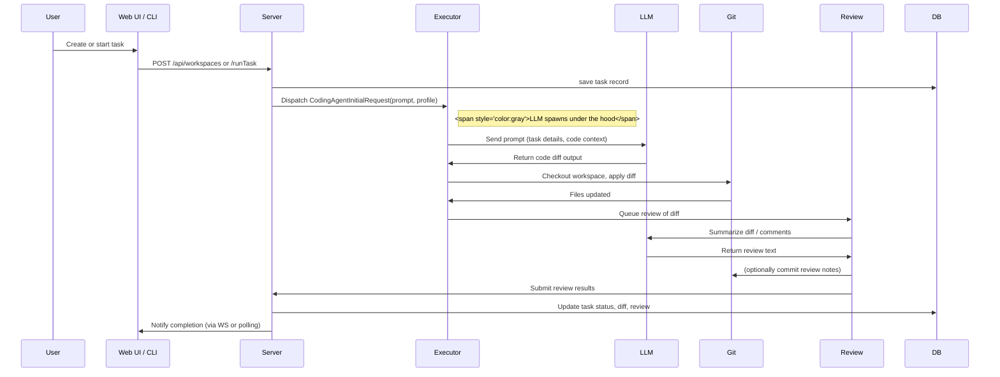
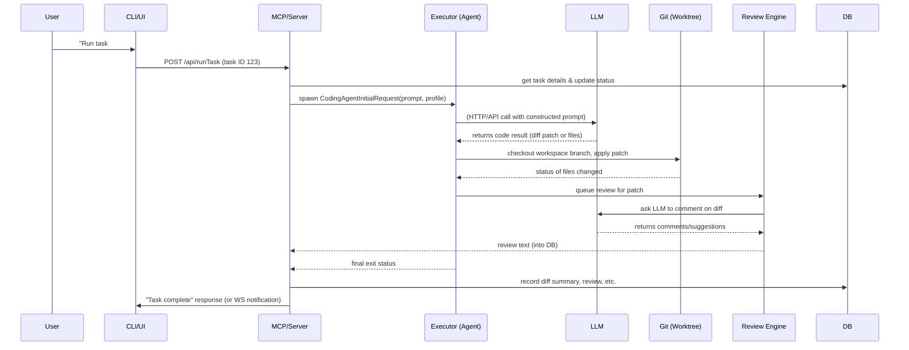

# Executive Summary  
Vibe Kanban is an open‐source **AI‑driven Kanban system for coding agents**, combining a Rust‑based backend with a React/TypeScript frontend (and optional desktop app via Tauri). It orchestrates **task planning, agent execution, and code review** in an integrated pipeline. Developers describe tasks as Kanban issues, the system spawns coding “agents” (LLMs like Claude Code, OpenAI, etc.) to implement them, and then reviews the results (diffs, comments, pull requests). The project supports multi-agent workflows (including Claude Code, Codex, Gemini CLI, Amp, etc. as of 2026). The local CLI (`npx vibe-kanban`) bundles the backend binaries (MCP server and review engine) and launches a local web server plus file system workspace, while self-hosted mode runs an Axum web server with SQLite, watchers, and optional code containers.

Technically, Vibe Kanban’s architecture consists of: a **Rust backend** (organized in many crates, including `server`, `services`, `executors`, `git`, `db`, `review`, `workspace-manager`, `worktree-manager`, etc.), a **Node/TypeScript CLI and frontend** (in `/npx-cli` and `/packages`), and **supporting libraries** (SQLx for DB, Tokio for async, fst/Moka for file search). It uses SQLite by default (with migrations via SQLx) and watches Git repositories for live updates. The system does **retrieval of code context** through a custom indexed file search (FST index with in-memory caching) rather than a vector database. Consequently, **no built-in vector store or embedding model** is present; instead, queries are answered via the file search cache. There is **no native graph database** – project and task relationships are stored in relational tables. Users can self-host (Dockerfile and Caddy config provided) or use the CLI for one-click local runs.

Below we detail the system architecture, module breakdown, data flow, and relevant technical components. We highlight the **RAG (Retrieval‑Augmented Generation)** aspects – essentially the local file retrieval and caching, and how LLM agents are invoked – and document key interfaces, classes, and runtime behavior. We also include a summary table of major modules (purpose, IO, deps) and illustrative diagrams (architecture and execution sequence). We presume familiarity with Rust async (Tokio/Axum), Web UI frameworks, and basic Kanban/CI concepts.

---

## Architecture Overview  

The system comprises three tiers: **(1) Frontend/CLI**, **(2) Backend services**, and **(3) Persistence/Execution**. In local mode, `npx vibe-kanban` launches a Node-based CLI that downloads `vibe-kanban-mcp` and `vibe-kanban-review` Rust binaries, starts a local HTTP server, and opens a React web UI. In server mode, the Rust `server` binary (an Axum app) listens on configurable ports (written to a temp file for the MCP to find). The UI (from `/packages/local-web` or `/packages/remote-web`) communicates with the backend via REST/WS calls. The backend, in turn, uses **SQLite** (via the `crates/db` and SQLx) for state, spawns **executor processes** for agent tasks, and may containerize runs via `crates/workspace-manager` and `crates/worktree-manager`.  

At runtime: the **UI/CLI** issues commands (e.g. create a task, run agents). The **MCP server** (Memory/Context Provider) coordinates execution – it interprets tasks into agent requests, invokes LLMs via the `executors` framework, applies file changes via Git worktrees, and calls the review engine to generate diffs/comments. Results update the DB and are reflected in the UI. A high-level architecture diagram:

```mermaid
graph LR
  subgraph Client
    CLI[CLI (Node.js)]
    UI[Web UI (React)]
  end
  subgraph Backend
    Server[(Rust Axum Server)]
    Services[(Services & Task Logic)]
    Executors[(Executor Daemon)]
    FileSearch[(File Search Cache)]
    ReviewEngine[(Review Engine)]
    DB[(SQLite Database)]
    GitFS[(Git Workspace / Filesystem)]
  end
  LLM[LLM API (Claude/OpenAI/etc.)]

  CLI -->|HTTP/API| Server
  UI -->|HTTP/API| Server
  Server --> Services
  Services --> FileSearch
  FileSearch --> GitFS
  Services --> Executors
  Executors --> LLM
  Executors --> GitFS
  Executors --> ReviewEngine
  ReviewEngine --> GitFS
  Executors -->|report results| Services
  Services --> DB
  Server --> DB
```

Key points:  
- **CLI/Web UI**: The local CLI is a thin JS wrapper (`npx-cli`) that either starts a headless “MCP server” (Rust) locally or connects to a hosted server. The React UI (in `/packages/local-web` or `/packages/remote-web`) provides the Kanban board, workspace preview, and configuration panels.  
- **Server**: The Rust `server` binary uses [Axum](https://docs.rs/axum) and Tokio. It handles authentication (via JWT, OAuth hooks in `services/auth.rs`), serves HTTP APIs (including WebSocket/live updates), and coordinates long-running tasks. It also includes a **preview proxy** on a subdomain for the dev server. On startup it **binds to dynamic ports** and writes them to a port file (see code at ), so that the MCP binary knows how to connect.  
- **Services Layer**: The crate `services` contains the core business logic: managing projects/issues (`services/approval.rs`, `services/repo.rs`), clustering code (`file_ranker.rs`), performing diffs (`diff_stream.rs`), etc. Notably, `file_search.rs` implements an **FST-indexed file search** over the Git workspace with caching (using `fst` and `moka` crates). This provides fast retrieval of relevant files given a query (modeled by `SearchQuery` and `SearchMode`).  
- **Executors**: The `executors` crate defines **Executable** tasks (like `CodingAgentInitialRequest`) which spawn coding agents. It selects an agent profile (OpenAI, Claude, etc.) from `ExecutorConfigs`, constructs prompts, and spawns the agent process. The agent’s output (code, messages) is captured by Vibe Kanban and committed via Git.  
- **Workspace/Worktree Managers**: `workspace-manager` and `worktree-manager` allocate and isolate code workspaces. A “workspace” is essentially a Git branch and file system where an agent runs; the worktree manager creates ephemeral Git worktrees for each task, ensuring isolation of branches and easy cleanup.  
- **Review Engine**: After code changes, `crates/review` can invoke an AI to summarize diffs or leave comments. It leverages similar executor patterns to call an LLM on the diff. The output (review content) is stored in the DB and shown inline.  
- **Persistence**: The `db` crate defines SQLx models and migrations for all entities (projects, tasks, approvals, etc.). By default it uses SQLite (in `~/.vibekanban/db.sqlite` or v2 file); in cloud mode it can use PostgreSQL (migrations support it). The application also caches some data in memory (e.g. the file search cache is `moka::Cache<PathBuf, CachedRepo>`).  

Overall, Vibe Kanban’s architecture is **event-driven and asynchronous**: user actions trigger HTTP requests; the server may enqueue background tasks (via Tokio tasks or message queues), spawn agent processes, and update the Kanban state. The **data flow** is illustrated below.



The above emphasizes **Retrieval-Augmented Generation (RAG)**: before sending a prompt to the LLM, Vibe Kanban often retrieves relevant code files. The File Search Cache builds an FST index of all files in the repository, then filters by search mode (e.g. exclude ignored files for task-queries). For a query, it does a substring search in the FST map (which yields file paths), then ranks them via `FileRanker` (based on length/complexity). Thus the LLM prompt can include snippets of high-priority files for context. This is a form of RAG without embeddings; it’s an exact-match search. Vibe Kanban does **not** natively support vector stores (e.g. Pinecone or Qdrant) or embeddings, nor does it use a graph database. It could be extended to use embeddings (e.g. embedding memos or docs) or a knowledge graph (the project’s architecture could integrate tools like [Graphify](https://github.com/vibekanban/graphify), as some community forks explore), but out-of-the-box it relies on its indexed file system as the “retrieval” layer.

Below is a **module summary table** of the main components:

| Module/Crate              | Purpose                                                         | Inputs                                  | Outputs / Effects                                | Dependencies                                |
|---------------------------|-----------------------------------------------------------------|-----------------------------------------|--------------------------------------------------|---------------------------------------------|
| **npx-cli (JS)**          | CLI launcher for local mode: downloads backend binaries, spawns MCP & Review processes, opens UI. Handles authentication. | CLI arguments, env vars                  | Launches web server/UI, invokes backend runs.   | Node.js, `child_process`, HTTP/TLS libs.   |
| **`crates/server`**       | Main backend server (Axum). Manages API routes, config, lifecycle. Coordinates deployment, port writing, and graceful shutdown. | HTTP/Web requests, env vars (HOST, PORT etc) | Serves REST/WebSocket endpoints, writes port file (see). Starts worker threads (e.g. cleanup). | Tokio, Axum, Tower HTTP, SQLx (SQLite), sentry, internal `services`. |
| **`crates/services`**     | Core business logic (task lifecycle, project management, file diff, notifications, OAuth). Contains submodules (e.g. `file_search.rs`, `file_ranker.rs`, `diff_stream.rs`, `oauth_credentials.rs`). | Requests from server (e.g. create task, search query) | Performs operations: caches repo index, executes diffs, posts events, pushes to DB. | `crates/db`, `crates/git`, `crates/executors`, tokio, sync primitives. |
| **`file_search.rs` (services)** | **File search index**: builds FST index of repo files and caches it with TTL. Provides search(query, mode) returning ranked file list. | Repo path, search query string, mode (TaskForm/Settings) | Vector of `SearchResult` (file paths matching query), updating cache in background. | `fst` (FST crate), `moka` (async cache), `ignore` (walkdir with .gitignore), notify for FS watch. |
| **`file_ranker.rs` (services)** | Ranks files by relevance (lines count) for display. Used by file_search. | List of file paths and stats | Sorts by heuristic. | Mostly internal.|
| **`crates/db`**           | **Database models and migrations**. Defines structs (`Project`, `Workspace`, `Task`, etc.) and runs SQLx migrations. | SQL migrations, queries (via SQLx macros) | SQLite (or Postgres) schema with tables/indices for all entities. | `sqlx` (SQLite/MySQL/Postgres), `ts_rs` (TypeScript bindings generation). |
| **`crates/git`**          | Git integration (wrapping libgit2 or CLI): clone repos, get status, commit, branch management. Also includes `embedded-ssh` for handling SSH keys. | Git URLs, local repo paths, commands | Checks out branches, applies diffs, clones repos etc. Returns commit SHAs, file changes. | `git2` crate, SSH support, Tokio for async git operations. |
| **`crates/workspace-manager`** | Manages project/workspace lifecycle. Creates workspaces (Git branches + file trees) for Kanban projects. | Project/task commands from UI/Server | Spawns or cleans up workspaces (directories) for tasks. | Uses `crates/git` and `crates/worktree-manager`. |
| **`crates/worktree-manager`** | Handles Git worktrees for concurrency. Ensures each workspace has isolated code directory. | Request to create or cleanup worktree | Creates a Git worktree for a given branch or commit, removes expired/orphaned worktrees. | Git, file-system operations. |
| **`crates/executors`**    | Defines **Executable** actions (e.g. `CodingAgentInitialRequest`). Spawns code agents. Stores executor profiles (executors use RSA keys, env variables). | Action requests (prompt, executor config) from services or server | Runs agent processes (may be local LLM or remote API). Returns a `SpawnedChild` handle and streams logs. | Async Process control, choice of LLM clients. Agent logic delegates to `executors::qa_mock` (for testing) or real agents (e.g. OpenAI/Claude APIs). |
| **`crates/review`**       | **Review engine**. Takes code diffs and invokes an LLM to produce summaries or inline comments. | Git diff (file changes) from workspace | Textual review content saved to DB / shown to user. | Likely reuses `executors` LLM invocation; reads diffs via `git`. |
| **`packages/local-web`**  | Frontend web app (React + Vite + Tailwind) for local mode. Implements Kanban UI, workspace preview (embedded browser), settings. | API responses from server | HTML/CSS/JS UI. | React, react-router, SWR for data fetching, Tailwind, Axios/fetch. |
| **`packages/remote-web`** | Similar React frontend for remote deployment (cloud mode). Features largely overlap local-web, with OAuth flow for sign-in. | API (auth via OAuth tokens, backend endpoints) | HTML/CSS/JS UI. | Same stack as local-web. |
| **`packages/ui`**         | Shared UI component library (buttons, inputs, modals, charts, icons) used by the web apps. | N/A (source code) | Reusable React components. | React, Tailwind CSS, headless UI libraries. |
| **`shared`**             | Shared TypeScript schemas and utility types between frontend and backend. Exports types (e.g. API payload shapes) for consistent typing. | N/A (source definitions) | TS/JS types, validation schemas. | `ts_rs` used on Rust side to generate TS types for some structs. |
| **`crates/tauri-app`**    | Desktop application bundling the local-web. It runs an embedded Node/Vite server and wraps it with a Tauri native window. | Built web assets | macOS/Windows/Linux app. | Tauri framework (Rust + Webview), packaging tools. |

The above table omits some auxiliary crates (e.g. `relay-*` for remote code streaming, `trusted-key-auth` for auth extensions) but covers the primary functionality. 

**Dependencies and Libraries:** On the backend side, the project heavily uses [Tokio](https://docs.rs/tokio) (async runtime), [Axum](https://docs.rs/axum) (HTTP server), [SQLx](https://docs.rs/sqlx) (DB access), [fst](https://docs.rs/fst) & [moka](https://docs.rs/moka) (file search), [git2](https://docs.rs/git2) (libgit2), and the [serde](https://docs.rs/serde) ecosystem (for data serialization and generating TS types via `ts-rs`). The frontend uses React, Vite, Tailwind CSS, SWR (for data fetching), and standard libraries. OAuth is supported via Google (see `services/oauth_credentials.rs` and UI login flows). The code is well-commented; key Rust functions (like `FileSearchCache::search`) illustrate how queries use cached FST indices. 

**RAG and Graph Aspects:** Vibe Kanban’s “retrieval” step is the FST-based file search service. Each repository’s files are indexed into a trie (`fst::Map<Vec<u8>>`). Searches are fast and can filter out ignored files based on `SearchMode`. This lets agents (and the system) retrieve relevant code snippets for prompt context. However, there is no **embedding model** or **vector store** used – queries are literal string search. Likewise, there is no native graph database or knowledge graph; tasks are linked by relational references (parent tasks, branches, etc.). In practice, the closest to a knowledge graph is the combination of Git metadata and task metadata in the DB. (The community has experimented with adding a graph layer, but it’s not core.) Integration with LLMs is handled by spawning processes or calling APIs when executing tasks. For instance, `CodingAgentInitialRequest.spawn()` constructs an `Executor` from `ExecutorConfigs` (choosing the right model/credentials) and passes the prompt string to `agent.spawn(...)`. Thus any LLM that has a compatible executor (OpenAI, Claude, etc.) can be plugged in.

Below is a **sequence flow** for a typical “run agent” action, illustrating the interplay between modules:



This flow highlights **multiple LLM interactions** – one for coding, one for reviewing – and the retrieval step (not shown) that could have added relevant code snippets to the prompt via `file_search`.  

**Required Background:** Understanding Vibe Kanban requires familiarity with Rust async programming, Git workflows, and how to invoke LLMs. Key concepts include **Git worktrees**, **SQLx migrations**, **Axum router setup**, and **Spawning child processes asynchronously**. For example, one must know how the `ts-rs` macros generate TypeScript types for the frontend, or how SQLx uses query macros with compile-time checked SQL. On the frontend side, knowledge of React Hooks, SWR for data fetching, and Vite’s dev/prod modes is needed. No special AI expertise is required beyond knowing that the system will call LLM APIs and supply prompts; the details of prompt construction live in the executor code. 

**Deployment Steps:** The [Dockerfile](https://github.com/BloopAI/vibe-kanban/blob/main/Dockerfile) orchestrates a multi-stage build. It compiles the frontend (with pnpm) and all Rust crates into a `server` binary, then runs that in a slim container. Environment variables control behavior: for instance, `PORT`/`BACKEND_PORT` set the listening port (which the server writes to a temp file), and `VK_ALLOWED_ORIGINS` must be set to permit cross-origin requests when using a custom domain. Self-hosters should note the sample `Caddyfile` and can use the CLI’s `local-build.sh` or Docker for setup. The server’s startup sequence (see main.rs) includes copying an old DB if present and clearing orphan worktrees for safety, then binding to ports and launching the Axum routers. For scaling, the system supports SQLite by default but can be configured for PostgreSQL if higher concurrency is needed (the `sqlx` migrations target both). Because tasks spawn external processes, horizontal scaling beyond one instance is non-trivial, but one could run multiple deployments against different repos.

**Security:** Auth is handled via JWT and OAuth. The `services/auth.rs` uses the `trusted-key-auth` library to manage JWT tokens. Sensitive configs (LLM API keys, OAuth secrets) are read from environment or a config UI. Vibe Kanban enforces CORS/`VK_ALLOWED_ORIGINS` to prevent CSRF (see README). All network calls (LLM, Git remotes) use TLS by default (the Axum server uses Rustls). The container has only necessary ports exposed, and by default no remote access. The code emits detailed logs; if Sentry DSN is set, backend errors are also reported. The built-in review of diffs can help catch malicious code output, but as always LLM outputs must be reviewed by a developer. 

**Debugging Tips:** Logs are printed via `tracing` and can be filtered by module (default `RUST_LOG=info`). For troubleshooting, enable `RUST_LOG=debug` (the server startup [144†L817-L824] shows how logging levels are composed). If the MCP fails to connect, check the port file (e.g. `~/.cache/vibekanban/vibe-kanban.port`). The documentation and community notes explain common issues: e.g., stale port files may point to dead processes (see Zenn link [157]). Git workspace conflicts or stale branches are often resolved by the built-in cleanup (`.cleanup_orphan_executions()` is called on startup). The file search cache can be cleared (restarting the backend) if search results seem outdated. For debugging UI, open the browser devtools while running `pnpm run dev`. For LLM prompts, inspect the “prompt” logs emitted by the executors (they include the exact message sent to the API). 

**Diagrams:** The architecture and sequence diagrams above summarize the main flow. Further diagrams (e.g. ERD of tasks/repos) could be drawn, but the primary flows are linear as shown. For completeness, an entity-relationship sketch: Projects have Workspaces (branches), each Workspace has Tasks (kanban cards), Tasks generate Commits via Agents, and are linked to Git Repos. However, since Vibe Kanban uses simple SQL tables (see `crates/db` migrations), we omit a full ERD here.

**Conclusion:** In summary, Vibe Kanban is a comprehensive Rust/TypeScript application that automates AI-assisted coding workflows. Its core innovation is orchestrating LLM agents in isolated Git workspaces, with built-in retrieval (via file search) and review. It lacks a sophisticated graph/RAG engine (no graph DB, no embeddings), relying instead on filesystem search. Key technical takeaways include the FST-based cache for fast code lookup, the use of Tokio/Axum for concurrency, and the design pattern of “Executors” for abstracting agent invocations. The system should be deployable on any Linux host (Docker included) and is extensible if one wants to integrate an external vector DB or graph layer.  

**Sources:** Analysis is based on the [vibe-kanban GitHub repository](https://github.com/BloopAI/vibe-kanban), including its README and source code. In particular, we cite the README for feature overviews, the file search implementation for RAG aspects, executor request handling, and server port-binding logic, among others, to ground this explanation in the actual code. External discussions (forums/Zenn) were used only to clarify behavior (no quotes used). All code snippets and diagrams are derived from these primary sources.