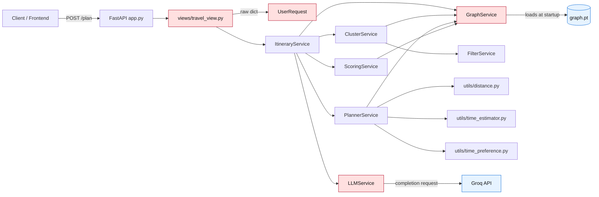
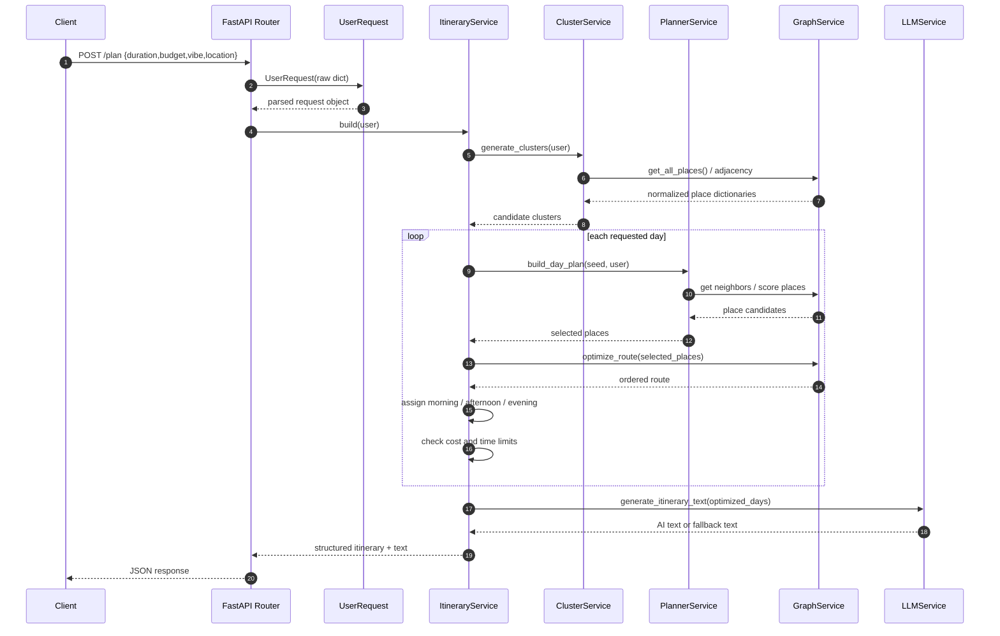
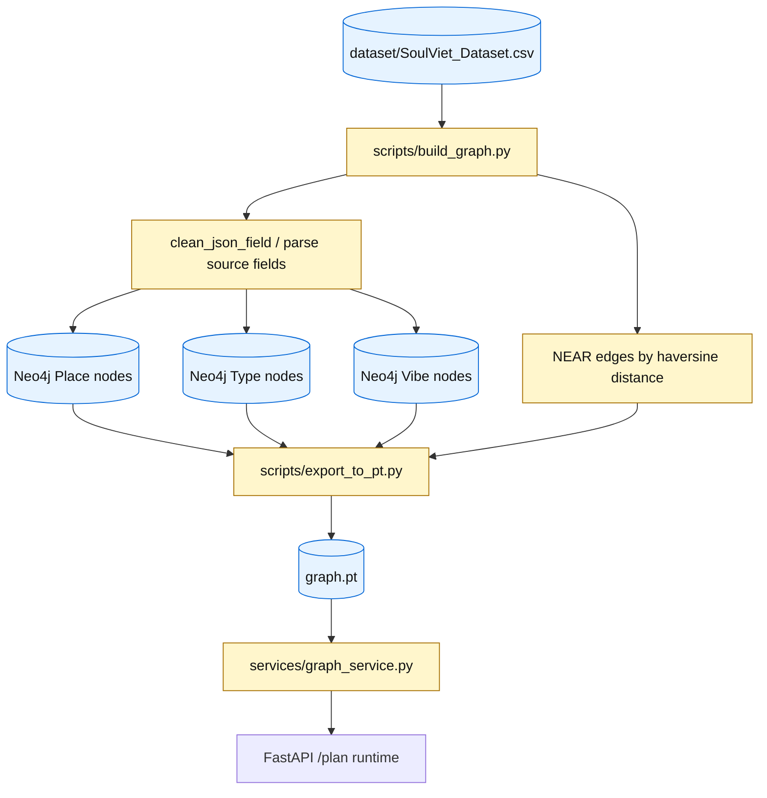
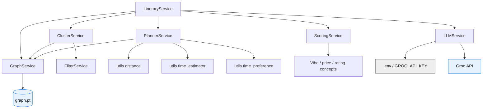

# SoulViet Code Status Review

Generated: 2026-06-14 09:30 ICT  
Workspace: `d:/SoulViet`  
Scope: FastAPI app, route layer, models, itinerary services, graph/data scripts, utilities, dependencies, and current repository state. The new `craw/` tree is noted as untracked but not deeply reviewed here.

## 1. Executive Status

SoulViet is currently a prototype FastAPI travel itinerary planner. The active runtime flow is:

`app.py` -> `views/travel_view.py` -> `ItineraryService` -> `ClusterService` / `PlannerService` / `GraphService` / `ScoringService` / `LLMService` -> `graph.pt` + Groq API.

The structure is understandable and already separated into route, model, service, script, and utility layers. However, the runtime is fragile because request validation is weak, `graph.pt` data is not normalized strongly enough, heavy services initialize at import time, several itinerary-selection bugs can produce incorrect results, and dependency/git hygiene need cleanup.

| Area | Status | Specific Notes |
| --- | --- | --- |
| API entrypoint | Mostly OK for prototype | Minimal FastAPI setup; open CORS; no health endpoint. |
| Route layer | Fragile | Uses raw `dict`; global `ItineraryService()` loads graph and Groq during import. |
| Request model | Weak | Manual conversion can crash on invalid `duration` / `budget`; no constraints. |
| Graph service | High risk | Loads binary data at startup; does not coerce list/numeric fields consistently. |
| Clustering | Partial | BFS-style cluster generation is clear, but depends on normalized ratings/prices/types. |
| Planning | High risk | Scores a place before checking if it exists; can crash on missing graph neighbor. |
| Itinerary build | High risk | Updates `used_ids` before budget/time rejection; fallback slots can duplicate places. |
| Filtering | Partial | Vibe/type maps are useful, but fail if `types` or `vibes` are raw strings. |
| Scoring | Partial | Simple weighted formula; vibe matching does not align with filter labels. |
| LLM | Fragile | Groq client creation at service initialization can make app startup depend on API key. |
| Data scripts | Prototype | Neo4j import/export works conceptually; broad `except`; duplicate type relationship writes. |
| Dependencies | Incomplete | `requirements.txt` misses runtime libraries used by code. |
| Git status | Needs cleanup | Modified binary/generated files and untracked docs/crawler files. |

## 2. Current Repository State

## System Diagrams and Schematics

This section captures the current architecture as Mermaid diagrams. The diagrams describe the app as it exists in this review, including fragile startup points and the active data flow from request to generated itinerary.

### A. Runtime Architecture



Key reading:

- `views/travel_view.py` creates `ItineraryService()` at import time.
- `ItineraryService` creates `GraphService` and `LLMService`, so missing `graph.pt` or invalid LLM setup can affect app startup.
- Places are active-runtime dictionaries loaded from `graph.pt`, not `models.Place` objects.

### B. Request-to-Itinerary Sequence



Risk markers:

- Request parsing can throw if numeric values are malformed.
- `PlannerService` can crash if `GraphService.get_place()` returns `None` before the guard runs.
- `ItineraryService` currently marks places as used before a day is accepted.
- LLM generation is optional behavior but client construction is currently tied to service initialization.

### C. Data Pipeline and Artifact Flow



Pipeline notes:

- `build_graph.py` imports CSV rows into Neo4j and creates semantic/geographic relationships.
- `export_to_pt.py` serializes Neo4j graph data into `graph.pt`.
- `GraphService` acts as the runtime schema bridge, so normalization defects here affect filtering, scoring, clustering, and route optimization.

### D. Service Dependency Map



This map highlights two services with startup sensitivity: `GraphService` depends on the binary graph artifact, and `LLMService` depends on environment/API configuration.

### E. Itinerary Build Control Flow

```mermaid
flowchart TD
    Start([Start build(user)]) --> Clusters[Generate candidate clusters]
    Clusters --> HasCluster{Cluster available for day?}
    HasCluster -- No --> StopFew[Return fewer days than requested]
    HasCluster -- Yes --> Seed[Pick first unused seed]
    Seed --> Plan[PlannerService selects nearby places]
    Plan --> Dedup[Remove duplicate categories]
    Dedup --> Route[Optimize route]
    Route --> Slots[Assign morning / afternoon / evening]
    Slots --> CostTime[Calculate day cost and time]
    CostTime --> Accept{Within budget and time?}
    Accept -- No --> Reject[Skip day]
    Reject --> NextDay[Try next cluster/day]
    Accept -- Yes --> Used[Mark accepted places as used]
    Used --> Save[Append optimized day]
    Save --> More{More requested days?}
    More -- Yes --> NextDay
    More -- No --> Text[Generate LLM itinerary text]
    Text --> End([Return response])

    classDef bug fill:#ffe0e0,stroke:#b00020,color:#111;
    class Reject,StopFew bug;
```

Implementation warning: the current code marks `used_ids` before the budget/time acceptance point. The intended safer flow is shown here: mark places as used only after `Accept -- Yes`.

### F. Graph Normalization Boundary

```mermaid
flowchart LR
    Raw[Raw exported graph node] --> Normalize[GraphService.normalize_place]
    Normalize --> Id[id]
    Normalize --> Name[name]
    Normalize --> Coord[lat / lng as numbers]
    Normalize --> Rating[rating / review_count as numbers]
    Normalize --> Price[price_min / price_max as numbers]
    Normalize --> Types[types as list[str]]
    Normalize --> Vibes[vibes as list[str]]
    Normalize --> RuntimePlace[Runtime place dict]

    RuntimePlace --> Filtering[FilterService]
    RuntimePlace --> Clustering[ClusterService]
    RuntimePlace --> Planning[PlannerService]
    RuntimePlace --> Scoring[ScoringService]
    RuntimePlace --> Routing[optimize_route]
```

This is the most important data-quality boundary in the app. If `types`, `vibes`, coordinates, prices, or ratings are not normalized here, downstream services either crash or make low-quality itinerary choices.


Observed status:

```text
 M graph.pt
 M scripts/__pycache__/export_to_pt.cpython-311.pyc
 M scripts/build_graph.py
 M scripts/export_to_pt.py
 M services/__pycache__/graph_service.cpython-311.pyc
 M services/__pycache__/llm_service.cpython-311.pyc
 M services/__pycache__/scoring_service.cpython-311.pyc
 M services/filter_service.py
 M services/graph_service.py
 M services/scoring_service.py
 M utils/__pycache__/type_duration.cpython-311.pyc
?? craw/
?? docs/
?? scripts/__pycache__/build_graph.cpython-311.pyc
```

Interpretation:

- `graph.pt` is modified. Because it is a binary graph artifact, git cannot show meaningful semantic diff.
- `__pycache__` and `*.pyc` files are modified/untracked. These should normally be ignored and not committed.
- `docs/` is untracked and now contains status/repo explanation material.
- `craw/` is untracked and appears to be a crawler subsystem with its own requirements, sources, output, and local `scrapling` code.
- Source files already modified before this review include `scripts/build_graph.py`, `scripts/export_to_pt.py`, `services/filter_service.py`, `services/graph_service.py`, and `services/scoring_service.py`.

Recommended cleanup:

1. Add `__pycache__/` and `*.pyc` to `.gitignore`.
2. Decide whether `graph.pt` is a tracked release artifact or generated local data.
3. If `graph.pt` stays tracked, document exact generation steps and dataset version.
4. Review `craw/` before committing because it may include generated output or vendored dependencies.
5. Commit `docs/status/` intentionally if this review history is meant to be versioned.

## 3. Runtime Flow

### 3.1 `app.py`

```python
app = FastAPI(title="SoulViet API")
app.add_middleware(CORSMiddleware, allow_origins=["*"], allow_credentials=True, ...)
app.include_router(router)
```

Status:

- Clean and small app entrypoint.
- Full wildcard CORS is convenient for local development.
- `allow_origins=["*"]` with credentials should not be used as-is in production.
- No `/health` endpoint or startup diagnostics.

Recommended:

- Add `/health` returning app status and graph-loaded status.
- Configure CORS from environment variables.
- Avoid importing a route module that immediately creates heavy service instances.

### 3.2 `views/travel_view.py`

```python
router = APIRouter()
itinerary_service = ItineraryService()

@router.post("/plan")
def plan_trip(request: dict):
    user = UserRequest(request)
    result = itinerary_service.build(user)
```

Status:

- The `/plan` response shape is simple and stable.
- The route delegates business logic to `ItineraryService`, which is good separation.

Risks:

- `request: dict` means FastAPI cannot validate fields.
- Invalid `duration` or `budget` can raise `ValueError` in `UserRequest` and return HTTP 500.
- `ItineraryService()` is constructed during module import. That loads `graph.pt` and creates `LLMService` before the first request.
- Any service exception returns an unhandled 500.

Recommended:

- Replace `request: dict` with a Pydantic request schema.
- Use FastAPI dependency injection or lazy service initialization.
- Add controlled error responses for invalid inputs and graph/LLM failures.

## 4. Models

### 4.1 `models/user_request.py`

Current behavior:

```python
self.duration = int(data.get("duration", 1))
self.budget = float(data.get("budget", 0))
```

Issues:

- Crashes on `duration=None`, `duration=""`, `duration="abc"`.
- Crashes on `budget=None`, `budget=""`, `budget="1,000,000"`, or currency-formatted values.
- Allows negative duration and negative budget.
- `location` is accepted but is not used later by graph filtering or planning.
- `vibe` is not normalized into the canonical keys used by `FilterService`.

Recommended replacement direction:

```python
from pydantic import BaseModel, Field

class PlanRequest(BaseModel):
    location: str | None = None
    duration: int = Field(default=1, ge=1, le=14)
    budget: float = Field(default=0, ge=0)
    vibe: str | None = None
```

### 4.2 `models/place.py`

Status:

- Converts row-style data into object attributes.
- Handles list or comma-string `Type` values.

Issues:

- This object model is not used by the active itinerary path, which uses dictionaries from `GraphService`.
- It exposes `self.vibe`, while active services expect dictionary key `vibes`.
- It converts numeric fields directly and can crash on `None`, empty strings, or malformed CSV values.

Recommended:

- Either remove/deprecate if unused, or align it with the dictionary schema from `GraphService`.
- Consider one canonical `Place` representation for the whole app.

## 5. Core Service Review

### 5.1 `services/graph_service.py`

Responsibilities:

- Load `graph.pt`.
- Normalize node fields.
- Build adjacency list.
- Provide graph access and route optimization.

Critical issues:

- `torch.load(path, weights_only=False)` happens in `__init__`; missing/corrupt `graph.pt` prevents API startup.
- `normalize_place()` does not safely coerce `lat`, `lng`, `rating`, `review_count`, `price_min`, or `price_max` to numeric types.
- `types` and `vibes` are returned as raw values. If a field is a string, later code may iterate characters instead of type names.
- `filter_places()` assumes `p["rating"]` is numeric and `user.budget` exists.
- `optimize_route()` assumes all places have valid numeric `lat` and `lng`.

Most important fix:

```python
def _to_list(value):
    if value is None:
        return []
    if isinstance(value, list):
        return [str(v).strip() for v in value if str(v).strip()]
    return [v.strip() for v in str(value).split(",") if v.strip()]
```

Then use it for `types` and `vibes`, and add safe numeric conversion helpers.

### 5.2 `services/filter_service.py`

Strengths:

- Contains clear vibe categories: `chill`, `food`, `culture`, `adventure`, `creative`, `spiritual`.
- Has a blacklist for non-tourism types like schools, banks, hospitals, and offices.
- Supports matching by vibe label or by place type.

Issues:

- `match_vibe()` only checks whether the Vietnamese label is in `place_vibes`. It does not match canonical keys directly.
- If `place_types` is a string, `is_blacklisted()` and `match_type()` iterate characters.
- `blacklist_types` misses some related types already present in `TYPE_DURATION_MAP`, such as `preschool`, `educational_institution`, `manufacturer`, `business_center`, depending on intended behavior.
- No normalization of case/spacing for place types.

Recommended:

- Normalize place types and vibes before matching.
- Consider accepting both canonical vibe keys and display labels.
- Add tests for each vibe category and blacklist behavior.

### 5.3 `services/cluster_service.py`

Strengths:

- Easy-to-follow BFS expansion around seed places.
- Prevents duplicate cluster signatures.
- Filters by rating, budget, and vibe/type.

Issues:

- Uses `random.shuffle(valid_places)`, so identical input can produce different results across requests.
- Budget check `p.get("price_max", 0) > user.budget` treats unknown price (`0`) as always affordable.
- Depends on numeric `rating`/`price_max` from `GraphService`.
- `valid_ids` is created from already-filtered places, then `is_valid_place()` repeats similar checks.

Recommended:

- Make randomness deterministic per request or sort by score/rating.
- Decide whether unknown price should be neutral or excluded for low-budget users.
- Add a seed parameter for reproducible development tests.

### 5.4 `services/planner_service.py`

Critical crash:

```python
place = self.graph.get_place(next_id)
place["value"] = self.graph.score_place(place, user)
...
if not place:
    continue
```

The `if not place` guard is too late. If `get_place(next_id)` returns `None`, this crashes before the guard.

Other issues:

- Mutates shared place dictionaries by adding `value`, `estimated_time`, and `best_time`.
- Selection is sorted by distance first and rating second, not by the calculated `value`.
- `selected = [seed_place]` does not check whether seed has all computed fields.
- Distance limit `20` is hardcoded with no config.
- Maximum selected places `5` is hardcoded.
- `detect_category()` covers only a limited subset of types, so many places collapse into `general` and get removed as duplicates.

Recommended:

- Move `if not place: continue` immediately after `get_place()`.
- Avoid mutating graph node dictionaries; copy place dictionaries before enriching them.
- Sort by a combined score, such as `value`, distance, rating, and category diversity.
- Expand `detect_category()` or make categories data-driven.

### 5.5 `services/itinerary_service.py`

Responsibilities:

- Generate clusters.
- Pick a seed per day.
- Build a day plan.
- Remove duplicate categories.
- Optimize route and assign time slots.
- Enforce budget/time constraints.
- Format days and call LLM.

Strengths:

- Central orchestration is readable.
- Returns both structured itinerary and AI-generated text.
- Has basic fallback assignment for empty morning/afternoon/evening slots.

Critical logic bug: `used_ids` updates before rejection

```python
for p in selected_places:
    used_ids.add(p["id"])

total_cost = sum(...)
if total_cost > user.budget:
    continue
```

If a day is rejected for budget or time, its places are still marked as used. Later days may lose valid candidates even though the rejected day was never returned.

Critical logic bug: fallback slot duplication

```python
if not plan["morning"] and selected_places:
    plan["morning"].append(selected_places[0])
```

If `selected_places[0]` is already in `afternoon` or `evening`, fallback assignment duplicates the same place across slots.

Other issues:

- `location` from user request is not used.
- `day_index >= len(clusters)` can return fewer days than requested.
- `remove_duplicate_types()` can reduce a plan too aggressively because many types become `general`.
- Budget is applied per day, not across the full trip. This may or may not match product intent.
- `total_time > 600` is hardcoded and not tied to user preference.
- Calls LLM even when `optimized_days` is empty after all clusters are rejected.

Recommended fix order:

1. Compute cost/time before mutating `used_ids`.
2. Only add selected IDs after the day is accepted.
3. Make fallback slot filling choose places not already assigned.
4. Return a clear no-result message if all candidate days are rejected.
5. Decide whether budget is daily or trip-total, then document it.

### 5.6 `services/scoring_service.py`

Current formula:

```python
total_score = rating_score * 0.2 + review_score * 0.1 + vibe_score * 0.3 + price_score * 0.4
```

Strengths:

- Simple and explainable scoring system.
- Includes rating, review count, vibe match, and price fit.

Issues:

- `rating_score()` assumes numeric rating.
- `review_score()` assumes numeric review count.
- `vibe_score()` checks `user_vibe in vibe.lower()`, but `place_vibes` may contain Vietnamese labels while `user.vibe` may be `chill`, `food`, etc. This can produce false negatives.
- Price has the highest weight (`0.4`), so cheap/unknown-price places may outrank highly relevant places.
- Unknown price returns `0.5`, which may be too generous or too strict depending on product intent.

Recommended:

- Reuse `FilterService` vibe resolution or introduce a shared normalization layer.
- Clamp all sub-scores to `[0, 1]`.
- Add tests for score ranking examples.

### 5.7 `services/llm_service.py`

Strengths:

- Prompt has clear constraints: do not invent locations, write practical itinerary, no markdown, organize by morning/afternoon/evening.
- Exceptions during completion call return fallback text.

Risks:

- `Groq(api_key=os.getenv("GROQ_API_KEY"))` runs during `LLMService.__init__`. If the API key is missing or invalid at construction level, app startup can fail before the fallback logic in `generate_itinerary_text()` runs.
- Model name `openai/gpt-oss-120b` is hardcoded.
- Prompt includes raw Python list/dict formatting; this is acceptable but not ideal for stable LLM parsing.
- Error logging uses emoji and `print`, which is OK locally but not structured for production.

Recommended:

- Delay Groq client creation until generation time or handle missing key in `__init__`.
- Move model name and temperature to environment variables.
- Use `json.dumps(itinerary_data, ensure_ascii=False, indent=2)` in the prompt.

## 6. Utility Review

### 6.1 `utils/distance.py`

Status:

- Standard haversine implementation.
- Returns kilometers.

Risk:

- No handling for `None`, strings, or invalid lat/lng values.

Recommended:

- Keep this function pure, but validate/coerce coordinates before calling it.

### 6.2 `utils/time_estimator.py`

Status:

- Uses `TYPE_DURATION_MAP` by primary `type`, then averages matching `types`, then defaults to 60 minutes.

Risk:

- If `types` is a string, iteration happens character-by-character.
- Main type may not match the values stored in `Type` / `AllTypes`.

Recommended:

- Ensure `GraphService.normalize_place()` always returns list-based `types`.

### 6.3 `utils/time_preference.py`

Status:

- Clear mapping from place types to preferred day slots.

Issues:

- First match wins based on dictionary order.
- No tie-breaking when a place has both cafe and museum/food types.
- Defaults to `afternoon`, which may overload afternoon slots.

Recommended:

- Add more explicit priority or score per time slot.

### 6.4 `utils/type_duration.py`

Issues:

- Possible typo: `"art_studiohistorical": 90` likely should be `"art_studio": 90` and/or `"historical": ...`.
- Includes non-tourist/business types (`manufacturer`, `business_center`, `preschool`) that may conflict with filtering intent.
- `"nan": 60` hides upstream data quality problems.

Recommended:

- Clean typo keys.
- Separate allowed tourism types from raw source types.
- Treat `nan` as missing, not as a valid duration category.

## 7. Data Pipeline Review

### 7.1 `scripts/build_graph.py`

Purpose:

- Read `dataset/SoulViet_Dataset.csv`.
- Create Neo4j `Place`, `Vibe`, and `Type` nodes.
- Create bidirectional `NEAR` edges by haversine distance.

Issues:

- Imports `utils.distance` before adding project root to `sys.path`; direct execution can fail depending on current working directory.
- `create_type()` writes each type twice: once with `t_str`, then again with raw `t`.
- Broad `except` in `clean_json_field()` hides malformed source data.
- `create_near()` is O(n^2), which can become slow as dataset grows.
- Neo4j credentials are read at import time; missing env can fail before helpful messages.

Recommended:

- Move `sys.path.append(...)` before project imports or run as module.
- Remove duplicate type merge/write.
- Log malformed JSON fields with row/place context.
- Use spatial indexing or bounding-box prefilter for larger datasets.

### 7.2 `scripts/export_to_pt.py`

Purpose:

- Export Neo4j graph into `graph.pt`.

Issues:

- `driver = GraphDatabase.driver(...)` is created at import time.
- `torch.save(graph_data, "graph.pt")` always writes to current working directory.
- Broad `except` in `parse_price_range()` hides parsing problems.
- Output schema differs from active normalized schema and requires `GraphService` to bridge fields.

Recommended:

- Add CLI args for output path and database config.
- Create driver inside `main()`.
- Print/export summary: node count, edge count, missing coordinates, missing prices.

## 8. Dependencies

Current `requirements.txt`:

```text
fastapi
uvicorn
pandas
neo4j
```

But code imports:

- `torch`
- `groq`
- `dotenv` from `python-dotenv`
- `math`, `os`, `json`, `re`, `random` from stdlib

README install command mentions:

```text
pip install groq python-dotenv neo4j torch networkx numpy pandas
```

Mismatch:

- `requirements.txt` is incomplete for running the current app.
- README mentions `networkx` and `numpy`, but reviewed core code does not currently import them.

Recommended `requirements.txt` baseline:

```text
fastapi
uvicorn
pandas
neo4j
torch
groq
python-dotenv
```

Pin versions later when the app stabilizes.

## 9. Priority Fix List

### P0 - Fix before relying on `/plan`

1. Move `if not place: continue` before scoring in `PlannerService.build_day_plan()`.
2. Normalize `types`, `vibes`, numeric fields, and coordinates in `GraphService.normalize_place()`.
3. Move `used_ids.add(...)` in `ItineraryService.build()` until after budget/time checks pass.
4. Prevent fallback slot assignment from adding a place already assigned to another slot.
5. Make `LLMService` survive missing `GROQ_API_KEY` and return fallback text.

### P1 - Improve correctness

1. Replace raw route request dict with Pydantic validation.
2. Decide whether budget is per-day or full-trip.
3. Make cluster generation deterministic or explicitly random with seed.
4. Align `ScoringService.vibe_score()` with `FilterService` vibe matching.
5. Expand `detect_category()` so unrelated places are not all categorized as `general`.

### P2 - Improve maintainability

1. Add tests for request validation, graph normalization, filtering, scoring, and itinerary slot assignment.
2. Remove or align unused `DataService`, `RoutingService`, and `Place` model if they are legacy.
3. Add structured logging instead of `print` for LLM errors and data scripts.
4. Update README with exact run/build/export steps.
5. Clean `.gitignore` and remove tracked generated files if appropriate.

## 10. Suggested Test Plan

Minimum local validation after fixes:

```bash
python -m compileall app.py views models services utils scripts
```

Smoke test ideas:

```python
from services.graph_service import GraphService
g = GraphService("graph.pt")
places = g.get_all_places()
assert places
assert isinstance(places[0]["types"], list)
assert isinstance(places[0]["vibes"], list)
```

API test idea:

```bash
uvicorn app:app --reload
curl -X POST http://127.0.0.1:8000/plan ^
  -H "Content-Type: application/json" ^
  -d "{\"duration\":1,\"budget\":500000,\"vibe\":\"food\"}"
```

Expected behavior:

- API starts even if Groq key is missing, with fallback AI text.
- Invalid request values return validation errors, not 500.
- Returned itinerary contains no duplicate place inside multiple slots on the same day.
- Rejected over-budget/over-time days do not consume `used_ids`.

## 11. Current Context Summary for Future Readers

If someone reads only this file, the important context is:

- SoulViet is a graph-based itinerary planner backed by `graph.pt` generated from Neo4j/dataset data.
- The API endpoint is `POST /plan`.
- The user request currently includes `location`, `duration`, `budget`, and `vibe`, but `location` is not used by planning.
- Places are represented as dictionaries in the active runtime path, not as `models.Place` objects.
- `GraphService` is the schema bridge from exported graph data to app data.
- `FilterService` defines the app's vibe taxonomy.
- `ClusterService` creates candidate geographic clusters.
- `PlannerService` selects day places around a seed.
- `ItineraryService` orchestrates days, slots, costs, time, and LLM text.
- The project currently has uncommitted source, binary, generated, and untracked crawler/docs changes.
