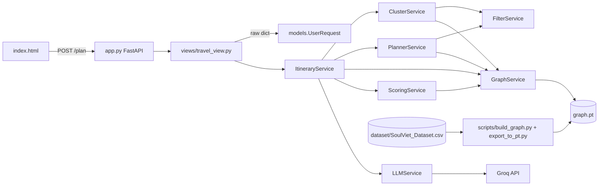
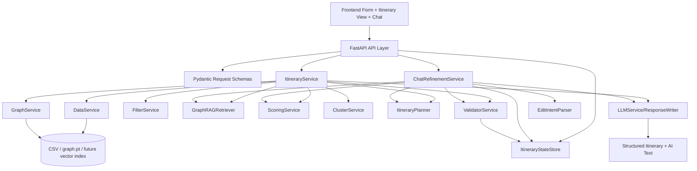
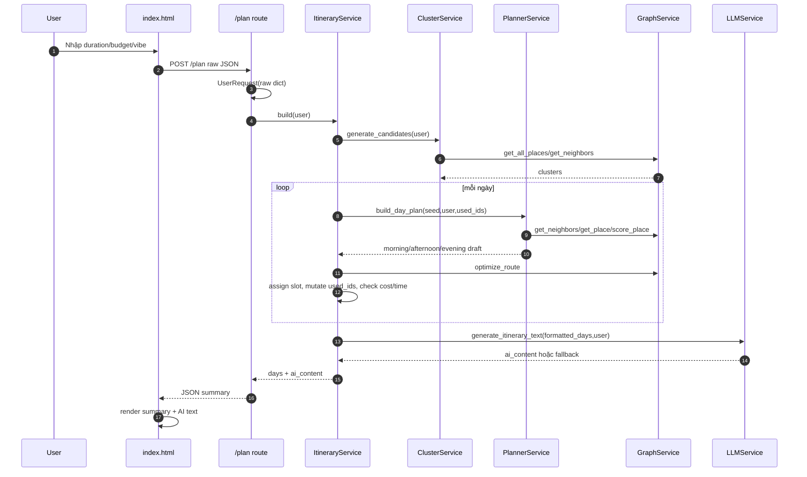
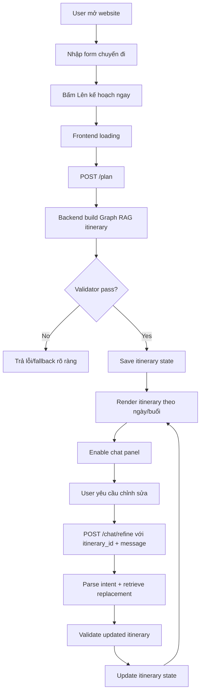
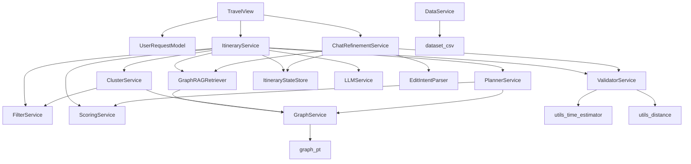

# SoulViet Implementation Plan

## 1. Project Goal

SoulViet AI cần trở thành hệ thống Graph RAG hỗ trợ tạo lịch trình du lịch cá nhân hóa theo form đầu vào và cho phép chỉnh sửa bằng chat sau khi lịch trình đã được tạo. Mục tiêu cuối cùng là:

- User nhập số ngày, ngân sách, phong cách trải nghiệm và các ràng buộc bổ sung như địa điểm mong muốn, nhóm đi, sở thích, điểm cần tránh khi hệ thống hỗ trợ.
- Backend dùng dữ liệu địa điểm, quan hệ graph, lọc hard constraints, scoring, clustering và itinerary validation để chọn địa điểm phù hợp.
- Kết quả trả về theo ngày và theo buổi: sáng, trưa, chiều, tối; mỗi điểm có lý do chọn, chi phí, thời lượng, ghi chú di chuyển/evidence nếu có.
- Chat chỉ xuất hiện sau khi itinerary sẵn sàng, nhận itinerary hiện tại làm context, hiểu yêu cầu chỉnh sửa và cập nhật state thay vì trả lời chung chung.
- Mỗi vòng chỉnh sửa phải giữ state itinerary hiện tại, không làm mất địa điểm hợp lệ, không đánh dấu `used_ids` trước khi lịch trình/ngày được accept.

## 2. Current Repository Understanding

### Thư mục gốc

- `app.py`: tạo FastAPI app, bật CORS `allow_origins=["*"]`, include router từ `views/travel_view.py`. Không có health endpoint, không có static serving cho `index.html`.
- `index.html`: frontend tĩnh dùng Tailwind CDN, marked CDN, FontAwesome CDN. Có form `duration`, `budget`, `vibe`; gọi `fetch('http://127.0.0.1:8000/plan')`; render `itinerary_summary` và `ai_suggestion`. Chưa có chat panel, chưa giữ itinerary state phía client.
- `README.md`: rất ngắn, chỉ ghi lệnh cài `groq python-dotenv neo4j torch networkx numpy pandas` và yêu cầu có `graph.pt`.
- `requirements.txt`: hiện chỉ có `fastapi`, `uvicorn`, `pandas`, `neo4j`; thiếu `torch`, `groq`, `python-dotenv`, có thể thiếu `numpy/networkx` nếu runtime/scripts cần.
- `graph.pt`: artifact runtime đã build từ Neo4j. Kiểm tra thực tế bằng `torch.load` thấy có `dict_keys(['nodes', 'edges'])`, 1210 nodes, 78092 edges.

### Dataset

- `dataset/SoulViet_Dataset.csv`: 1210 dòng, 19 cột: `PlaceId`, `Name`, `Type`, `AllTypes`, `Address`, `Lat`, `Lng`, `RatingScore`, `ReviewCount`, `OperationHours`, `Description`, `MainImage`, `LandImages_JSON`, `TopReviews_JSON`, `VibeTag`, `Generated_Description`, `Activities_JSON`, `PriceCategory`, `PriceRange`.
- Dữ liệu có mô tả, reviews, ảnh, hoạt động và giá; runtime `graph.pt` hiện chỉ xuất một phần: id/name/lat/lng/rating/review_count/price_min/price_max/description/vibes/types.

### Models

- `models/user_request.py`: class `UserRequest`, parse raw dict bằng `int(data.get('duration', 1))`, `float(data.get('budget', 0))`, `vibe`, `location`. Chưa có Pydantic validation, chưa kiểm tra min/max, malformed input có thể crash.
- `models/place.py`: class `Place` parse node thành object; đang được `DataService` dùng nhưng active runtime `GraphService` dùng dict, nên `Place` không nằm trong flow `/plan` hiện tại.

### View/API layer

- `views/travel_view.py`: tạo global `itinerary_service = ItineraryService()` ngay lúc import. Endpoint `POST /plan` nhận `request: dict`, convert sang `UserRequest`, gọi `itinerary_service.build(user)`, format summary. Chưa có endpoint `/chat`, `/itinerary/{id}`, `/health`.

### Services

- `services/data_service.py`: đọc `torch.load(path)`, convert `data['nodes']` thành list `Place`. Hiện không được `/plan` dùng.
- `services/graph_service.py`: load `graph.pt` trong `__init__`, normalize nodes thành dict, build adjacency từ edges. Cung cấp `get_all_places`, `get_place`, `get_neighbors`, `filter_places`, `score_place`, `optimize_route`, `normalize_place`, `get_clusters`. Chưa ép kiểu số/list an toàn trong `normalize_place`.
- `services/filter_service.py`: map vibe (`chill`, `food`, `culture`, `adventure`, `creative`, `spiritual`) sang label và allowed types; blacklist loại không phù hợp; `match` dùng `match_vibe` hoặc `match_type`. Rủi ro nếu `place_types`/`place_vibes` là string thay vì list.
- `services/scoring_service.py`: score = rating 0.2 + review 0.1 + vibe 0.3 + price 0.4. `vibe_score` so user key như `culture` trong label tiếng Việt, nên thường không match label `Đậm văn hóa & Bản địa`; filter có thể match type nhưng score vibe vẫn thấp.
- `services/cluster_service.py`: lọc valid places rating >= 4, price <= budget, match vibe/type; shuffle seed; expand cluster BFS 2 tầng qua NEAR; chỉ nhận cluster có >=3 places. Có tính candidate cluster nhưng không có fallback nếu cluster không đủ cho duration.
- `services/planner_service.py`: `build_day_plan(seed_place, user, used_ids)` BFS từ seed, lấy neighbor trong 2 tầng, lọc `used_ids`, rating, vibe/type, distance <=20km, chọn tối đa 5 điểm khác category. Bug rõ: gọi `place['value'] = self.graph.score_place(place, user)` trước khi `if not place`, nên neighbor id thiếu trong graph có thể crash.
- `services/itinerary_service.py`: orchestration chính. Tạo Graph/LLM/Filter/Cluster/Planner/Scoring. `build` tạo clusters, loop theo ngày, chọn seed score cao, gọi planner, loại duplicate category, optimize route, gán buổi theo `best_time`, tính cost/time, format và gọi LLM. Bug quan trọng: `used_ids.add(p['id'])` ở dòng 167-168 xảy ra trước khi check `total_cost > user.budget` và `total_time > 600`, nên ngày bị reject vẫn làm mất địa điểm. Fallback slot sau validation có thể thêm lại place đã có vào slot khác gây duplicate trong buổi.
- `services/llm_service.py`: tạo `Groq(api_key=os.getenv('GROQ_API_KEY'))` trong `__init__`, prompt yêu cầu không bịa địa điểm. Nếu thiếu key hoặc lỗi client, startup/LLM phụ thuộc cấu hình. Fallback chỉ trả `AI đang bận 😭`, không tạo nội dung deterministic hữu ích.
- `services/neo4j_service.py`: wrapper Neo4j rất mỏng; không nằm trong runtime `/plan` hiện tại.
- `services/routing_service.py`: có `RoutingService.optimize`, nhưng `ItineraryService` dùng `GraphService.optimize_route`, nên service này gần như chưa active.

### Scripts

- `scripts/build_graph.py`: đọc CSV, tạo Neo4j `Place`, `Vibe`, `Type`, `NEAR` edges bằng haversine threshold 2km. Có parse JSON fields cho activities/reviews/images. `create_type` hiện ghi trùng relationship hai lần: một lần với `t_str`, một lần với `t`.
- `scripts/export_to_pt.py`: query Neo4j, collect vibes/types, parse `price_range`, export `nodes` và `edges` vào `graph.pt`.

### Docs

- `docs/status/soulviet_code_status_review.md`: review hiện trạng dài, xác nhận runtime flow, các rủi ro `used_ids`, request validation, graph normalization, LLM startup, requirements thiếu dependency, git hygiene.
- `docs/repo_exp/*.md`: 13 file kiến thức tổng hợp từ repo tham chiếu cho Graph RAG, agent, state machine, validator, scoring, citation, prompt, production workflow.

## 3. Knowledge Learned From Reference Repos

### RAG / Graph RAG

Từ `graphrag-code_for_graph.md`, `RAG-Anything_for_graph.md`, `Understand-Anything_for_graph.md`, `awesome-llm-apps_for_graph.md`, `system-prompts-and-models-of-ai-tools_for_graph.md`:

- Không nên chỉ dùng prompt LLM sau khi chọn địa điểm. Graph RAG đúng nghĩa cần pipeline rõ: ingest -> normalize -> entity/relation extraction -> index graph/vector -> retrieve -> rerank -> validate -> generate grounded response.
- Graph-first retrieval có giá trị khi cần hiểu quan hệ: `Place` gần nhau, cùng type, cùng vibe, phù hợp time slot, recommended-with, conflicts-with. Với du lịch, graph geographic/semantic quan trọng hơn plain vector similarity.
- Hybrid retrieval nên kết hợp: hard filter bằng constraints, graph expansion qua NEAR/SAME_CLUSTER/HAS_TAG, lexical/semantic matching trên description/reviews/activities, rerank bằng score tổng hợp.
- Context đưa vào LLM phải là package có cấu trúc, chỉ gồm candidates/itinerary đã accept, kèm evidence fields như rating, review_count, types, description, price, distance.
- Tránh hallucination bằng rule: LLM chỉ được diễn đạt từ itinerary/candidates đã được backend chọn; backend trả structured JSON là source of truth; LLM không tự thêm địa điểm.

### Agent orchestration

Từ `ai-agents-for-beginners_for_graph.md`, `Toonflowapp_for_graph.md`, `colleague-skill_for_graph.md`, `vibe-kanban_for_graph.md`:

- Nên tách vai trò: RequestParser/ConstraintAgent, Retriever, Scorer, ItineraryPlanner, Validator, ResponseWriter, ChatRefiner. Với MVP có thể là service/module deterministic, chưa cần multi-agent phức tạp.
- Planner không nên vừa retrieve, vừa validate, vừa mutate state. Mỗi bước có input/output rõ để test.
- Workflow nhiều bước nên có checkpoint/state: form submitted, itinerary draft, validation result, accepted itinerary, chat refinement request, updated itinerary.
- Tool use phải được kiểm soát: ChatRefinementService chỉ được gọi tool nội bộ như filter/scoring/replacement/validator, không để LLM tự quyết định địa điểm không có trong graph.

### State machine

Từ `conversational-state-machine_for_graph.md`:

- Flow nên deterministic với state hữu hạn: `INIT -> FORM_INPUT -> BUILDING_ITINERARY -> ITINERARY_READY -> CHAT_ENABLED -> REFINING_ITINERARY -> ITINERARY_UPDATED -> ERROR`.
- Mỗi state cần event hợp lệ. Ví dụ chat chỉ nhận khi có `current_itinerary_id`; nếu chưa có itinerary thì trả lỗi rõ.
- Context cần tách: user request gốc, constraints hiện tại, itinerary hiện tại, change history, used/place locks.
- State machine giúp tránh lỗi chat trả lời chung chung hoặc sửa lịch không dựa trên itinerary hiện tại.

### Validation

Từ `container-bay-plan-validator_for_graph.md`:

- Validator nên deterministic, tách khỏi planner. Planner tạo draft; validator kiểm constraints; chỉ khi pass mới accept và mutate `used_ids`/state.
- Áp dụng cho itinerary: không vượt budget, không vượt tổng thời gian/ngày, không duplicate place, không duplicate quá nhiều category, không xếp quá dày, không chọn type blacklist, không chọn style mismatch, không đánh dấu địa điểm đã dùng trước khi ngày được accept.
- Cần trả validation report có lỗi cụ thể để planner fallback/retry, thay vì `continue` im lặng.

### Recommendation / scoring

Từ `e-commerce-project_for_graph.md`:

- Recommendation nên có 2 lớp: hard filters loại candidate không hợp lệ; soft scoring/reranking để chọn candidate tốt nhất.
- Scoring nên giải thích được: rating_score, review_score, style_score, budget_score, distance_score, time_slot_score, diversity_score.
- Search/recommendation nên hỗ trợ fallback: nếu budget quá thấp hoặc style quá hẹp, nới soft constraint theo thứ tự kiểm soát và báo cho user.

### Citation / grounding

Từ `medical-citation-agent_for_graph.md`:

- Mỗi gợi ý cần evidence: vì sao chọn, dựa trên type/vibe/rating/review/description/price/distance nào.
- Nên lưu `evidence` trong item itinerary, ví dụ `matched_types`, `matched_vibes`, `rating`, `review_count`, `price_range`, `source_fields`.
- Response LLM không phải source of truth; structured itinerary + evidence mới là grounding.

### Prompt engineering

Từ `system-prompts-and-models-of-ai-tools_for_graph.md`:

- Prompt cần tách system/developer/task, không nhồi quá nhiều rule lặp lại.
- Với SoulViet, prompt writer chỉ nên nhận accepted itinerary JSON và sinh text; prompt chat refinement chỉ parse intent/constraints hoặc viết explanation, không tự chọn địa điểm.
- Tool boundaries phải rõ: LLM có thể phân loại intent `reduce_walking`, `add_food`, `remove_place`, `lower_budget`; backend deterministic xử lý thay đổi.

### Production architecture

Từ `RAG-Anything_for_graph.md`, `Understand-Anything_for_graph.md`, `vibe-kanban_for_graph.md`, `colleague-skill_for_graph.md`:

- Pipeline nên có artifact versioning: dataset version, graph build version, index version.
- Nên có evaluation suite cho itinerary quality và constraint correctness.
- Nên có observability tối thiểu: log request, candidate count, filter count, validation errors, selected ids.
- Multimodal tương lai: ảnh/review/map có thể ingest thành nodes/properties hoặc vector chunks nhưng MVP nên chuẩn hóa data text trước.

## 4. Current Architecture

## 5. Target Architecture

## 6. Current Data Flow

## 7. Target User Flow

## 8. Backend Service Dependency Map

## 9. Graph RAG Design

### Node đề xuất

| Node | Vai trò | Properties chính |
| --- | --- | --- |
| `Destination` | vùng/tỉnh/thành/phân khu | id, name, lat, lng |
| `Place` | địa điểm cụ thể | id, name, address, lat, lng, rating, review_count, description, price_min, price_max, source |
| `Tag` | tag semantic | name, category |
| `Style` | phong cách trải nghiệm | key, label |
| `BudgetLevel` | mức giá | key, min, max |
| `TimeSlot` | morning/noon/afternoon/evening/night | key, label |
| `Cuisine` | loại ẩm thực | name |
| `ActivityType` | hoạt động | name |
| `UserRequest` | request đã normalize | id, duration, budget, style, created_at |
| `Itinerary` | lịch trình đã tạo | id, request_id, total_cost, status |
| `ItineraryDay` | ngày trong lịch | day_index, total_cost, total_time |

### Edge đề xuất

| Edge | Ý nghĩa |
| --- | --- |
| `LOCATED_IN` | Place thuộc Destination |
| `HAS_TAG` | Place có tag |
| `SUITABLE_FOR_STYLE` | Place phù hợp style |
| `NEAR` | gần nhau theo km |
| `SAME_CLUSTER` | cùng cụm địa lý/chủ đề |
| `BEST_AT_TIME` | phù hợp buổi |
| `HAS_PRICE_LEVEL` | mức giá |
| `SERVES_CUISINE` | cuisine |
| `OFFERS_ACTIVITY` | activity |
| `RECOMMENDED_WITH` | nên đi cùng |
| `CONFLICTS_WITH` | không nên xếp cùng |
| `SELECTED_IN` | place được chọn trong itinerary/day |
| `REPLACED_BY` | lịch sử chỉnh sửa |

### Retrieval strategy

1. Normalize user request: duration, budget_per_day, style, preferred/avoid places, pace.
2. Hard filter: rating threshold, blacklist, budget candidate, valid coordinates, style/type/vibe match.
3. Graph expansion: từ seed phù hợp style/budget, mở rộng qua `NEAR`, `SAME_CLUSTER`, `RECOMMENDED_WITH`, `BEST_AT_TIME`.
4. Semantic retrieval future: vector search trên `Generated_Description`, `TopReviews_JSON`, `Activities_JSON` cho query như “ít đi bộ”, “đặc sản”, “văn hóa”.
5. Rerank: tổng hợp rating/review/style/budget/distance/diversity/time_slot/evidence.
6. Validate: budget/time/duplicate/pace before accept.
7. Grounding: response chỉ dùng accepted places + evidence.

### Scoring strategy

`final_score = 0.20 rating + 0.10 review_confidence + 0.20 style_match + 0.15 budget_fit + 0.15 distance_fit + 0.10 time_slot_fit + 0.10 diversity/evidence`

Cần trả breakdown để UI/LLM giải thích lý do chọn.

## 10. Itinerary Builder Design

Thuật toán đề xuất:

1. `parse request`: dùng Pydantic model, kiểm duration 1-7 hoặc giới hạn MVP, budget > 0, style thuộc enum.
2. `derive constraints`: budget_per_day, max_minutes_per_day, pace, preferred/avoid types.
3. `filter`: loại blacklist, thiếu lat/lng, rating thấp, quá đắt nếu là hard budget.
4. `retrieve`: lấy candidates bằng graph expansion từ places match style/type/vibe; nếu không đủ thì fallback nới type nhưng giữ blacklist/rating/budget.
5. `score`: tính score breakdown, không mutate place gốc hoặc dùng copy.
6. `cluster`: gom theo NEAR/geographic cluster, ưu tiên cluster đủ diversity food/culture/nature/cafe.
7. `assign to days`: mỗi ngày chọn 3-5 điểm, route gần nhau, có slot sáng/trưa/chiều/tối.
8. `validate draft`: check budget/time/duplicate/pace/style; nếu fail, retry bằng candidate kế tiếp.
9. `accept/reject`: chỉ khi validation pass mới add vào `used_ids` và append day.
10. `save state`: tạo `itinerary_id`, lưu user_request, constraints, days, selected_place_ids, validation report.
11. `generate response`: structured JSON + optional AI text từ accepted itinerary.

## 11. Chat Refinement Design

Chat chỉ hoạt động khi frontend có `itinerary_id` hoặc gửi `current_itinerary` đầy đủ.

1. Input: `itinerary_id`, `message`, optional updated constraints.
2. Load state: current itinerary, original request, selected ids, rejected ids, change history.
3. Parse intent: deterministic keyword + LLM optional, phân loại:
   - `reduce_walking`: giảm distance, ít điểm/ngày, tăng cluster chặt hơn.
   - `add_food`: thêm/đổi điểm type restaurant/food/market/cafe.
   - `remove_place`: tìm place name trong itinerary và remove.
   - `change_pace`: nhẹ nhàng hơn/năng động hơn.
   - `lower_budget`: giảm budget hoặc ưu tiên price_score.
   - `increase_culture`: tăng weight culture types.
4. Decide edit type: replace place, remove place, add slot, rebuild day, rebuild all itinerary.
5. Retrieve candidates: loại current selected nếu không muốn duplicate; giữ các locked places nếu user không yêu cầu đổi.
6. Validate updated itinerary: budget/time/duplicate/pace/style.
7. Update state: tạo version mới, lưu `REPLACED_BY`/change history.
8. Return: itinerary updated + change summary + evidence. Nếu không thể chỉnh, trả lý do cụ thể và lựa chọn gần nhất.

## 12. Gap Analysis

| Area | Current | Target | Gap | Priority |
| --- | --- | --- | --- | --- |
| Request validation | Raw dict + manual cast | Pydantic schema + constraints | Input malformed crash, không có error rõ | P0 |
| Frontend form | duration/budget/vibe | thêm optional preferences/avoid/group/pace | MVP form thiếu chat/state | P1 |
| Itinerary rendering | Summary + AI text | structured day/slot/place/reason/cost/time | Chưa có reason/evidence/trưa | P1 |
| Chat | Chưa có | Chat sau itinerary, refine stateful | Thiếu toàn bộ flow | P1 |
| State | Không lưu | ItineraryStateStore/versioning | Không refine được itinerary hiện tại | P1 |
| Graph RAG | graph.pt + NEAR + type/vibe | typed graph + hybrid retrieval + evidence | Chưa có vector/chunk/evidence retrieval | P2 |
| Validator | Không có service riêng | deterministic ValidatorService | `used_ids` bug, reject im lặng | P0 |
| `used_ids` | Mutate trước validation | Mutate sau accept | Mất địa điểm oan khi day fail | P0 |
| Scoring | Simple weighted | explainable score breakdown | `vibe_score` mismatch label/key | P0 |
| Graph normalization | minimal dict | safe numeric/list normalization | string/list/nan có thể làm filter sai | P0 |
| LLM | startup Groq client | optional writer with fallback | thiếu key có thể ảnh hưởng startup | P1 |
| DataService | unused Place loader | single data gateway | duplicate runtime schema | P2 |
| Tests | không thấy tests itinerary | constraint/unit/API tests | khó chống regression | P0 |
| Requirements | thiếu deps | đầy đủ runtime/scripts | cài mới sẽ lỗi `torch/groq/dotenv` | P0 |

## 13. Bugs / Risks Found

1. `services/itinerary_service.py:167`: `used_ids.add(p['id'])` chạy trước `total_cost` và `total_time` validation. Nếu ngày bị reject, các địa điểm vẫn bị đánh dấu đã dùng.
2. `services/planner_service.py:60`: dùng `place['value']` trước `if not place`, có thể crash nếu edge trỏ tới node không tồn tại.
3. `services/itinerary_service.py:200`, `services/itinerary_service.py:205`, `services/itinerary_service.py:213`: fallback thêm `selected_places[0/1/2]` vào slot nếu slot trống nhưng không kiểm place đã nằm trong slot khác, có thể duplicate trong lịch ngày.
4. `services/scoring_service.py:43`: `vibe_score` so key tiếng Anh (`culture`) với label tiếng Việt trong `VibeTag`, làm score style không phản ánh match thực tế.
5. `services/graph_service.py:69`: `normalize_place` không ép kiểu `lat/lng/rating/review_count/price` và không normalize `vibes/types` thành list, downstream có thể lỗi hoặc filter sai nếu artifact khác format.
6. `models/user_request.py:3`: `int()` và `float()` không try/except; request như `duration=''` hoặc `budget='abc'` sẽ lỗi 500.
7. `views/travel_view.py:6`: global `ItineraryService()` làm app startup load `graph.pt` và Groq client ngay; missing file/key có thể làm app không khởi động.
8. `services/llm_service.py:12`: Groq client được tạo dù có thể không có `GROQ_API_KEY`; fallback text khi lỗi quá chung, không dùng itinerary structured để tạo response deterministic.
9. `scripts/build_graph.py:create_type`: `MERGE Type` và `MERGE HAS_TYPE` bị lặp bằng `t_str` và `t`, tăng write thừa.
10. `ClusterService.generate_candidates`: `random.shuffle` làm kết quả không deterministic, khó test/evaluate.
11. Nếu `day_index >= len(clusters)`, `ItineraryService.build` break và trả ít ngày hơn request nhưng không báo lý do.
12. Nếu budget thấp hoặc filter quá hẹp, hệ thống trả “Không tìm thấy địa điểm phù hợp” nhưng không có fallback/nới constraints.
13. Frontend `index.html` không kiểm `response.ok`; nếu backend lỗi vẫn `await response.json()` và truy cập `resData.data` có thể crash UI.
14. Frontend hard-code `http://127.0.0.1:8000/plan`, khó deploy.
15. Chưa có chat context/current itinerary nên không đáp ứng mục tiêu refinement.
16. Chưa có itinerary id/version nên không giữ state.
17. `requirements.txt` thiếu dependency thực tế.
18. Dữ liệu `TopReviews_JSON`, `Activities_JSON`, ảnh, operation hours chưa được export vào `graph.pt`, làm evidence/grounding nghèo.

## 14. Implementation Roadmap

### Phase 1: Stabilize current itinerary generation

- Mục tiêu: `/plan` ổn định, không crash input phổ biến, không mất địa điểm oan, score/filter đúng hơn.
- File cần sửa: `models/user_request.py`, `views/travel_view.py`, `services/graph_service.py`, `services/planner_service.py`, `services/itinerary_service.py`, `services/scoring_service.py`, `requirements.txt`.
- Thay đổi cụ thể:
  - Thêm Pydantic request model hoặc validate thủ công an toàn.
  - Move `used_ids` mutation sau validation pass.
  - Guard `place is None` trước khi score trong planner.
  - Normalize list/numeric trong GraphService.
  - Fix `vibe_score` dùng label/type mapping hoặc filter result.
  - Trả error JSON rõ khi không đủ ngày/candidate.
- Tiêu chí hoàn thành: test 2 ngày/2 triệu/culture trả lịch không duplicate, không 500 khi input lỗi, budget/time reject không làm mất candidate.
- Rủi ro: thay đổi normalization có thể làm khác kết quả hiện tại; cần test với `graph.pt` thật.

### Phase 2: Add frontend itinerary rendering

- Mục tiêu: UI hiển thị itinerary structured rõ ràng theo ngày/buổi, loading/error tốt.
- File cần sửa: `index.html`, có thể tách `static/app.js`, `static/styles.css` nếu cần.
- Thay đổi cụ thể: render place cards có cost/time/reason, xử lý `response.ok`, empty/error state, không chỉ dựa vào AI text.
- Tiêu chí hoàn thành: user thấy lịch theo ngày/buổi, lỗi backend hiển thị rõ.
- Rủi ro: hiện backend chỉ trả names, cần backend bổ sung place details trước hoặc trong phase này.

### Phase 3: Add itinerary state

- Mục tiêu: mỗi itinerary có id/version và current state để chat refine.
- File cần sửa/thêm: `services/itinerary_state_service.py`, `views/travel_view.py`, `services/itinerary_service.py`, schemas trong `models/`.
- Thay đổi cụ thể: in-memory store MVP, response `/plan` trả `itinerary_id`, lưu request/days/selected_ids/history.
- Tiêu chí hoàn thành: gọi API lấy lại itinerary theo id, state không mất trong process.
- Rủi ro: in-memory mất khi restart; production cần DB/Redis sau.

### Phase 4: Add chat after itinerary generated

- Mục tiêu: frontend chỉ hiện chat khi có itinerary, gửi message kèm itinerary id.
- File cần sửa/thêm: `index.html`, `views/travel_view.py`, `models/chat_request.py`, `services/chat_refinement_service.py` skeleton.
- Thay đổi cụ thể: endpoint `/chat/refine`, chat panel hidden until plan success, render assistant response/change summary.
- Tiêu chí hoàn thành: chat nhận request và trả response dựa trên itinerary state, không generic.
- Rủi ro: nếu chưa có refine logic sâu, cần minh bạch “đề xuất chỉnh” hay “đã cập nhật”.

### Phase 5: Add refinement logic

- Mục tiêu: xử lý các intent chính: bớt đi bộ, thêm ăn đặc sản, bỏ điểm, lịch nhẹ hơn, tăng văn hóa, giảm chi phí.
- File cần sửa/thêm: `services/chat_refinement_service.py`, `services/edit_intent_parser.py`, `services/itinerary_service.py`, `services/scoring_service.py`.
- Thay đổi cụ thể: parse intent, lock/remove/replace places, retrieve replacements, rebuild day/all if needed.
- Tiêu chí hoàn thành: các test chat trong mục Test Plan cập nhật itinerary thật.
- Rủi ro: matching tên địa điểm tiếng Việt cần fuzzy matching.

### Phase 6: Add validator

- Mục tiêu: validator service độc lập kiểm constraints và trả report.
- File cần thêm: `services/validator_service.py`, tests.
- Thay đổi cụ thể: validate budget, time, duplicate, used_ids, pace, style mismatch, slot density.
- Tiêu chí hoàn thành: planner chỉ accept draft khi validator pass; report lỗi rõ.
- Rủi ro: nếu validator quá strict có thể không tạo được lịch; cần fallback policy.

### Phase 7: Improve Graph RAG retrieval

- Mục tiêu: nâng từ graph heuristic sang Graph RAG có evidence và hybrid retrieval.
- File cần sửa/thêm: `scripts/build_graph.py`, `scripts/export_to_pt.py`, `services/graph_service.py`, `services/graph_rag_retriever.py`, có thể vector index sau.
- Thay đổi cụ thể: export activities/reviews/price_category/address/images; thêm relation BEST_AT_TIME/PRICE_LEVEL/ACTIVITY; candidate evidence; optional embeddings.
- Tiêu chí hoàn thành: mỗi selected place có reason/evidence và retrieval score breakdown.
- Rủi ro: cần rebuild graph.pt/Neo4j; artifact versioning.

### Phase 8: Add evaluation tests

- Mục tiêu: chống regression cho itinerary generation và chat refinement.
- File cần thêm: `tests/test_itinerary_service.py`, `tests/test_validator_service.py`, `tests/test_api_plan.py`, sample fixtures.
- Thay đổi cụ thể: unit tests constraints, API tests, deterministic seed.
- Tiêu chí hoàn thành: test suite chạy local, cover bug `used_ids`, input invalid, budget low, chat edits.
- Rủi ro: service hiện load Groq/graph at init; cần dependency injection/mocking.

## 15. Concrete File-by-File Action Plan

| File | Action | Reason | Expected Change |
| --- | --- | --- | --- |
| `requirements.txt` | Update | Thiếu runtime deps | thêm `torch`, `groq`, `python-dotenv`, có thể `numpy`, test deps sau |
| `models/user_request.py` | Replace/extend validation | Raw dict dễ crash | Pydantic model hoặc safe parser với errors rõ |
| `views/travel_view.py` | Refactor nhẹ | global service startup fragile, thiếu chat | lazy/service DI, `/plan` error handling, thêm `/chat/refine` sau |
| `services/graph_service.py` | Harden normalization | downstream phụ thuộc schema | safe float/int/list, handle missing edges, expose evidence fields |
| `services/planner_service.py` | Fix guard/order | crash nếu missing place | check `if not place` trước score/mutate |
| `services/itinerary_service.py` | Fix acceptance flow | bug `used_ids` | validate before marking used, no duplicate fallback, return structured details |
| `services/scoring_service.py` | Improve score | vibe score mismatch | style/type score breakdown + budget/distance readiness |
| `services/filter_service.py` | Normalize input assumptions | string/list risk | coerce `place_types`, `place_vibes`, expose allowed types |
| `services/validator_service.py` | Add | constraints cần deterministic | validation report cho budget/time/duplicate/pace/style |
| `services/itinerary_state_service.py` | Add | chat cần state | in-memory itinerary store with version/history |
| `services/chat_refinement_service.py` | Add | chat refinement target | parse intent, update itinerary, validate, save state |
| `services/edit_intent_parser.py` | Add | tách intent khỏi refine | keyword/LLM parser for edit requests |
| `services/llm_service.py` | Make optional/fallback | startup/API key fragile | lazy client, deterministic fallback text, cleaner prompt |
| `scripts/build_graph.py` | Clean later | duplicate type writes, limited graph schema | remove duplicate writes, add richer nodes/edges when Phase 7 |
| `scripts/export_to_pt.py` | Extend later | evidence missing in runtime | export address, activities, reviews, price_category, images |
| `index.html` | Update | chưa chat/error/state | itinerary cards, chat hidden until success, API error handling |
| `README.md` | Update | onboarding thiếu | setup, env vars, run API, rebuild graph, test |
| `.gitignore` | Update | pycache/artifacts | ignore `__pycache__/`, `*.pyc`; quyết định graph.pt tracking |
| `tests/` | Add | chưa có regression tests | test generator, validator, API, chat refinement |

## 16. Test Plan

| Test case | Input | Expected |
| --- | --- | --- |
| 2 ngày, 2 triệu, đậm văn hóa | duration=2, budget=2000000, vibe=culture | trả 2 ngày nếu đủ cluster, mỗi ngày không duplicate, tổng cost <= budget/day policy hoặc <= request policy rõ |
| 3 ngày, ngân sách thấp | duration=3, budget thấp, vibe=food/chill | không crash, fallback hoặc trả lỗi có lý do “không đủ candidate” |
| 1 ngày, lịch nhẹ nhàng | duration=1, budget=2000000, vibe=chill, pace=light | ít điểm hơn, distance/time thấp |
| số ngày quá lớn | duration=30 | validation 422/400 hoặc message rõ max days |
| ngân sách quá thấp | budget=1000 | không crash, gợi ý tăng budget/nới constraint |
| input malformed | duration='', budget='abc' | trả 400/422, frontend hiển thị lỗi |
| used_ids reject | tạo draft vượt budget/time | selected rejected không bị add vào `used_ids` |
| planner missing neighbor | edge trỏ missing id trong fixture | không crash, bỏ qua neighbor |
| chat đổi lịch nhẹ hơn | message “Đổi sang lịch nhẹ nhàng hơn” | giảm số điểm/distance, giữ itinerary_id version mới |
| chat bỏ địa điểm | message “Bỏ X ra” | X không còn trong itinerary, có replacement hoặc slot trống hợp lệ |
| chat thêm đặc sản | message “Thêm địa điểm ăn đặc sản” | thêm/replace bằng food/restaurant/market phù hợp budget |
| chat giảm chi phí | message “Giảm chi phí” | tổng cost giảm hoặc giải thích không thể giảm |
| chat tăng văn hóa | message “Tăng trải nghiệm văn hóa” | tăng culture types/places, validate pass |

## 17. Final Recommendation

Nên bắt đầu bằng Phase 1 vì các lỗi hiện tại nằm ở correctness nền tảng: request validation, graph normalization, `used_ids` mutation, planner guard, score mismatch và dependency thiếu. Nếu chưa sửa các lỗi này mà thêm chat/refinement, hệ thống sẽ khuếch đại lỗi: chat sẽ refine trên itinerary không ổn định, state có thể lưu lịch sai, và validator sau này khó phân biệt lỗi cũ/lỗi mới.

Thứ tự 5 việc nên làm đầu tiên:

1. Sửa `used_ids` chỉ update sau khi day validation pass trong `services/itinerary_service.py`.
2. Sửa guard `place is None` trước scoring trong `services/planner_service.py`.
3. Chuẩn hóa numeric/list trong `services/graph_service.py`.
4. Thêm validation request/API error rõ trong `models/user_request.py` và `views/travel_view.py`.
5. Sửa `ScoringService.vibe_score` để match style key với label/types thực tế và trả score breakdown.
